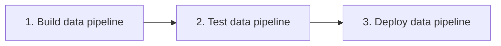
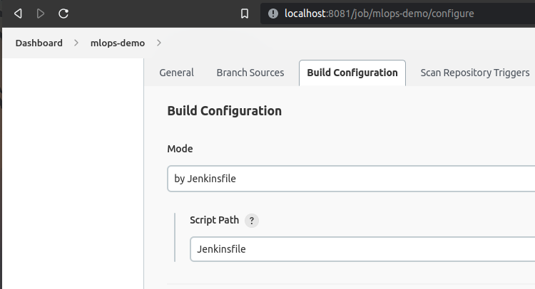
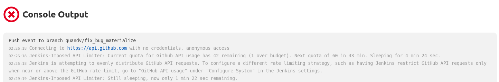
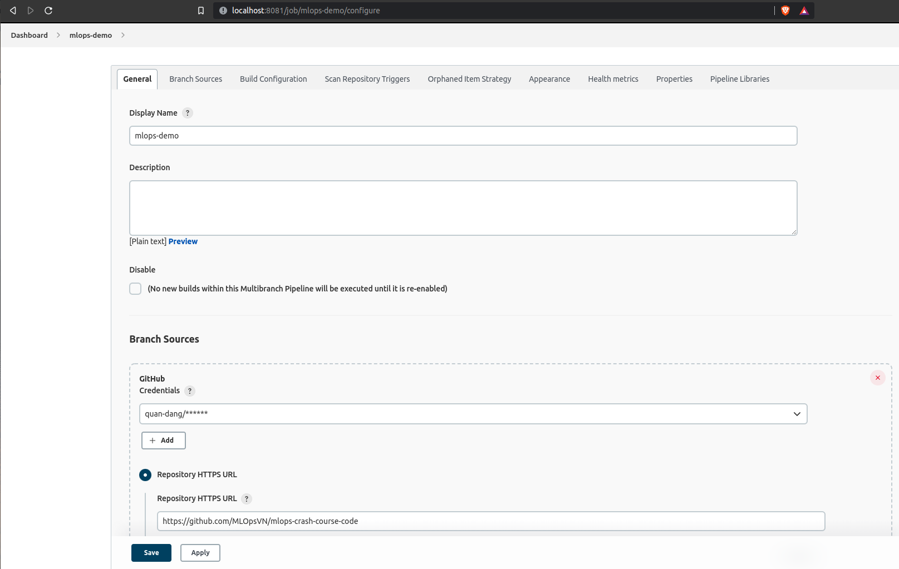
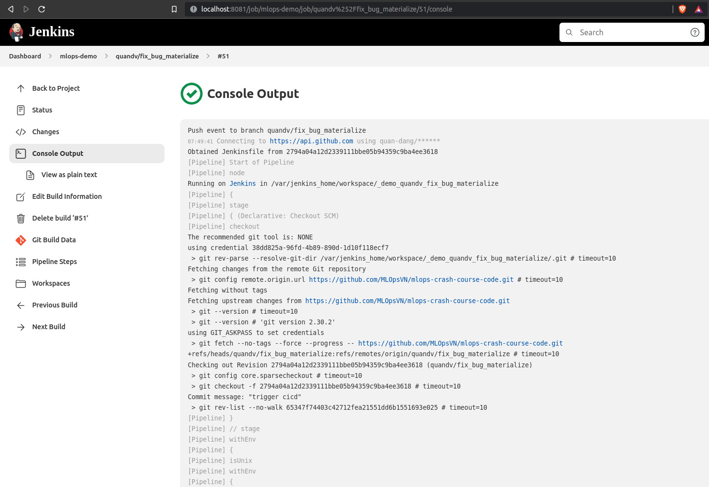

<figure>
    
    <figcaption>Photo from <a href="https://flexagon.com/blog/why-the-world-needs-ci-cd/">flexagon.com</a></figcaption>
</figure>

## Giới thiệu

Ở bài học về `data pipeline`, chúng ta đã cùng nhau xây dựng và deploy data pipeline theo các bước như sau:

- Đóng gói code và môi trường thành image để chạy các bước trong pipeline
- Thực hiện kiểm thử code
- Copy Python script định nghĩa `DAG` sang thư mục `dags/` của `Airflow`

Nếu chúng ta tự động hóa các bước này thì có thể đẩy nhanh quá trình release version mới cho pipeline mỗi khi developer thay đổi code.
Ở bài học này chúng ta sẽ sử dụng Jenkins để làm điều này.

## Jenkins pipeline

Chúng ta sẽ viết Jenkinsfile cho 3 bước trên như sau:



???+ info

    Ở bài học này chúng ta sẽ sử dụng agent lả docker image `python:3.9`, do đó trước hết mọi người phải truy câp <http://localhost:8081/pluginManager/> và cài đặt thêm plugin `Docker Pipeline`.

```py title="Jenkinsfile_data_pipeline" linenums="1"
pipeline {
    agent {
        docker {
            image 'python:3.9' # (1)
        }
    }

    stages {
        stage('build data pipeline') {
            when {changeset "data_pipeline/**" }

            steps {
                echo 'Building data pipeline..'
                sh 'cd data_pipeline && make build_image'  # (2)
            }
        }

        stage('test data pipeline') {
            when {changeset "data_pipeline/**" }

            steps {
                echo 'Testing data pipeline..'  # (3)
            }
        }

        stage('deploy data pipeline') {
            when {changeset "data_pipeline/**" }

            steps {
                sh 'cd data_pipeline && make deploy_dags' # (4)
            }
        }
    }
}
```

1. Định nghĩa agent là docker image `python:3.9`. Image này được sử dụng mặc định cho tất cả các `stage` trong pipeline.
2. Build image cho để chạy các bước trong Airflow pipeline
3. Test code, phần này mọi người sẽ bổ sung `unit test`, `integration test`, .v.v. dựa vào bài học về `kiểm thử hệ thống`
4. Copy script chứa `DAG` qua folder `dags/` của Airflow

???+ warning
    Ở đây, chúng ta để ý file định nghĩa Jenkins CI/CD là `Jenkinsfile_data_pipeline`, không phải tên mặc định là `Jenkinsfile`, do đó chúng ta phải thêm một bước cài đặt trên Jenkins để khai báo file này. Để làm điều này, chúng ta truy cập đường dẫn <http://localhost:8081/job/mlops-demo/configure> và thay đổi `Script Path` từ `Jenkinsfile` sang `Jenkinsfile_data_pipeline`.

    

???+ warning

    Nếu mọi người gặp hiện tượng Github API Rate Limit như sau:

    

    Thì mọi người thêm Credentials ở mục Github bằng cách ấn vào `Add` như hình dưới:

    

Sau khi mọi người thay đổi code ở folder `data-pipeline/` và push code lên Github, mọi người sẽ thấy `Console Output` tương ứng với commit này hiển thị tương tự như sau:



## Tổng kết

Ở bài học vừa rồi, chúng ta đã sử dụng Jenkins để xây dựng một CI/CD pipeline với 3 bước: buid image, test code và deploy Airflow pipeline. Developer bây giờ chỉ cần tập trung vào code, khi nào code xong thì `push` lên Github và để luồng CI/CD lo những phần còn lại, thật tiện lợi phải không nào!

Ở bài học tiếp theo, chúng ta sẽ xây dựng một CI/CD pipeline phức tạp hơn một chút cho `model serving`.
