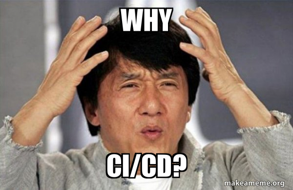

<figure>
    
</figure>

## Giới thiệu

Công việc mà cần nhiều sức người và tự động hóa ít thường rất dễ xảy ra sai sót. Nếu vỉệc này lặp lại càng nhiều thì tỉ lệ sai sót càng cao, và hậu quả càng nghiêm trọng. Trong bài học này, chúng ta sẽ cùg nhau đi tìm hiểu về tự động hóa trong ML: tự động hóa những gì và tự động hóa như thế nào.

## Tự động hóa những gì

| Continuous...    | Chi tiết                                                                          | Tool                            |
| ---------------- | --------------------------------------------------------------------------------- | ------------------------------- |
| Integration (CI) | Tự động hóa quá trình kiểm thử                                                    | Gitlab CI hoặc Jenkins          |
|                  | Tự động hóa quá trình đóng gói code và môi trường                                 | Gitlab CI hoặc Jenkins          |
| Delivery (CD)    | Tự động hóa quá trình deploy serving API                                          | Gitlab CI hoặc Jenkins          |
|                  | Tự động hóa quá trình deploy các pipeline                                         | Gitlab CI hoặc Jenkins          |
| Training (CT)    | Tự động hóa quá trình run các data pipeline chuẩn bị feature cho model            | Airflow hoặc Kubeflow Pipelines |
|                  | Tự động hóa quá trình run training pipeline để train model                        | Airflow hoặc Kubeflow Pipelines |
| Monitoring (CM)  | Tự động hóa quá trình theo dõi và cảnh báo hiệu năng model và tài nguyên hệ thống | Prometheus và Grafana           |

???+ tip

    Đôi khi mọi người nghe thấy một `CD` khác là `Continous Deployment`. Loại này có mức độ tự động cao hơn `Continous Delivery` , khi mà quá trình từ đóng gói tới deploy được tự động hoàn toàn, thay vì trigger thủ công bước deploy như `Continuous Delivery`.

## Triển khai tự động hóa theo từng giai đoạn

Tùy từng yêu cầu đầu ra và tiến độ hiện tại của dự án, nhà phát triển cần cân nhắc nên tự động hóa những gì, với thứ tự và độ ưu tiên ra sao.

???+ example

    Đầu ra của dự án là 1 model serving API để một team sản phẩm tích hợp vào hệ thống của họ, khi đó chúng ta có thể cân nhắc triển khai theo thứ tự sau:

    - **CI:**
        - Tự động hóa quá trình kiểm thử model (kết quả dự đoán có _reproducible_ và giống kết quả mà chúng ta chạy ở máy cá nhân không, .v.v.) và code (thực hiện unit test các hàm logic)
        - Tự động đóng gói model, code, và môi trường thành Docker image
    - **CD:** Tự động hóa quá trình deploy model serving API
    - **CM:** Sử dụng Prometheus và Grafana để  kiểm tra mức độ sử dụng tài nguyên hệ thống, kiểm tra model drift, và tự động cảnh báo qua email hoặc Slack khi có những bất thường.

## Môi trường triển khai dự án

Thông thường có 3 môi trường triển khai dự án bao gồm:

- **Development**/**Dev:** môi trường này thường có cấu hình yếu, với quyền truy cập dữ liệu thật "gần như" bằng 0. Ở môi trường này sẽ dùng dữ liệu giả, với cùng schema với dữ liệu thực tế.
- **Staging:** môi trường này thường có cấu hình và quyền truy cập dữ liệu giống như môi trường `production`
- **Production**/**Prod:** môi trường chạy thực tế

## Tổng kết

Ở bài học vừa rồi, chúng ta đã cùng nhau đi qua các khái niệm cơ bản về CI/CD. Ở bài tiếp theo, chúng ta sẽ ứng dụng để tự động hóa việc triển khai model serving và các pipeline, thay vì làm thủ công như những bài trước.

## Tài liệu tham khảo

- <https://mlops-guide.github.io/MLOps/PipelineAutomation/>
- <https://cloud.google.com/architecture/mlops-continuous-delivery-and-automation-pipelines-in-machine-learning>
