<figure>
    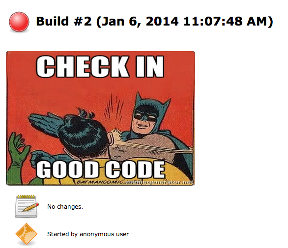
    <figcaption>Photo from <a href="https://wiki.jenkins.io/JENKINS/Internet-Meme-Plugin.html">wiki.jenkins.io</a></figcaption>
</figure>

## Giới thiệu

Vừa rồi, chúng ta đã được làm quen với một số khái niệm liên quan tới CI/CD và các bài học về kiểm thử trong một hệ thống ML. Câu hỏi được đặt ra đó là làm thế nào để triển khai một CI/CD pipeline tự động hóa gồm các bước như build, test, deploy? Jenkins là một open source cho phép hiện thực háo điều này.

Ở bài học này, bạn sẽ:

1. Cài đặt Jenkins trên máy cá nhân
1. Kết nối Jenkins tới Github
1. Và chạy thử một CI/CD pipeline đơn giản

## Cài đặt Jenkins

Các bạn làm các bước sau để cài đặt:

1.  Vào repo `mlops-crash-course-platform/` và chạy:

    ```bash
    bash run.sh jenkins up
    ```

1.  Kiểm tra tình trạng service:

    ```bash
    docker ps

    CONTAINER ID   IMAGE                  COMMAND                  CREATED          STATUS                         PORTS                                                                                      NAMES
    f81b55f1b151   jenkins/jenkins:lts    "/usr/bin/tini -- /u…"   41 minutes ago   Up 41 minutes                  0.0.0.0:50000->50000/tcp, :::50000->50000/tcp, 0.0.0.0:8081->8080/tcp, :::8081->8080/tcp   jenkins
    ```

1.  Truy cập <http://localhost:8081>, các bạn sẽ thấy:

    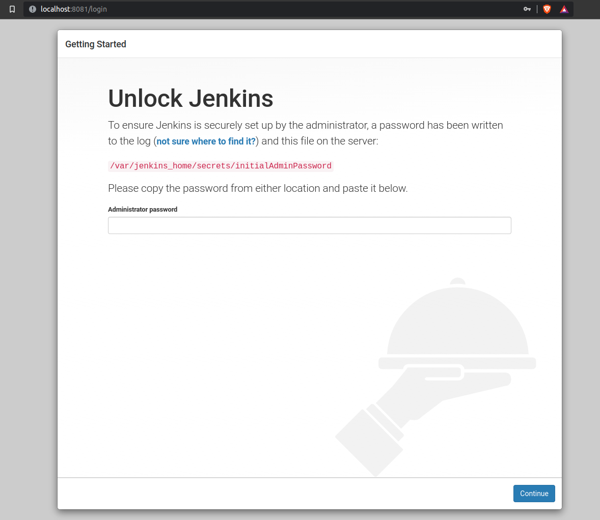

1.  Kiểm tra logs của jenkins container để lấy mật khẩu `admin`:

    ```bash
    docker logs jenkins
    ```

    Các bạn sẽ thấy mật khẩu như sau:

    ```bash
    *************************************************************
    *************************************************************
    *************************************************************

    Jenkins initial setup is required. An admin user has been created and a password generated.
    Please use the following password to proceed to installation:

    e6623e35c18847e7a7ccfd07863feb4a

    This may also be found at: /var/jenkins_home/secrets/initialAdminPassword
    ```

1.  Chọn `Install suggested plugins` và chờ Jenkins cài đặt các plugins.

    

1.  Ở giao diện đăng ký user sử dụng Jenkins chọn `Skip and continue as admin`

    

    ???+ tip

        Trong thực tế, người quản trị Jenkins sẽ phải tạo user và cấp quyền phù hợp. Ở đây chúng ta sử dụng tài khoản `admin` để tránh đi quá sâu vào phần quản trị này.

1.  Cấu hình Jenkins URL như sau:

    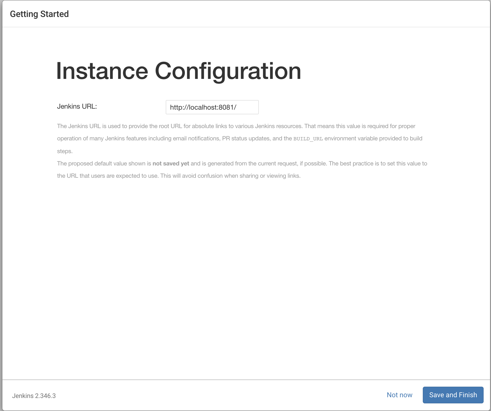

1.  Cuối cùng, giao diện sẽ như sau:

    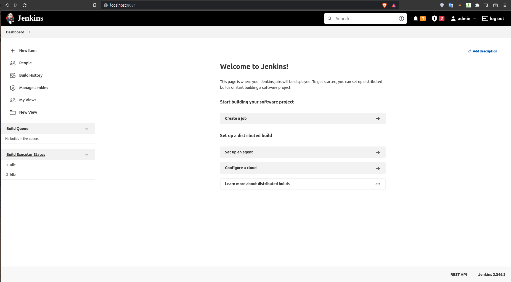

## Kết nối Jenkins với Github

Bây giờ chúng ta sẽ kết nối Jenkins ở local với Github để mỗi khi push code lên thì Github sẽ trigger CI/CD pipeline trên máy cá nhân của chúng ta.

### Expose Jenkins với ngrok

Các bạn làm các bước sau:

1.  Cài đặt _ngrok_, xác nhận email, set token theo hướng dận [tại đây](https://ngrok.com/download)
1.  Expose Jenkins service tại local với câu lệnh:

    ```bash
    ngrok http 8081
    ```

    Bạn sẽ thấy console hiển thị như sau:

    ```bash
    ngrok by @inconshreveable                                       (Ctrl+C to quit)

    Session Status                online
    Account                       dangvanquan.xyz@gmail.com (Plan: Free)
    Version                       2.3.40
    Region                        United States (us)
    Web Interface                 http://127.0.0.1:4040
    Forwarding                    http://a846-183-80-56-103.ngrok.io -> http://local
    Forwarding                    https://a846-183-80-56-103.ngrok.io -> http://loca

    Connections                   ttl     opn     rt1     rt5     p50     p90
                                0       0       0.00    0.00    0.00    0.00
    ```

1.  Truy cập Jenkins qua link forward ở trên <https://a846-183-80-56-103.ngrok.io>

    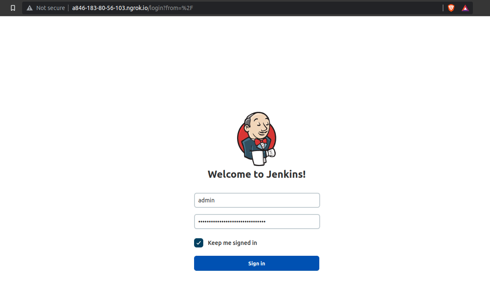

### Thêm Jenkins webhook vào Github

Đầu tiên bạn push code đã clone từ [mlops-crash-course-code](https://github.com/MLOpsVN/mlops-crash-course-code) lên Github repo của bạn, link repo sau khi đẩy lên sẽ có dạng `https://github.com/<yourusername>/mlops-crash-course-code`. Ví dụ: nếu Github username là `MLOps` thi đường link tới repo sẽ là `https://github.com/MLOps/mlops-crash-course-code`.

Nội dung bên dưới và các nội dung kế tiếp trong module bài giảng về `ci-cd`, bạn sẽ làm việc trên repo `https://github.com/<yourusername>/mlops-crash-course-code` của mình. Do đó, khi mà bạn thấy tác giả đề cập tới repo `https://github.com/MLOpsVN/mlops-crash-course-code`, thì các bạn hãy thực hành trên repo tương ứng của bạn nhé.

1.  Vào `Settings` ở repo code, chọn `Webhooks`

    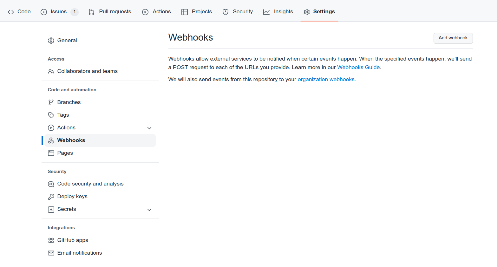

1.  Ấn `Add webhook`, điền `Payload URL` là `https://a846-183-80-56-103.ngrok.io/github-webhook/`, `Content type` là `application/json`

    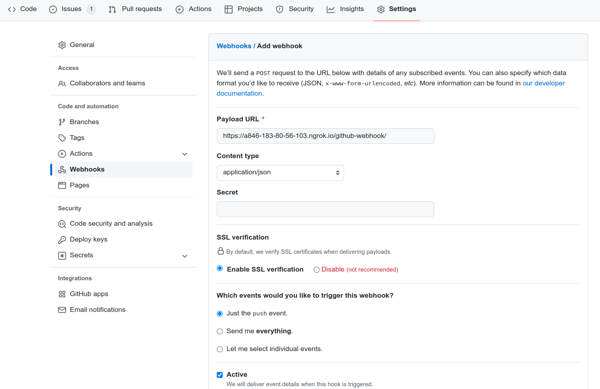

1.  Ở phần `Which events would you like to trigger this webhook?`, chọn `Let me select individual events.`, tick vào phần `Pushes` và `Pull requests`

    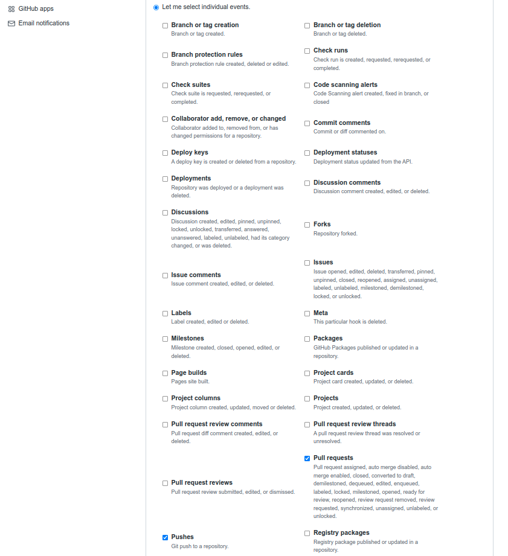

1.  Ấn `Add webhook` để hoàn tất

    

### Thêm Github repo vào Jenkins

1.  Trở lại mà hình home của Jenkins qua URL <https://a846-183-80-56-103.ngrok.io>

    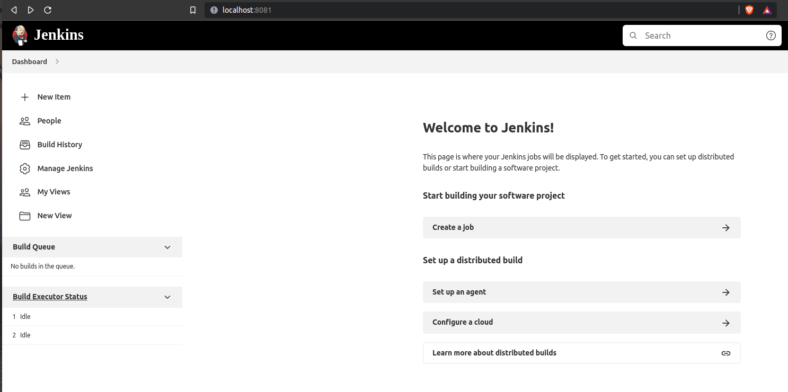

1.  Ấn `+ New Item`, điền tên dự án vào phần bên dưới `Enter an item name`, chọn `Multibranch Pipeline` và ấn `OK`

    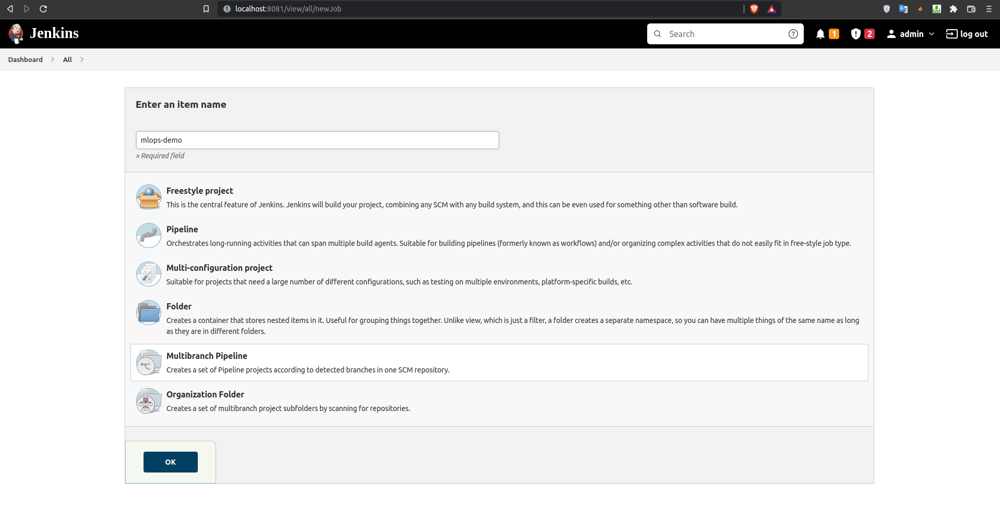

1.  Ở phần `Branch Sources`, ấn `Add source` chọn `GitHub`

    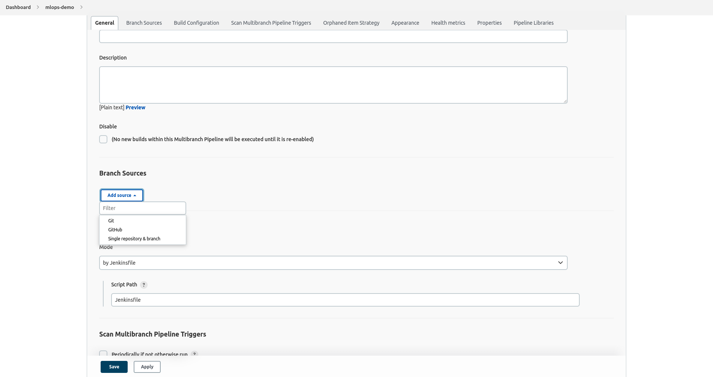

1.  Thêm Github repo bằng cách chọn `Add repository`, điền vào `Repository URL`

    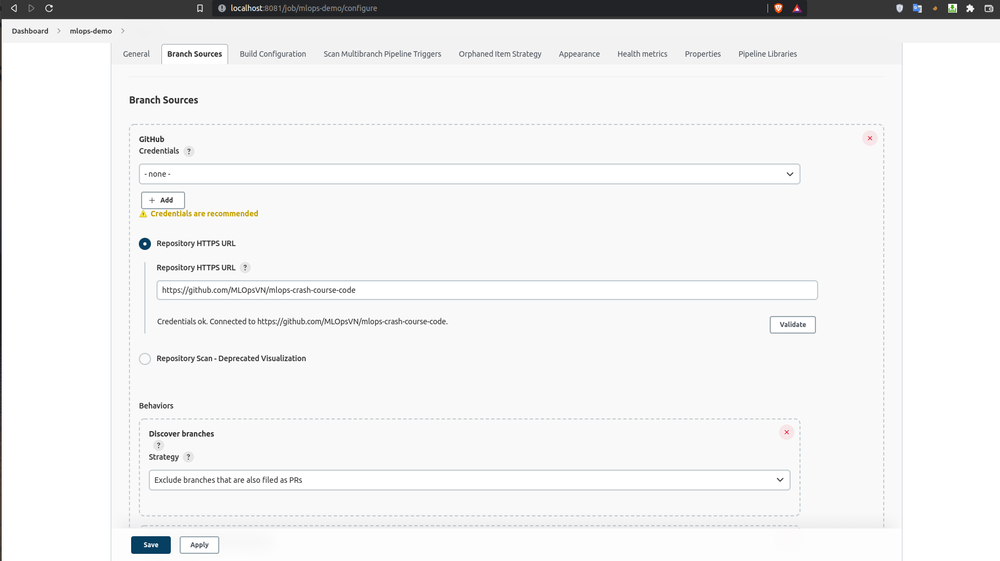

1.  Ấn `Apply` để hoàn tất

## Trigger Jenkins pipeline

Sau khi cài đặt theo các bước như ở trên, chúng ta sẽ thấy có project `mlops-demo` như bên dưới

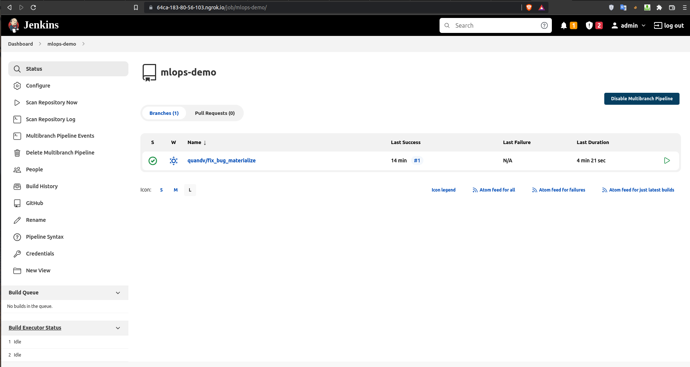

???+ bug

    Nếu bạn không thấy branch nào, thì bạn ấn `Scan Repository Now` như bên dưới và reload lại trang là được.
    
    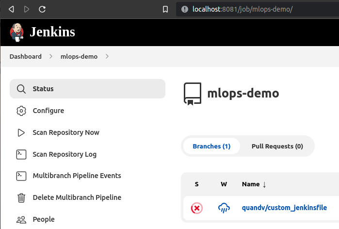

Nếu ấn vào project `mlops-demo`, chúng ta sẽ thấy ở góc tay trái bên dưới có `Build History`, chính là lịch sử các lần push code trigger CI/CD pipeline của chúng ta.

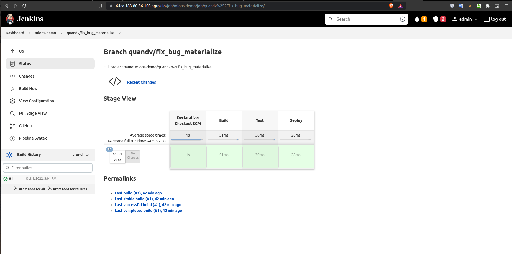

Tuyệt vời, tiếp theo chúng ta sẽ chuẩn bị 1 file `Jenkinsfile` đơn giản ở trong folder `mlops-crash-course-code/`

```bash
mlops-crash-course-code/
├── data_pipeline/
├── Jenkinsfile
├── LICENSE
├── model_serving/
├── README.md
├── .gitignore
├── stream_emitting/
└── training_pipeline/
└── monitoring_service/
```

với nội dung như sau:

```py title="Jenkinsfile" linenums="1"
pipeline {
    agent any # (1)

    stages {
        stage('Build') {  # (2)
            steps {
                echo 'Building something..'  # (3)
            }
        }
        stage('Test') {
            steps {
                echo 'Testing something..'
            }
        }
        stage('Deploy') {
            steps {
                echo 'Deploying something..'
            }
        }
    }
}
```

1. Định nghĩa _executor_ chạy pipeline (`ip:port` hoặc `docker image`), ở đây `any` được hiểu là một _executor_ bất kỳ
2. Khai báo một bước trong pipeline
3. Chạy câu lệnh `echo ...` trong bước này

Sau khi đã thêm file này vào folder, chúng ta sẽ thực hiện push commit lên branch bất kỳ

```bash
git init
git add Jenkinsfile
git push origin your_branch
```

Lúc này chúng ta sẽ thấy có thêm `#2` ở `Build History` với 3 bước `Build`, `Test` và `Deploy`, chứng tỏ đã thông luồng từ push code cho tới trigger Jenkins pipeline.

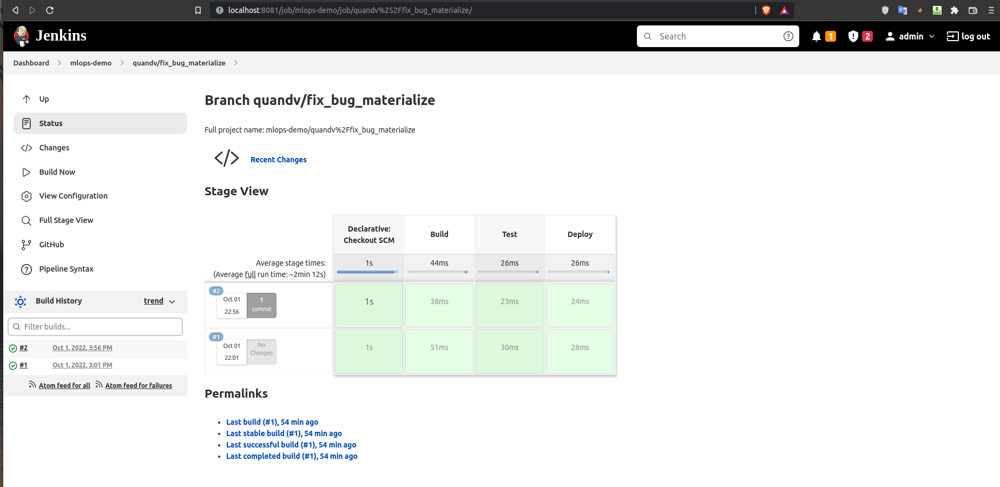

Nếu chúng ta ấn vào `#2`, chọn `Console Output`, chúng ta sẽ thấy hiển thị như sau:


```bash
[Pipeline] }
[Pipeline] // stage
[Pipeline] withEnv
[Pipeline] {
[Pipeline] stage
[Pipeline] { (Build)
[Pipeline] echo
Building something..
[Pipeline] }
[Pipeline] // stage
[Pipeline] stage
[Pipeline] { (Test)
[Pipeline] echo
Testing something..
[Pipeline] }
[Pipeline] // stage
[Pipeline] stage
[Pipeline] { (Deploy)
[Pipeline] echo
Deploying something..
[Pipeline] }
[Pipeline] // stage
[Pipeline] }
[Pipeline] // withEnv
[Pipeline] }
[Pipeline] // node
[Pipeline] End of Pipeline
Finished: SUCCESS
```

???+ tip

    Nếu muốn chạy stage chỉ khi có thay đổi ở file hoặc folder liên quan, ví dụ chỉ test data pipeline khi có thay đổi ở folder `data_pipeline/`, chúng ta thêm điều kiện `when` như sau:
    
        ````py title="Jenkinsfile" linenums="1"
        pipeline {
        ...
    
                    stage('test data pipeline') {
                        when {changeset "data_pipeline/*.*" }
    
                        steps {
                            echo 'Testing data pipeline..'
                        }
                    }
    
                    ...
                }
            }
            ```
        ````

???+ info

    Kiểu viết `Jenkinsfile` như ở trên, tuân theo các rule và syntax được định nghĩa sẵn, gọi là _Declarative Pipeline_. Ngoài ra còn một cách viết khác dùng `Groovy script` gọi là _Scripted Pipeline_, cách này thông thường sử dụng cho những logic phức tạp.

## Tổng kết

Ở bài học vừa rồi, Jenkins đã được cài đặt để có thể tự động chạy CI/CD pipeline mỗi khi có sự thay đổi ở repo `yourusername/mlops-crash-course-code` của bạn. Chúng ta đã xây dựng và chạy thử một file Jenkinsfile đơn giản để smoke test các cài đặt xem có vấn đề gì không.

Ở bài tiếp theo, chúng ta sẽ sử dụng Jenkinsfile để xây dựng các CI/CD pipeline cho data pipeline.
