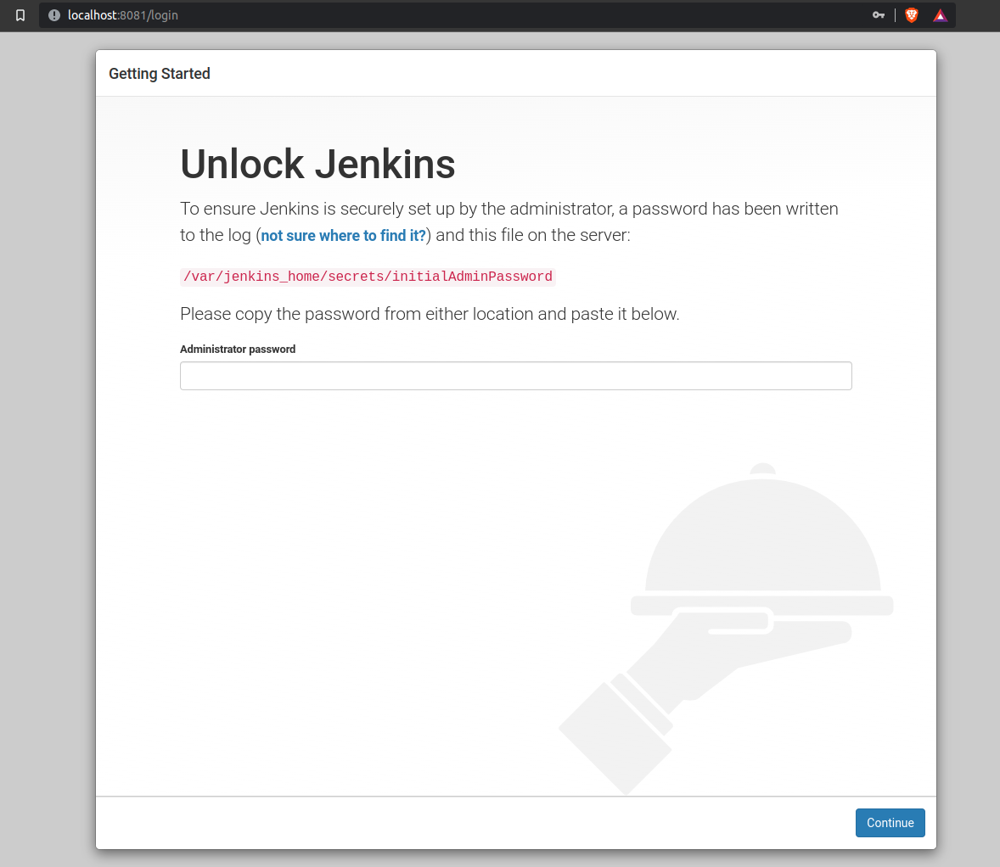
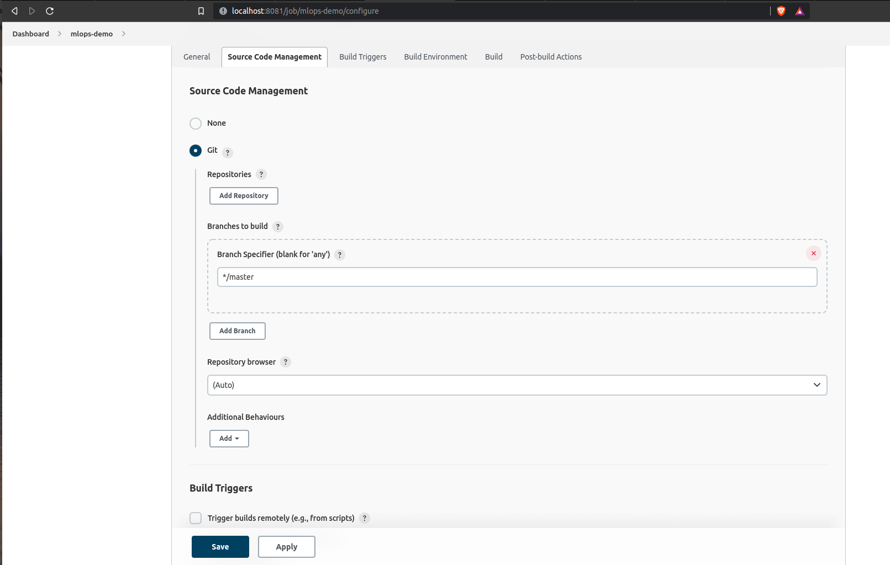

## Giới thiệu

## Cài đặt Jenkins
Trước hết mọi người vào repo `mlops-crash-course-platform/` và start service này như sau:
```bash
bash run.sh jenkins up
```
Chúng ta sử dụng `docker ps` để kiểm tra tình trạng service:

```bash
CONTAINER ID   IMAGE                  COMMAND                  CREATED          STATUS                         PORTS                                                                                      NAMES
f81b55f1b151   jenkins/jenkins:lts    "/usr/bin/tini -- /u…"   41 minutes ago   Up 41 minutes                  0.0.0.0:50000->50000/tcp, :::50000->50000/tcp, 0.0.0.0:8081->8080/tcp, :::8081->8080/tcp   jenkins
```

Service này đã `Up` và được serve tại đường dẫn <http://localhost:8081> như sau:



Để lấy mật khẩu `admin`, chúng ta sẽ kiểm tra logs của jenkins container với câu lệnh:
```bash
docker logs jenkins
```

và mọi người sẽ thấy mật khẩu như sau:
```bash
*************************************************************
*************************************************************
*************************************************************

Jenkins initial setup is required. An admin user has been created and a password generated.
Please use the following password to proceed to installation:

e6623e35c18847e7a7ccfd07863feb4a

This may also be found at: /var/jenkins_home/secrets/initialAdminPassword
```

Sau khi điền mật khẩu ở trên, chúng ta sẽ tới giao diện đăng ký user sử dụng Jenkins, để cho đơn giản, chúng ta sẽ chọn `Skip and continue as admin`


???+ tip
    Trong thực tế, người quản trị Jenkins sẽ phải tạo user và cấp quyền phù hợp. Ở đây chúng ta sử dụng tài khoản `admin` để tránh đi quá sâu vào phần quản trị này.

Tiếp theo chúng ta sẽ chọn `Install suggested plugins`, và chờ Jenkins cài đặt các plugins. 


Sau khi cài xong, chúng ta sẽ nhìn thấy giao diện sau:


## Kết nối Jenkins với Github

Bây giờ chúng ta sẽ kết nối Jenkins ở local với Github để mỗi khi push code lên thì Github sẽ trigger CI/CD pipeline trên máy cá nhân của chúng ta.

### Expose Jenkins với ngrok
Đầu tiên, cài đặt [ngrok](https://ngrok.com/), và expose Jenkins service tại local với câu lệnh:
```bash
ngrok http 8081
```
, khi đó chúng ta sẽ thấy console hiển thị như sau:
```bash
ngrok by @inconshreveable                                       (Ctrl+C to quit)
                                                                                
Session Status                online                                            
Account                       dangvanquan.xyz@gmail.com (Plan: Free)             
Version                       2.3.40                                            
Region                        United States (us)                                
Web Interface                 http://127.0.0.1:4040                             
Forwarding                    http://a846-183-80-56-103.ngrok.io -> http://local
Forwarding                    https://a846-183-80-56-103.ngrok.io -> http://loca
                                                                                
Connections                   ttl     opn     rt1     rt5     p50     p90       
                              0       0       0.00    0.00    0.00    0.00      
                                                                              
```

Bây giờ, chúng ta có thể truy cập Jenkins qua link forward ở trên <https://a846-183-80-56-103.ngrok.io>, và sử dụng username `admin`, và password như trên.


### Thêm Jenkins webhook vào Github

Bây giờ chúng ta sẽ vào phần `Settings` ở repo code của chúng ta và chọn phần `Webhooks` như bên dưới

, say đó ấn `Add webhook` và điền `Payload URL` là `https://a846-183-80-56-103.ngrok.io/github-webhook/`, và `Content type` là `application/json`


Mọi người lưu ý phần `Which events would you like to trigger this webhook?`, ở đây chúng ta chọn `Let me select individual events.` và sau đó tick vào phần `Pushes` và `Pull requests`

và chúng ta ấn `Add webhook` để hoàn tất.


### Thêm Github repo vào Jenkins
Đầu tiên, chúng ta trở lại mà hình home của Jenkins

, và ấn vào phần `+ New Item`. 

Ở trang mới này, chúng ta điền tên dự án vào phần bên dưới `Enter an item name`, chọn `Multibranch Pipeline`, và ấn `OK`


Tiếp theo, chúng ta tìm đến phần `Branch Sources`, ấn `Add source` và chọn `GitHub`


Sau đó, chúng ta sẽ thấy màn hình như sau:


Chúng ta sẽ thêm Github repo bằng cách chọn `Add repository`, và điền vào phần `Repository URL` theo dạng `https://github.com/MLOpsVN/mlops-crash-course-code` như bên dưới.


Cuối cùng, chúng ta kéo xuống phần cuối cùng, ấn `Apply` để hoàn tất.

## Smoke test luồng push code để trigger Jenkins pipeline

Sau khi cài đặt theo các bước như ở trên, chúng ta sẽ thấy có project `mlops-demo` như bên dưới


Nếu chúng ta ấn vào project `mlops-demo`, chúng ta sẽ thấy ở góc tay trái bên dưới có `Build History`, chính là lịch sử các lần push code trigger CI/CD pipeline của chúng ta.


Tuyệt vời, tiếp theo chúng ta sẽ chuẩn bị 1 file `Jenkinsfile` đơn giản ở trong folder

```bash
.
├── data_pipeline
├── Jenkinsfile
├── LICENSE
├── model_deployment
├── README.md
├── stream_emitting
└── training_pipeline
```

với nội dung như sau:
```py title="Jenkinsfile" linenums="1"
pipeline {
    agent any # (1)

    stages {
        stage('Build') {  # (2)
            steps {
                echo 'Building something..'  # (3)
            }
        }
        stage('Test') {
            steps {
                echo 'Testing something..'
            }
        }
        stage('Deploy') {
            steps {
                echo 'Deploying something..'
            }
        }
    }
}
```

1. Định nghĩa _executor_ chạy pipeline (`ip:port` hoặc `docker image`), ở đây `any` được hiểu là một _executor_ bất kỳ
2. Khai báo một bước trong pipeline
3. Chạy câu lệnh `echo ...` trong bước này

Sau khi đã thêm file này vào folder, chúng ta sẽ thực hiện push commit lên branch bất kỳ

```bash
git init
git add Jenkinsfile
git push origin your_branch
```

Lúc này chúng ta sẽ thấy có thêm `#2` ở `Build History`, với 3 bước `Build`, `Test` và `Deploy`, chứng tỏ đã thông luồng từ push code cho tới trigger Jenkins pipeline.


Nếu chúng ta ấn vào `#2`, chọn `Console Output`, chúng ta sẽ thấy hiển thị như sau:


```bash
[Pipeline] }
[Pipeline] // stage
[Pipeline] withEnv
[Pipeline] {
[Pipeline] stage
[Pipeline] { (Build)
[Pipeline] echo
Building something..
[Pipeline] }
[Pipeline] // stage
[Pipeline] stage
[Pipeline] { (Test)
[Pipeline] echo
Testing something..
[Pipeline] }
[Pipeline] // stage
[Pipeline] stage
[Pipeline] { (Deploy)
[Pipeline] echo
Deploying something..
[Pipeline] }
[Pipeline] // stage
[Pipeline] }
[Pipeline] // withEnv
[Pipeline] }
[Pipeline] // node
[Pipeline] End of Pipeline
Finished: SUCCESS
```

???+ tip
    Nếu chúng ta muốn chạy stage chỉ khi có thay đổi ở file hoặc folder liên quan, ví dụ chỉ test data pipeline khi có thay đổi ở folder `data_pipeline/`, chúng ta thêm điều kiện `when` như sau:
    ```py title="Jenkinsfile" linenums="1"
    pipeline {
            ...

            stage('test data pipeline') {
                when {changeset "data_pipeline/*.*" }

                steps {
                    echo 'Testing data pipeline..'
                }
            }

            ...
        }
    }
    ```

???+ tip
    Kiểu viết `Jenkinsfile` như ở trên, tuân theo các rule và syntax được định nghĩa sẵn, gọi là _Declarative Pipeline_. Ngoài ra còn một cách viết khác dùng `Groovy script`gọi là _Scripted Pipeline_, cách này thông thường sử dụng cho những logic phức tạp.

## Tổng kết