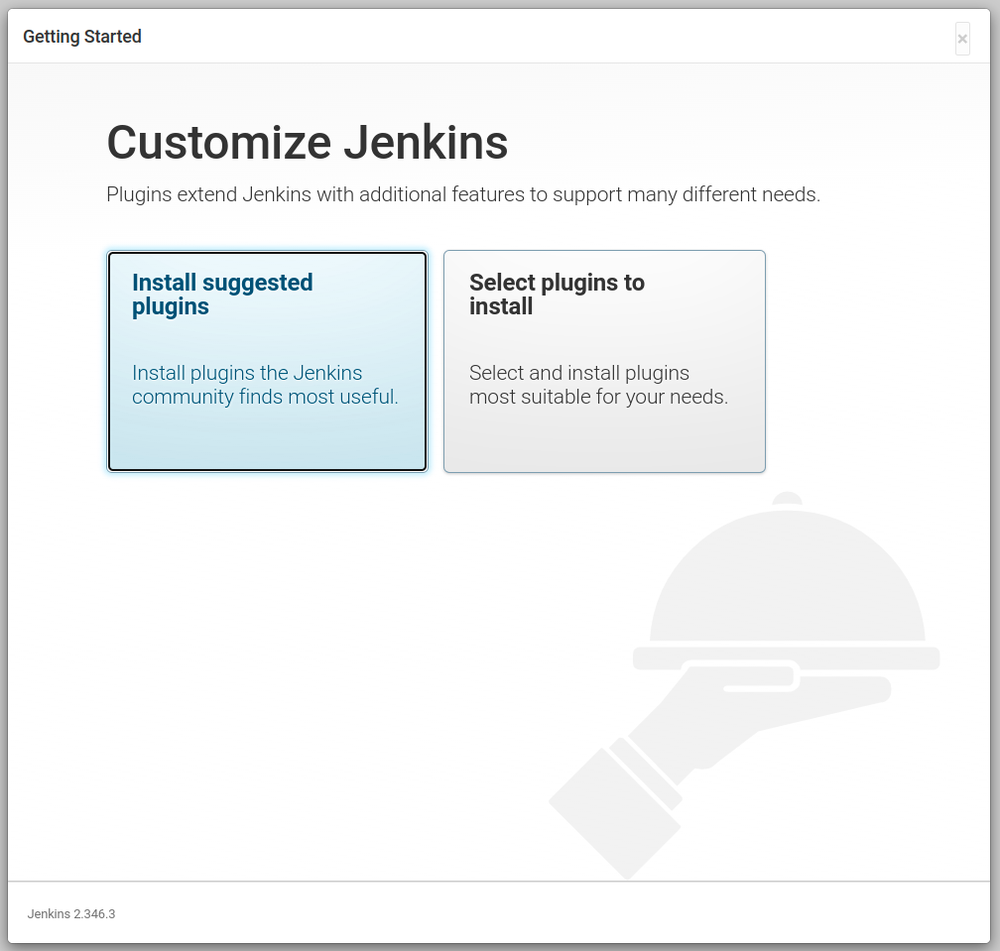

## Giới thiệu

## Cài đặt Jenkins
Trước hết mọi người vào repo `mlops-crash-course-platform/` và start service này như sau:
```bash
bash run.sh jenkins up
```
Chúng ta sử dụng `docker ps` để kiểm tra tình trạng service:

```bash
CONTAINER ID   IMAGE                  COMMAND                  CREATED          STATUS                         PORTS                                                                                      NAMES
f81b55f1b151   jenkins/jenkins:lts    "/usr/bin/tini -- /u…"   41 minutes ago   Up 41 minutes                  0.0.0.0:50000->50000/tcp, :::50000->50000/tcp, 0.0.0.0:8081->8080/tcp, :::8081->8080/tcp   jenkins
```

Service này đã `Up` và được serve tại đường dẫn <http://localhost:8081> như sau:


Để lấy mật khẩu `admin`, chúng ta sẽ kiểm tra logs của jenkins container với câu lệnh:
```bash
docker logs jenkins
```

và mọi người sẽ thấy mật khẩu như sau:
```bash
*************************************************************
*************************************************************
*************************************************************

Jenkins initial setup is required. An admin user has been created and a password generated.
Please use the following password to proceed to installation:

e6623e35c18847e7a7ccfd07863feb4a

This may also be found at: /var/jenkins_home/secrets/initialAdminPassword
```

Sau khi điền mật khẩu ở trên, chúng ta sẽ tới giao diện đăng ký user sử dụng Jenkins, để cho đơn giản, chúng ta sẽ chọn `Skip and continue as admin`


???+ tip
    Trong thực tế, người quản trị Jenkins sẽ phải tạo user và cấp quyền phù hợp. Ở đây chúng ta sử dụng tài khoản `admin` để tránh đi quá sâu vào phần quản trị này.

Tiếp theo chúng ta sẽ chọn `Install suggested plugins`, và chờ Jenkins cài đặt các plugins. 



Sau khi cài xong, chúng ta sẽ nhìn thấy giao diện sau:


## Kết nối Jenkins với Github

Bây giờ chúng ta sẽ kết nối Jenkins ở local với Github để mỗi khi push code lên thì Github sẽ trigger CI/CD pipeline trên máy cá nhân của chúng ta.

### Expose Jenkins với ngrok
Đầu tiên, cài đặt [ngrok](https://ngrok.com/), và expose Jenkins service tại local với câu lệnh:
```bash
ngrok http 8081
```
, khi đó chúng ta sẽ thấy console hiển thị như sau:
```bash
ngrok by @inconshreveable                                       (Ctrl+C to quit)
                                                                                
Session Status                online                                            
Account                       dangvanquan.xyz@gmail.com (Plan: Free)             
Version                       2.3.40                                            
Region                        United States (us)                                
Web Interface                 http://127.0.0.1:4040                             
Forwarding                    http://a846-183-80-56-103.ngrok.io -> http://local
Forwarding                    https://a846-183-80-56-103.ngrok.io -> http://loca
                                                                                
Connections                   ttl     opn     rt1     rt5     p50     p90       
                              0       0       0.00    0.00    0.00    0.00      
                                                                              
```

Bây giờ, chúng ta có thể truy cập Jenkins qua link forward ở trên <https://a846-183-80-56-103.ngrok.io>, và sử dụng username `admin`, và password như trên.


### Thêm Jenkins webhook vào Github

Bây giờ chúng ta sẽ vào phần `Settings` ở repo code của chúng ta và chọn phần `Webhooks` như bên dưới

, say đó ấn `Add webhook` và điền `Payload URL` là `https://a846-183-80-56-103.ngrok.io/github-webhook/`, và `Content type` là `application/json`


Mọi người lưu ý phần `Which events would you like to trigger this webhook?`, ở đây chúng ta chọn `Let me select individual events.` và sau đó tick vào phần `Pushes` và `Pull requests`

và chúng ta ấn `Add webhook` để hoàn tất.


## Tổng kết