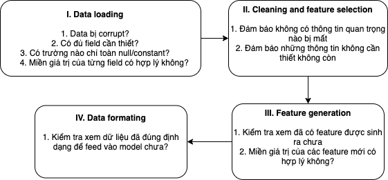

## Giới thiệu

Khác với các hệ thống phần mềm truyển thống: một ông developer ngồi nghĩ ra các rule, và lập trình bằng Python, Java, hoặc... LOLCODE, thì ML model sẽ tự sinh ra các rule sử dụng dữ liệu được cung cấp. Điều này đương nhiên là tốt, vì không phải rule nào ông developer cũng nghĩ ra được, tuy nhiên nó cũng có mặt trái của nó: rule được sinh ra có thể thay đổi, theo hướng tốt, xấu, hoặc bị BUG rồi các ông ạ :). Điều này dẫn tới việc kiểm thử và debug một hệ thống ML không hề đơn giản.

Ở bài học này chúng ta hãy cùng tìm hiểu về vấ n đề hóc búa này: kiểm thử trong hệ thống ML.


## Kiểm thử hệ thống phần mềm truyền thống

Thông thường có 2 loại kiểm thử phần mềm:

- **Functional Testing:** kiểm tra xem hệ thống đã đảm bảo yêu cầu về chức năng chưa, ví dụ ấn tắt windows update mãi mà nó vẫn update thì là fail rồi :)
- **Non-functional Testing:** kiểm tra xem hệ thống có đáp ứng được kỳ vọng của khách hàng không, ví dụ tất cả người trên thế giới cùng ấn nút tham gia group MLOps VN thì group không được sập chả hạn.

### Functional Testing

Thông thường loại này bao gồm:

1. **Unit testing:** test từng module nhỏ
2. **Integration testing:** test một module lớn bao gồm nhiều module nhỏ để đảm bảo khi kết hợp không xảy ra vấn đề gì

   **Mẹo nhỏ:** Theo nguyên tắc [KISS](https://people.apache.org/~fhanik/kiss.html), hãy luôn cố gắng bẻ vấn đề thành nhiều module đủ nhỏ và đủ dễ hiểu.

   Ví dụ dưới đây được trích từ [Machine learning mastery blog](https://machinelearningmastery.com/machine-learning-in-python-step-by-step/) cho thấy tác giả áp dụng rất tốt nguyên tắc này, qua việc tác giả đã cố gắng sử dụng hàm nhiều nhất có thể, ví dụ `train_test_split`, `accuracy_score` và `confusion_matrix`, khi đó chuyện test và debug sẽ dễ dàng hơn rất nhiều.

   ```py title="example.py" linenums="1"
   # make predictions
   from pandas import read_csv
   from sklearn.model_selection import train_test_split
   from sklearn.metrics import classification_report
   from sklearn.metrics import confusion_matrix
   from sklearn.metrics import accuracy_score
   from sklearn.svm import SVC
   # Load dataset
   url = "https://raw.githubusercontent.com/jbrownlee/Datasets/master/iris.csv"
   names = ['sepal-length', 'sepal-width', 'petal-length', 'petal-width', 'class']
   dataset = read_csv(url, names=names)
   # Split-out validation dataset
   array = dataset.values
   X = array[:,0:4]
   y = array[:,4]
   X_train, X_validation, Y_train, Y_validation = train_test_split(X, y, test_size=0.20, random_state=1)
   # Make predictions on validation dataset
   model = SVC(gamma='auto')
   model.fit(X_train, Y_train)
   predictions = model.predict(X_validation)
   # Evaluate predictions
   print(accuracy_score(Y_validation, predictions))
   print(confusion_matrix(Y_validation, predictions))
   print(classification_report(Y_validation, predictions))
   ```

3. **Regression testing:** kiểm tra lại toàn bộ chức năng của hệ thống mỗi khi có thay đổi của một hoặc vài chức năng nào đó
4. **Smoke testing:** chạy một bài test cơ bản với chức năng tối thiểu để xem hệ thống sẵn sàng cho việc test chưa
   Một ví dụ đơn giản: Bắt đầu kiểm tra một hệ thống bóng đèn, vừa ấn nút xong khói (smoke) bốc lên nghi ngút thì khỏi test tiếc gì thêm.

### Non-functional Testing

1. **Load testing:** xác định độ chịu tải, SLA của hệ thống
2. **Stress testing:** đánh giá hành vi của hệ thống tại các điều kiện không lường trước, ví dụ một phần hệ thống đột nhiên shutdown thì phản hồi có chấp nhận được không

### Luồng phát triển phần mềm cơ bản

Thông thường, các developer tuân thủ một số quy ước sau khi phát triển phần mềm:

1. Không merge code nếu chưa chạy các test case
2. Luôn viết code test khi commit logic mới
3. Khi fix bug, luôn viết code test để bắt bug, và phòng xảy ra trường hợp tương tự trong tương lai


<figcaption align="center" font-size="8px"><i>Source: https://www.jeremyjordan.me/testing-ml/</i></figcaption>

## Hệ thống ML cần kiểm thử những gì?

Những bài test cho hệ thống phần mềm có thể ứng dụng cho hầu hết ML code, tuy nhiên vẫn chưa để đủ đảm bảo hệ thống ML có thể hoạt động với độ tin cậy cao.


<figcaption align="center" font-size="8px"><i>Source: https://learning.oreilly.com/library/view/building-machine-learning</i></figcaption>

OK! Thế để hệ thống ML tin tưởng được thì cần kiểm tra thêm những gì?

- **Data pipeline testing:** đảm bảo dữ liệu không bị corrupt, đúng format và đúng schema (kiểu dữ liệu), ...

  Data là một phần không thể thiếu trong một hệ thống ML, do đó duy trì một data pipeline với độ tin cậy cao là điều rất quan trọng.
  Hình dưới đây là ví dụ về 1 data pipeline và những thứ yếu tố cần cân nhắc ở mỗi bước:

    

- **Model testing:** đảm bảo model đạt hiểu quả (ví dụ accuracy) như mong muốn và model có consistent không, ...

  Có thể chia thành 2 loại model testing:

  - **Testing**

    - **Pre-train testing:** tìm bug trước khi train/evaluate
      - Kiểm tra xem có data leakage (leak thông tin), ví dụ observation trong tập train cũng có ở tập validation/test
      - Kiểm tra xem có feature leakage (feature mang thông tin của label)
      - Kiểm tra model output có shape, hoặc có miền giá trị như ý muốn
    - **Post-train testing:** hoạt động của model (model behavior) có như ý muốn ở các tình huống (scenarios) khác nhau?

      - **Invariance testing:** mô tả những thay đổi của input mà không làm thay đổi kết quả dự đoán của model
        Ví dụ: trong bài toán sentiment analysis, thì 2 câu sau nên có cùng một output:
        - Bộ phim A hay quá!
        - Bộ phim B hay quá!
      - **Directional expectation test:** mô tả những thay đổi của input sẽ làm thay đổi kết quả dự đoán của model một cách có thể lường trước.
        Ví dụ: trong bài toán dự đoán giá nhà, có thể đoán trước nếu không gian tăng, thì giá nhà sẽ tăng.
      - **Bias/Fairness:** kiểm tra xem model có dự đoán công bằng không, ví dụ dự đoán income của người châu Mỹ chính xác hơn người châu Á, chứng tỏ model đang bị bias.
      - **Model Output Consistency:** với cùng 1 dữ liệu đầu vào, model output có bị thay đổi sau nhiều lần chạy khác nhau không?

      **Note:** Công cụ [What-If](https://pair-code.github.io/what-if-tool/) hỗ trợ rất tốt trong việc kiểm tra model behavior ở các tình huống khác nhau.

  - **Evaluation:** đánh giá hiệu quả của model thông qua các metrics như accuracy và F1, ... trên tập validation/test.

## Một số tool hay dùng để test và debug

- [pdb](https://docs.python.org/3/library/pdb.html) để debug python code
- [pytest](https://docs.pytest.org/en/6.2.x/) là framework hỗ trợ viết code test
- [Coverage.py](https://coverage.readthedocs.io/en/coverage-5.5/#:~:text=Coverage.py%20is%20a%20tool,gauge%20the%20effectiveness%20of%20tests.) để xác định đoạn code nào có thể được execute nhưng đã không
- [pylint](https://www.pylint.org/) để kiểm tra lỗi cú pháp/logic

## Tổng kết

Ở bài học vừa rồi, chúng ta đã tìm hiểu về kiểm thử phần mềm truyền thống, kiếm thử trong ML và các tool hữu ích để triển khai quá trình kiểm thử này. Hy vọng tài liệu này giúp ích mọi người trong việc đảm bảo hệ thống ML đáng tin cậy hơn.

## Tài liệu tham khảo

1. <https://serokell.io/blog/machine-learning-testing>
2. <https://developers.google.com/machine-learning/testing-debugging/common/overview>
3. [Emmanuel Ameisen, Building Machine Learning Powered Applications: Going from Idea to Product](https://www.oreilly.com/library/view/building-machine-learning/9781492045106/)
4. <https://www.jeremyjordan.me/testing-ml/>
5. <https://homes.cs.washington.edu/~marcotcr/acl20_checklist.pdf>
6. <https://fontysblogt.nl/software-engineering-for-machine-learning-applications/>
7. <https://futurice.com/blog/differences-between-machine-learning-and-software-engineering>
8. <https://www.geeksforgeeks.org/differences-between-functional-and-non-functional-testing/>
9. <https://eugeneyan.com/writing/testing-ml/>
