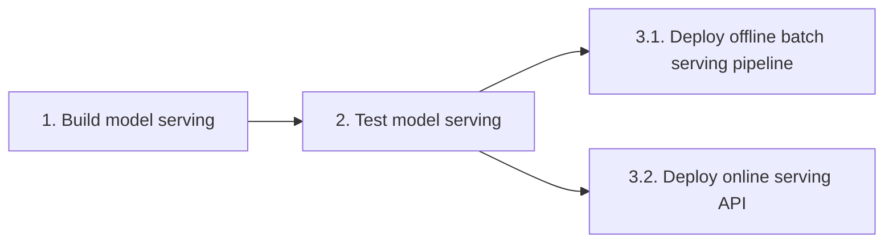

## Giới thiệu
Ở bài học trước, chúng ta đã cùng nhau xây dựng Jenkins pipeline để tự động hóa quá trình release `data pipeline`. Trong bài học này chúng ta sẽ sửa Jenkinsfile để phục vụ cho `model serving`.

## Jenkins pipeline
Luồng CI/CD cho model serving sẽ được thay đổi thành như sau:



???+ tip
    Ở đây chúng ta sẽ dùng 1 image cho cả `online serving API` và `offline batch serving pipeline` để hạn chế sự khác nhau giữa code và môi trường chạy.

```py title="Jenkinsfile" linenums="1"
pipeline {
    agent { docker { image 'python:3.9' } }

    stages {
        stage('build model serving') {
            when {changeset "model_serving/**" }

            steps {
                echo 'Building model serving..'
                sh 'cd model_serving && make build_image'
            }
        }

        stage('test model serving') {
            when {changeset "model_serving/**" }

            steps {
                echo 'Testing model serving..' # (1)
            }
        }

        stage('deploy model serving') {
            parallel { # (2)
                stage('batch serving pipeline') {
                    when {changeset "model_serving/**" }

                    steps {
                        sh 'cd model_serving && make deploy_dags'
                    }
                }

                stage('online serving API') {
                    when {changeset "model_serving/**" }

                    steps {
                        sh 'cd model_serving && make compose_up'
                    }
                }
            }
        }
    }
}
```

1. Test code, phần này mọi người sẽ bổ sung `unit test`, `integration test`, .v.v. dựa vào bài học về `kiểm thử hệ thống`
2. Định nghĩa 2 bước chạy song song là `serving pipeline` và `online serving API`

## Tổng kết
Ở bài học này, chúng ta đã cải tiến Jenkinsfile của `data pipeline` để tự động hóa `model serving` bằng cách sử dụng từ khóa `parallel`.
Mọi người có thể đọc thêm [document](https://www.jenkins.io/doc/) của Jenkins và tiếp tục custom luồng CI/CD, ví dụ: biến bước `deploy` trong CI/CD sang manual, thay vì tự động chạy cả luồng một lúc. 