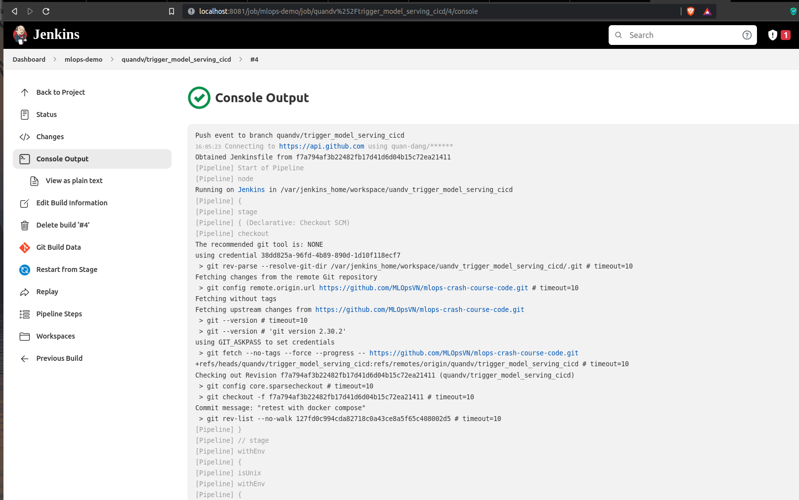

## Giới thiệu
Ở bài học trước, chúng ta đã cùng nhau xây dựng Jenkins pipeline để tự động hóa quá trình release `data pipeline`. Trong bài học này chúng ta sẽ sửa Jenkinsfile để phục vụ cho `model serving`.

## Jenkins pipeline
Luồng CI/CD cho model serving sẽ được thay đổi thành như sau:


???+ tip
    Ở đây chúng ta sẽ dùng 1 image cho cả `online serving API` và `offline batch serving pipeline` để hạn chế sự khác nhau giữa code và môi trường chạy.

```py title="Jenkinsfile" linenums="1"
pipeline {
    agent { docker { image 'python:3.9' } }

    stages {
        stage('build model serving') {
            when {changeset "model_serving/**" }

            steps {
                echo 'Building model serving..'
                sh 'cd model_serving && make build_image'
            }
        }

        stage('test model serving') {
            when {changeset "model_serving/**" }

            steps {
                echo 'Testing model serving..' # (1)
            }
        }

        stage('deploy model serving') {
            parallel { # (2)
                stage('batch serving pipeline') {
                    when {changeset "model_serving/**" }

                    steps {
                        sh 'cd model_serving && make deploy_dags'
                    }
                }

                stage('online serving API') {
                    when {changeset "model_serving/**" }

                    steps {
                        sh 'cd model_serving && make compose_up'
                    }
                }
            }
        }
    }
}
```

1. Test code, phần này mọi người sẽ bổ sung `unit test`, `integration test`, .v.v. dựa vào bài học về `kiểm thử hệ thống`
2. Định nghĩa 2 bước chạy song song là `serving pipeline` và `online serving API`

Sau khi mọi người thay đổi code ở folder `model_serving/` và push code lên Github, mọi người sẽ thấy `Console Output` tương ứng với commit này hiển thị tương tự như sau:



```bash
+ docker inspect -f . python:3.9
.
[Pipeline] }
[Pipeline] // withEnv
[Pipeline] withDockerContainer
Jenkins seems to be running inside container f82ae05b35bdfdc79907b7327f7f5c3da79a5f55b2e530bd4fdcf9abc3c6a4bc
$ docker run -t -d -u 0:0 -w /var/jenkins_home/workspace/uandv_trigger_model_serving_cicd --volumes-from f82ae05b35bdfdc79907b7327f7f5c3da79a5f55b2e530bd4fdcf9abc3c6a4bc -e ******** -e ******** -e ******** -e ******** -e ******** -e ******** -e ******** -e ******** -e ******** -e ******** -e ******** -e ******** -e ******** -e ******** -e ******** -e ******** -e ******** -e ******** -e ******** -e ******** -e ******** -e ******** -e ******** -e ******** -e ******** -e ******** -e ******** -e ******** -e ******** -e ******** -e ******** -e ******** python:3.9 cat
$ docker top 9c91089cefbdebff5d3aecb4ae7452bd55490cfa688c60c1b34fea3f794065e5 -eo pid,comm
[Pipeline] {
[Pipeline] stage
[Pipeline] { (build model serving)
[Pipeline] echo
Building model serving..
[Pipeline] sh
+ cd model_serving
+ make build_image
source "./deployment/.env" && bash deployment/deploy.sh build
Sending build context to Docker daemon  30.72kB

Step 1/11 : FROM python:3.8-slim AS build
 ---> bdd3315885d4
Step 2/11 : RUN apt-get update
 ---> Using cache
 ---> 87b1070b627f
Step 3/11 : RUN python -m venv /opt/venv
 ---> Using cache
 ---> af2314d67d5d
Step 4/11 : ENV PATH="/opt/venv/bin:$PATH"
 ---> Using cache
 ---> 848df69e17f2
Step 5/11 : COPY deployment/requirements.txt .
 ---> Using cache
 ---> a608d0dedd5b
Step 6/11 : RUN pip install -r requirements.txt
 ---> Using cache
 ---> 050052c1e2ea
Step 7/11 : FROM python:3.8-slim
 ---> bdd3315885d4
Step 8/11 : COPY --from=build /opt/venv /opt/venv
 ---> Using cache
 ---> 4f85e603296c
Step 9/11 : ENV PATH="/opt/venv/bin:$PATH"
 ---> Using cache
 ---> de620c67c6b8
Step 10/11 : COPY . /model_serving
 ---> Using cache
 ---> d55a439c0665
Step 11/11 : WORKDIR /model_serving
 ---> Using cache
 ---> 2685acbcb90a
Successfully built 2685acbcb90a
Successfully tagged mlopsvn/mlops_crash_course/model_serving:f7a794a
[Pipeline] }
[Pipeline] // stage
[Pipeline] stage
[Pipeline] { (test model serving)
[Pipeline] echo
Testing model serving..
[Pipeline] }
[Pipeline] // stage
[Pipeline] stage
[Pipeline] { (deploy model serving)
[Pipeline] parallel
[Pipeline] { (Branch: batch serving pipeline)
[Pipeline] { (Branch: online serving API)
[Pipeline] stage
[Pipeline] { (batch serving pipeline)
[Pipeline] stage
[Pipeline] { (online serving API)
[Pipeline] sh
[Pipeline] sh
+ cd model_serving
+ make deploy_dags
source "./deployment/.env" && bash deployment/deploy.sh dags
+ cd model_serving
+ make compose_up
docker-compose -f ./deployment/docker-compose.yml up -d
Container online_serving  Creating
Container online_serving  Created
Container online_serving  Starting
Container online_serving  Started
[Pipeline] }
[Pipeline] // stage
[Pipeline] }
[Pipeline] }
[Pipeline] // stage
[Pipeline] }
[Pipeline] // parallel
[Pipeline] }
[Pipeline] // stage
[Pipeline] }
$ docker stop --time=1 9c91089cefbdebff5d3aecb4ae7452bd55490cfa688c60c1b34fea3f794065e5
$ docker rm -f 9c91089cefbdebff5d3aecb4ae7452bd55490cfa688c60c1b34fea3f794065e5
[Pipeline] // withDockerContainer
[Pipeline] }
[Pipeline] // withEnv
[Pipeline] }
[Pipeline] // node
[Pipeline] End of Pipeline

GitHub has been notified of this commit’s build result

Finished: SUCCESS
```

## Tổng kết
Ở bài học này, chúng ta đã cải tiến Jenkinsfile của `data pipeline` để tự động hóa `model serving` bằng cách sử dụng từ khóa `parallel`.
Mọi người có thể đọc thêm [document](https://www.jenkins.io/doc/) của Jenkins và tiếp tục custom luồng CI/CD, ví dụ: biến bước `deploy` trong CI/CD sang manual, thay vì tự động chạy cả luồng một lúc. 