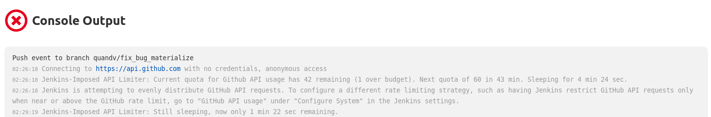

## Giới thiệu
Ở bài học về `data pipeline`, chúng ta đã cùng nhau xây dựng và deploy data pipeline theo các bước như sau:

- Đóng gói code và môi trường thành image để chạy các bước trong pipeline
- Thực hiện kiểm thử code
- Copy Python script định nghĩa `DAG` sang thư mục `dags/` của `Airflow`

Nếu chúng ta tự động hóa các bước này thì có thể đẩy nhanh quá trình release version mới cho pipeline mỗi khi developer thay đổi code.
Ở bài học này chúng ta sẽ sử dụng Jenkins để làm điều này.

## Jenkins pipeline
Chúng ta sẽ viết Jenkinsfile cho 3 bước trên như sau:


???+ info
    Ở bài học này chúng ta sẽ sử dụng agent lả docker image `python:3.9`, do đó trước hết mọi người phải truy câp <http://localhost:8081/pluginManager/> và cài đặt thêm plugin `Docker Pipeline`.

```py title="Jenkinsfile" linenums="1"
pipeline {
    agent { 
        docker { 
            image 'python:3.9' # (1) 
        } 
    }

    stages {
        stage('build data pipeline') {
            when {changeset "data_pipeline/**" }

            steps {
                echo 'Building data pipeline..'
                sh 'cd data_ppeline && make build_image'  # (2)
            }
        }

        stage('test data pipeline') {
            when {changeset "data_pipeline/**" }

            steps {
                echo 'Testing data pipeline..'  # (3)
            }
        }

        stage('deploy data pipeline') {
            when {changeset "data_pipeline/**" }

            steps {
                sh 'cd data_pipeline && make deploy_dags' # (4)
            }
        }
    }
}
```

1. Định nghĩa agent là docker image `python:3.9`. Image này được sử dụng mặc định cho tất cả các `stage` trong pipeline.
2. Build image cho để chạy các bước trong Airflow pipeline
3. Test code, phần này mọi người sẽ bổ sung `unit test`, `integration test`, .v.v. dựa vào bài học về `kiểm thử hệ thống`
4. Copy script chứa `DAG` qua folder `dags/` của Airflow

???+ warning
    Nếu mọi người gặp hiện tượng Github API Rate Limit như sau:
    
    
    , thì mọi người thêm Credentials ở mục Github bằng cách ấn vào `Add` như hình dưới: 
    

Sau khi mọi người thay đổi code ở folder `data-pipeline/` và push code lên Github, mọi người sẽ thấy `Console Output` tương ứng với commit này hiển thị tương tự như sau:


```bash
+ docker inspect -f . python:3.9
.
[Pipeline] }
[Pipeline] // withEnv
[Pipeline] withDockerContainer
Jenkins seems to be running inside container 1512656ef882dffe830aeaebaaefb49a72673a7bc61c451700b1b860213f4b5a
$ docker run -t -d -u 0:0 -w /var/jenkins_home/workspace/_demo_quandv_fix_bug_materialize --volumes-from 1512656ef882dffe830aeaebaaefb49a72673a7bc61c451700b1b860213f4b5a -e ******** -e ******** -e ******** -e ******** -e ******** -e ******** -e ******** -e ******** -e ******** -e ******** -e ******** -e ******** -e ******** -e ******** -e ******** -e ******** -e ******** -e ******** -e ******** -e ******** -e ******** -e ******** -e ******** -e ******** -e ******** -e ******** -e ******** -e ******** -e ******** -e ******** -e ******** -e ******** python:3.9 cat
$ docker top 2e4c21d3087d8cd719b8c1c1634e29f4bc2bfb2fa4f6644485a559022340552d -eo pid,comm
[Pipeline] {
[Pipeline] stage
[Pipeline] { (build data pipeline)
[Pipeline] echo
Building data pipeline..
[Pipeline] sh
+ cd data_pipeline
+ make build_image
source "./deployment/.env" && bash deployment/deploy.sh build
Sending build context to Docker daemon  25.09kB

Step 1/13 : FROM python:3.8-slim AS build
 ---> bdd3315885d4
Step 2/13 : RUN apt-get update
 ---> Running in a3976c6a325f
Get:1 http://deb.debian.org/debian bullseye InRelease [116 kB]
Get:2 http://deb.debian.org/debian-security bullseye-security InRelease [48.4 kB]
Get:3 http://deb.debian.org/debian bullseye-updates InRelease [44.1 kB]
Get:4 http://deb.debian.org/debian bullseye/main amd64 Packages [8184 kB]
Get:5 http://deb.debian.org/debian-security bullseye-security/main amd64 Packages [189 kB]
Get:6 http://deb.debian.org/debian bullseye-updates/main amd64 Packages [6344 B]
Fetched 8587 kB in 2s (4974 kB/s)
Reading package lists...
Removing intermediate container a3976c6a325f
 ---> 87b1070b627f
Step 3/13 : RUN python -m venv /opt/venv
 ---> Running in b066e5a08cdd
Removing intermediate container b066e5a08cdd
 ---> af2314d67d5d
Step 4/13 : ENV PATH="/opt/venv/bin:$PATH"
 ---> Running in bfa436419627
Removing intermediate container bfa436419627
 ---> 848df69e17f2
Step 5/13 : COPY deployment/requirements.txt .
 ---> da3ba833e7e5
Step 6/13 : RUN pip install -r requirements.txt
 ---> Running in abc449670506
Collecting pyspark==3.0.1
  Downloading pyspark-3.0.1.tar.gz (204.2 MB)
     ━━━━━━━━━━━━━━━━━━━━━━━━━━━━━━━━━━━━━━━ 204.2/204.2 MB 7.4 MB/s eta 0:00:00
  Preparing metadata (setup.py): started
  Preparing metadata (setup.py): finished with status 'done'
...
Step 9/13 : ENV JAVA_HOME=/usr/lib/jvm/java-11-openjdk-amd64
 ---> Running in 7f9e90e2b252
Removing intermediate container 7f9e90e2b252
 ---> abd41170b226
Step 10/13 : COPY --from=build /opt/venv /opt/venv
 ---> b7c37ed2e321
Step 11/13 : ENV PATH="/opt/venv/bin:$PATH"
 ---> Running in 41d839e620a6
Removing intermediate container 41d839e620a6
 ---> ce5c3b6c57bc
Step 12/13 : COPY . /data_pipeline
 ---> 1d49a90d64ff
Step 13/13 : WORKDIR /data_pipeline
 ---> Running in ee905d3559ea
Removing intermediate container ee905d3559ea
 ---> af80a23fe864
Successfully built af80a23fe864
Successfully tagged mlopsvn/mlops_crash_course/data_pipeline:2794a04
[Pipeline] }
[Pipeline] // stage
[Pipeline] stage
[Pipeline] { (test data pipeline)
[Pipeline] echo
Testing data pipeline..
[Pipeline] }
[Pipeline] // stage
[Pipeline] stage
[Pipeline] { (deploy data pipeline)
[Pipeline] sh
+ cd data_pipeline
+ make deploy_dags
source "./deployment/.env" && bash deployment/deploy.sh dags ""../../mlops-crash-course-platform/airflow/run_env/dags/data_pipeline""
[Pipeline] }
[Pipeline] // stage
[Pipeline] }
$ docker stop --time=1 2e4c21d3087d8cd719b8c1c1634e29f4bc2bfb2fa4f6644485a559022340552d
$ docker rm -f 2e4c21d3087d8cd719b8c1c1634e29f4bc2bfb2fa4f6644485a559022340552d
[Pipeline] // withDockerContainer
[Pipeline] }
[Pipeline] // withEnv
[Pipeline] }
[Pipeline] // node
[Pipeline] End of Pipeline

GitHub has been notified of this commit’s build result

Finished: SUCCESS
```

## Tổng kết
Ở bài học vừa rồi, chúng ta đã sử dụng Jenkins để xây dựng một CI/CD pipeline với 3 bước: buid image, test code và deploy Airflow pipeline. Developer bây giờ chỉ cần tập trung vào code, khi nào code xong thì `push` lên Github và để luồng CI/CD lo những phần còn lại, thật tiện lợi phải không nào!

Ở bài học tiếp theo, chúng ta sẽ xây dựng một CI/CD pipeline phức tạp hơn một chút cho `model serving`.
