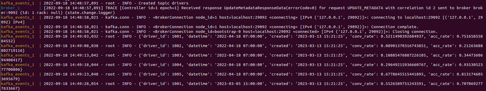

## Giới thiệu
Câu chuyện bắt đầu ở một công ty X nọ có 2 ông data scientist làm 2 bài toán khác nhau là credit score và churn prediction. Vào một ngày đẹp trời đầy nắng và gió, 2 ông ngồi trà đá và chia sẻ với nhau về bài toán mình đang làm thì chợt nhận ra cả 2 đều đang tạo một đống demographics feature (feature về độ tuổi, giới tính và ngôn ngữ, .v.v.) một cách độc lập, mà đáng lẽ ra là có thể chia sẻ cho nhau. 2 ông chợt này ra ý tưởng về một nơi lưu trữ feature chung để có thể dễ dàng sử dụng cho nhiều vấn đề khác nhau, thế là phiên bản đầu tiên của feature store ra đời. 

Liệu rằng feature store còn có công dụng gì không, và xây dựng feature store như thế nào, mời mọi người đến với nội dung bài học hôm nay.

## Môi trường phát triển
Bài học này sẽ sử dụng Feast, mọi người vào repo `mlops-crash-course-platform/` và start service này như sau:
```bash
bash run.sh feast up
```

## Feature store

Feature store là một hệ thống giúp lưu trữ, tương tác và quản lý feature. Công cụ này sinh ra để giải quyết vấn đề về:

- **Feature reuse:** lưu trữ các feature đã được tạo ra để tái sử dụng khi cần thiết
- **Feature sharing:** chia sẻ feature giữa các thành viên trong team hoặc với nhiều team khác nhau
- **Feature consistency:** một nguồn dữ liệu cho cả mục đích training và serving
- **Feature monitoring:** theo dõi drift và chất lượng dữ liệu trước khi đưa qua model sử dụng
- **Data leakage:** đảm bảo không xảy ra hiện tượng leak dữ liệu trong tập training. Ví dụ: dữ liệu training vào thời điểm bất kỳ không được bao gồm dữ liệu mà có timestamp sau đó.

Có rất nhiều feature store ở thời điểm hiện tại, có thể kể tới một số như:

- **Open-source:** Feast, Hopsworks
- **Trả phí:** Tecton (Feast phiên bản enterprise), Hopworks (phiên bản enterprise), Amazon SageMaker Feature Store, Vertex AI Feature Store

## Feast

Ở series này chúng ta sẽ tìm hiểu về feature store thông qua [Feast](https://feast.dev/).

Để sử dụng Feast, trước hết mọi người activate vào conda hoặc virtualenv và cài đặt sử dụng pip

```console
conda activate my_env
pip install feast
```

Feast có 2 khái niệm stores là:

- **Offline store:** lưu trữ dữ liệu lịch sử để phục vụ mục đích training hoặc offline batch serving. Hiện tại Feast hỗ trợ chọn một trong loại data source sau để làm offline store: File, Snowflake, Bigquery và Redshift. Ngoài ra còn các loại khác được contribute bởi cộng đồng ví dụ như PostgreSQL, Spark, Trino, .v.v.., tuy nhiên nên hạn chế dùng vì chưa đạt full test coverage.

- **Online store:** lưu trữ dữ liệu mới nhất cho mỗi ID. Store này cần có khả năng serve với low latency để sử dụng cho online serving. Các loại data source mà Feast hỗ trợ để làm online store bao gồm: SQLite, Snowflake, Redis, MongoDB và Datastore. Các loại khác contribute bởi cộng đồng có thể kể đến như PostgreSQL và Cassandra + Astra DB.

Tất cả các config cho Feast bao gồm data source cho mỗi loại store, định nghĩa các feature và entity (ID) nằm trong folder sau:

```
data_pipeline/feature_repo
├── data_sources.py: định nghĩa các data source
├── entities.py: định nghĩa entity
├── features.py: định nghĩa các bảng feature, và các feature cùng kiểu dữ liệu trong từng bảng
└── feature_store.yaml: định nghĩa loại data source và đường dẫn tới feature definition object store
```

Các bảng feature (còn gọi là feature view) chúng ta sẽ sử dụng bao gồm:

- **driver_stats_view:** feature view với data source dạng file
- **driver_stats_stream:** stream feature view với data source là Kafka và xử lý dữ liệu bằng Spark. Do bảng này lấy dữ liệu từ stream source nên feature sẽ mới hơn so với _driver_stats_view_

, được định nghĩa như sau:
```py title="features.py" linenums="1"
driver_stats_view = FeatureView(
    name="driver_stats",
    description="driver features",
    entities=[driver], # (1)
    ttl=timedelta(days=36500),  # (2)
    schema=[
        Field(name="conv_rate", dtype=Float32), # (3)
        Field(name="acc_rate", dtype=Float32),
        Field(name="avg_daily_trips", dtype=Int32),
    ],
    online=True,  # (4)
    source=driver_stats_batch_source,  # (5)
    tags={},
    owner="batch_source_owner@gmail.com",
)

@stream_feature_view(
    entities=[driver],
    ttl=timedelta(days=36500),
    mode="spark",  # (6)
    schema=[
        Field(name="conv_rate", dtype=Float32),
        Field(name="acc_rate", dtype=Float32),
    ],
    timestamp_field="datetime",
    online=True,
    source=driver_stats_stream_source,
    tags={},
    owner="stream_source_owner@gmail.com",
)
def driver_stats_stream(df: DataFrame):
    from pyspark.sql.functions import col

    return (
        df.withColumn("conv_percentage", col("conv_rate") * 100.0)
        .withColumn("acc_percentage", col("acc_rate") * 100.0)
        .drop("conv_rate", "acc_rate")
        .withColumnRenamed("conv_percentage", "conv_rate")
        .withColumnRenamed("acc_percentage", "acc_rate")
    )
```

1.  Định nghĩa entity cho bảng feature
2.  **Time-to-live:** Thời gian sử dụng của feature trước khi bị stale
3.  Định nghĩa feature và kiểu dữ liệu
4.  Cho phép online serving
5.  Định nghĩa data source cho bảng feature
6.  Sử dụng Spark để xử lý dữ liệu stream

với data source như sau:

```py title="data_sources.py" linenums="1"
driver_stats_parquet_file = "../data_sources/driver_stats.parquet"

driver_stats_batch_source = FileSource(
    name="driver_stats",
    file_format=ParquetFormat(),
    path=driver_stats_parquet_file,
    timestamp_field="datetime",
    created_timestamp_column="created",
)

driver_stats_stream_source = KafkaSource(
    name="driver_stats_stream",
    kafka_bootstrap_servers="localhost:29092",
    topic="drivers",
    timestamp_field="datetime",
    batch_source=driver_stats_batch_source,
    message_format=JsonFormat(
        schema_json="driver_id integer, acc_rate double, conv_rate double, datetime timestamp, created timestamp"
    ),
    watermark_delay_threshold=timedelta(minutes=5),   # (1)
    description="The Kafka stream containing the driver stats",
)
```

1.  Khoảng thời gian đến muộn cho phép của feature trước khi nó bị loại bỏ

Sau khi config feature store bằng cách thay đổi các file trong repo `feature_repo/`, chúng ta cần đảm bảo các data source đã sẵn sàng, bao gồm:

- **FileSource:** đảm bảo đường dẫn tồn tại, file không bị lỗi
- **KafkaSource:** đảm bảo bootstrap servers đang chạy. Để start boootstrap server này, mọi người truy cập vào thư mục `stream_emitting/` và chạy command:
  ```console
  bash deploy.sh start
  ```
  khi này chúng ta sẽ thấy console như sau, tức là Kafka đang stream dữ liệu driver về
  

và cuối cùng chúng ta sẽ apply các thay đổi như sau:

```console
cd feature_repo
feast apply
```

## Tổng kết

Chúng ta vừa làm quen với một số khái niệm về feature store thông qua Feast, ở bài tiếp theo, chúng ta sẽ lấy feature từ Feast, materialize feature từ offline qua online store, đấy dữ liệu stream về online store và offline store, và cuối cùng là xây dựng các Airflow pipeline để tự động hóa các công việc trên.

## Tài liệu tham khảo
- <https://feast.dev/>