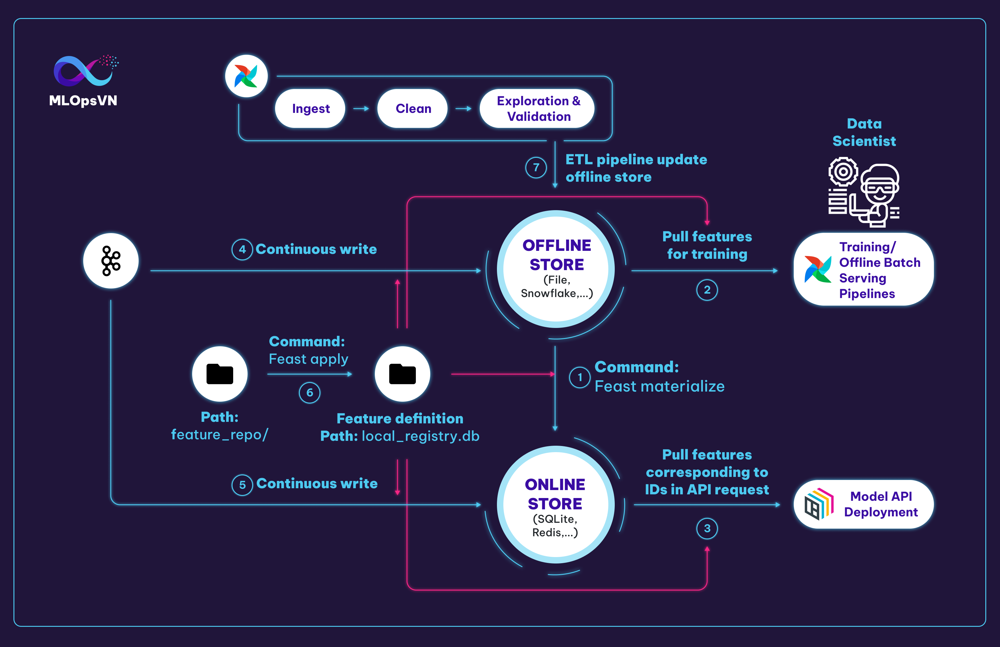
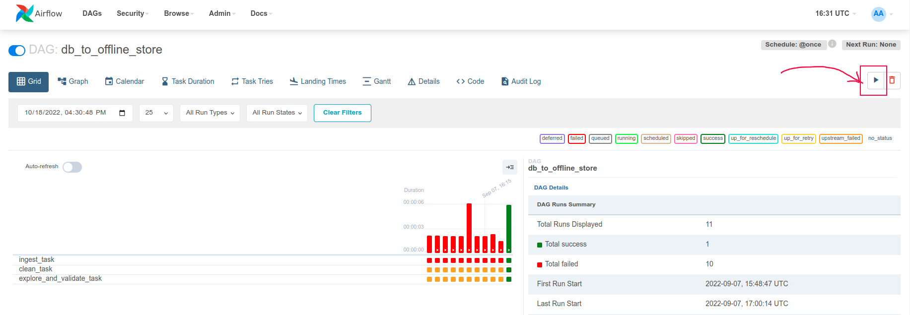

<figure>
    
    <figcaption>Photo by <a href="https://snehamehrin22.medium.com/?source=post_page-----fe14643c67fd--------------------------------">Sneha Mehrin</a> on <a href="https://snehamehrin22.medium.com/how-to-build-a-technical-design-architecture-for-an-analytics-data-pipeline-fe14643c67fd">Medium</a></figcaption>
</figure>

## Giới thiệu

Ở bài học trước, chúng ta đã làm quen với feature store, Feast, và dùng command `feast apply` để tạo ra feature definition ở đường dẫn `data_pipeline/feature_repo/registry/local_registry.db`. Trong bài học này chúng ta sẽ sử dụng folder này để config client `store` giao tiếp với feature store như sau:

```py linenums="1"
from feast import FeatureStore
store = FeatureStore(repo_path="../feature_repo")  # (1)
```

1.  Khởi tạo client _store_ để giao tiếp với feature store

Client này sẽ được sử dụng ở nhiều bước khác nhau bao gồm **1**, **2**, **3**, **4**, **5** như hình dưới đây:



## Môi trường phát triển

Ngoài Feast, bài học này sẽ sử dụng thêm Airflow, mọi người vào repo `mlops-crash-course-platform/` và start service này như sau:

```bash
bash run.sh airflow up
```

## Các tương tác chính với Feast

Chúng ta có 6 tương tác chính với Feast như sau:

1\. Materialize feature từ offline sang online store để đảm bảo online store lưu trữ feature mới nhất

```py title="data_pipeline/scripts/feast_helper.sh" linenums="1"
cd feature_repo
feast materialize-incremental $(date +%Y-%m-%d)
```

2\. Data scientist, training pipeline hoặc offline batch serving pipeline kéo features về để train model

```py title="data_pipeline/examples/get_historical_features.py" linenums="1"
entity_df = pd.DataFrame.from_dict(
    {
        "driver_id": [1001, 1002, 1003],
        "datetime": [
            datetime(2022, 5, 11, 11, 59, 59),
            datetime(2022, 6, 12, 1, 15, 10),
            datetime.now(),
        ],
    }
)
training_df = store.get_historical_features(
    entity_df=entity_df,
    features=["driver_stats:acc_rate", "driver_stats:conv_rate"],
).to_df()
print(training_df.head())
```

3\. Kéo features mới nhất tương ứng với các IDs trong request API để cho qua model dự đoán

```py title="data_pipeline/examples/get_online_features.py" linenums="1"
features = store.get_online_features(
    features=[
        "driver_stats:acc_rate",
        "driver_stats:conv_rate"
    ],
    entity_rows=[
        {
            "driver_id": 1001,
        }
    ],
).to_dict(include_event_timestamps=True)

def print_online_features(features):
    for key, value in sorted(features.items()):
        print(key, " : ", value)

print_online_features(features)
```

4\. Đẩy stream feature vào offline store

```py title="data_pipeline/src/stream_to_stores/processor.py" linenums="1"
def preprocess_fn(rows: pd.DataFrame):
    print(f"df columns: {rows.columns}")
    print(f"df size: {rows.size}")
    print(f"df preview:\n{rows.head()}")
    return rows

ingestion_config = SparkProcessorConfig(mode="spark", source="kafka", spark_session=spark, processing_time="30 seconds", query_timeout=15)
sfv = store.get_stream_feature_view("driver_stats_stream")

processor = get_stream_processor_object(
    config=ingestion_config,
    fs=store,
    sfv=sfv,
    preprocess_fn=preprocess_fn,
)

processor.ingest_stream_feature_view(PushMode.OFFLINE)
```

5\. Đẩy stream feature vào online store

```py linenums="1"
processor.ingest_stream_feature_view()
```

7\. ETL pipeline cập nhật dữ liệu của offline store

???+ tip
    Ở tương tác 2., thông thường các Data Scientist sẽ kéo dữ liệu từ feature store để:

    - thực hiện POC
    - thử nghiệm với các feature khác nhằm mục đích cải thiện model

Ở công đoạn xây dựng data pipeline, chúng ta sẽ xây dựng pipeline cho các tương tác 1., 4., 5., 7.

## Xây dựng các pipelines

### ETL pipeline

Để tạo ra một Airflow pipeline, thông thường chúng ta sẽ làm theo trình tự sau:

1.  Định nghĩa _DAG_ cho pipeline (line 1-8)
1.  Viết các task cho pipeline, ví dụ: _ingest_task_, _clean_task_ và _explore_and_validate_task_ (line 9-25)
1.  Viết thứ tự chạy các task (line 27)
1.  Chạy lệnh sau để copy file code DAG sang folder `airflow/run_env/dags/data_pipeline` của repo clone từ [MLOps Crash course platform](https://github.com/MLOpsVN/mlops-crash-course-platform)

    ```bash
    cd data_pipeline
    make deploy_dags
    ```

    ```py title="data_pipeline/dags/db_to_offline_store.py" linenums="1"
    with DAG(
        dag_id="db_to_offline_store", # (1)
        default_args=DefaultConfig.DEFAULT_DAG_ARGS, # (2)
        schedule_interval="@once",  # (3)
        start_date=pendulum.datetime(2022, 1, 1, tz="UTC"), # (4)
        catchup=False,  # (5)
        tags=["data_pipeline"],
    ) as dag:
        ingest_task = DockerOperator(
            task_id="ingest_task",
            **DefaultConfig.DEFAULT_DOCKER_OPERATOR_ARGS,
            command="/bin/bash -c 'cd src/db_to_offline_store && python ingest.py'",  # (6)
        )

        clean_task = DockerOperator(
            task_id="clean_task",
            **DefaultConfig.DEFAULT_DOCKER_OPERATOR_ARGS,
            command="/bin/bash -c 'cd src/db_to_offline_store && python clean.py'",
        )

        explore_and_validate_task = DockerOperator(
            task_id="explore_and_validate_task",
            **DefaultConfig.DEFAULT_DOCKER_OPERATOR_ARGS,
            command="/bin/bash -c 'cd src/db_to_offline_store && python explore_and_validate.py'",
        )

        ingest_task >> clean_task >> explore_and_validate_task  # (7)
    ```

    1.  Định nghĩa tên pipeline hiển thị ở trên Airflow dashboard
    2.  Định nghĩa image cho các **DockerOperator**, số lần retry pipeline, và khoảng thời gian giữa các lần retry
    3.  Lịch chạy pipeline, ở đây _@once_ là một lần chạy, mọi người có thể thay bằng cron expression ví dụ như 0 0 1 \* \*
    4.  Ngày bắt đầu chạy pipeline theo múi giờ UTC
    5.  Nếu **start_date** là ngày 01/01/2022, ngày deploy/turn on pipeline là ngày 02/02/2022, và **schedule_interval** là @daily thì sẽ không chạy các ngày trước 02/02/2022 nữa
    6.  Command chạy trong docker container cho bước này
    7.  Định nghĩa thứ tự chạy các bước của pipeline: đầu tiên là **ingest** sau đó tới **clean** và cuối cùng là **explore_and_validate**

    ???+ info

        Do chúng ta dùng DockerOperator để tạo _task_ nên cần phải build image chứa code và môi trường trước, sau đó sẽ truyền tên image vào _DEFAULT_DAG_ARGS_ trong DAG (line 3). Dockerfile để build image mọi người có thể tham khảo tại `data-pipeline/deployment/Dockerfile`

1.  Đăng nhập vào Airflow tại <http://localhost:8088>, account `airflow`, password `airflow`, các bạn sẽ thấy một DAG với tên chính là dag_id: *db_to_offline_store*, 2 DAG bên dưới chính là những pipeline còn lại trong data pipelines (đề cập ở bên dưới).

    

1.  Xem thứ tự các task của pipeline này như sau:

    

1. Để trigger pipeline chạy một cách thủ công (không theo schedule), mọi người ấn vào *db_to_offline_store*
    
    , và ấn vào nút `Play` như hình dưới
    
    

???+ tip
    Nếu mọi người gặp lỗi `Permission denied` như sau:
    ```bash
    [2022-10-16, 14:01:48 UTC] {taskinstance.py:1902} ERROR - Task failed with exception
    Traceback (most recent call last):
    File "/home/airflow/.local/lib/python3.7/site-packages/urllib3/connectionpool.py", line 710, in urlopen
        chunked=chunked,
    File "/home/airflow/.local/lib/python3.7/site-packages/urllib3/connectionpool.py", line 398, in _make_request
        conn.request(method, url, **httplib_request_kw)
    File "/usr/local/lib/python3.7/http/client.py", line 1281, in request
        self._send_request(method, url, body, headers, encode_chunked)
    File "/usr/local/lib/python3.7/http/client.py", line 1327, in _send_request
        self.endheaders(body, encode_chunked=encode_chunked)
    File "/usr/local/lib/python3.7/http/client.py", line 1276, in endheaders
        self._send_output(message_body, encode_chunked=encode_chunked)
    File "/usr/local/lib/python3.7/http/client.py", line 1036, in _send_output
        self.send(msg)
    File "/usr/local/lib/python3.7/http/client.py", line 976, in send
        self.connect()
    File "/home/airflow/.local/lib/python3.7/site-packages/docker/transport/unixconn.py", line 30, in connect
        sock.connect(self.unix_socket)
    PermissionError: [Errno 13] Permission denied
    ```
    thì có nghĩa là user `Airflow` thiếu quyền để chạy Docker command, mọi người làm theo cách [sau](https://stackoverflow.com/questions/48957195/how-to-fix-docker-got-permission-denied-issue/48957722#48957722) để thêm user này vào docker group (recommended), hoặc sử dụng command `sudo chmod 666 /var/run/docker.sock` để gán quyền cho tất cả user.

Tương tự như ETL pipeline, chúng ta sẽ code tiếp _Feast materialize pipeline_ và _Stream to stores pipline_ như bên dưới.

### Feast materialize pipeline

Materialize dữ liệu từ _offline_ qua _online_ giúp làm mới dữ liệu ở _online store_

```py title="data_pipeline/dags/materialize_offline_to_online.py" linenums="1"
with DAG(
    dag_id="materlize_offline_to_online",
    default_args=DefaultConfig.DEFAULT_DAG_ARGS,
    schedule_interval="@once",
    start_date=pendulum.datetime(2022, 1, 1, tz="UTC"),
    catchup=False,
    tags=["data_pipeline"],
) as dag:
    materialize_task = DockerOperator(
        task_id="materialize_task",
        **DefaultConfig.DEFAULT_DOCKER_OPERATOR_ARGS,
        command="/bin/bash -c 'chmod +x ./scripts/feast_helper.sh' && ./scripts/feast_helper.sh",
    )
```

### Stream to stores pipline

Mọi người thậm chí có thể làm feature mới hơn bằng cách ghi dữ liệu trực tiếp từ stream source vào _offline_ và _online store_

```py title="data_pipeline/dags/stream_to_stores.py" linenums="1"
with DAG(
    dag_id="stream_to_stores",
    default_args=DefaultConfig.DEFAULT_DAG_ARGS,
    schedule_interval="@once",
    start_date=pendulum.datetime(2022, 1, 1, tz="UTC"),
    catchup=False,
    tags=["data_pipeline"],
) as dag:
    stream_to_online_task = DockerOperator(
        task_id="stream_to_online_task",
        command="/bin/bash -c 'cd src/stream_to_stores && python ingest.py --store online'",
        **DefaultConfig.DEFAULT_DOCKER_OPERATOR_ARGS,
    )

    stream_to_offline_task = DockerOperator(
        task_id="stream_to_offline_task",
        **DefaultConfig.DEFAULT_DOCKER_OPERATOR_ARGS,
        command="/bin/bash -c 'cd src/stream_to_stores && python ingest.py --store offline'",
    )
```

## Tổng kết

Ở bài học vừa rồi, chúng ta đã sử dụng Feast SDK để lưu trữ và lấy feature từ feature store. Để đảm bảo feature luôn ở trạng thái mới nhất có thể, chúng ta cũng đã xây dựng các Airflow pipeline để cập nhật dữ liệu định kỳ cho các store.

Bài học này đồng thời cũng khép lại chuỗi bài về data pipeline, hy vọng mọi người có thể vận dụng các kiến thức đã học để vận hành hiệu quả các luồng dữ liệu và luồng feature của mình.

## Tài liệu tham khảo

- <https://feast.dev/>
- <https://airflow.apache.org/docs/apache-airflow/stable/tutorial/index.html>
