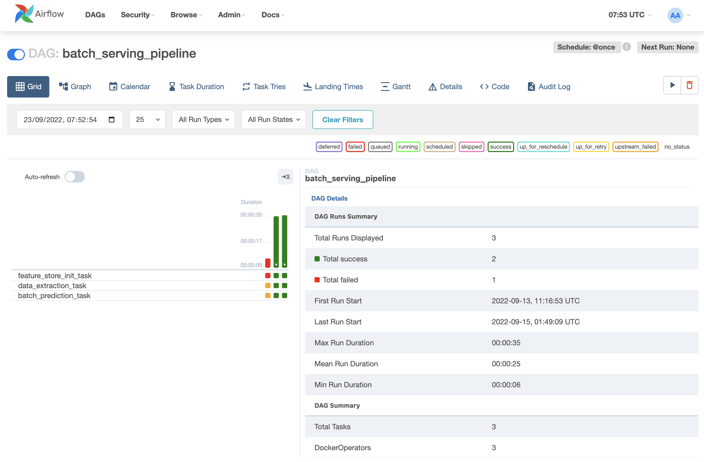

<figure>
    
    <figcaption>Photo by <a href="https://unsplash.com/@jaywennington?utm_source=unsplash&utm_medium=referral&utm_content=creditCopyText">Jay Wennington</a> on <a href="https://unsplash.com/s/photos/serve?utm_source=unsplash&utm_medium=referral&utm_content=creditCopyText">Unsplash</a></figcaption>
</figure>

## Giới thiệu

Sau khi train được một model tốt, chúng ta cần triển khai model đó để thực hiện inference. Có hai hình thức triển khai model phổ biến là _batch serving_ và _online serving_.

Cả batch serving và online serving đều có thể xử lý một hoặc nhiều requests. Trong khi batch serving được tối ưu để xử lý số lượng lớn các requests, thường để chạy các model phức tạp, thì online serving được tối ưu để giảm thời gian xử lý trong một lần thực thi. Batch serving thường được lên lịch theo chu kì và chạy offline. Online serving thường được triển khai lên một server dưới dạng RESTful APIs để người dùng có thể gọi tới.

Trong bài này, chúng ta sẽ tìm hiểu cách triển khai model ở cả hai hình thức batch serving và online serving.

## Môi trường phát triển

Các bạn làm các bước sau để cài đặt môi trường phát triển:

1.  Cài đặt **môi trường Python 3.9 mới** với các thư viện cần thiết trong file `model_serving/dev_requirements.txt`

1.  Đặt environment variable `MODEL_SERVING_DIR` ở terminal bạn dùng bằng đường dẫn tuyệt đối tới folder `model_serving`, và `MLFLOW_TRACKING_URI` bằng URL của MLflow server. Hai env var này hỗ trợ chạy python code ở folder `model_serving/src` trong quá trình phát triển.

    ```bash
    cd mlops-crash-course-code/model_serving
    export MODEL_SERVING_DIR=$(pwd)
    export MLFLOW_TRACKING_URI="http://localhost:5000"
    ```

Các MLOps tools được dùng trong bài này bao gồm:

1. **Feast:** truy xuất Feature Store
1. **MLflow:** ML Metadata Store, Model Registry
1. **Airflow:** điều phối batch serving pipeline

!!! note

    Trong quá trình chạy code cho tất cả các phần dưới đây, giả sử rằng folder gốc nơi chúng ta làm việc là folder `model_serving`.

## Batch serving

Batch serving được thiết kế với input là data file ở local hoặc cloud. Bạn có thể chỉ cần viết vài script để load input, load model, chạy predictions và lưu lại chúng. Tuy nhiên, chúng ta cũng có thể coi batch serving là một pipeline, sử dụng Airflow để quản lý và lên lịch cho quá trình chạy batch serving. Batch serving pipeline gồm các tasks như hình dưới:

[//]: # (```mermaid)

[//]: # (flowchart LR)

[//]: # (    n1[1. Cập nhật<br>Feature Store] --> n2[2. Data<br>extraction] --> n3[3. Batch<br>prediction])

[//]: # (```)

<figure>
    
</figure>

### Cập nhật Feature Store

Giả sử nơi chạy Batch serving là ở một server với infrastructure đủ mạnh cho việc tối ưu batch serving. Khi chạy batch serving, data được lấy từ Feature Store để phục vụ cho inference. Do đó, Feature Store cần được cập nhật trên server nơi batch serving được triển khai.

Task này được thực hiện giống như task **Cập nhật Feature Store** ở training pipeline. Bạn có thể xem lại bài [Xây dựng training pipeline](../../training-pipeline/xay-dung-training-pipeline/#cap-nhat-feature-store). Bạn hãy làm theo các bước dưới đây để cập nhật Feature Store.

1.  Code của Feature Store nằm tại `data_pipeline/feature_repo`. Để triển khai sang batch serving pipeline, chúng ta sẽ copy code từ `data_pipeline/feature_repo` sang `model_serving/feature_repo`. Bạn hãy chạy các lệnh sau.

```bash
cd ../data_pipeline
make deploy_feature_repo # (1)
cd ../model_serving

cd feature_repo
feast apply # (2)
cd ..
```

1. Triển khai code của Feature Store
2. Cập nhật Feature Registry và Offline Feature Store của Feast

### Data extraction

Task Data extraction có đầu vào và đầu ra như sau:

- **Đầu vào:** data được đọc từ Offline Feature Store. Data sẽ được xử lý theo format mà model yêu cầu để tiện cho task **Batch prediction** tiếp theo
- **Đầu ra:** data đã được xử lý và được lưu vào disk

Code của task này được lưu tại `model_serving/src/data_extraction.py`.

```python linenums="1" title="model_serving/src/data_extraction.py"
fs = feast.FeatureStore(repo_path=AppPath.FEATURE_REPO) # (1)

orders = pd.read_csv(batch_input_file, sep="\t") # (2)
orders["event_timestamp"] = pd.to_datetime(orders["event_timestamp"])

batch_input_df = fs.get_historical_features( # (3)
    entity_df=orders,
    features=[
        "driver_stats:conv_rate", # (4)
        "driver_stats:acc_rate",
        "driver_stats:avg_daily_trips",
    ],
).to_df()

batch_input_df = batch_input_df.drop(["event_timestamp", "driver_id"], axis=1) # (5)
to_parquet(batch_input_df, AppPath.BATCH_INPUT_PQ) # (6)
```

1. Khởi tạo kết nối tới Feature Store
2. Đọc file data nằm tại `model_serving/data/batch_request.csv` chứa các records mà chúng ta muốn chạy prediction
3. Lấy ra các features `conv_rate`, `acc_rate` và `avg_daily_trips`
4. `driver_stats` là tên `FeatureView` mà chúng ta đã định nghĩa tại `data_pipeline/feature_repo/features.py`
5. Bỏ các cột không cần thiết
6. Lưu `batch_input_df` vào disk

Bạn làm các bước sau để test thử code.

1.  Chạy code

    ```bash
    cd src
    python data_extraction.py
    cd ..
    ```

1.  Kiểm tra folder `model_serving/artifacts`, bạn sẽ thấy file `batch_input.parquet`

### Batch prediction

Task Batch prediction có đầu vào và đầu ra như sau:

- **Đầu vào:** config file chứa thông tin về model được dùng
- **Đầu ra:** kết quả predictions được lưu vào disk

Model được dùng là model đã được lưu vào MLflow Model Registry ở task **Model validation** trong bài [Xây dựng training pipeline](../../training-pipeline/xay-dung-training-pipeline/#model-validation). Trong task **Model validation** đó, thông tin về model đã đăng ký được lưu tại file `training_pipeline/artifacts/registered_model_version.json`. File này cần được upload vào một Storage nào đó trong tổ chức để các task khác, cụ thể là cho batch serving và online serving ở trong bài này, có thể biết được model nào là tốt nhất.

Vì chúng ta đang phát triển cả training pipeline và model serving ở local, nên bạn chỉ cần copy file `training_pipeline/artifacts/registered_model_version.json` sang `model_serving/artifacts/registered_model_version.json`. Để làm điều này, bạn hãy chạy lệnh sau.

```bash
cd ../training_pipeline
make deploy_registered_model_file
cd ../model_serving
```

Tiếp theo, chúng ta sẽ viết code cho task batch prediction. Đoạn code này giống như ở task **Model evaluation** trong bài [Xây dựng training pipeline](../../training-pipeline/xay-dung-training-pipeline/#model-evaluation). Code của task này được lưu tại `model_serving/src/batch_prediction.py`.

```python linenums="1" title="model_serving/src/batch_prediction.py"
mlflow_model = mlflow.pyfunc.load_model(model_uri=model_uri) # (1)

batch_df = load_df(AppPath.BATCH_INPUT_PQ) # (2)

model_signature = mlflow_model.metadata.signature # (3)
feature_list = []
for name in model_signature.inputs.input_names():
    feature_list.append(name)
batch_df = batch_df[feature_list] # (4)

preds = mlflow_model.predict(batch_df) # (5)
batch_df["pred"] = preds

to_parquet(batch_df, AppPath.BATCH_OUTPUT_PQ) # (6)
```

1. `model_uri` chứa URI của model đọc từ file `model_serving/artifacts/registered_model_version.json`
2. Load batch input file được lưu ở task trước, nằm tại `model_serving/artifacts/batch_input.parquet`
3. Load model signature
4. Sắp xếp các features theo đúng thứ tự mà model yêu cầu
5. Chạy inference
6. Lưu output vào disk

Bạn làm các bước sau để test thử code.

1.  Chạy code

    ```bash
    cd src
    python batch_prediction.py
    cd ..
    ```

1.  Kiểm tra folder `model_serving/artifacts`, bạn sẽ thấy file `batch_output.parquet`

### Airflow DAG

Ở phần này, Airflow DAG sẽ kết nối các task trên thành một pipeline. Code định nghĩa Airflow DAG được lưu tại `model_serving/dags/batch_serving_dag.py`.

```python linenums="1" title="model_serving/dags/batch_serving_dag.py"
with DAG(
    dag_id="batch_serving_pipeline", # (1)
    # các argument khác
) as dag:
    feature_store_init_task = DockerOperator(
        task_id="feature_store_init_task",
        command="bash -c 'cd feature_repo && feast apply'",
        **DefaultConfig.DEFAULT_DOCKER_OPERATOR_ARGS,
    )

    data_extraction_task = DockerOperator(
        task_id="data_extraction_task",
        command="bash -c 'cd src && python data_extraction.py'",
        **DefaultConfig.DEFAULT_DOCKER_OPERATOR_ARGS,
    )

    # các task khác
```

1. Chi tiết về những điểm quan trọng cần lưu ý, mời bạn xem lại bài [Xây dựng training pipeline](../../training-pipeline/xay-dung-training-pipeline/#airflow-dag).

Tiếp theo, chúng ta cần build docker image `mlopsvn/mlops_crash_course/model_serving:latest` và triển khai Airflow DAGs bằng cách các bước sau.

1.  Đăng nhập vào Airflow UI với tài khoản và mật khẩu là `airflow`.

1.  Đặt Airflow Variable `MLOPS_CRASH_COURSE_CODE_DIR` bằng đường dẫn tuyệt đối tới folder `mlops-crash-course-code/`

1.  Chạy lệnh

    ```bash
    make build_image
    make deploy_dags # (1)
    ```

    1.  Copy `model_serving/dags/*` vào folder `dags` của Airflow

    !!! tip

        Định nghĩa về các env vars được dùng trong quá trình chạy Airflow DAG được lưu tại `model_serving/.env`. Bạn có thể thay đổi nếu cần.

1.  Kích hoạt batch serving pipeline và đợi kết quả

    

## Online serving

Khi triển khai Online serving hay _Online serving service_, thường thì bạn sẽ dùng một library để xây dựng RESTful API, ví dụ như Flask, FastAPI trong Python. Trong phần này, chúng ta sẽ dùng một library chuyên được dùng cho việc xây dựng online serving cho ML models, đó là _BentoML_. Code của online serving được lưu tại `model_serving/src/bentoml_service.py`.

```python linenums="1" title="model_serving/src/bentoml_service.py"
mlflow_model = mlflow.pyfunc.load_model(model_uri=model_uri) # (1)
model = mlflow_model._model_impl # (2)

bentoml_model = bentoml.sklearn.save_model( # (3)
    model_name, # (4)
    model,
    signatures={ # (5)
        "predict": { # (6)
            "batchable": False, # (7)
        },
    },
    custom_objects={ # (8)
        "feature_list": feature_list, # (9)
    },
)

feature_list = bentoml_model.custom_objects["feature_list"]
bentoml_runner = bentoml.sklearn.get(bentoml_model.tag).to_runner() # (10)
svc = bentoml.Service(bentoml_model.tag.name, runners=[bentoml_runner])
fs = feast.FeatureStore(repo_path=AppPath.FEATURE_REPO) # (11)

def predict(request: np.ndarray) -> np.ndarray: # (12)
    result = bentoml_runner.predict.run(request)
    return result

class InferenceRequest(BaseModel): # (13)
    driver_ids: List[int]

class InferenceResponse(BaseModel): # (14)
    prediction: Optional[float]
    error: Optional[str]

@svc.api(
    input=JSON(pydantic_model=InferenceRequest), # (15)
    output=JSON(pydantic_model=InferenceResponse),
)
def inference(request: InferenceRequest, ctx: bentoml.Context) -> Dict[str, Any]:
    try:
        driver_ids = request.driver_ids
        online_features = fs.get_online_features( # (16)
            entity_rows=[{"driver_id": driver_id} for driver_id in driver_ids],
            features=[f"driver_stats:{name}" for name in feature_list],
        )
        df = pd.DataFrame.from_dict(online_features.to_dict())

        input_features = df.drop(["driver_id"], axis=1) # (17)
        input_features = input_features[feature_list] # (18)

        result = predict(input_features)
        df["prediction"] = result
        best_idx = df["prediction"].argmax()
        best_driver_id = df["driver_id"].iloc[best_idx] # (19)

        ... # (20)
    except Exception as e:
        ...
```

1. Download model từ MLflow server
2. Lấy ra sklearn model
3. Lưu model về [dạng mà BentoML yêu cầu](https://docs.bentoml.org/en/latest/concepts/model.html#save-a-trained-model)
4. `model_name` được lấy từ file `model_serving/artifacts/registered_model_version.json`
5. [Signature của model](https://docs.bentoml.org/en/latest/concepts/model.html#model-signatures), thể hiện hàm mà model object sẽ gọi
6. Key `predict` là tên hàm mà model sẽ gọi. Vì `sklearn` model dùng hàm `predict` để chạy inference nên `signatures` của BentoML sẽ chứa key `predict`
7. Thông tin thêm về key `batchable`. Đọc thêm [tại đây](https://docs.bentoml.org/en/latest/concepts/model.html#batching).
8. Lưu bất kì Python object nào đi kèm với model. Đọc thêm [tại đây](https://docs.bentoml.org/en/latest/concepts/model.html#save-a-trained-model)
9. Lưu thứ tự các features model yêu cầu. `feature_list` được lấy ra từ metadata của model đã lưu ở MLflow
10. Tạo [_BentoML Runner_ và _BentoML Service_](https://docs.bentoml.org/en/latest/concepts/model.html#using-model-runner). Quá trình chạy inference thông qua một BentoML Runner. BentoML Service chứa object BentoML Runner, giúp định nghĩa API một cách thuận tiện
11. Khởi tạo kết nối tới Feature Store
12. Hàm `predict` để thực hiện inference
13. Định nghĩa input class cho API
14. Định nghĩa output class cho API
15. Định nghĩa input và output ở dạng json cho API
16. Đọc features từ Online Feature Store
17. Loại bỏ cột không cần thiết
18. Sắp xếp thứ tự features
19. Lấy ra ID của tài xế có khả năng cao nhất sẽ hoàn thành cuốc xe. ID này được trả về trong response
20. Đoạn code liên quan tới monitoring sẽ được giải thích trong bài tiếp theo. Bạn hãy tạm thời bỏ qua đoạn code này

Để triển khai online serving API trên máy local, docker compose sẽ được dùng. Online serving API sẽ được gọi qua port `8172`.

??? info

    Port `8172` được định nghĩa tại `model_serving/deployment/.env`.

Bạn làm các bước sau để triển khai Online serving service.

1.  Chạy Online Feature Store bằng cách vào repo `mlops-crash-course-platform` và chạy lệnh sau

    ```bash
    bash run.sh feast up
    ```

    !!! info

        Online Feature Store thực chất là một Redis database. Các bạn xem file `feast/feast-docker-compose.yml` trong repo `mlops-crash-course-platform`

1.  Cập nhật Online Feature Store. Xem lại bài [Xây dựng data pipeline](../../data-pipeline/xay-dung-data-pipeline/#feast-materialize-pipeline)

    ```bash
    cd feature_repo
    feast apply
    feast materialize-incremental $(date +%Y-%m-%d)
    cd ..
    ```

1.  Build docker image và chạy docker compose

    ```bash
    make build_image
    make compose_up
    ```

    !!! tip

        Định nghĩa về các env vars được dùng trong quá trình build image được lưu tại `model_serving/deployment/.env`. Bạn có thể thay đổi nếu cần.

1.  Truy cập <http://localhost:8172/>, mở API `/inference`, click `Try it out`. Ở phần `Request body`, bạn gõ nội dung sau:

    ```json
    {
      "request_id": "uuid-1",
      "driver_ids": [1001, 1002, 1003, 1004, 1005]
    }
    ```

    Kết quả của response trả về sẽ giống như sau.

    

## Tổng kết

Chúng ta vừa thực hiện một loạt các quy trình điển hình để triển khai batch serving và online serving. Code để chạy cả batch serving và online serving sẽ phụ thuộc vào model mà Data Scientist đã train và các features được yêu cầu cho model đó. Do đó, batch serving và online serving code cũng sẽ được cập nhật theo yêu cầu của Data Scientist.

Sau khi tự động hoá batch serving pipeline và triển khai online serving service, trong bài tiếp theo chúng ta sẽ xây dựng hệ thống giám sát online serving service. Hệ thống này rất quan trọng trong việc theo dõi system performance và model performance, giúp chúng ta giải quyết các vấn đề ở production nhanh hơn và cảnh báo khi có các sự cố về hệ thống và model performance.

## Tài liệu tham khảo

- [BentoML](https://docs.bentoml.org/en/latest/tutorial.html)
