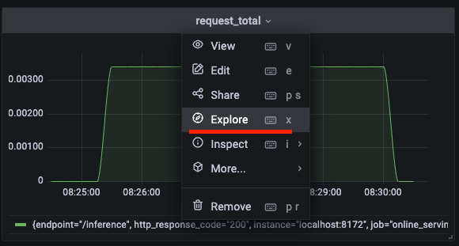

## Giới thiệu

Trong bài trước, chúng ta đã tìm hiểu về theo dõi một hệ thống ML nói chung, với các metrics mà chúng ta thường cần theo dõi, và các bộ công cụ mà chúng ta sử dụng trong quá trình theo dõi.

Trong bài này, chúng ta sẽ bắt tay vào triển khai các giải pháp để theo dõi hệ thống ML mà chúng ta đang làm, cụ thể là những công việc sau:

1. Triển khai ELK Stack để theo dõi logs của hệ thống
1. Triển khai Prometheus và Grafana servers để theo dõi operational metrics

## Môi trường phát triển

Trong bài này, chúng ta sẽ không viết code, mà sẽ đi triển khai ELK Stack, Prometheus và Grafana servers. Do đó, các bạn không cần cài đặt môi trường phát triển trong bài này. Các bạn chỉ cần clone Github repo [mlops-crash-course-platform](https://github.com/MLOpsVN/mlops-crash-course-platform) là xong.

Các MLOps tools sẽ được sử dụng trong bài này bao gồm:

1. Elasticsearch, Kibana, và Filebeat, để thu thập và hiển thị logs tập trung từ Online serving service
2. Prometheus và Grafana để theo dõi và hiển thị operational metrics

## Logs

Việc sử dụng công nghệ container mang đến rất nhiều ưu điểm, nhưng bên cạnh đó cũng xuất hiện thêm những thách thức cho các kĩ sư. Một trong những thách thức đó phải kể đến là việc thu thập và xử lý logs của mỗi container một cách hiệu quả. May mắn thay, ELK Stack là một trong những giải pháp được cộng đồng ưa chuộng để xử lý vấn đề này.

### Cách ELK Stack hoạt động

Hình dưới là một pipeline điển hình cho việc thu thập và xử lý logs tập trung sử dụng ELK Stack.


Đầu tiên, Logstash thu thập logs từ các containers, xử lý bằng cách filter logs đó. Các cách để filter logs sẽ được người dùng tự định nghĩa. Sau đó, Logstash sẽ đẩy logs tới Elasticsearch để đánh index, tiện cho việc tìm kiếm. Kibana sẽ lấy logs ra, phân tích và hiển thị data lên Kibana dashboard.

Có khá nhiều các biến thể của pipeline trên, ví dụ như chúng ta có thể dùng _Filebeat_ để thu thập logs từ các containers và gửi logs tới Elasticsearch, hoặc chúng ta có thể thêm Redis với vai trò là một bộ đệm vào giữa Logstash và Elasticsearch.

Trong bài này, chúng ta sẽ thay thế Logstash bằng Filebeat để thu thập logs từ các containers và gửi tới Elasticsearch.

!!! note

    ELK Stack được sử dụng làm tên chung cho giải pháp, mặc dù chúng ta sẽ sử dụng Filebeat thay thế cho Logstash.

### Triển khai ELK Stack

Để triển khai ELK Stack, các bạn hay vào repo `mlops-crash-course-platform`, và chạy lệnh sau:

```bash
bash run.sh elk up
```

Câu lệnh trên sẽ chạy các servers sau:

- Filebeat server
  - File docker-compose để chạy Filebeat server được đặt tại `elk/extensions/filebeat/filebeat-compose.yml`
  - Config của Filebeat server được đặt tại `elk/extensions/filebeat/config/filebeat.yml`
- Elasticsearch server
  - File docker-compose để chạy Elasticsearch server được đặt tại `elk/elk-docker-compose.yml`
  - Config của Elasticsearch server được đặt tại `elk/elasticsearch/config/elasticsearch.yml`
- Kibana server
  - File docker-compose để chạy Kibana server được đặt tại `elk/elk-docker-compose.yml`
  - Config của Kibana server được đặt tại `elk/kibana/config/kibana.yml`

Hãy đợi khoảng 10 giây để cho việc khởi tạo các servers hoàn thành. Tiếp theo, chúng ta cần kiểm tra xem Elasticsearch server trên đã được triển khai thành công chưa, bằng cách chạy lệnh sau:

```bash
curl -X GET http://localhost:9200 -u elastic:changeme
```

Nếu Elasticsearch server được triển khai thành công, ở terminal sẽ hiển thị tương tự như sau:

```bash
{
"name" : "W3NuLnv",
"cluster_name" : "docker-cluster",
"cluster_uuid" : "fauVIbHoSE2SlN_nDzxxdA",
"version" : {
    "number" : "5.2.1",
    "build_hash" : "db0d481",
    "build_date" : "2017-02-09T22:05:32.386Z",
    "build_snapshot" : false,
    "lucene_version" : "6.4.1"
},
"tagline" : "You Know, for Search"
}
```

Để kiểm tra xem Kibana server đã được triển khai thành công chưa, các bạn hãy làm những việc sau:

1. Trên browser, truy cập vào Kibana server tại [http://localhost:5601](http://localhost:5601)
2. Đăng nhập với tên user là `elastic`, và mật khẩu là `changeme`

Việc đăng nhập thành công chứng tỏ Kibana server đã được triển khai thành công.

### Truy vấn logs

Sau khi đã triển khai ELK Stack thành công, hãy cùng thử truy vấn logs ở ELK Stack xem logs đã được thu thập thành công từ Online serving API hay chưa.

Đầu tiên, các bạn hãy gửi một vài requests tới Online serving API bằng cách mở browser, truy cập tới `http://localhost:8172/`, mở API `/inference`, và ấn nút `Try it out`. Ở phần `Request body`, các bạn gõ nội dung sau:

```json
{
  "request_id": "1234",
  "driver_ids": [1001, 1002, 1003, 1004, 1005]
}
```

Sau đó, hãy đăng nhập vào Kibana server [http://localhost:5601](http://localhost:5601) trên browser của bạn như hướng dẫn ở phần trước. Ở sidebar bên phải, các bạn chọn **Discover**.


Trên UI của page **Discover**, trong phần gõ câu truy vấn, các bạn gõ câu lệnh truy vấn như sau:

```
container.name:"online_serving"
```

!!! note

    Câu truy vấn trên sử dụng ngôn ngữ truy vấn KQL. Các bạn có thể tham khảo thêm [tại đây](https://www.elastic.co/guide/en/kibana/current/kuery-query.html).

Sau đó, các bạn sẽ nhìn thấy bảng hiển thị logs của Online Serving service như hình dưới đây.


Các bạn có thể lưu lại lần _discover_ này để lần sau có thể xem lại mà không cần gõ lại câu lệnh truy vấn trên bằng cách click vào nút Save ở góc trên bên phải.

!!! question

    Nhưng làm thế nào mà ELK stack có thể biết được nên thu thập logs từ containers nào?

Nếu bạn nào đã đọc file config của Filebeat tại `elk/extensions/filebeat/config/filebeat.yml`, thì các bạn sẽ để ý thấy một đoạn config như sau:

```yaml linenums="1" title="elk/extensions/filebeat/config/filebeat.yml"
filebeat.autodiscover:
  providers:
    # The Docker autodiscover provider automatically retrieves logs from Docker
    # containers as they start and stop.
    - type: docker
      hints.enabled: true
```

Đoạn config này sẽ cấu hình Filebeat để nó tự động thu thập logs và gửi về Elasticsearch service khi có containers mới được tạo ra. Tuy nhiên, trong thực tế, chúng ta không muốn thu thập logs từ mọi containers, và chúng ta cũng muốn lọc ra những dòng log nhất định từ service. Để tuỳ chỉnh Filebeat config, các bạn có thể đọc thêm [tại đây](https://www.elastic.co/guide/en/beats/filebeat/current/filtering-and-enhancing-data.html).

## Operational metrics

Trong phần này, chúng ta sẽ dùng Prometheus để thu thập các operational metrics và dùng Grafana để hiển thị các metrics đó.

### Triển khai Prometheus và Grafana servers

Để triển khai Prometheus và Grafana servers, các bạn hay vào repo `mlops-crash-course-platform`, và chạy lệnh sau:

```bash
bash run.sh prom-graf up
```

Câu lệnh trên sẽ chạy các servers sau:

- Prometheus server
  - File docker-compose để chạy Prometheus server được đặt tại `prom-graf/prom-graf-docker-compose.yml`
  - Config của Prometheus server được đặt tại `prom-graf/prometheus/config/prometheus.yml`
- Grafana server
  - File docker-compose để chạy Grafana server được đặt tại `prom-graf/prom-graf-docker-compose.yml`
  - Grafana _dashboard_ config được đặt tại `prom-graf/grafana/config/dashboards.yaml`
  - Grafana _datasource_ config được đặt tại `prom-graf/grafana/config/datasources.yaml`. File này định nghĩa sẵn datasource là Prometheus server được triển khai ở trên.
- Node exporter server
  - File docker-compose để chạy Node exporter server được đặt tại `prom-graf/prom-graf-docker-compose.yml`

Node exporter server là một server được cài đặt thêm vào để thu thập các metrics liên quan tới node (hay chính là máy tính hiện tại của chúng ta), ví dụ như các metrics liên quan tới CPU, memory, v.v. Các bạn có thể đọc thêm ở Github repo này [prometheus/node_exporter](https://github.com/prometheus/node_exporter).

Để kiểm tra xem Prometheus server đã được triển khai thành công chưa, các bạn hãy làm những bước sau.

1. Mở browser, truy cập vào Prometheus server tại [http://localhost:9090](http://localhost:9090)
1. Trên Navbar, click **Status**, chọn **Targets**
1. Kiểm tra xem các endpoints của các job **prometheus**, **node**, **online_serving** có đạt trạng thái **UP** không. Các bạn có thể cần đợi 30s cho tới khi các endpoints đạt trạng thái này. Hình dưới đây cho thấy endpoints của các targets trên đã đạt trạng thái **UP**.


!!! note

    Một *endpoint*, hoặc một *instance*, trong Prometheus được hiểu là địa chỉ của service mà chúng ta muốn Prometheus thu thập metrics. Một *job* là một process làm nhiệm vụ thu thập metrics từ một tập hợp của các *instance* có chung mục đích. Các bạn có thể đọc thêm [tại đây](https://prometheus.io/docs/concepts/jobs_instances/).

!!! question

    Làm thế nào để tạo một job hay một instance trong Prometheus?

Chúng ta có thể tạo job và các instances của job đó trong Prometheus. Trong config file `prom-graf/prometheus/config/prometheus.yml` của Prometheus server, các bạn có thể thấy job `online_serving` đã được thiết lập sẵn để thu thập metrics từ Online serving service.

```yaml linenums="1" title="prom-graf/prometheus/config/prometheus.yml"
- job_name: "online_serving"
  scrape_interval: 5s
  static_configs:
    - targets:
        - "localhost:8172"
```

Thiết lập này để báo cho Prometheus biết rằng, mỗi 5 giây, nó cần phải đi thu thập metrics từ URI [localhost:8172/metrics](localhost:8172/metrics), với `/metrics` là route mặc định để Prometheus đọc các metrics. Các bạn có thể mở URI này trên browser và sẽ thấy nội dung tương tự như sau.


Tiếp theo, chúng ta cũng cần kiểm tra xem Grafana server đã được triển khai thành công chưa, các bạn hãy làm những bước sau.

1. Mở browser, truy cập vào Grafana server tại [http://localhost:3000](http://localhost:3000)
2. Đăng nhập với tên user là `admin`, và mật khẩu là `admin`

Việc đăng nhập thành công chứng tỏ Grafana server đã được triển khai thành công.

!!! note

    Grafana cần một datasource để có thể lấy metrics về và hiển thị. Prometheus đã được cấu hình làm datasource mặc định của Grafana. Cấu hình này được đặt tại `prom-graf/grafana/config/datasources.yaml`.

### Thiết lập Note Exporter Full dashboard

Ở phần này, chúng ta sẽ sử dụng một Grafana dashboard tên là [Node Exporter Full](https://grafana.com/grafana/dashboards/1860-node-exporter-full/) được xây dựng sẵn bởi cộng đồng sử dụng Prometheus và Grafana. Dashboard này sẽ hiển thị các thông tin quan trọng của hệ thống về máy local mà chúng ta đang chạy. Để đảm bảo dashboard này chạy đúng chức năng, các bạn hãy chắc chắn rằng config file `prom-graf/prometheus/config/prometheus.yml` của Prometheus server chứa config sau:

```yaml linenums="1" title="prom-graf/prometheus/config/prometheus.yml"
- job_name: "node"
  static_configs:
    - targets:
        - "localhost:9100"
```

Tiếp theo, các bạn làm các bước sau:

1. Trên giao diện của Grafana Web UI, ở menu bên trái, chọn `Dashboards` > `Manage`
1. Click `Import`, nhập vào ID của Node Exporter Full dashboard là _1860_
1. Chọn Prometheus datasource, và click `Import`

Các bạn sẽ nhìn thấy dashboard giống như sau.


Tuỳ thuộc vào cài đặt của Node Exporter service trong file docker-compose `prom-graf/prom-graf-docker-compose.yml` mà một vài phần của dashboard sẽ không được hiển thị hết. Các bạn có thể xem thêm [tại đây](https://grafana.com/grafana/dashboards/1860-node-exporter-full/) nếu cần biết thêm chi tiết về cách cấu hình Node Exporter service.

### Thiết lập Bentoml dashboard

Bentoml dashboard đã được chuẩn bị sẵn tại `mlops-crash-course-code/monitoring_service/dashboards/bentoml_dashboard.json`. Chúng ta cần làm các bước sau để hiển thị Bentoml dashboard trên Grafana.

1. Copy file dashboard trên vào `mlops-crash-course-platform/prom-graf/run_env/grafana/dashboards`
1. Truy cập vào Grafana server tại [http://localhost:3000](http://localhost:3000)
1. Ở sidebar bên phải, chọn **Dashboards**
1. Ở giao diện của trang Dashboards, các bạn sẽ nhìn thấy một dashboard tên là _Bentoml Dashboard_, click chọn để mở dashboard. Bentoml dashboard sẽ nhìn như sau.


Dashboard này bao gồm 2 panel:

1. `request_in_progress`: Hiển thị số lượng request đang được xử lý
1. `request_total`: Hiển thị số lượng request trong 1 giây, được đo trong thời gian mỗi 5 phút

Các bạn có thể click vào tên của panel, chọn **Explore** để xem câu truy vấn _PromQL_ được sử dụng để đọc data từ Prometheus.



!!! note

    PromQL là ngôn ngữ truy vấn được dùng trong Prometheus để tổng hợp data dạng time-series trong thời gian thực. Các bạn có thể đọc thêm [tại đây](https://prometheus.io/docs/prometheus/latest/querying/basics/).

!!! question

    Làm thế nào mà Grafana tự động đọc được file `bentoml_dashboard.json`?

Config của Grafana dashboard được đặt tại `prom-graf/grafana/config/dashboards.yaml`. Trong đó, các bạn sẽ thấy có một số config như sau.

```yaml linenums="1" title="prom-graf/grafana/config/dashboards.yaml"
updateIntervalSeconds: 10 # (1)
options:
  path: /opt/grafana/dashboards # (2)
```

1. Chu kì mà Grafana đọc và cập nhật dashboard nằm trong folder chứa dashboard
2. Folder chứa Grafana dashboard

Cấu hình này cho phép Grafana tự động đọc dashboards được đặt tại đường dẫn được chỉ định. Thêm nữa, trong file docker-compose của Grafana server, chúng ta đã mount folder `mlops-crash-course-platform/prom-graf/run_env/grafana/dashboards` ở máy local vào folder `/opt/grafana/dashboards` ở trong docker container. Điều này cho phép chúng ta có thể copy file `bentoml_dashboard.json` vào `mlops-crash-course-platform/prom-graf/run_env/grafana/dashboards`, và Grafana sẽ tự động đọc file dashboard này.

## Tổng kết

Như vậy, chúng ta vừa thực hiện quá trình triển khai ELK Stack để thu thập logs lại tập trung một chỗ, truy vấn và hiển thị logs. Chúng ta cũng vừa triển khai Prometheus và Grafana servers để thu thập các operational metrics và hiển thị chúng.

Trong thực tế, với ELK Stack, chúng ta sẽ cần thiết lập các bộ filter để truy vấn và hiển thị logs hiệu quả hơn, dễ dàng tìm ra logs chứa lỗi để kịp thời xử lý. Với Prometheus và Grafana, chúng ta sẽ cần tìm hiểu thêm về cách viết các câu lệnh truy vấn sử dung _PromQL_ để có thể chọn lọc và tổng hợp metrics data hiệu quả. Các bạn có thể đọc thêm tại [Querying Prometheus](https://prometheus.io/docs/prometheus/latest/querying/basics/).

Trong bài sau, chúng ta sẽ thực hiện triển khai một service khá phức tạp, đó là Monitoring service. Service này sẽ có chức năng theo dõi các ML metrics liên quan tới chất lượng data và model.
