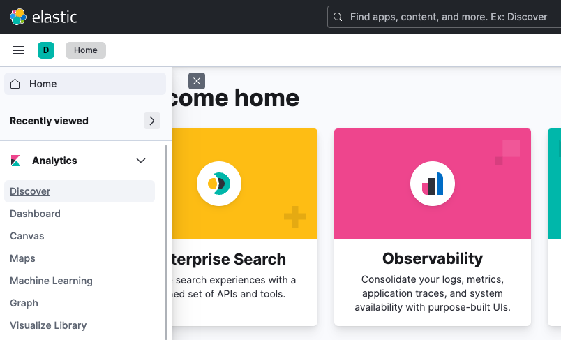
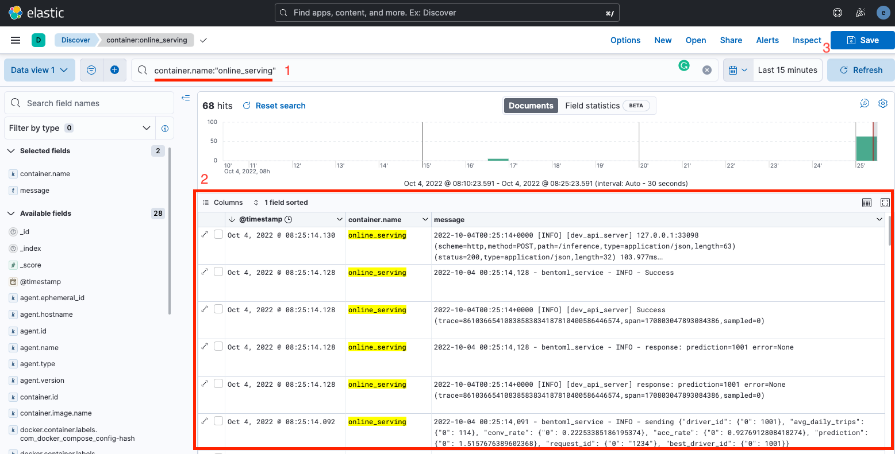
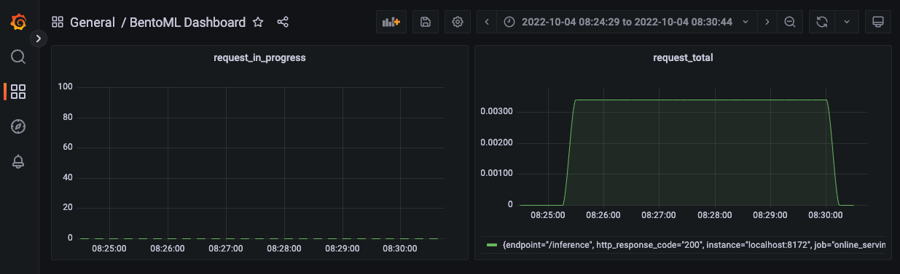

<figure>
    
    <figcaption>Photo by <a href="https://unsplash.com/@chrisliverani?utm_source=unsplash&utm_medium=referral&utm_content=creditCopyText">Chris Liverani</a> on <a href="https://unsplash.com/s/photos/dashboard?utm_source=unsplash&utm_medium=referral&utm_content=creditCopyText">Unsplash</a></figcaption>
</figure>

## Giới thiệu

Trong bài trước, chúng ta đã tìm hiểu về theo dõi một hệ thống ML nói chung, với các metrics điển hình, và các bộ công cụ được dùng trong quá trình theo dõi.

Trong bài này, chúng ta sẽ triển khai các giải pháp để theo dõi hệ thống ML trong khoá học này, cụ thể là những công việc sau:

1. Triển khai ELK Stack để theo dõi logs của hệ thống
1. Triển khai Prometheus và Grafana servers để theo dõi metrics hệ thống

## Môi trường phát triển

Ở bài này, chúng ta không viết code, mà sẽ triển khai ELK Stack, Prometheus và Grafana servers. Do đó, bạn không cần cài đặt môi trường phát triển.

Các MLOps tools được dùng trong bài này bao gồm:

1. Elasticsearch, Kibana, và Filebeat: thu thập và hiển thị logs tập trung từ Online serving service
2. Prometheus và Grafana: theo dõi và hiển thị metrics

## Logs

Việc sử dụng công nghệ container có nhiều ưu điểm, nhưng cũng xuất hiện thêm nhiều thách thức cho các kĩ sư. Một trong những thách thức đó là việc thu thập và xử lý logs của mỗi container một cách hiệu quả. May mắn thay, ELK Stack là một trong những giải pháp được cộng đồng ưa chuộng để xử lý vấn đề này.

### Cách ELK Stack hoạt động

Hình dưới là một pipeline điển hình cho việc thu thập và xử lý logs tập trung sử dụng ELK Stack.


Đầu tiên, Logstash thu thập logs từ containers và lọc logs. Các cách để lọc logs được người dùng định nghĩa. Sau đó, Logstash đẩy logs tới Elasticsearch để đánh index, tiện cho việc tìm kiếm. Kibana lấy logs ra, phân tích và hiển thị data lên Kibana dashboard.

Có khá nhiều biến thể của pipeline trên, ví dụ như dùng _Filebeat_ để thu thập logs từ containers và gửi logs tới Elasticsearch. Trong bài này, Logstash sẽ được thay thế bằng Filebeat để thu thập logs từ containers và gửi tới Elasticsearch.

!!! info

    ELK Stack được sử dụng làm tên chung cho giải pháp, mặc dù Filebeat sẽ được dùng thay thế cho Logstash trong bài này.

### Triển khai ELK Stack

Để triển khai ELK Stack, ở trong repo `mlops-crash-course-platform`, bạn hãy làm các bước sau:

1.  Triển khai các servers cần thiết

    ```bash
    bash run.sh elk up
    ```

    Câu lệnh trên sẽ chạy các servers với các file config sau:

    - Filebeat server

          - `elk/extensions/filebeat/filebeat-compose.yml`: File docker-compose để chạy Filebeat server
          - `elk/extensions/filebeat/config/filebeat.yml`: Config của Filebeat server

    - Elasticsearch server

          - `elk/elk-docker-compose.yml`: File docker-compose để chạy Elasticsearch server
          - `elk/elasticsearch/config/elasticsearch.yml`: Config của Elasticsearch server

    - Kibana server

          - `elk/elk-docker-compose.yml`: File docker-compose để chạy Kibana server
          - `elk/kibana/config/kibana.yml`: Config của Kibana server

2.  Đợi 20s để việc khởi tạo các servers hoàn thành
3.  Kiểm tra Elasticsearch server được triển khai thành công chưa:

    ```bash
    curl -X GET http://localhost:9200 -u elastic:changeme
    ```

    Nếu Elasticsearch server được triển khai thành công, ở terminal sẽ hiển thị tương tự như sau:

    ```bash
    {
        "name" : "ee711e6d1977",
        "cluster_name" : "docker-cluster",
        "cluster_uuid" : "sG38FtFuQSedHb68U_Uv5Q",
        "version" : {
            "number" : "8.4.1",
            "build_flavor" : "default",
            "build_type" : "docker",
            "build_hash" : "2bd229c8e56650b42e40992322a76e7914258f0c",
            "build_date" : "2022-08-26T12:11:43.232597118Z",
            "build_snapshot" : false,
            "lucene_version" : "9.3.0",
            "minimum_wire_compatibility_version" : "7.17.0",
            "minimum_index_compatibility_version" : "7.0.0"
        },
        "tagline" : "You Know, for Search"
    }
    ```

4.  Kiểm tra Kibana server được triển khai thành công chưa:

    1.  Trên browser, truy cập vào Kibana server tại <http://localhost:5601>
    2.  Đăng nhập với tên user là `elastic`, và mật khẩu là `changeme`

        Việc đăng nhập thành công chứng tỏ Kibana server đã triển khai thành công.

### Truy vấn logs

Sau khi đã triển khai ELK Stack, hãy thử truy vấn logs ở ELK Stack xem logs đã được thu thập thành công từ Online serving service hay chưa.

1.  Gửi vài request tới Online serving API bằng cách truy cập <http://localhost:8172>, mở API `/inference`, click `Try it out`. Ở phần `Request body`, bạn gõ nội dung sau:

    ```json
    {
      "request_id": "uuid-1",
      "driver_ids": [1001, 1002, 1003, 1004, 1005]
    }
    ```

1.  Đăng nhập vào Kibana server <http://localhost:5601>. Ở sidebar bên phải, chọn **Discover**.

    

1.  Trên UI của page **Discover**, trong phần gõ câu truy vấn, gõ truy vấn sau:

    ```
    container.name:"online_serving"
    ```

    !!! info

        Câu truy vấn trên sử dụng ngôn ngữ truy vấn KQL. Bạn có thể tham khảo thêm [tại đây](https://www.elastic.co/guide/en/kibana/current/kuery-query.html).

    Bảng hiển thị logs của Online Serving service sẽ giống như sau

    

    Bạn có thể lưu lại lần _discover_ này bằng cách click vào nút `Save` ở góc trên bên phải.

!!! question

    Làm thế nào ELK stack có thể biết được nên thu thập logs từ containers nào?

Nếu bạn nào đã đọc file config của Filebeat tại `elk/extensions/filebeat/config/filebeat.yml`, bạn sẽ thấy một đoạn config như sau:

```yaml linenums="1" title="elk/extensions/filebeat/config/filebeat.yml"
filebeat.autodiscover:
  providers:
    # The Docker autodiscover provider automatically retrieves logs from Docker
    # containers as they start and stop.
    - type: docker
      hints.enabled: true
```

Đoạn config này cấu hình để Filebeat tự động thu thập logs từ các containers và gửi về Elasticsearch. Trong thực tế, chúng ta không muốn thu thập logs từ mọi containers, và chúng ta cũng muốn lọc ra những dòng log nhất định từ service. Để làm điều này, bạn có thể đọc thêm [tại đây](https://www.elastic.co/guide/en/beats/filebeat/current/filtering-and-enhancing-data.html).

## Metrics hệ thống

Trong phần này, Prometheus sẽ được dùng để thu thập các metrics hệ thống và Grafana sẽ được dùng để hiển thị các metrics đó.

### Prometheus và Grafana servers

Để triển khai Prometheus và Grafana servers, ở trong repo `mlops-crash-course-platform`, bạn hãy làm các bước sau:

1.  Triển khai các servers cần thiết

    ```bash
    bash run.sh prom-graf up
    ```

    Câu lệnh trên sẽ chạy các servers sau:

    - Prometheus server

          - `prom-graf/prom-graf-docker-compose.yml`: File docker-compose để chạy Prometheus server
          - `prom-graf/prometheus/config/prometheus.yml`: Config của Prometheus server

    - Grafana server

          - `prom-graf/prom-graf-docker-compose.yml`: File docker-compose để chạy Grafana server
          - `prom-graf/grafana/config/dashboards.yaml`: Grafana _dashboard_ config
          - `prom-graf/grafana/config/datasources.yaml`. Grafana _datasource_ config. File này định nghĩa sẵn datasource là Prometheus server được triển khai ở trên

    - Node exporter server

          - `prom-graf/prom-graf-docker-compose.yml`: File docker-compose để chạy Node exporter server

    Node exporter server được cài đặt thêm vào để tính toán các metrics liên quan tới node (chính là máy local hiện tại của bạn), ví dụ như các metrics liên quan tới CPU, memory, v.v. Chúng ta sẽ học cách lấy ra các metrics này từ Node exporter server và hiển thị lên Grafana dashboard ở phần dưới.

1.  Kiểm tra Prometheus server được triển khai thành công chưa:

    1.  Truy cập Prometheus server tại <http://localhost:9090>
    1.  Trên Navbar, click **Status**, chọn **Targets**
    1.  Kiểm tra xem các endpoints của các job **prometheus**, **node**, **online_serving** có ở trạng thái **UP** không. Bạn có thể cần đợi 30s cho tới khi các endpoints đạt trạng thái này. Hình dưới cho thấy endpoints của các targets trên đã ở trạng thái **UP**.

        

        !!! info

            Một *endpoint*, hoặc một *instance*, trong Prometheus được hiểu là địa chỉ của service mà Prometheus thu thập metrics. Một *job* là một process làm nhiệm vụ thu thập metrics từ một tập hợp các *instance* có chung mục đích. Bạn có thể đọc thêm [tại đây](https://prometheus.io/docs/concepts/jobs_instances/).

1.  Kiểm tra xem Grafana server được triển khai thành công chưa

    1.  Truy cập vào Grafana server tại <http://localhost:3000>
    1.  Đăng nhập với tên user là `admin`, và mật khẩu là `admin`. Việc đăng nhập thành công chứng tỏ Grafana server đã được triển khai thành công.

    !!! info

        Grafana cần một datasource để có thể lấy metrics về và hiển thị. Prometheus đã được cấu hình làm datasource mặc định của Grafana. Cấu hình này được đặt tại `prom-graf/grafana/config/datasources.yaml`.

!!! question

    Làm thế nào để tạo một job hay một instance trong Prometheus?

Trong config file `prom-graf/prometheus/config/prometheus.yml` của Prometheus server, job `online_serving` đã được thiết lập sẵn để thu thập metrics từ Online serving service.

```yaml linenums="1" title="prom-graf/prometheus/config/prometheus.yml"
- job_name: "online_serving"
scrape_interval: 5s
static_configs:
    - targets:
        - "localhost:8172"
```

Thiết lập này báo cho Prometheus biết rằng, mỗi 5s, nó cần phải thu thập metrics từ URI <http://localhost:8172/metrics>, với `/metrics` là route mặc định để Prometheus đọc các metrics. Bạn có thể mở URI này trên browser và sẽ thấy nội dung tương tự như sau.


### Node Exporter Full dashboard

Ở phần này, chúng ta sẽ triển khai Grafana dashboard tên là [Node Exporter Full](https://grafana.com/grafana/dashboards/1860-node-exporter-full/). Dashboard này được xây dựng sẵn bởi cộng đồng sử dụng Prometheus và Grafana. Nó hiển thị các thông tin quan trọng của hệ thống về máy local mà bạn đang chạy. Bạn hãy làm các bước sau để triển khai.

1.  Đảm bảo config file `prom-graf/prometheus/config/prometheus.yml` của Prometheus server chứa config sau:

    ```yaml linenums="1" title="prom-graf/prometheus/config/prometheus.yml"
    - job_name: "node"
    static_configs:
        - targets:
            - "localhost:9100"
    ```

1.  Trên giao diện của Grafana Web UI, ở menu bên trái, chọn `Dashboards` > `Browse`
1.  Click `Import`, nhập vào ID của Node Exporter Full dashboard là _1860_, click `Load`
1.  Chọn datasource là Prometheus, click `Import`. Bạn sẽ nhìn thấy dashboard giống như sau

    

    Tuỳ thuộc vào cài đặt của Node Exporter service trong file docker-compose `prom-graf/prom-graf-docker-compose.yml` mà một vài phần của dashboard sẽ không được hiển thị hết. Bạn có thể xem thêm [tại đây](https://grafana.com/grafana/dashboards/1860-node-exporter-full/) nếu cần biết thêm chi tiết về cách cấu hình Node Exporter service.

### BentoML dashboard

BentoML dashboard đã được chuẩn bị sẵn tại `mlops-crash-course-code/monitoring_service/dashboards/bentoml_dashboard.json`. Bạn làm các bước sau để triển khai BentoML dashboard trên Grafana.

1.  Copy file dashboard trên vào `mlops-crash-course-platform/prom-graf/run_env/grafana/dashboards`
1.  Truy cập vào Grafana server tại <http://localhost:3000>
1.  Ở sidebar bên phải, chọn **Dashboards**
1.  Ở giao diện của trang Dashboards, bạn sẽ thấy _BentoML Dashboard_, click chọn để mở. BentoML dashboard sẽ giống như sau.

    

    Dashboard này bao gồm 2 panel:

    - `request_in_progress`: Hiển thị số lượng request đang được xử lý
    - `request_total`: Hiển thị số lượng request trong 1s, được đo trong thời gian mỗi 5 phút

1.  Click vào tên của panel, chọn **Explore** để xem câu truy vấn _PromQL_ được sử dụng để đọc data từ Prometheus.

    

    !!! info

        PromQL là ngôn ngữ truy vấn được dùng trong Prometheus để tổng hợp data dạng time-series trong thời gian thực. Bạn có thể đọc thêm [tại đây](https://prometheus.io/docs/prometheus/latest/querying/basics/).

!!! question

    Làm thế nào mà Grafana tự động đọc được file `bentoml_dashboard.json`?

Trong config `prom-graf/grafana/config/dashboards.yaml` của Grafana, bạn sẽ thấy một số config như sau:

```yaml linenums="1" title="prom-graf/grafana/config/dashboards.yaml"
updateIntervalSeconds: 10 # (1)
options:
  path: /opt/grafana/dashboards # (2)
```

1. Chu kì mà Grafana đọc và cập nhật dashboard nằm trong folder chứa dashboard
2. Folder chứa Grafana dashboard

Ngoài ra, trong file docker-compose của Grafana server tại `prom-graf/prom-graf-docker-compose.yml`, chúng ta đã mount folder `mlops-crash-course-platform/prom-graf/run_env/grafana/dashboards` ở máy local vào folder `/opt/grafana/dashboards` ở trong docker container. Điều này giúp Grafana tự động đọc các file dashboard trong folder `mlops-crash-course-platform/prom-graf/run_env/grafana/dashboards`.

## Tổng kết

Chúng ta vừa triển khai ELK Stack để thu thập logs tập trung lại một chỗ, truy vấn và hiển thị logs. Chúng ta cũng vừa triển khai Prometheus và Grafana servers để thu thập các metrics hệ thống và hiển thị chúng.

Trong thực tế, với ELK Stack, bạn sẽ cần thiết lập các bộ lọc để truy vấn và hiển thị logs hiệu quả hơn, dễ dàng tìm ra logs chứa lỗi để kịp thời xử lý. Với Prometheus và Grafana, bạn sẽ cần tìm hiểu thêm về cách viết các câu lệnh truy vấn sử dung _PromQL_ để có thể chọn lọc và tổng hợp metrics data hiệu quả. Bạn có thể đọc thêm tại [Querying Prometheus](https://prometheus.io/docs/prometheus/latest/querying/basics/).

Tập trung logs lại một nơi, theo dõi các metrics hệ thống của Online serving service là chưa đủ trong một hệ thống ML. Ngoài các metrics đó, các metrics về data và model cũng cần được quan tâm, ví dụ như data ở production có bị drift không, model performance như thế nào, v.v. Việc theo dõi các metrics liên quan tới data và model sẽ giúp kịp thời cập nhật data và train lại model. Trong bài sau, chúng ta sẽ thực hiện triển khai một service khá phức tạp, đó là Monitoring service.

## Tài liệu tham khảo

- [Docker Logs with the ELK Stack](https://logz.io/blog/docker-logging/)
- [Monitoring a Linux host with Prometheus, Node Exporter, and Docker Compose](https://grafana.com/docs/grafana-cloud/quickstart/docker-compose-linux/)
- [BentoML - Monitoring with Prometheus](https://docs.bentoml.org/en/0.13-lts/guides/monitoring.html)
