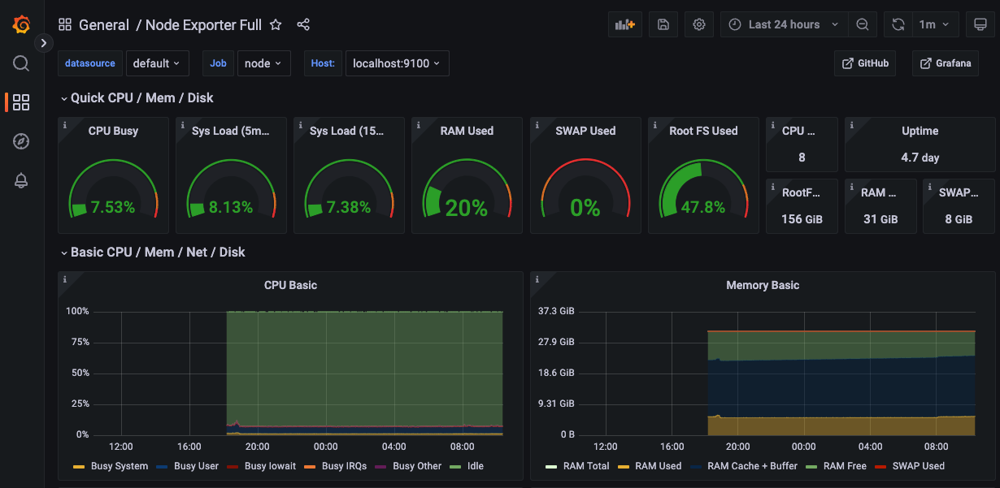

## Giới thiệu

Trong bài trước, chúng ta đã tìm hiểu về theo dõi một hệ thống ML nói chung, với các metrics mà chúng ta thường cần theo dõi, và các bộ công cụ mà chúng ta sử dụng trong quá trình theo dõi.

Trong bài này, chúng ta sẽ bắt tay vào triển khai các giải pháp để theo dõi hệ thống ML mà chúng ta đang làm, cụ thể là những công việc sau:

1. Triển khai ELK Stack để theo dõi logs của hệ thống
1. Triển khai Prometheus và Grafana servers để theo dõi operational metrics

## Môi trường phát triển

Trong bài này, chúng ta sẽ không viết code, mà sẽ đi triển khai ELK Stack, Prometheus và Grafana servers. Do đó, các bạn không cần cài đặt môi trường phát triển trong bài này. Các bạn chỉ cần clone Github repo [mlops-crash-course-platform](https://github.com/MLOpsVN/mlops-crash-course-platform) là xong.

Các MLOps tools sẽ được sử dụng trong bài này bao gồm:

1. ELK Stack, gồm có: Elasticsearch, Logstash, Kibana, và Filebeat, để thu thập và hiển thị logs tập trung từ Online serving service
2. Prometheus và Grafana để theo dõi và hiển thị operational metrics

## Logs

Việc sử dụng công nghệ container mang đến rất nhiều ưu điểm, nhưng bên cạnh đó cũng xuất hiện thêm những thách thức cho các kĩ sư. Một trong những thách thức đó phải kể đến là việc thu thập và xử lý logs của mỗi container một cách hiệu quả. May mắn thay, ELK Stack là một trong những giải pháp được cộng đồng ưa chuộng để xử lý vấn đề này.

### Cách ELK Stack hoạt động

Hình dưới là một pipeline điển hình cho việc thu thập và xử lý logs tập trung sử dụng ELK Stack.


Đầu tiên, Logstash thu thập logs từ các containers, xử lý bằng cách filter logs đó. Các cách để filter logs sẽ được người dùng tự định nghĩa. Sau đó, Logstash sẽ đẩy logs tới Elasticsearch để đánh index, tiện cho việc tìm kiếm. Kibana sẽ lấy logs ra, phân tích và hiển thị data lên Kibana dashboard.

Có khá nhiều các biến thể của pipeline trên, ví dụ như chúng ta có thể dùng _Filebeat_ để thu thập logs từ các containers và gửi logs tới Elasticsearch, hoặc chúng ta có thể thêm Redis với vai trò là một bộ đệm vào giữa Logstash và Elasticsearch.

Trong bài này, chúng ta sẽ thay thế Logstash bằng Filebeat để thu thập logs từ các containers và gửi tới Elasticsearch.

!!! note

    ELK Stack được sử dụng làm tên chung cho giải pháp, mặc dù chúng ta sẽ sử dụng Filebeat thay thế cho Logstash.

### Triển khai ELK Stack

Để triển khai ELK Stack, các bạn hay vào repo `mlops-crash-course-platform`, và chạy lệnh sau:

```bash
bash run.sh elk up
```

Câu lệnh trên sẽ chạy các servers sau:

- Filebeat server
  - File docker-compose để chạy Filebeat server được đặt tại `elk/extensions/filebeat/filebeat-compose.yml`
  - Config của Filebeat server được đặt tại `elk/extensions/filebeat/config/filebeat.yml`
- Elasticsearch server
  - File docker-compose để chạy Elasticsearch server được đặt tại `elk/elk-docker-compose.yml`
  - Config của Elasticsearch server được đặt tại `elk/elasticsearch/config/elasticsearch.yml`
- Kibana server
  - File docker-compose để chạy Kibana server được đặt tại `elk/elk-docker-compose.yml`
  - Config của Kibana server được đặt tại `elk/kibana/config/kibana.yml`

Hãy đợi khoảng 10 giây để cho việc khởi tạo các servers hoàn thành. Tiếp theo, chúng ta cần kiểm tra xem Elasticsearch server trên đã được triển khai thành công chưa, bằng cách chạy lệnh sau:

```bash
curl -X GET http://localhost:9200 -u elastic:changeme
```

Nếu Elasticssearch server được triển khai thành công, các bạn sẽ nhận được một output tương tự như sau:

```bash
{
"name" : "W3NuLnv",
"cluster_name" : "docker-cluster",
"cluster_uuid" : "fauVIbHoSE2SlN_nDzxxdA",
"version" : {
    "number" : "5.2.1",
    "build_hash" : "db0d481",
    "build_date" : "2017-02-09T22:05:32.386Z",
    "build_snapshot" : false,
    "lucene_version" : "6.4.1"
},
"tagline" : "You Know, for Search"
}
```

Để kiểm tra xem Kibana server đã được triển khai thành công chưa, các bạn hãy làm những việc sau:

1. Trên browser, truy cập vào Kibana server tại [http://localhost:5601](http://localhost:5601)
2. Đăng nhập với tên user là `elastic`, và mật khẩu là `changeme`

Việc đăng nhập thành công chứng tỏ Kibana server đã được triển khai thành công.

### Truy vấn logs

Sau khi đã triển khai ELK Stack thành công, hãy cùng thử truy vấn logs ở ELK Stack xem logs đã được thu thập thành công từ Online serving API hay chưa.

Đầu tiên, các bạn hãy gửi một vài requests tới Online serving API bằng cách mở browser, truy cập tới `http://localhost:8172/`, mở API `/inference`, và ấn nút `Try it out`. Ở phần `Request body`, các bạn gõ nội dung sau:

```json
{
  "driver_ids": [1001, 1002, 1003, 1004, 1005]
}
```

Sau đó, hãy đăng nhập vào Kibana server [http://localhost:5601](http://localhost:5601) trên browser của bạn như hướng dẫn ở phần trước.

TODO: Tiếp tục hướng dẫn để viết query truy vấn, để hiển thị logs

## Operational metrics

Trong phần này, chúng ta sẽ dùng Prometheus để thu thập các operational metrics và dùng Grafana để hiển thị các metrics đó.

### Triển khai Prometheus và Grafana servers

Để triển khai Prometheus và Grafana servers, các bạn hay vào repo `mlops-crash-course-platform`, và chạy lệnh sau:

```bash
bash run.sh prom-graf up
```

Câu lệnh trên sẽ chạy các servers sau:

- Prometheus server
  - File docker-compose để chạy Prometheus server được đặt tại `prom-graf/prom-graf-docker-compose.yml`
  - Config của Prometheus server được đặt tại `prom-graf/prometheus/config/prometheus.yml`
- Grafana server
  - File docker-compose để chạy Grafana server được đặt tại `prom-graf/prom-graf-docker-compose.yml`
  - Grafana server không có config
- Node exporter server
  - File docker-compose để chạy Node exporter server được đặt tại `prom-graf/prom-graf-docker-compose.yml`

Node exporter server là một server được cài đặt thêm vào để thu thập các metrics liên quan tới node (hay chính là máy tính hiện tại của chúng ta), ví dụ như các metrics liên quan tới CPU, memory, v.v. Các bạn có thể đọc thêm ở Github repo này [prometheus/node_exporter](https://github.com/prometheus/node_exporter).

Để kiểm tra xem Prometheus server đã được triển khai thành công chưa, các bạn hãy làm những bước sau.

1. Mở browser, truy cập vào Prometheus server tại [http://localhost:9090](http://localhost:9090)
1. TODO: hướng dẫn xem scrape config, đảm bảo các jobs succesful

Như các bạn thấy, trong config file `prom-graf/prometheus/config/prometheus.yml` của Prometheus server, mình đã thiết lập sẵn một job để thu thập metrics từ Online serving service như đoạn code yaml dưới đây.

```yaml
- job_name: "online_serving"
  scrape_interval: 5s
  static_configs:
    - targets:
        - "localhost:8172"
```

Thiết lập này để báo cho Prometheus biết rằng, mỗi 5 giây, nó cần phải đi thu thập metrics từ server `localhost`, port `8172`.

Tiếp theo, chúng ta cũng cần kiểm tra xem Grafana server đã được triển khai thành công chưa, các bạn hãy làm những bước sau.

1. Mở browser, truy cập vào Grafana server tại [http://localhost:3000](http://localhost:3000)
1. Đăng nhập với tên user là `admin`, và mật khẩu là `admin`

Việc đăng nhập thành công chứng tỏ Grafana server đã được triển khai thành công.

### Thiết lập Note Exporter Full dashboard

Ở phần này, chúng ta sẽ sử dụng một Grafana dashboard tên là [Node Exporter Full](https://grafana.com/grafana/dashboards/1860-node-exporter-full/) được xây dựng sẵn bởi cộng đồng sử dụng Prometheus và Grafana. Dashboard này sẽ hiển thị các thông tin quan trọng của hệ thống về máy local mà chúng ta đang chạy. Để đảm bảo dashboard này chạy đúng chức năng, các bạn hãy chắc chắn rằng config file `prom-graf/prometheus/config/prometheus.yml` của Prometheus server chứa config sau:

```yaml
- job_name: "node"
  static_configs:
    - targets:
        - "localhost:9100"
```

Tiếp theo, các bạn làm các bước sau:

1. Trên giao diện của Grafana Web UI, ở menu bên trái, chọn `Dashboards` > `Manage`
1. Click `Import`, nhập vào ID của Node Exporter Full dashboard là _1860_
1. Chọn Prometheus datasource, và click `Import`

Các bạn sẽ nhìn thấy dashboard giống như sau.



Tuỳ thuộc vào cài đặt của Node Exporter service trong file docker-compose `prom-graf/prom-graf-docker-compose.yml` mà một vài phần của dashboard sẽ không được hiển thị đúng. Các bạn có thể xem thêm [tại đây](https://grafana.com/grafana/dashboards/1860-node-exporter-full/) nếu cần biết thêm chi tiết về cách cấu hình Node Exporter service.

### Thêm Bentoml metrics

TODO: thêm panel để show Bentoml metrics

## Tổng kết

Như vậy, chúng ta vừa thực hiện quá trình triển khai ELK Stack để thu thập logs lại tập trung một chỗ, truy vấn và hiển thị logs. Chúng ta cũng vừa triển khai Prometheus và Grafana servers để thu thập các operational metrics và hiển thị chúng.

Trong thực tế, với ELK Stack, chúng ta sẽ cần thiết lập các bộ filter để truy vấn và hiển thị logs hiệu quả hơn, dễ dàng tìm ra logs chứa lỗi để kịp thời xử lý. Với Prometheus và Grafana, chúng ta sẽ cần tìm hiểu thêm về cách viết các câu lệnh truy vấn sử dung _PromQL_ để có thể chọn lọc và tổng hợp metrics data hiệu quả. Các bạn có thể đọc thêm tại [Querying Prometheus](https://prometheus.io/docs/prometheus/latest/querying/basics/).

Trong bài sau, chúng ta sẽ thực hiện triển khai một service khá phức tạp, đó là Monitoring service. Service này sẽ có chức năng theo dõi các ML metrics liên quan tới chất lượng data và model.
