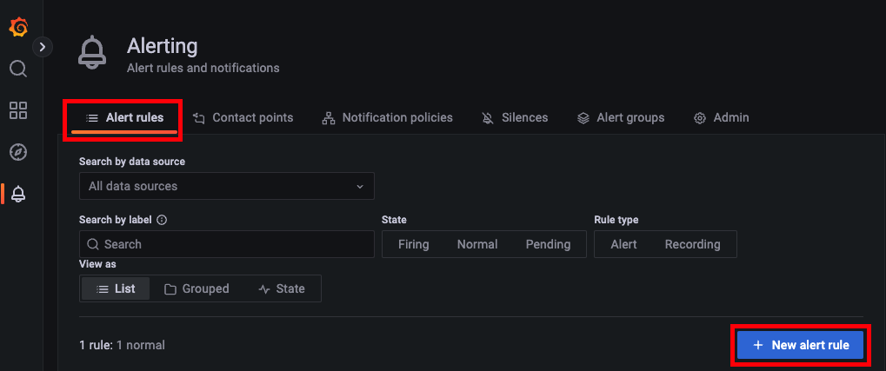
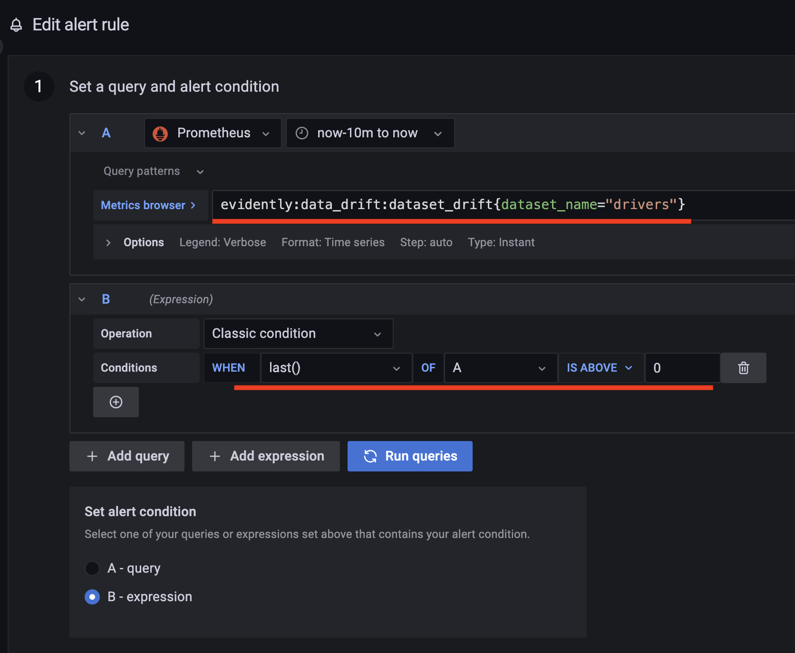
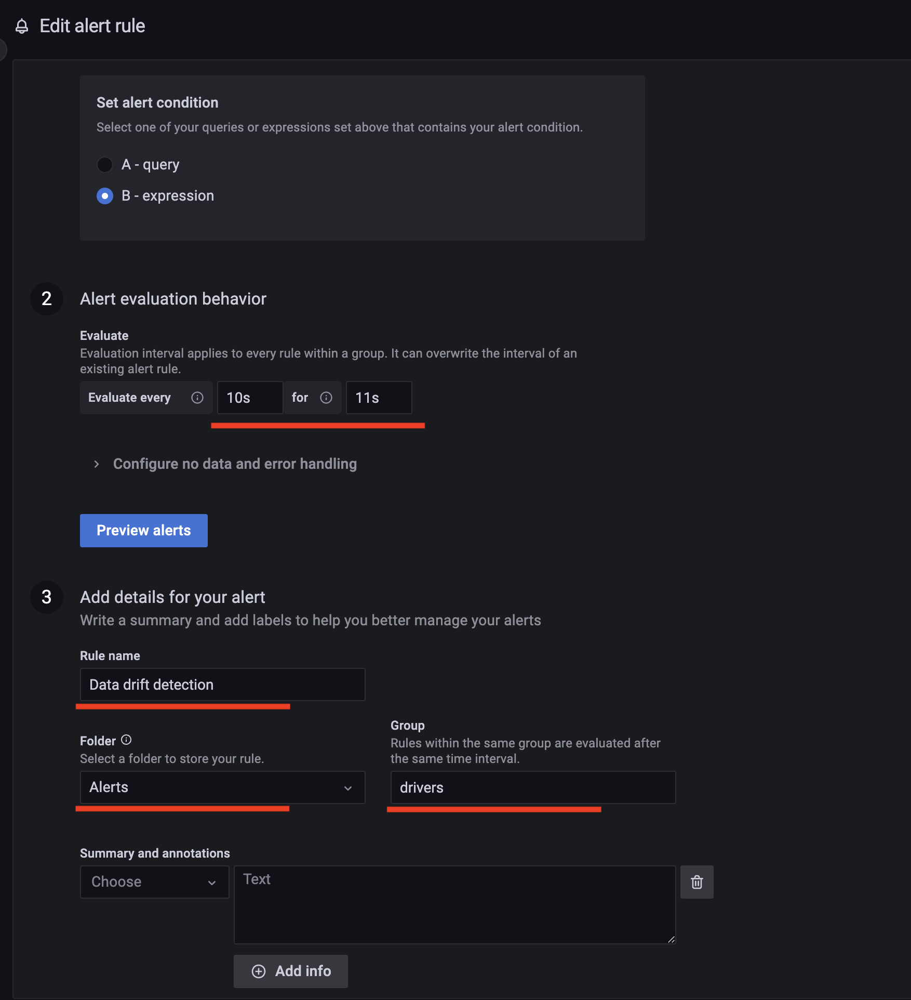
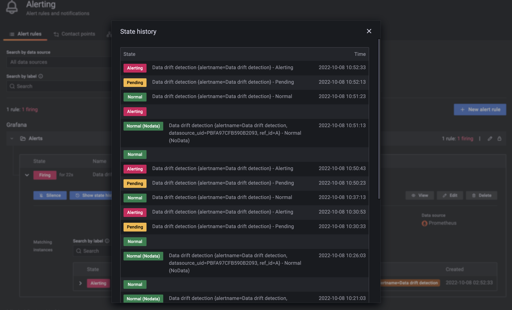

<figure>
    
    <figcaption>Photo by <a href="https://unsplash.com/@ibrahimboran?utm_source=unsplash&utm_medium=referral&utm_content=creditCopyText">Ibrahim Boran</a> on <a href="https://unsplash.com/s/photos/monitoring?utm_source=unsplash&utm_medium=referral&utm_content=creditCopyText">Unsplash</a></figcaption>
</figure>

## Giới thiệu

Trong bài trước, chúng ta đã triển khai ELK Stack để thu thập, theo dõi logs từ các services; và Prometheus server, Grafana server để theo dõi các metrics hệ thống của các services như là CPU, memory, network, v.v. Ngoài các metrics đó ra, trong một hệ thống ML, chúng ta cũng cần theo dõi các metrics liên quan tới data và model, để kịp thời phát hiện sự thay đổi của data và model performance ở production, để có thể cập nhật data hay train lại model kịp thời. Trong bài này, chúng ta sẽ thực hiện các công việc sau:

1. Sinh ra dataset chứa feature bị drift
1. Triển khai _monitoring service_ để theo dõi data và model performance
1. Thiết lập các Grafana dashboards để hiển thị các metrics về data và model

## Môi trường phát triển

Các library bạn cần cài đặt cho môi trường phát triển được đặt tại `monitoring_service/dev_requirements.txt`. Sau khi cài đặt môi trường phát triển, bạn cần làm tiếp các việc sau.

1.  Copy file `monitoring_service/deployment/.env-example`, đổi tên thành `monitoring_service/deployment/.env`. File này chứa các config cần thiết cho việc triển khai việc triển khai model serving.

1.  Set env var `MONITORING_SERVICE_DIR` bằng đường dẫn tuyệt đối tới folder `monitoring_service`. Env var này là để hỗ trợ việc chạy python code trong folder `monitoring_service/src` trong quá trình phát triển.

    ```bash
    export MONITORING_SERVICE_DIR="path/to/mlops-crash-course-code/monitoring_service"
    ```

Các tools sẽ được sử dụng trong bài này bao gồm:

1. Feast để truy xuất Feature Store
1. Flask để viết API cho monitoring service
1. Evidently để kiểm tra chất lượng data và model performance

!!! note

    Trong quá trình chạy code cho tất cả các phần dưới đây, giả sử rằng folder gốc nơi chúng ta làm việc là folder `monitoring_service`.

## Thiết kế

Theo dõi các metrics liên quan tới chất lượng data và model performance là quá trình kiểm tra xem data và model performance thay đổi như thế nào theo thời gian. Đây cũng chính là yêu cầu đầu ra của monitoring service. Các chức năng chính của monitoring service được thể hiện như hình dưới


Thông thường, để biết được data thay đổi như thế nào, chúng ta sẽ so sánh training data với production data dựa trên một thuật toán so sánh nào đó, cho phép chúng ta biết được data có bị drift hay không, hay nói cách khác, xem các thuộc tính về thống kê của data bị thay đổi nhiều hay ít như thế nào. Như vậy, đầu vào của chức năng **Phát hiện data drift** là features ở bước training và features ở production.

Để biết được model performance thay đổi thế nào, chúng ta sẽ thu thập label ở production, so sánh với prediction mà model sinh ra, và theo dõi model performance metrics theo thời gian. Model performance ở production cũng có thể được so sánh với model performance ở bước training. Tuy nhiên, để đơn giản, chúng ta sẽ chỉ theo dõi model performance ở production. Như vậy, đầu vào của chức năng **Theo dõi model performance** là dự đoán của model và label ở production.

Trong bài này, chúng ta sẽ sử dụng thư viện Evidently để phát hiện data drift và model performance. Evidently là một thư viện open-source được sử dụng để đánh giá, kiểm tra, và giám sát data và model performance. Evidently đã tích hợp sẵn các thuật toán để theo dõi các thuộc tính thống kê của data như **PSI**, **K-L divergence**, **Jensen-Shannon distance**, **Wasserstein distance**, và các metrics phổ biến của model performance như **Accuracy**, **F1 score**, **RMSE**, **MAE**, v.v. Các bạn có thể đọc thêm ở [document của Evidently](https://docs.evidentlyai.com/reference/data-drift-algorithm) để tìm hiểu về cách mà Evidently lựa chọn thuật toán tự động để phát hiện data drift tuỳ thuộc vào kích thước của dataset.

## Cách test

Trong phần này, trước khi bắt tay vào code, chúng ta sẽ cùng phân tích xem làm thế nào để test các chức năng của monitoring service.

!!! quote

    Before you start anything, learn how to finish it.

### Phát hiện data drift

Để test chức năng phát hiện data drift của monitoring service, chúng ta cần sinh ra 2 bộ datasets như sau:

| #   | Dataset       | Giá trị                                                                 |
| --- | ------------- | ----------------------------------------------------------------------- |
| 1   | `normal_data` | Trong khoảng `[A, B]`                                                   |
| 2   | `drift_data`  | Trong khoảng `[C, D]`; `C`, `D` nằm đủ xa `A`, `B` để gây ra data drift |

Chúng ta cũng cần sắp đặt 2 tình huống như bảng dưới đây.

| #   | Tình huống                     | Loại data       | Dataset được dùng |
| --- | ------------------------------ | --------------- | ----------------- |
| 1   | Production data không bị drift | Training data   | `normal_data`     |
|     |                                | Production data | `normal_data`     |
| 2   | Production data bị drift       | Training data   | `normal_data`     |
|     |                                | Production data | `drift_data`      |

Ở tình huống 1, production data không bị drift, `normal_data` vừa là training data, vừa là production data, và được lưu vào Feature Store. Data được lấy ra ở Feature Store chính là training data, tức là sẽ không xảy ra data drift giữa training data và production data.

Ở tình huống 2, production data bị drift, `normal_data` ở trên vẫn là training data, còn `drift_data` là production data. `drift_data` được lưu vào Feature Store. Data được lấy ra ở Feature Store (`drift_data`) để dự đoán có giá trị nằm xa training data (`normal_data`), tức là sẽ xảy ra data drift giữa training data và production data.

!!! question

    Để phát hiện data drift, chúng ta sẽ so sánh training data với production data. Vậy chúng ta cần lấy ra bao nhiêu records trong training data và tích luỹ bao nhiêu records của production data thì mới bắt đầu thực hiện quá trình so sánh?

Khi training dataset quá lớn, chúng ta không thể lấy hết các records ra để so sánh được (nếu thuật toán so sánh không cho phép tính toán các metrics để so sánh trước). Thông thường, chúng ta sẽ cố gắng dùng một con số đủ nhỏ để việc theo dõi data được diễn ra liên tục và gần với thời gian thực nhất (near real-time), để phát hiện kịp thời các vấn đề về data. Đồng thời, con số này cũng phải đủ lớn, để các tính chất thống kê của data không bị quá khác biệt ở các phần của dataset. Phương pháp lựa chọn và con số cần lựa chọn cho số các records tuỳ thuộc vào nhu cầu và tần suất theo dõi production data của mỗi dự án.

!!! tip

    Thuật ngữ **_reference window_** chỉ tập hợp các records để so sánh với production data. Thuật ngữ **_test window_** chỉ tập hợp các records để so sánh với **_reference window_**

Để đơn giản, chúng ta sẽ sinh ra 5 records cho mỗi dataset, và chỉ tích luỹ 5 records của production data để thực hiện việc so sánh data.

Một lý do nữa cho con số 5 là vì ở Online serving API, features được lấy ra sẽ là features mới nhất trong dataset. Do đó, việc sinh ra nhiều records ở nhiều thời điểm là không cần thiết, chỉ cần đảm bảo rằng tồn tại ít nhất 1 record trong Feature Store cho mỗi driver id ở request gửi đến là đủ. Và vì dataset gốc chỉ chứa 5 driver ids bao gồm `[1001, 1002, 1003, 1004, 1005]`, nên chúng ta chỉ cần 5 records cho mỗi dataset.

Tóm lại, chúng ta cần sinh ra 2 datasets có khoảng giá trị nằm xa nhau, mỗi dataset có 5 records tương ứng với 5 driver ids. Để đơn giản hoá quá trình test, phân phối chuẩn sẽ được sử dụng cho các giá trị của features.

Bảng dưới đây là một ví dụ của `normal_data`.

| index | datetime                  | driver_id | conv_rate | acc_rate | avg_daily_trips |
| ----- | ------------------------- | --------- | --------- | -------- | --------------- |
| 0     | 2021-07-19 23:00:00+00:00 | 1001      | 0.186341  | 0.226879 | 107             |
| 1     | 2021-07-18 06:00:00+00:00 | 1002      | 0.071032  | 0.229490 | 250             |
| 2     | 2021-07-28 09:00:00+00:00 | 1003      | 0.050000  | 0.192864 | 103             |
| 3     | 2021-07-27 10:00:00+00:00 | 1004      | 0.184332  | 0.050000 | 49              |
| 4     | 2021-07-23 05:00:00+00:00 | 1005      | 0.250000  | 0.250000 | 246             |

Bảng dưới đây là một ví dụ của `drift_data`.

| index | datetime                  | driver_id | conv_rate | acc_rate | avg_daily_trips |
| ----- | ------------------------- | --------- | --------- | -------- | --------------- |
| 0     | 2021-07-19 23:00:00+00:00 | 1001      | 0.886341  | 0.926879 | 807             |
| 1     | 2021-07-18 06:00:00+00:00 | 1002      | 0.771032  | 0.929490 | 950             |
| 2     | 2021-07-28 09:00:00+00:00 | 1003      | 0.750000  | 0.892864 | 803             |
| 3     | 2021-07-27 10:00:00+00:00 | 1004      | 0.884332  | 0.750000 | 750             |
| 4     | 2021-07-23 05:00:00+00:00 | 1005      | 0.950000  | 0.950000 | 946             |

### Theo dõi model performance

Để test chức năng theo dõi model performance của monitoring service, chúng ta cần có label của mỗi request được gửi tới Online serving API, thì mới biết được prediction tạo bởi model là đúng hay sai.

Như chúng ta đã biết ở [phần Online serving của bài Triển khai model serving](../../model-serving/trien-khai-model-serving/#online-serving), request và response được gửi tới Online serving API có dạng như sau.

```json
// Request
{
  "request_id": "uuid-1",
  "driver_ids": [1001, 1002, 1003, 1004, 1005]
}
// Response
{
  "prediction": 1001,
  "error": null
}
```

Với mỗi driver id, model sẽ trả về 1 số thực. Số thực này thể hiện khả năng mà tài xế có hoàn thành hay không. Tuy nhiên, ở production, chúng ta không có label để biết chính xác số thực này hay khả năng này là bao nhiêu. Chúng ta chỉ biết rằng, với driver id là `1001` trả về bởi model, tài xế có id `1001` có hoàn thành cuốc xe hay không. Bảng dưới đây thể hiện kết quả dự đoán của model, tài xế được chọn, và thông tin cuốc xe có hoàn thành không, với mỗi request được gửi đến serving API.

| request_id | Dự đoán của model | Tài xế được chọn | Hoàn thành |
| ---------- | ----------------- | ---------------- | ---------- |
| uuid-1     | 0.1234            | 1001             | 1          |
| uuid-2     | 1.2345            | 1001             | 0          |
| uuid-3     | -1.5678           | 1002             | 1          |

Như các bạn thấy, mặc dù chúng ta có dự đoán của model, nhưng chúng ta không có label ở dạng số thực này để so sánh. Chúng ta chỉ biết tài xế được chọn, tức là dự đoán luôn là `1` cho tài xế được chọn. Cột `Hoàn thành` chính là label cho mỗi request. Như vậy, để test chức năng theo dõi model performance của monitoring service, chúng ta chỉ cần sinh ra labels cho mỗi request được gửi tới ở dạng 1/0 chứ không phải ở dạng số thực mà model trả về.

!!! question

    Cần sinh ra bao nhiêu request và label tương ứng?

Ở phần trước, chúng ta đã phân tích rằng chỉ cần tích luỹ 5 records là đủ để thực hiện quá trình so sánh data, nên số lượng request và label tương ứng chúng ta cần sinh ra 5 records. Dataset chứa 5 records này được gọi là `request_data`, gồm 3 cột:

1. `request_id`: request id
1. `driver_ids`: danh sách các driver id được gửi đến trong request
1. `trip_completed`: label cho request

Giả sử tài xế `1001` luôn được dự đoán là tài xế có khả năng cao nhất sẽ hoàn thành cuốc xe, thì bộ features của tài xế `1001` sẽ luôn được gửi về monitoring service, khiến cho chúng ta không thể kiểm soát được phân phối của production data trong quá trình test monitoring service. Do đó, chúng ta cần đảm bảo cả 5 bộ features của 5 tài xế trong dataset mà chúng ta dùng (`normal_data` hoặc `drift_data`) đều được gửi tới Online serving API lần lượt. Điều này giúp cho phân phối của data trong 5 requests này giống với phân phối của cả dataset mà chúng ta dùng, giúp chúng ta kiểm soát được 2 trường hợp data không bị drift và bị drift. Bảng dưới đây là một ví dụ cho dataset `request_data`.

| request_id | driver_ids | trip_completed |
| ---------- | ---------- | -------------- |
| uuid-1     | [1001]     | 1              |
| uuid-2     | [1002]     | 0              |
| uuid-3     | [1003]     | 1              |
| uuid-4     | [1004]     | 0              |
| uuid-5     | [1005]     | 1              |

Như vậy là chúng ta đã phân tích xong cách test monitoring service, với các bộ dataset cần được tạo ra bao gồm `normal_data`, `drift_data`, và `request_data`. Trong các phần dưới đây, chúng ta sẽ thực hiện viết code.

## Tạo datasets

Trong phần này, chúng ta sẽ sinh ra 2 datasets có tính chất và mục đích như bảng dưới đây.

| Dataset       | Phân phối                                   | Số records |
| ------------- | ------------------------------------------- | ---------- |
| `normal_data` | Phân phối chuẩn, giá trị thuộc [0.05, 0.25] | 5          |
| `drift_data`  | Phân phối chuẩn, giá trị thuộc [0.75, 0.95] | 5          |

Code để sinh ra 2 datasets này nằm tại `monitoring_service/nbs/prepare_datasets.ipynb`.

```python linenums="1" title="monitoring_service/nbs/prepare_datasets.ipynb"
df_orig = pd.read_parquet(DATA_PATH, engine='fastparquet')
driver_ids = np.unique(df_orig['driver_id']) # (1)

N_SAMPLES = driver_ids.shape[0]
X, _ = make_classification(n_samples=N_SAMPLES, random_state=random_seed) # (2)

scaler = MinMaxScaler(feature_range=(0.05, 0.25))
X = scaler.fit_transform(X) # (3)

scaler = MinMaxScaler(feature_range=(0.75, 0.95))
X_shift = scaler.fit_transform(X) # (4)

def create_dataset(generated_X):
    df = pd.DataFrame()
    df['conv_rate'] = generated_X[:, 0] # (5)
    df['acc_rate'] = generated_X[:, 1]
    df['avg_daily_trips'] = np.array((generated_X[:, 2] * 1000), dtype=int) # (6)
    return df

# Tạo normal_data và drift_data
normal_df = create_dataset(X)
drift_df = create_dataset(X)

# Tạo request_data
request_id_list = [] # (7)
driver_ids_list = []

for i in range(N_SAMPLES):
    request_id = f"uuid-{i}"
    request_id_list.append(request_id)
    driver_id = driver_ids[i % len(driver_ids)] # (8)
    driver_ids_list.append([driver_id])

y = np.random.choice([0, 1], size=N_SAMPLES, p=[0.3, 0.7]) # (9)

request_df = pd.DataFrame() # (10)
request_df['request_id'] = request_id_list
request_df['driver_ids'] = driver_ids_list
request_df['trip_completed'] = y
```

1. Lấy ra các driver ids từ dataset gốc
2. Tạo ra 1 dataset cho bài toán classification theo phân phối chuẩn dựa vào hàm `make_classification` có sẵn của scikit-learn
3. Biến đổi `X` về đoạn [0.05, 0.25]. `X` sẽ được dùng để tạo `normal_data`
4. Biến đổi `X` về đoạn [0.75, 0.95], lưu vào `X_shift`. `X_shift` sẽ được dùng để tạo `drift_data`
5. Sử dụng 3 cột đầu tiên của `X` và `X_shift` để làm features cho `normal_data` và `drift_data`
6. Feature `avg_daily_trips` nằm trong khoảng từ 0 tới 1000
7. Khởi tạo list chứa request ids và list chứa driver ids cho mỗi request
8. Lần lượt lấy ra các driver id trong list `driver_ids` chứa các driver ids từ dataset gốc
9. Sinh ra label cho mỗi request với xác suất 0.3 cho label `0` và 0.7 cho label `1`. 2 con số này có thể là bất kì
10. Tạo `DataFrame` chứa `request_data`

Như vậy là chúng ta vừa tạo xong `request_data` chứa thông tin về request sẽ được gửi tới Online serving API và label tương ứng của mỗi request. Tiếp theo, chúng ta sẽ test các datasets được sinh ra và cách sử dụng Evidently để phát hiện data drift và đánh giá model performance.

### Test datasets

Trong phần này, chúng ta sẽ sử dụng Evidently để phát hiện data drift và theo dõi model performance của 2 datasets trên. Code của phần này được đặt tại `monitoring_service/nbs/test_datasets.ipynb`.

```python linenums="1" title="monitoring_service/nbs/test_datasets.ipynb"
normal_df = pd.read_parquet(ORIG_DATA_PATH, engine='fastparquet') # (1)
drift_df = pd.read_parquet(DRIFT_DATA_PATH, engine='fastparquet')
request_df = pd.read_csv(REQUEST_DATA_PATH)

column_mapping = ColumnMapping( # (2)
    target="trip_completed", # (3)
    prediction="prediction", # (4)
    numerical_features=["conv_rate", "acc_rate", "avg_daily_trips"], # (5)
    categorical_features=[], # (6)
)

features_and_target_monitor = ModelMonitoring(monitors=[DataDriftMonitor()]) # (7)
model_performance_monitor = ModelMonitoring(monitors=[ClassificationPerformanceMonitor()]) # (8)

# Chạy kiểm tra data drift
features_and_target_monitor.execute( # (9)
    reference_data=normal_df, # (10)
    current_data=drift_df, # (11)
    column_mapping=column_mapping,
)

# Chạy kiểm tra model performance
predictions = [1] * drift_df.shape[0]
drift_df = drift_df.assign(prediction=predictions) # (12)
drift_df = drift_df.assign(trip_completed=request_df["trip_completed"]) # (13)

model_performance_monitor.execute( # (14)
    reference_data=drift_df,
    current_data=drift_df,
    column_mapping=column_mapping,
)
```

1. Đọc `normal_data`, `drift_data`, và `request_data`
2. `ColumnMapping` là 1 class trong Evidently dùng để định nghĩa loại data của các cột của data
3. Định nghĩa cột `target`, hay chính là label
4. Định nghĩa cột `prediction`, hay chính là dự đoán của model
5. Định nghĩa các cột là features ở dạng số
6. Định nghĩa các cột là features ở dạng categorical
7. Định nghĩa 1 object `ModelMonitoring` để theo dõi data drift. `ModelMonitoring` là 1 class trong Evidently. Class này định nghĩa các loại monitoring mà chúng ta muốn chạy. Có nhiều loại monitoring như `DataDriftMonitor`, `CatTargetDriftMonitor`, `NumTargetDriftMonitor`, v.v.
8. Định nghĩa 1 object `ModelMonitoring` để theo dõi model performance
9. Chạy kiểm tra data drift, so sánh `drift_data` với `normal_data`
10. Dùng `normal_data` làm `reference_data`, mang ý nghĩa là training data
11. Dùng `drift_data` làm `current_data`, mang ý nghĩa là production data, để so sánh với training data
12. Thêm cột `prediction` vào `drift_data`, hay chính là dự đoán của model. Như đã phân tích ở phần trước, predictions của model luôn là `1`
13. Thêm cột `trip_completed` vào `drift_data`, hay chính là label của mỗi record
14. Chạy kiểm tra model performance, so sánh `drift_data` với chính nó

!!! question

    Tại sao chúng ta lại kiểm tra model performance bằng cách so sánh `drift_data`, hay production data, với chính nó?

Trong Evidently, với loại monitoring là `ClassificationPerformanceMonitor`, nếu cả `reference_data` và `current_data` đều chứa prediction và label, thì Evidently sẽ tính toán các metrics cho model performance trên cả 2 datasets này, và thực hiện so sánh xem các metrics đó khác nhau thế nào. Tuy nhiên, để đơn giản hoá, chúng ta chỉ cần biết model performance của model với production data, chứ không cần so sánh model performance giữa 2 datasets `reference_data` và `current_data`. Và vì `drift_data` đã chứa thông tin về prediction và label, nên chúng ta sẽ truyền vào `drift_data` cho cả 2 loại datasets này.

Kết quả được in ra sau khi chạy sẽ giống như sau.

```bash
data_drift:n_drifted_features | 3 | None # (1)
data_drift:dataset_drift | True | None # (2)
...

classification_performance:quality | 0.4 | {'dataset': 'reference', 'metric': 'accuracy'} # (3)
classification_performance:class_quality | 0.0 | {'dataset': 'reference', 'class_name': '0', 'metric': 'precision'} # (4)
...
```

1. Số features bị drift
2. Dataset `current_data` có bị drift không
3. `accuracy` của model
4. `precision` của model cho class `0`

Để tìm hiểu thêm về các loại monitoring khác hay các chức năng khác của Evidently, các bạn có thể xem thêm các ví dụ tại [website của Evidently](https://docs.evidentlyai.com/examples).

## Monitoring service

Trong phần này, chúng ta sẽ phát triển monitoring service. Hình dưới đây thể hiện các luồng data của monitoring service.


Như hình trên, quá trình phát triển monitoring service bao gồm các bước chính sau.

1. Viết code để gửi request và response data từ Online serving API sang _Monitoring API_ của monitoring service
2. Viết Monitoring API ở monitoring service, nhận data từ Online serving API, dùng data này để theo dõi data drift và model performance
3. Thiết lập Prometheus server và Grafana dashboards để hiển thị các metrics liên quan tới data drift và model performance

### Monitoring API

Đầu tiên, chúng ta sẽ viết Monitoring API ở monitoring service trước. Code của monitoring service được đặt tại `monitoring_service/src/monitoring_service.py`. Các bạn hãy để ý tới hàm `iterate` của class `MonitoringService` với luồng xử lý data như sau.

```python linenums="1" title="monitoring_service/src/monitoring_service.py"
def iterate(self, new_rows: pd.DataFrame): # (1)
    if not self._process_curr_data(new_rows): # (2)
        return
    if not self._process_next_run(): # (3)
        return
    self._execute_monitoring() # (4)
    self._process_metrics(self.features_and_target_monitor.metrics()) # (5)
    self._process_metrics(self.model_performance_monitor.metrics()) # (6)
```

1. Hàm `iterate` nhận vào `new_rows`, chính là data được Online serving API gửi tới
2. Xử lý data nhận được
3. Kiểm tra xem đã đến thời điểm chạy quá trình đánh giá data drift và model performance chưa
4. Bắt đầu phân tích đánh giá data drift và model performance
5. Gửi metrics của data drift tới Prometheus server
6. Gửi metrics của model performance tới Prometheus server

Data nhận được từ Online serving API bao gồm các cột chính như sau.

| Cột               | Ý nghĩa                            |
| ----------------- | ---------------------------------- |
| `request_id`      | Request ID                         |
| `conv_rate`       | Feature                            |
| `acc_rate`        | Feature                            |
| `avg_daily_trips` | Feature                            |
| `best_driver_id`  | Driver ID được chọn                |
| `prediction`      | Prediction cho driver ID được chọn |

Bây giờ, hãy cùng xem hàm `_process_curr_data` làm công việc gì.

```python linenums="1" title="monitoring_service/src/monitoring_service.py"
def _process_curr_data(self, new_rows: pd.DataFrame): # (1)
    label_data = read_label_data() # (2)
    if label_data is None:
        return False

    merged_data = merge_request_with_label(new_rows, label_data) # (3)
    if not self.current_data is None: # (4)
        curr_data: pd.DataFrame = pd.concat([self.current_data, merged_data], ignore_index=True)
    else:
        curr_data = merged_data

    curr_size = curr_data.shape[0]
    if curr_size > self.WINDOW_SIZE: # (5)
        curr_data.drop(
            index=list(range(0, curr_size - self.WINDOW_SIZE)), inplace=True
        )
        curr_data.reset_index(drop=True, inplace=True)

    self.current_data = curr_data # (6)

    if curr_size < self.WINDOW_SIZE: # (7)
        Log().log.info(
            f"Not enough data for measurement: {curr_size}/{self.WINDOW_SIZE} rows. Waiting for more data"
        )
        return False
    return True
```

1. Hàm `_process_curr_data` nhận vào `DataFrame` được gửi từ Online serving API sang
2. Đọc label data, hay chính là `request_data` mà chúng ta đã tạo ra ở trên
3. Kết hợp data mới nhận được với label data theo `request_id`
4. Tích luỹ data mới với data hiện tại
5. Bỏ bớt data nếu như số records vượt quá `WINDOW_SIZE`, được định nghĩa là số lượng các records chúng ta muốn tích luỹ để thực hiện monitoring
6. Lưu lại data mới đã được xử lý vào làm data hiện tại
7. Kiểm tra xem đã đủ số records cần thiết chưa

!!! question

    Tại sao chúng ta cần đọc label data, hay `request_data`, mỗi khi có records mới được gửi đến từ Online serving API?

Thực ra chúng ta không cần phải đọc lại `request_data` mỗi khi có records mới. Sở dĩ mình viết code như vậy là để giả sử rằng không phải lúc nào label cũng có sẵn ở production.

Sau khi kết hợp data mới nhận được với label data theo `request_id`, chúng ta sẽ có một record chứa các cột sau:

- Các cột features: dùng để theo dõi data drift
- Cột `prediction` và cột label `trip_completed`: dùng để theo dõi model performance. Lưu ý rằng cột `prediction` đã được biến đổi trong hàm `merge_request_with_label` để luôn có giá trị là `1`

Tiếp đến, hãy cùng xem hàm `_process_next_run` và hàm `_execute_monitoring`.

```python linenums="1" title="monitoring_service/src/monitoring_service.py"
def _process_next_run(self):
    if not self.next_run is None and self.next_run > datetime.now(): # (1)
        return False
    self.next_run = datetime.now() + timedelta(seconds=self.RUN_PERIOD_SEC) # (2)
    return True

def _execute_monitoring(self):
    self.features_and_target_monitor.execute( # (3)
        self.reference_data,
        self.current_data,
        self.column_mapping,
    )
    self.model_performance_monitor.execute( # (4)
        self.current_data,
        self.current_data,
        self.column_mapping,
    )
```

1. Kiểm tra xem thời điểm hiện tại có chạy monitoring không
2. Tính thời điểm tiếp theo sẽ chạy monitoring
3. Thực hiện đánh giá data drift, giống như chúng ta đã thực hiện ở file notebook `monitoring_service/nbs/test_datasets.ipynb`
4. Thực hiện đánh giá model performance

Cuối cùng, đoạn code dưới đây của hàm `_process_metrics` sẽ gửi metrics của data drift và model performance tới Prometheus server.

```python linenums="1" title="monitoring_service/src/monitoring_service.py"
def _process_metrics(self, evidently_metrics):
    for metric, value, labels in evidently_metrics:
        metric_key = f"evidently:{metric.name}" # (1)

        if not labels:
            labels = {}
        labels["dataset_name"] = MonitoringService.DATASET_NAME # (2)

        if isinstance(value, str):
            continue

        found = self.metrics.get(metric_key) # (3)
        if found is None:
            found = prometheus_client.Gauge(
                metric_key, "", list(sorted(labels.keys()))
            )
            self.metrics[metric_key] = found

        try:
            found.labels(**labels).set(value) # (4)
        except ValueError as error:
            ...
```

1. Tạo tên metric. Tên metric này phải giống với các metric mà chúng ta sẽ hiển thị trên Grafana dashboards
2. `labels` là một `dict` với key và value là tên và giá trị của các label được quy ước bởi Evidently, ví dụ `{'dataset': 'reference', 'metric': 'accuracy'}`. `labels` này tương đương với [Prometheus labels](https://prometheus.io/docs/practices/naming/#labels)
3. `self.metrics` lưu các object `Gauge` của Prometheus. `Gauge` giúp chúng ta gửi metrics tới Prometheus server. Biến `found` là một object `Gauge`, tương ứng với mỗi metric lấy ra từ Evidently
4. Gán Prometheus labels và giá trị cho `Gauge` object. Dòng code này sẽ gửi labels và giá trị của các metrics lên Prometheus server

Như vậy là chúng ta vừa tìm hiểu các đoạn code quan trọng nhất của monitoring service. Các đoạn code còn lại khác mà các bạn cần lưu ý như dưới đây.

```python linenums="1" title="monitoring_service/src/monitoring_service.py"
app = Flask(AppConst.MONITORING_SERVICE) # (1)
...
app.wsgi_app = DispatcherMiddleware(app.wsgi_app, {"/metrics": prometheus_client.make_wsgi_app()}) # (2)
...
SERVICE = MonitoringService() # (3)
...
@app.route("/iterate", methods=["POST"]) # (4)
def iterate():
    item = flask.request.json
    df = pd.DataFrame.from_dict(item) # (5)
    SERVICE.iterate(new_rows=df) # (6)
    return "ok"
...
app.run(host="0.0.0.0", port=8309, debug=True) # (7)
```

1. Tạo Flask app. Flask là một công cụ phổ biến được dùng để viết RESTful API cho Python
2. Tự động tạo endpoint `/metrics` để Prometheus thu thập metrics
3. Khởi tạo `MonitoringService` class
4. Tạo endpoint `/iterate` để Online serving API gửi data tới
5. Biến đổi data nhận vào thành `DataFrame`
6. Gọi hàm `iterate` để thực hiện đánh giá data drift và model performance
7. Chạy Flask app ở port `8309` ở máy local

Để Prometheus có thể thu thập metrics được gửi qua endpoint `/metrics`, chúng ta cần phải tạo 1 Prometheus Job trong file config của Prometheus server được đặt tại `prom-graf/prometheus/config/prometheus.yml` trong repo `mlops-crash-course-platform`.

```yaml linenums="1" title="prom-graf/prometheus/config/prometheus.yml"
- job_name: "monitoring_service"
  scrape_interval: 5s
  static_configs:
    - targets:
        - "localhost:8309"
```

Sau khi code xong monitoring service, chúng ta sẽ viết thêm code cho Online serving API để nó gửi data sau khi thực hiện prediction sang Monitoring API.

### Tích hợp Online serving

Các bạn hãy mở file code của Online serving API tại `model_serving/src/bentoml_service.py` trong repo `mlops-crash-course-code`. Hãy chú ý tới đoạn code trong hàm `inference`.

```python linenums="1" title="model_serving/src/bentoml_service.py"
@svc.api(
    ...
)
def inference(request: InferenceRequest, ctx: bentoml.Context) -> Dict[str, Any]:
    try:
        ...
        result = predict(input_features[sorted(input_features)])
        df["prediction"] = result
        best_idx = df["prediction"].argmax() # (1)
        best_driver_id = df["driver_id"].iloc[best_idx] # (2)

        # monitor
        monitor_df = df.iloc[[best_idx]] # (3)
        monitor_df = monitor_df.assign(request_id=[request.request_id]) # (4)
        monitor_df = monitor_df.assign(best_driver_id=[best_driver_id]) # (5)
        monitor_request(monitor_df) # (6)

    except Exception as e:
        ...

def monitor_request(df: pd.DataFrame): # (7)
    try:
        data = json.dumps(df.to_dict(), cls=NumpyEncoder) # (8)
        response = requests.post( # (9)
            MONITORING_SERVICE_API,
            data=data,
            headers={"content-type": "application/json"},
        )
        ...
    except Exception as error:
        ...
```

1. Lấy ra index của tài xế có khả năng cao nhất sẽ hoàn thành cuốc xe
2. Lấy ra ID của tài xế được chọn
3. Lấy ra hàng trong `DataFrame` gốc của tài xế được chọn
4. Thêm cột `request_id` vào `monitor_df`, với giá trị là `request_id` được gửi tới trong request
5. Thêm cột `best_driver_id` vào. Việc lưu trữ lại thông tin về dự đoán của model là cần thiết, giúp cho việc thu thập data và debug ở production dễ dàng hơn
6. Gọi tới hàm `monitor_request` để gửi data tới Monitoring API. Data được gửi bao gồm các chính sau: `request_id`, các features, `prediction`, và `best_driver_id`
7. Hàm `monitor_request` làm nhiệm vụ gửi data tới Monitoring API
8. Biến đổi `DataFrame` thành dạng JSON với sự hỗ trợ của `NumpyEncoder` class, giúp cho việc biến đổi JSON trở lại thành `DataFrame` ở phía Monitoring API dễ dàng hơn
9. Gửi POST request tới Monitoring API với data vừa biến đổi ở trên

Như vậy là chúng ta vừa tích hợp Online serving API với Monitoring API của Monitoring service. Sau khi model thực hiện prediction ở Online serving API, data được tổng hợp từ request gửi đến và prediction của model sẽ được gửi sang Monitoring API để được theo dõi và đánh giá. Monitoring API sẽ thực hiện việc đánh giá data drift, model performance, rồi gửi các metrics đánh giá được ra API endpoint `/metrics`. Prometheus server sẽ định kì thu thập các metrics này qua endpoint `/metrics`. Grafana sẽ đọc các metrics từ Prometheus server và hiển thị lên dashboards. Trong phần tiếp theo, chúng ta sẽ thiết lập Grafana dashboards để hiển thị các metrics này.

## Grafana dashboards và Alerts

Có 2 dashboards chúng ta cần thiết lập. 2 dashboards này bao gồm:

1. `monitoring_service/dashboards/data_drift.json`: Dashboard cho metrics về data drift
1. `monitoring_service/dashboards/classification_performance.json`: Dashboard cho metrics về model performance

Giống như ở bài trước [Metrics hệ thống](../metrics-he-thong), các bạn cần làm các bước sau để triển khai các dashboards này lên Grafana.

1. Copy 2 file dashboards trên vào `mlops-crash-course-platform/prom-graf/run_env/grafana/dashboards`
1. Truy cập vào Grafana server tại [http://localhost:3000](http://localhost:3000)
1. Mở 2 file dashboards có tên **Evidently Data Drift Dashboard** và **Evidently Classification Performance Dashboard**

### Data Drift Dashboard

Dashboard **Evidently Data Drift Dashboard** sẽ giống như hình dưới đây.


Dashboard này chứa các panels về data drift bao gồm.

- `General information`

      - `Dataset drift`: Dataset có bị drift hay không
      - `Share of drifted features`: Tỉ lệ số features bị drift trên tổng số features
      - `# of drifted features`: Số features bị drift
      - `# of features`: Tổng số features

- `Detailed information`

      - `P-value of features`: [p-value](https://en.wikipedia.org/wiki/P-value) của các features

### Model Performance Dashboard

Dashboard **Evidently Classification Performance Dashboard** sẽ giống như hình dưới đây.


Dashboard này chứa các panels về model performance bao gồm.

- `Reference dataset data`

      - `Quality`: Tổng hợp các model performance metrics theo thời gian
      - `accuracy`, `f1`, `precision`, `recall`: Các model performance metrics
      - `Prediction class representation`: Số lượng các prediction theo class
      - `Target class representation`: Số lượng các label theo class

- `Class 0 information`: Thông tin về class 0

      - `Confusion 0`: Confusion matrix cho class 0
      - `Confusion in time`: Các giá trị của confusion matrix theo thời gian
      - `Quality`: Tổng hợp các model performance metrics cho class 0 theo thời gian

- `Class 1 information`: Tương tự class 0

### Alerts

Grafana Alerting cho phép chúng ta có thể kích hoạt cảnh báo khi một vấn đề về metrics xảy ra. Trong bài này, chúng ta sẽ tạo một Alert đơn giản trong Grafana để cảnh báo khi dataset bị drift.

1.  Ở sidebar bên phải của Grafana, các bạn click vào `Dashabords`. Ở trang Dashboard, tạo Folder tên là `Alerts`. Folder này được dùng để lưu Alert chúng ta sẽ tạo

    

2.  Ở sidebar bên phải của Grafana, các bạn click vào `Alerting`. Trong giao diện của trang `Alerting`, tab `Alert rules`, các bạn click nút `New alert rule`.

    

3.  Trong trang tạo alert rule mới tên là `Data drift detection`, các bạn điền các thông tin trong phần `1. Set a query and alert condition` như ảnh dưới, với query `A` là:

    ```PromQL linenums="1"
    evidently:data_drift:dataset_drift{dataset_name="drivers"}
    ```

     

4.  Phần `2. Alert evaluation behavior` và `3. Add details for your alert`

    

5.  Click `Save and exit`

!!! info

    Để cấu hình cách mà Alert được gửi đi, các bạn vào tab `Notification polices` và thêm policy mới. Trong khoá học này, để đơn giản, chúng ta sẽ giữ nguyên policy mặc định của Grafana.

## Thử nghiệm

### Data bị drift

Sau khi thiết lập xong các dashboards, trong phần này chúng ta sẽ viết code để gửi request chứa `normal_data` và `drift_data` tới Online serving API. Code để gửi các requests được đặt tại `monitoring_service/src/mock_request.py`.

```python linenums="1" title="monitoring_service/src/mock_request.py"
def construct_request(row: pd.Series) -> dict: # (1)
    request_id = row["request_id"]
    driver_ids = ast.literal_eval(row["driver_ids"])
    return {
        "request_id": request_id,
        "driver_ids": driver_ids,
    }

def send_request(request: dict) -> None: # (2)
    try:
        data = json.dumps(request)
        response = requests.post(
            ONLINE_SERVING_API,
            data=data,
            headers={"content-type": "application/json"},
        )
        ...
    except Exception as error:
        ...

def main(data_type: str, n_request: int = 1): # (3)
    data_path = AppPath.NORMAL_DATA
    if data_type == DataType.DRIFT:
        data_path = AppPath.DRIFT_DATA
    data_source = pd.read_parquet(data_path, engine="fastparquet") # (4)
    request_data = pd.read_csv(AppPath.REQUEST_DATA) # (5)
    ...
    data_source.to_parquet(AppPath.FEAST_DATA_SOURCE, engine="fastparquet") # (6)

    result = subprocess.run(["make", "feast_teardown"]) # (7)
    ...
    result = subprocess.run(["make", "feast_apply"]) # (8)
    ...
    result = subprocess.run(["make", "feast_materialize"]) # (9)
    ...

    total_request = request_data.shape[0]
    for idx in range(n_request):
        row = request_data.iloc[idx % total_request]
        request = construct_request(row)
        send_request(request) # (10)
        ...
```

1. Hàm `construct_request` tạo payload dạng JSON để gửi tới Online serving API
2. Hàm `send_request` gửi payload được tạo bởi hàm `construct_request` tới Online serving API
3. Hàm `main` thực hiện quá trình gửi data
4. Đọc dataset chứa các features, tuỳ thuộc vào loại data là `normal_data` hay `drift_data`
5. Đọc `request_data`
6. Ghi đè dataset chứa các features vào file data source của Feast
7. Xoá data ở cả Offline Feature Store và Online Feature Store
8. Ghi data từ file data source của Feast vào Offline Feature Store
9. Ghi data từ Offline Feature Store vào Online Feature Store
10. Gửi lần lượt các request trong `request_data` tới Online serving API

Để tiến hành thử nghiệm, các bạn hãy làm theo các bước sau.

1.  Đảm bảo rằng [Online serving service](../../model-serving/trien-khai-model-serving/#online-serving) đã chạy
1.  Build docker image và chạy docker compose cho monitoring service

    ```bash
    make build_image
    make compose_up
    ```

1.  Gửi 5 requests giả chứa `drift_data`

    ```bash
    python src/mock_request.py -d drift -n 5
    ```

Sau khi các requests được gửi xong, các bạn hãy kiểm tra **Evidently Data Drift Dashboard** và **Evidently Classification Performance Dashboard**, kết quả sẽ giống như sau.

<figure>
    
    <figcaption>Evidently Data Drift Dashboard - Dataset drift</figcaption>
</figure>

<figure>
    
    <figcaption>Evidently Classification Performance Dashboard</figcaption>
</figure>

Các bạn mở trang Alerting trong Grafana và sẽ thấy Alert `Data drift detection` mà chúng ta tạo ở trên đang ở trạng thái `Firing`.


Các bạn có thể click vào nút `Show state history` để xem thời điểm của các trạng thái của Alert này.



### Data không bị drift

Tiếp theo, chúng ta sẽ gửi 5 requests giả chứa `normal_data` tới Online serving API bằng cách chạy lệnh sau.

```bash
python src/mock_request.py -d normal -n 5
```

Sau khi gửi xong, các bạn hãy kiểm tra **Evidently Data Drift Dashboard** sẽ thấy thông tin Dataset không bị drift, số drifted features là 0. Ngoài ra, alert `Data drift detection` cũng đã ở trạng thái `Normal`.

<figure>
    
    <figcaption>Evidently Data Drift Dashboard - Dataset không drift</figcaption>
</figure>

<figure>
    
    <figcaption>Alert Data drift detection ở trạng thái Normal</figcaption>
</figure>

!!! tip

    Nếu các bạn mở Kibana ra, các bạn cũng sẽ thấy logs của Monitoring service được tự động thu thập nhờ chức năng tự động thu thập logs từ các containers của Filebeat

## Tổng kết

Theo dõi và bảo trì luôn luôn là một phần quan trọng trong quá trình phát triển một hệ thống phần mềm. Trong bài hướng dẫn **Monitoring** này, chúng ta đã được học về các metrics điển hình liên quan tới hệ thống, data, và model mà một hệ thống ML thường sẽ theo dõi.

Chúng ta cũng đã phân tích và thiết kế một service khá phức tạp là Monitoring service. Các bạn đã hiểu các yêu cầu về tính năng thường thấy của một Monitoring service để theo dõi các metrics của data và model như là phát hiện Data drift, và theo dõi model performance. Các bạn cũng đã biết cách thiết lập một Alert trên Grafana. Trong thực tế, các bạn có thể sẽ cần dùng Grafana alert để kích hoạt một tác vụ nào đó, ví dụ như kích hoạt training pipeline tự động khi phát hiện dataset bị drift, hay đơn giản là gửi email thông báo về model performance tới Data Scientist, v.v.

Trong bài tiếp theo, chúng ta sẽ thiết lập và triển khai CI/CD cho các phần trong hệ thống ML của chúng ta. CI/CD sẽ giúp chúng ta tự động test, và triển khai các Airflow pipelines, cũng như là các services như là Online serving service, hay Monitoring service, thay vì gõ các lệnh bằng tay trong terminal.
