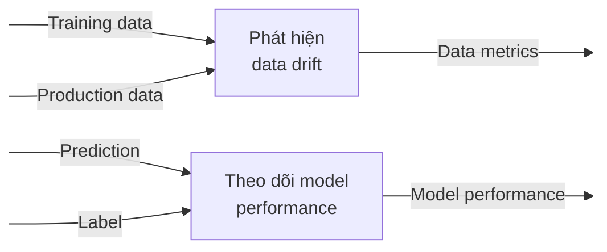

<figure>
    
    <figcaption>Photo by <a href="https://unsplash.com/@ibrahimboran?utm_source=unsplash&utm_medium=referral&utm_content=creditCopyText">Ibrahim Boran</a> on <a href="https://unsplash.com/s/photos/monitoring?utm_source=unsplash&utm_medium=referral&utm_content=creditCopyText">Unsplash</a></figcaption>
</figure>

## Giới thiệu

Trong bài trước, chúng ta đã triển khai ELK Stack thu thập, theo dõi logs từ các services, Prometheus và Grafana server để theo dõi các metrics hệ thống như CPU, memory, network, v.v. Trong một hệ thống ML, chúng ta cũng cần theo dõi metrics liên quan tới data, model để kịp thời phát hiện sự thay đổi của chúng ở production, để cập nhật data hay train lại model kịp thời. Trong bài này, chúng ta sẽ thiết kế _monitoring service_ với các công việc cụ thể sau:

1. Tạo ra dataset chứa feature bị drift
1. Triển khai monitoring service để theo dõi data và model performance
1. Thiết lập Grafana dashboards để hiển thị metrics về data và model

## Môi trường phát triển

Các bạn làm các bước sau để cài đặt môi trường phát triển:

1.  Cài đặt **môi trường Python 3.9 mới** với các thư viện cần thiết trong file `monitoring_service/dev_requirements.txt`

1.  Đặt environment variable `MONITORING_SERVICE_DIR` ở terminal bạn dùng bằng đường dẫn tuyệt đối tới folder `monitoring_service`. Env var này hỗ trợ chạy python code ở folder `monitoring_service/src` trong quá trình phát triển.

    ```bash
    cd mlops-crash-course-code/monitoring_service
    export MONITORING_SERVICE_DIR=$(pwd)
    ```

Các tools sẽ được sử dụng trong bài này bao gồm:

1. **Feast:** truy xuất Feature Store
1. **Flask:** viết API cho monitoring service
1. **Evidently:** kiểm tra chất lượng data và model performance

!!! note

    Trong quá trình chạy code cho tất cả các phần dưới đây, giả sử rằng folder gốc nơi chúng ta làm việc là folder `monitoring_service`.

## Architecture

Theo dõi metrics liên quan tới chất lượng data và model performance, là quá trình kiểm tra xem data và model performance thay đổi như thế nào theo thời gian. Đây cũng là yêu cầu đầu ra của monitoring service. Các chức năng chính của monitoring service được thể hiện như hình dưới



Để biết data thay đổi thế nào, training data sẽ được so sánh với production data dựa trên một thuật toán so sánh. Thuật toán này xem xét các thuộc tính về thống kê của data bị thay đổi nhiều hay ít thế nào. Như vậy, đầu vào của chức năng **Phát hiện data drift** là features ở khi training và features ở production.

Để biết model performance thay đổi thế nào, label ở production sẽ được so sánh với prediction mà model tạo ra. Model performance ở production cũng có thể được so sánh với model performance ở khi training. Để đơn giản, monitoring service sẽ chỉ theo dõi model performance ở production. Như vậy, đầu vào của chức năng **Theo dõi model performance** là dự đoán của model và label ở production.

Trong bài này, thư viện Evidently được dùng để phát hiện data drift, tính toán model performance metrics. Evidently là một thư viện open-source được sử dụng để đánh giá, kiểm tra và giám sát data, model performance. Evidently đã tích hợp sẵn các thuật toán để theo dõi các thuộc tính thống kê của data như **PSI**, **K-L divergence**, **Jensen-Shannon distance**, **Wasserstein distance** và các metrics phổ biến của model performance như **Accuracy**, **F1 score**, **RMSE**, **MAE**, v.v. Bạn có thể đọc thêm ở [document của Evidently](https://docs.evidentlyai.com/reference/data-drift-algorithm) để tìm hiểu về cách mà Evidently lựa chọn thuật toán tự động khi phát hiện data drift.

## Cách test

Trước khi code, chúng ta sẽ phân tích xem làm thế nào để test các chức năng của monitoring service.

!!! quote

    Before you start anything, learn how to finish it.

### Phát hiện data drift

Để test chức năng **Phát hiện data drift**, 2 bộ datasets cần được tạo ra:

| #   | Tên dataset   | Giá trị                                                               |
| --- | ------------- | --------------------------------------------------------------------- |
| 1   | `normal_data` | Trong đoạn `[A, B]`                                                   |
| 2   | `drift_data`  | Trong đoạn `[C, D]`; `C`, `D` nằm đủ xa `A`, `B` để gây ra data drift |

Hai tình huống như bảng dưới đây cũng cần được sắp đặt.

| #   | Tình huống                     | Data đầu vào    | Dataset được dùng |
| --- | ------------------------------ | --------------- | ----------------- |
| 1   | Production data không bị drift | Training data   | `normal_data`     |
|     |                                | Production data | `normal_data`     |
| 2   | Production data bị drift       | Training data   | `normal_data`     |
|     |                                | Production data | `drift_data`      |

Ở tình huống 1, production data không bị drift `normal_data` vừa là training data, vừa là production data và được lưu vào Online Feature Store. Data được lấy ra ở Online Feature Store sẽ giống với prodution data, tức là sẽ không xảy ra data drift.

Ở tình huống 2, production data bị drift `normal_data` ở trên vẫn là training data, còn `drift_data` là production data. `drift_data` được lưu vào Online Feature Store. Data được lấy ra ở Online Feature Store (`drift_data`) để model dự đoán có giá trị nằm xa training data (`normal_data`), tức là sẽ xảy ra data drift.

!!! question

    Cần lấy ra bao nhiêu records từ training data và tích luỹ bao nhiêu records của production data thì mới bắt đầu thực hiện quá trình so sánh?

Khi training dataset quá lớn, chúng ta không thể lấy hết các records ra để so sánh được. Thông thường, một con số đủ nhỏ sẽ được dùng để việc theo dõi data được diễn ra liên tục và gần với thời gian thực (near real-time). Đồng thời, con số này cũng phải đủ lớn, để các tính chất thống kê của data không quá khác biệt ở các phần của dataset. Phương pháp lựa chọn và số records cần lựa chọn tuỳ thuộc vào nhu cầu và tần suất theo dõi production data của mỗi dự án.

!!! tip

    Thuật ngữ **_reference window_** chỉ tập hợp các records để so sánh với production data. Thuật ngữ **_test window_** chỉ tập hợp các records để so sánh với **_reference window_**

Để đơn giản, chúng ta sẽ tạo ra 5 records cho mỗi dataset và chỉ tích luỹ 5 records của production data để thực hiện việc so sánh data.

Một lý do nữa cho con số 5 là vì ở Online serving API, features được lấy ra sẽ là features mới nhất trong dataset. Do đó, việc tạo ra nhiều records ở nhiều thời điểm là không cần thiết. Chỉ cần đảm bảo rằng trong Feature Store, tồn tại ít nhất 1 record cho mỗi ID của tài xế ở request gửi đến. Vì dataset gốc chỉ chứa ID của 5 tài xế bao gồm `[1001, 1002, 1003, 1004, 1005]`, nên chỉ cần 5 records cho mỗi dataset.

Tóm lại, chúng ta cần tạo ra 2 datasets có khoảng giá trị nằm xa nhau, mỗi dataset có 5 records tương ứng với 5 ID của các tài xế. Để đơn giản hoá quá trình test, phân phối chuẩn sẽ được sử dụng cho các giá trị của features trong cả 2 datasets.

Bảng dưới đây là một ví dụ của `normal_data`.

| index | datetime                  | driver_id | conv_rate | acc_rate | avg_daily_trips |
| ----- | ------------------------- | --------- | --------- | -------- | --------------- |
| 0     | 2021-07-19 23:00:00+00:00 | 1001      | 0.186341  | 0.226879 | 107             |
| 1     | 2021-07-18 06:00:00+00:00 | 1002      | 0.071032  | 0.229490 | 250             |
| 2     | 2021-07-28 09:00:00+00:00 | 1003      | 0.050000  | 0.192864 | 103             |
| 3     | 2021-07-27 10:00:00+00:00 | 1004      | 0.184332  | 0.050000 | 49              |
| 4     | 2021-07-23 05:00:00+00:00 | 1005      | 0.250000  | 0.250000 | 246             |

Bảng dưới đây là một ví dụ của `drift_data`.

| index | datetime                  | driver_id | conv_rate | acc_rate | avg_daily_trips |
| ----- | ------------------------- | --------- | --------- | -------- | --------------- |
| 0     | 2021-07-19 23:00:00+00:00 | 1001      | 0.886341  | 0.926879 | 807             |
| 1     | 2021-07-18 06:00:00+00:00 | 1002      | 0.771032  | 0.929490 | 950             |
| 2     | 2021-07-28 09:00:00+00:00 | 1003      | 0.750000  | 0.892864 | 803             |
| 3     | 2021-07-27 10:00:00+00:00 | 1004      | 0.884332  | 0.750000 | 750             |
| 4     | 2021-07-23 05:00:00+00:00 | 1005      | 0.950000  | 0.950000 | 946             |

### Theo dõi model performance

Để test chức năng **Theo dõi model performance**, label của mỗi request được gửi tới Online serving API cần được biết, thì mới đánh giá được dự đoán của model là đúng hay sai.

Ở [phần Online serving của bài Triển khai model serving](../../model-serving/trien-khai-model-serving/#online-serving), request và response được gửi tới Online serving API có dạng như sau.

```json
// Request
{
  "request_id": "uuid-1",
  "driver_ids": [1001, 1002, 1003, 1004, 1005]
}
// Response
{
  "prediction": 1001,
  "error": null
}
```

Với mỗi ID của tài xế, model trả về 1 số thực. Số thực này thể hiện khả năng mà tài xế có hoàn thành cuốc xe hay không. Tuy nhiên ở production, chúng ta không biết chính xác số thực này là bao nhiêu. Chúng ta chỉ biết rằng, khi model trả về ID tài xế có khả năng cao nhất hoàn thành cuốc xe là `1001`, thì tức là model đang dự đoán tài xế có ID `1001` sẽ hoàn thành cuốc xe. Bảng dưới đây thể hiện kết quả dự đoán của model và ID của tài xế được chọn, thông tin cuốc xe có hoàn thành không, với mỗi request được gửi đến Online serving API.

| request_id | driver_ids         | Dự đoán của model | Tài xế được chọn | Hoàn thành |
| ---------- | ------------------ | ----------------- | ---------------- | ---------- |
| uuid-1     | [1001, 1002, 1003] | 0.1234            | 1001             | 1          |
| uuid-2     | [1001, 1002, 1003] | 1.2345            | 1001             | 0          |
| uuid-3     | [1001, 1002, 1003] | -1.5678           | 1002             | 1          |

Như bạn thấy, mặc dù có dự đoán của model, nhưng bạn sẽ không có label ở dạng số thực này để so sánh. Bạn chỉ biết tài xế được chọn được dự đoán là sẽ hoàn thành cuốc xe, tức là dự đoán luôn là `1` cho tài xế được chọn đó. Như vậy, để test chức năng theo dõi model performance của monitoring service, bạn chỉ cần tạo ra labels cho mỗi request được gửi tới ở dạng 1/0 chứ không phải ở dạng số thực mà model trả về.

!!! question

    Cần tạo ra bao nhiêu request và label tương ứng?

Ở phần trước, chúng ta đã phân tích rằng chỉ cần tích luỹ 5 records là đủ để thực hiện quá trình so sánh data, nên số lượng request và label tương ứng cũng chỉ cần 5 records. Dataset chứa 5 records này được gọi là `request_data`, gồm 3 cột:

1. `request_id`: request id
2. `driver_ids`: danh sách ID các tài xế được gửi đến trong request
3. `trip_completed`: label cho request

Có một vấn đề như sau. Nếu tài xế `1001` luôn được dự đoán là tài xế có khả năng cao nhất sẽ hoàn thành cuốc xe, thì bộ features của tài xế `1001` sẽ luôn được gửi về monitoring service, khiến cho tính chất thống kê của production data sẽ không giống với tính chất thống kê của `normal_data` hoặc `drift_data`. Để khắc phục, bạn cần đảm bảo cả 5 bộ features của 5 tài xế trong dataset mà chúng ta dùng (`normal_data` hoặc `drift_data`) đều được gửi tới monitoring service. Bảng dưới đây là một ví dụ cho dataset `request_data`.

| request_id | driver_ids | trip_completed |
| ---------- | ---------- | -------------- |
| uuid-1     | [1001]     | 1              |
| uuid-2     | [1002]     | 0              |
| uuid-3     | [1003]     | 1              |
| uuid-4     | [1004]     | 0              |
| uuid-5     | [1005]     | 1              |

Như các bạn thấy, khi `driver_ids` chỉ chứa 1 ID, thì chắc chắc ID này sẽ được chọn làm dự đoán của model.

Như vậy là chúng ta đã phân tích xong cách test monitoring service, với các bộ dataset cần được tạo ra bao gồm `normal_data`, `drift_data` và `request_data`. Các phần dưới đây sẽ tập trung vào viết code.

## Tạo datasets

Trong phần này, chúng ta sẽ tạo ra 2 datasets có tính chất và mục đích như bảng dưới đây.

| Dataset       | Phân phối                                   | Số records |
| ------------- | ------------------------------------------- | ---------- |
| `normal_data` | Phân phối chuẩn, giá trị thuộc [0.05, 0.25] | 5          |
| `drift_data`  | Phân phối chuẩn, giá trị thuộc [0.75, 0.95] | 5          |

Code để tạo ra 2 datasets này nằm tại `monitoring_service/nbs/prepare_datasets.ipynb`.

```python linenums="1" title="monitoring_service/nbs/prepare_datasets.ipynb"
df_orig = pd.read_parquet(DATA_PATH, engine='fastparquet')
driver_ids = np.unique(df_orig['driver_id']) # (1)

N_SAMPLES = driver_ids.shape[0]
X, _ = make_classification(n_samples=N_SAMPLES, random_state=random_seed) # (2)

scaler = MinMaxScaler(feature_range=(0.05, 0.25))
X = scaler.fit_transform(X) # (3)

scaler = MinMaxScaler(feature_range=(0.75, 0.95))
X_shift = scaler.fit_transform(X) # (4)

def create_dataset(generated_X):
    df = pd.DataFrame()
    df['conv_rate'] = generated_X[:, 0] # (5)
    df['acc_rate'] = generated_X[:, 1]
    df['avg_daily_trips'] = np.array((generated_X[:, 2] * 1000), dtype=int) # (6)
    return df

# Tạo normal_data và drift_data
normal_df = create_dataset(X)
drift_df = create_dataset(X)

# Tạo request_data
request_id_list = [] # (7)
driver_ids_list = []

for i in range(N_SAMPLES):
    request_id = f"uuid-{i}"
    request_id_list.append(request_id)
    driver_id = driver_ids[i % len(driver_ids)] # (8)
    driver_ids_list.append([driver_id])

y = np.random.choice([0, 1], size=N_SAMPLES, p=[0.3, 0.7]) # (9)

request_df = pd.DataFrame() # (10)
request_df['request_id'] = request_id_list
request_df['driver_ids'] = driver_ids_list
request_df['trip_completed'] = y
```

1. Lấy ra ID các tài xế từ dataset gốc
2. Tạo ra 1 dataset dạng classification theo phân phối chuẩn dùng hàm `make_classification` của scikit-learn
3. Biến đổi `X` về đoạn [0.05, 0.25]. `X` sẽ được dùng để tạo `normal_data`
4. Biến đổi `X` về đoạn [0.75, 0.95], lưu vào `X_shift`. `X_shift` sẽ được dùng để tạo `drift_data`
5. Sử dụng 3 cột đầu tiên của `X` và `X_shift` để làm features cho `normal_data` và `drift_data`
6. Feature `avg_daily_trips` nằm trong khoảng từ 0 tới 1000
7. Khởi tạo list chứa request ID và list chứa ID các tài xế cho mỗi request
8. Lần lượt lấy ra ID các tài xế
9. Tạo ra label cho mỗi request với xác suất 0.3 cho label `0` và 0.7 cho label `1`. 2 con số này được lấy bất kì
10. Tạo `DataFrame` chứa `request_data`

Đoạn code trên tạo ra `request_data` chứa thông tin về request sẽ được gửi tới Online serving API, label tương ứng của mỗi request. Tiếp theo, chúng ta sẽ test các datasets được tạo ra bằng cách sử dụng Evidently để phát hiện data drift và đánh giá model performance.

### Test datasets

Code của phần này được đặt tại `monitoring_service/nbs/test_datasets.ipynb`.

```python linenums="1" title="monitoring_service/nbs/test_datasets.ipynb"
normal_df = pd.read_parquet(ORIG_DATA_PATH, engine='fastparquet') # (1)
drift_df = pd.read_parquet(DRIFT_DATA_PATH, engine='fastparquet')
request_df = pd.read_csv(REQUEST_DATA_PATH)

column_mapping = ColumnMapping( # (2)
    target="trip_completed", # (3)
    prediction="prediction", # (4)
    numerical_features=["conv_rate", "acc_rate", "avg_daily_trips"], # (5)
    categorical_features=[], # (6)
)

features_and_target_monitor = ModelMonitoring(monitors=[DataDriftMonitor()]) # (7)
model_performance_monitor = ModelMonitoring(monitors=[ClassificationPerformanceMonitor()]) # (8)

# Chạy kiểm tra data drift
features_and_target_monitor.execute( # (9)
    reference_data=normal_df, # (10)
    current_data=drift_df, # (11)
    column_mapping=column_mapping,
)

# Chạy kiểm tra model performance
predictions = [1] * drift_df.shape[0]
drift_df = drift_df.assign(prediction=predictions) # (12)
drift_df = drift_df.assign(trip_completed=request_df["trip_completed"]) # (13)

model_performance_monitor.execute( # (14)
    reference_data=drift_df,
    current_data=drift_df,
    column_mapping=column_mapping,
)
```

1. Đọc `normal_data`, `drift_data` và `request_data`
2. `ColumnMapping` là 1 class trong Evidently định nghĩa ý nghĩa của các cột trong bộ data
3. Định nghĩa cột `target` hay chính là label
4. Định nghĩa cột `prediction` hay chính là dự đoán của model
5. Định nghĩa các cột là features ở dạng số
6. Định nghĩa các cột là features ở dạng categorical
7. Định nghĩa object `ModelMonitoring` để theo dõi data drift. `ModelMonitoring` là 1 class trong Evidently định nghĩa các loại monitoring mà chúng ta muốn chạy. Có nhiều loại monitoring như `DataDriftMonitor`, `CatTargetDriftMonitor`, `NumTargetDriftMonitor`, v.v.
8. Định nghĩa object `ModelMonitoring` để theo dõi model performance
9. Kiểm tra data drift, so sánh `drift_data` với `normal_data`
10. Dùng `normal_data` làm **reference window** hay training data. Trong Evidently, **reference window** được gán vào tham số `reference_data`
11. Dùng `drift_data` làm **test window** hay production data để so sánh với training data. Trong Evidently, **test window** được gán vào tham số `current_data`
12. Thêm cột `prediction` vào `drift_data`, hay chính là dự đoán của model. Như đã phân tích ở phần trước, predictions của model luôn là `1`
13. Thêm cột `trip_completed` vào `drift_data` hay chính là label của mỗi record
14. Kiểm tra model performance so sánh `drift_data` với chính nó

!!! question

    Tại sao lại kiểm tra model performance bằng cách so sánh `drift_data` hay production data với chính nó?

Trong Evidently, với loại monitoring là `ClassificationPerformanceMonitor` nếu cả **reference window**, **test window** đều chứa prediction và label thì Evidently sẽ tính toán các metrics của model performance trên cả 2 datasets này, việc thực hiện so sánh xem các metrics đó khác nhau thế nào. Tuy nhiên để đơn giản hoá, chúng ta chỉ cần biết model performance của model với production data, chứ không cần so sánh model performance giữa **reference window**, **test window**. Vì vậy, chúng ta sẽ truyền vào `drift_data` vào cả `reference_data` và `current_data`. Bạn có thể đọc thêm [tại đây](https://docs.evidentlyai.com/reports/classification-performance#requirements) để hiểu rõ hơn về cách Evidently tính model performance.

Kết quả được in ra sau khi chạy giống như sau.

```bash
data_drift:n_drifted_features | 3 | None # (1)
data_drift:dataset_drift | True | None # (2)
...

classification_performance:quality | 0.4 | {'dataset': 'reference', 'metric': 'accuracy'} # (3)
classification_performance:class_quality | 0.0 | {'dataset': 'reference', 'class_name': '0', 'metric': 'precision'} # (4)
...
```

1. Số features bị drift
2. `current_data`, hay **test window**, có bị drift không
3. `accuracy` của model
4. `precision` của model cho class `0`

Để tìm hiểu thêm về các loại monitoring khác hay các chức năng khác của Evidently, bạn có thể xem thêm các ví dụ tại [website của Evidently](https://docs.evidentlyai.com/examples).

## Tổng kết

Trong bài này chúng ta đã phân tích, thiết kế một service khá phức tạp là Monitoring service. Bạn đã hiểu các yêu cầu về các chức năng của một Monitoring service để theo dõi các metrics của data model như **Phát hiện Data drift**, **Theo dõi model performance**. Trong bài tiếp theo, chúng ta sẽ học cách triển khai và thiết lập cảnh báo trên Grafana.

## Tài liệu tham khảo

- [Evidently](https://docs.evidentlyai.com/)
