<figure>
    
    <figcaption>Photo by <a href="https://unsplash.com/@dawson2406?utm_source=unsplash&utm_medium=referral&utm_content=creditCopyText">Stephen Dawson</a> on <a href="https://unsplash.com/s/photos/monitoring?utm_source=unsplash&utm_medium=referral&utm_content=creditCopyText">Unsplash</a></figcaption>
</figure>

## Giới thiệu

Trong bài trước, chúng ta đã thiết kế _monitoring service_ với các công việc:

1. Tạo ra dataset chứa feature bị drift
1. Triển khai monitoring service để theo dõi data và model performance
1. Thiết lập Grafana dashboards để hiển thị metrics về data và model

Trong bài này, chúng ta sẽ thực hiện code để triển khai service này.

## Môi trường phát triển

Các bạn làm các bước sau để cài đặt môi trường phát triển:

1.  Cài đặt **môi trường Python 3.9 mới** với các thư viện cần thiết trong file `monitoring_service/dev_requirements.txt`

1.  Đặt environment variable `MONITORING_SERVICE_DIR` ở terminal bạn dùng bằng đường dẫn tuyệt đối tới folder `monitoring_service`. Env var này hỗ trợ chạy python code ở folder `monitoring_service/src` trong quá trình phát triển.

    ```bash
    cd mlops-crash-course-code/monitoring_service
    export MONITORING_SERVICE_DIR=$(pwd)
    ```

Các tools sẽ được sử dụng trong bài này bao gồm:

1. **Feast:** truy xuất Feature Store
1. **Flask:** viết API cho monitoring service
1. **Evidently:** kiểm tra chất lượng data và model performance

!!! note

    Trong quá trình chạy code cho tất cả các phần dưới đây, giả sử rằng folder gốc nơi chúng ta làm việc là folder `monitoring_service`.

## Monitoring service

Trong phần này, chúng ta sẽ thực hiện code monitoring service. Hình dưới đây thể hiện các luồng data của monitoring service.

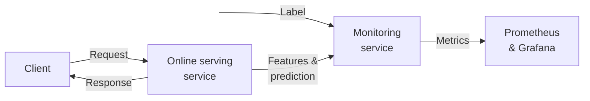

Quá trình phát triển monitoring service gồm các bước chính sau.

1. Viết code gửi request và response data từ Online serving API sang _Monitoring API_ (một RESTful API) của monitoring service
2. Viết Monitoring API ở monitoring service, nhận data từ Online serving API, dùng data này để theo dõi data drift và model performance
3. Thiết lập Prometheus server và Grafana dashboards để hiển thị các metrics về data drift và model performance

### Monitoring API

Đầu tiên, chúng ta sẽ viết Monitoring API ở monitoring service. Code của monitoring service được đặt tại `monitoring_service/src/monitoring_service.py`. Bạn hãy để ý tới hàm `iterate` của class `MonitoringService` với luồng xử lý data như sau.

```python linenums="1" title="monitoring_service/src/monitoring_service.py"
def iterate(self, new_rows: pd.DataFrame): # (1)
    if not self._process_curr_data(new_rows): # (2)
        return
    if not self._process_next_run(): # (3)
        return
    self._execute_monitoring() # (4)
    self._process_metrics(self.features_and_target_monitor.metrics()) # (5)
    self._process_metrics(self.model_performance_monitor.metrics()) # (6)
```

1. Hàm `iterate` nhận vào `new_rows`, chính là data được Online serving API gửi tới
2. Xử lý data nhận được
3. Kiểm tra xem đã đến thời điểm chạy quá trình đánh giá data drift và model performance chưa
4. Thực hiện phân tích đánh giá data drift và model performance
5. Gửi metrics về data drift tới Prometheus server
6. Gửi metrics về model performance tới Prometheus server

Data nhận được từ Online serving API gồm các cột chính sau.

| Cột               | Ý nghĩa                                   |
| ----------------- | ----------------------------------------- |
| `request_id`      | Request ID                                |
| `conv_rate`       | Feature                                   |
| `acc_rate`        | Feature                                   |
| `avg_daily_trips` | Feature                                   |
| `best_driver_id`  | ID tài xế được chọn                       |
| `prediction`      | Dự đoán của model cho driver ID được chọn |

Hãy cùng xem hàm `_process_curr_data` làm công việc gì.

```python linenums="1" title="monitoring_service/src/monitoring_service.py"
def _process_curr_data(self, new_rows: pd.DataFrame): # (1)
    label_data = read_label_data() # (2)
    if label_data is None:
        return False

    merged_data = merge_request_with_label(new_rows, label_data) # (3)
    if not self.current_data is None: # (4)
        curr_data: pd.DataFrame = pd.concat([self.current_data, merged_data], ignore_index=True)
    else:
        curr_data = merged_data

    curr_size = curr_data.shape[0]
    if curr_size > self.WINDOW_SIZE: # (5)
        curr_data.drop(
            index=list(range(0, curr_size - self.WINDOW_SIZE)), inplace=True
        )
        curr_data.reset_index(drop=True, inplace=True)

    self.current_data = curr_data # (6)

    if curr_size < self.WINDOW_SIZE: # (7)
        Log().log.info(
            f"Not enough data for measurement: {curr_size}/{self.WINDOW_SIZE} rows. Waiting for more data"
        )
        return False
    return True
```

1. Hàm `_process_curr_data` nhận vào data mới được gửi từ Online serving API sang
2. Đọc label data hay chính là `request_data`
3. Kết hợp data mới với label data theo `request_id`
4. Tích luỹ data mới với data hiện tại
5. Bỏ bớt records nếu như số records vượt quá `WINDOW_SIZE` chính là kích thước của **test window**
6. Lưu data mới đã được xử lý vào làm data hiện tại
7. Kiểm tra xem đã đủ số records cần thiết chưa

!!! question

    Tại sao cần đọc label data hay `request_data` mỗi khi có records mới được gửi đến từ Online serving API?

Chúng ta không cần phải đọc lại `request_data` mỗi khi có records mới vì `request_data` là không đổi. Sở dĩ code được viết như vậy là để giả sử rằng không phải lúc nào label cũng có sẵn ở production.

Sau khi kết hợp data mới với label data theo `request_id` data được tổng hợp chứa các cột sau:

- Các cột features: dùng để theo dõi data drift
- Cột `prediction` và cột label `trip_completed`: dùng để theo dõi model performance. Lưu ý, cột `prediction` được biến đổi trong hàm `merge_request_with_label` để luôn có giá trị là `1`

Tiếp đến, hãy xem hàm `_process_next_run` và `_execute_monitoring`.

```python linenums="1" title="monitoring_service/src/monitoring_service.py"
def _process_next_run(self):
    if not self.next_run is None and self.next_run > datetime.now(): # (1)
        return False
    self.next_run = datetime.now() + timedelta(seconds=self.RUN_PERIOD_SEC) # (2)
    return True

def _execute_monitoring(self):
    self.features_and_target_monitor.execute( # (3)
        self.reference_data,
        self.current_data,
        self.column_mapping,
    )
    self.model_performance_monitor.execute( # (4)
        self.current_data,
        self.current_data,
        self.column_mapping,
    )
```

1. Kiểm tra xem thời điểm hiện tại có chạy monitoring không
2. Tính thời điểm tiếp theo sẽ chạy monitoring
3. Thực hiện đánh giá data drift, giống như chúng ta đã thực hiện ở file notebook `monitoring_service/nbs/test_datasets.ipynb`
4. Thực hiện đánh giá model performance

Cuối cùng, đoạn code dưới đây của hàm `_process_metrics` sẽ gửi metrics của data drift và model performance tới Prometheus server.

```python linenums="1" title="monitoring_service/src/monitoring_service.py"
def _process_metrics(self, evidently_metrics):
    for metric, value, labels in evidently_metrics:
        metric_key = f"evidently:{metric.name}" # (1)

        if not labels:
            labels = {}
        labels["dataset_name"] = MonitoringService.DATASET_NAME # (2)

        if isinstance(value, str):
            continue

        found = self.metrics.get(metric_key) # (3)
        if found is None:
            found = prometheus_client.Gauge(
                metric_key, "", list(sorted(labels.keys()))
            )
            self.metrics[metric_key] = found

        try:
            found.labels(**labels).set(value) # (4)
        except ValueError as error:
            ...
```

1. Tạo tên metric, phải giống với metric được dùng trong Prometheus query trên Grafana dashboards
2. `labels` là một `dict` với key, value là tên và giá trị của các label được quy ước bởi Evidently, ví dụ `{'dataset': 'reference', 'metric': 'accuracy'}`. `labels` này có ý nghĩa tương đương với [Prometheus labels](https://prometheus.io/docs/practices/naming/#labels)
3. `self.metrics` lưu các object `Gauge` của Prometheus. `Gauge` gửi metrics tới Prometheus server. Biến `found` là một object `Gauge`, tương ứng với mỗi metric lấy ra từ Evidently
4. Gán Prometheus labels và giá trị cho `Gauge` object. `Gauge` object sẽ gửi labels, giá trị của các metrics lên Prometheus server

Ngoài các đoạn code quan trọng nhất của monitoring service ở trên, các đoạn code còn lại khác mà bạn cần lưu ý như dưới đây.

```python linenums="1" title="monitoring_service/src/monitoring_service.py"
app = Flask(AppConst.MONITORING_SERVICE) # (1)
...
app.wsgi_app = DispatcherMiddleware(app.wsgi_app, {"/metrics": prometheus_client.make_wsgi_app()}) # (2)
...
SERVICE = MonitoringService() # (3)
...
@app.route("/iterate", methods=["POST"]) # (4)
def iterate():
    item = flask.request.json
    df = pd.DataFrame.from_dict(item) # (5)
    SERVICE.iterate(new_rows=df) # (6)
    return "ok"
...
app.run(host="0.0.0.0", port=8309, debug=True) # (7)
```

1. Tạo Flask app. Flask là một thư viện phổ biến được dùng để viết RESTful API trong Python
2. Tự động tạo endpoint `/metrics` để Prometheus thu thập metrics
3. Khởi tạo `MonitoringService` class
4. Tạo endpoint `/iterate` để Online serving API gửi data tới
5. Biến đổi data nhận vào thành `DataFrame`
6. Gọi hàm `iterate` để thực hiện đánh giá data drift và model performance
7. Chạy Flask app tại port `8309` ở máy local

Để Prometheus thu thập được metrics gửi qua endpoint `/metrics`, bạn cần tạo 1 Prometheus Job trong file config của Prometheus server được đặt tại `prom-graf/prometheus/config/prometheus.yml` trong repo `mlops-crash-course-platform`. Prometheus Job này đã được tạo sẵn như dưới đây.

```yaml linenums="1" title="prom-graf/prometheus/config/prometheus.yml"
- job_name: "monitoring_service"
  scrape_interval: 5s
  static_configs:
    - targets:
        - "localhost:8309"
```

Sau khi code xong monitoring service, chúng ta sẽ cập nhật code trong Online serving API để gửi data tới Monitoring API sau khi model thực hiện dự đoán.

### Tích hợp Online serving

Bạn mở file code của Online serving API tại `model_serving/src/bentoml_service.py` trong repo `mlops-crash-course-code`. Hãy chú ý tới đoạn code trong hàm `inference`.

```python linenums="1" title="model_serving/src/bentoml_service.py"
@svc.api(
    ...
)
def inference(request: InferenceRequest, ctx: bentoml.Context) -> Dict[str, Any]:
    try:
        ...
        result = predict(input_features[sorted(input_features)])
        df["prediction"] = result
        best_idx = df["prediction"].argmax() # (1)
        best_driver_id = df["driver_id"].iloc[best_idx] # (2)

        # monitor
        monitor_df = df.iloc[[best_idx]] # (3)
        monitor_df = monitor_df.assign(request_id=[request.request_id]) # (4)
        monitor_df = monitor_df.assign(best_driver_id=[best_driver_id]) # (5)
        monitor_request(monitor_df) # (6)

    except Exception as e:
        ...

def monitor_request(df: pd.DataFrame):
    try:
        data = json.dumps(df.to_dict(), cls=NumpyEncoder) # (7)
        response = requests.post( # (8)
            MONITORING_SERVICE_API,
            data=data,
            headers={"content-type": "application/json"},
        )
        ...
    except Exception as error:
        ...
```

1. Lấy ra index của tài xế có khả năng cao nhất sẽ hoàn thành cuốc xe
2. Lấy ra ID của tài xế được chọn
3. Lấy ra record trong `DataFrame` gốc của tài xế được chọn
4. Thêm cột `request_id` vào `monitor_df` với giá trị là `request_id` được gửi tới trong request
5. Thêm cột `best_driver_id` vào `monitor_df`. Việc lưu trữ lại thông tin về dự đoán của model là cần thiết, giúp cho việc theo dõi data và debug ở production dễ dàng hơn
6. Gọi tới hàm `monitor_request` để gửi data tới Monitoring API. Data được gửi bao gồm các cột chính: `request_id`, các cột features, `prediction` và `best_driver_id`
7. Biến đổi `DataFrame` thành dạng JSON với sự hỗ trợ của `NumpyEncoder` class, giúp cho việc biến đổi JSON trở lại thành `DataFrame` ở phía Monitoring API dễ dàng hơn
8. Gửi POST request tới Monitoring API

Như vậy là chúng ta vừa tích hợp Online serving API với Monitoring API của Monitoring service. Sau khi model thực hiện dự đoán ở Online serving API, data được tổng hợp từ requests và prediction của model sẽ được gửi sang Monitoring API để được theo dõi và đánh giá. Monitoring API sẽ thực hiện việc đánh giá data drift, model performance, rồi gửi các metrics sau khi đánh giá ra API endpoint `/metrics`. Prometheus server sẽ định kì thu thập các metrics qua endpoint `/metrics` này. Grafana sẽ đọc các metrics từ Prometheus server và hiển thị lên dashboards. Trong phần tiếp theo, chúng ta sẽ thiết lập Grafana dashboards để hiển thị các metrics.

## Grafana dashboards và Alerts

Có 2 dashboards chúng ta cần thiết lập, bao gồm:

1. `monitoring_service/dashboards/data_drift.json`: Dashboard cho metrics về data drift
1. `monitoring_service/dashboards/classification_performance.json`: Dashboard cho metrics về model performance

Bạn cần làm các bước sau để triển khai các dashboards này lên Grafana.

1. Copy 2 file dashboards trên vào `mlops-crash-course-platform/prom-graf/run_env/grafana/dashboards`
2. Truy cập vào Grafana server tại <http://localhost:3000>
3. Mở 2 dashboards có tên **Evidently Data Drift Dashboard** và **Evidently Classification Performance Dashboard**

### Data Drift Dashboard

Dashboard **Evidently Data Drift Dashboard** sẽ giống như hình dưới đây.

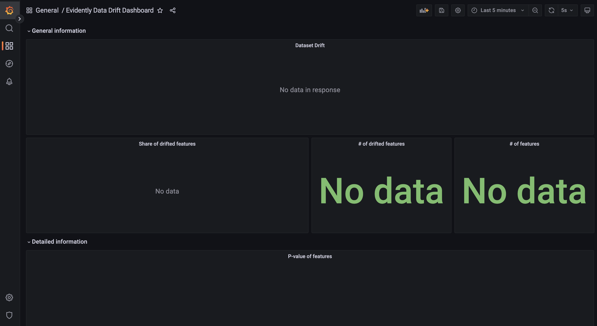

Dashboard này chứa các panels về data drift bao gồm:

- `General information`

      - `Dataset drift`: Dataset có bị drift hay không
      - `Share of drifted features`: Tỉ lệ số features bị drift trên tổng số features
      - `# of drifted features`: Số features bị drift
      - `# of features`: Tổng số features

- `Detailed information`

      - `P-value of features`: [p-value](https://en.wikipedia.org/wiki/P-value) của các features

### Model Performance Dashboard

Dashboard **Evidently Classification Performance Dashboard** sẽ giống như hình dưới đây.

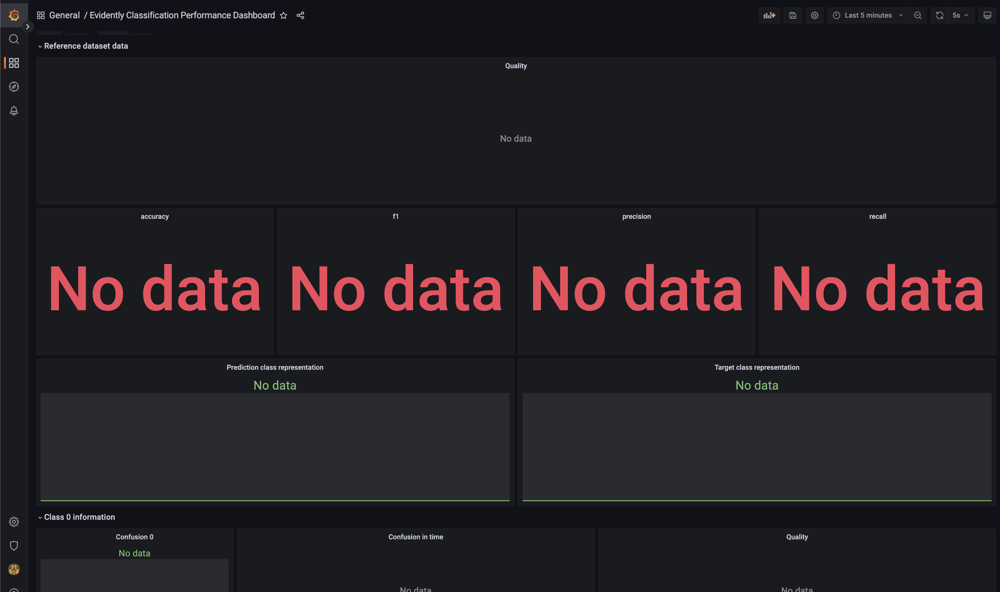

Dashboard này chứa các panels về model performance bao gồm:

- `Reference dataset data`

      - `Quality`: Tổng hợp model performance metrics theo thời gian
      - `accuracy`, `f1`, `precision`, `recall`: Model performance metrics
      - `Prediction class representation`: Số lượng các dự đoán theo class
      - `Target class representation`: Số lượng các label theo class

- `Class 0 information`: Thông tin về class 0

      - `Confusion 0`: Confusion matrix cho class 0
      - `Confusion in time`: Giá trị của confusion matrix theo thời gian
      - `Quality`: Tổng hợp model performance metrics cho class 0 theo thời gian

- `Class 1 information`: Tương tự class 0

### Alerts

Grafana Alerts cho phép kích hoạt cảnh báo khi một vấn đề về metrics xảy ra. Trong bài này, chúng ta sẽ tạo một cảnh báo đơn giản để cảnh báo khi dataset bị drift.

1.  Ở sidebar bên phải của Grafana, click `Dashabords`. Ở trang Dashboard, tạo Folder tên là `Alerts`. Folder này được dùng để lưu cảnh báo chúng ta sẽ tạo

    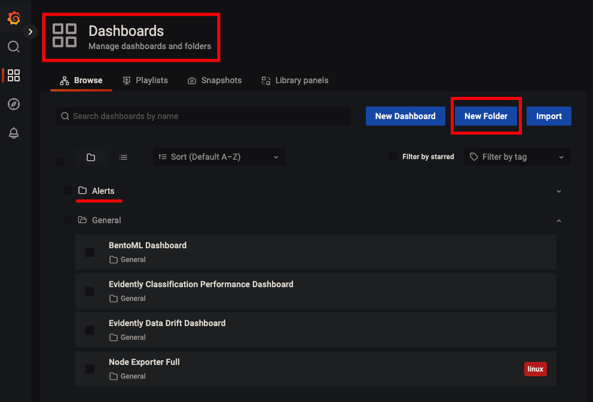

2.  Ở sidebar bên phải của Grafana, bạn click vào `Alerting`. Ở trang `Alerting`, tab `Alert rules`, click nút `New alert rule`.

    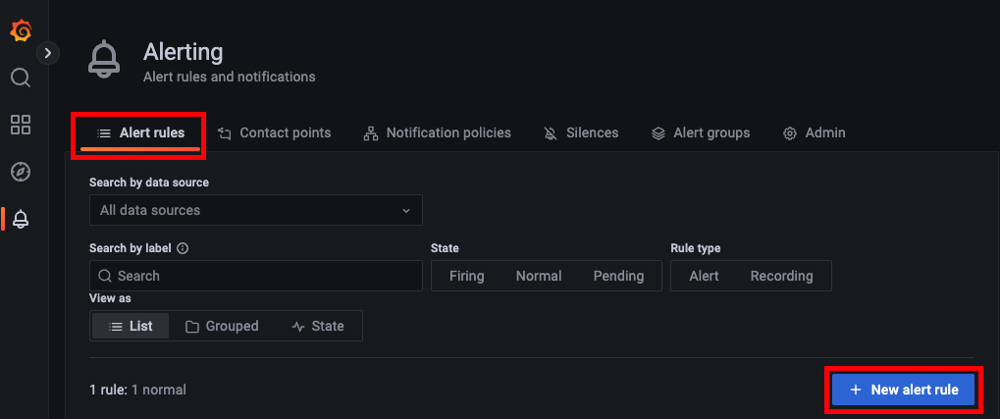

3.  Trong trang tạo cảnh báo, tạo cảnh báo mới tên là `Data drift detection`, điền các thông tin trong phần `1. Set a query and alert condition` như ảnh dưới, với query `A` là:

    ```PromQL linenums="1"
    evidently:data_drift:dataset_drift{dataset_name="drivers"}
    ```

     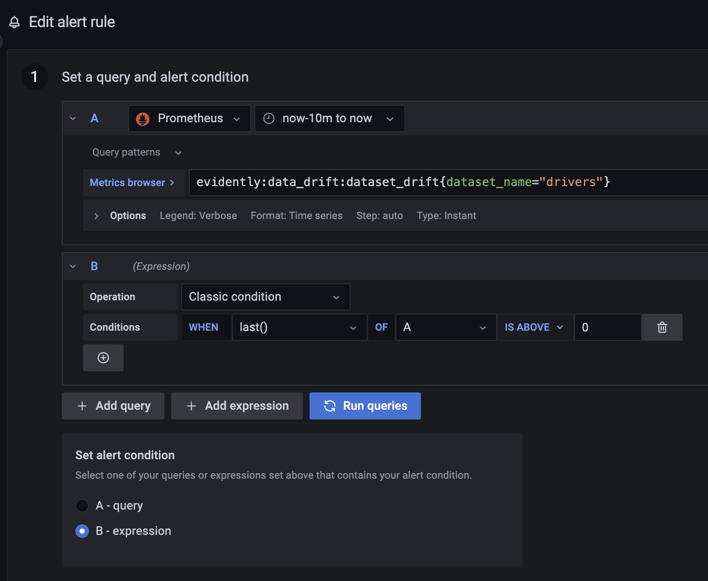

4.  Phần `2. Alert evaluation behavior` và `3. Add details for your alert`

    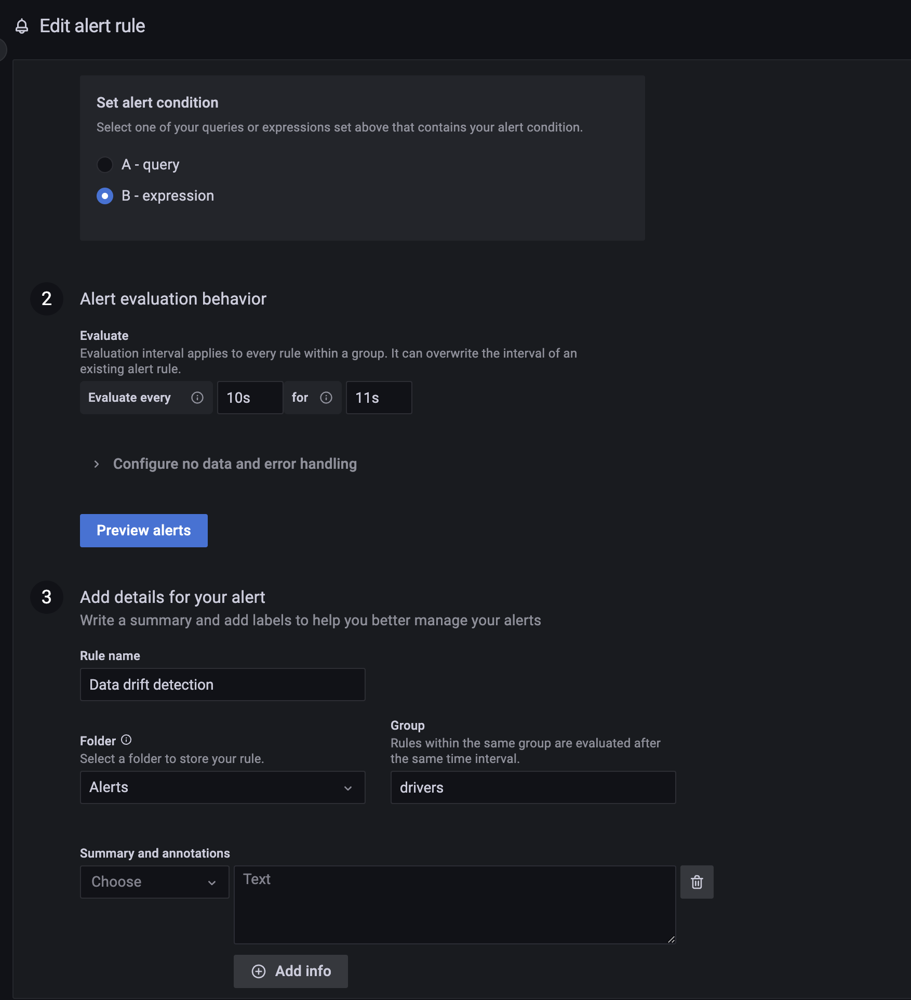

5.  Click `Save and exit`

!!! info

    Để cấu hình cách mà Alert được gửi đi, bạn vào tab `Notification polices` và thêm policy mới. Trong bài này, để đơn giản hơn chúng ta sẽ giữ nguyên policy mặc định của Grafana.

## Thử nghiệm

### Data bị drift

Sau khi thiết lập xong dashboards, chúng ta sẽ viết code để gửi request giả tới Online serving API. Code để gửi requests được đặt tại `monitoring_service/src/mock_request.py`.

```python linenums="1" title="monitoring_service/src/mock_request.py"
def construct_request(row: pd.Series) -> dict: # (1)
    request_id = row["request_id"]
    driver_ids = ast.literal_eval(row["driver_ids"])
    return {
        "request_id": request_id,
        "driver_ids": driver_ids,
    }

def send_request(request: dict) -> None: # (2)
    try:
        data = json.dumps(request)
        response = requests.post(
            ONLINE_SERVING_API,
            data=data,
            headers={"content-type": "application/json"},
        )
        ...
    except Exception as error:
        ...

def main(data_type: str, n_request: int = 1): # (3)
    data_path = AppPath.NORMAL_DATA
    if data_type == DataType.DRIFT:
        data_path = AppPath.DRIFT_DATA
    data_source = pd.read_parquet(data_path, engine="fastparquet") # (4)
    request_data = pd.read_csv(AppPath.REQUEST_DATA) # (5)
    ...
    data_source.to_parquet(AppPath.FEAST_DATA_SOURCE, engine="fastparquet") # (6)

    result = subprocess.run(["make", "feast_teardown"]) # (7)
    ...
    result = subprocess.run(["make", "feast_apply"]) # (8)
    ...
    result = subprocess.run(["make", "feast_materialize"]) # (9)
    ...

    total_request = request_data.shape[0]
    for idx in range(n_request):
        row = request_data.iloc[idx % total_request]
        request = construct_request(row)
        send_request(request) # (10)
        ...
```

1. Hàm `construct_request` tạo payload dạng JSON để gửi tới Online serving API
2. Hàm `send_request` gửi payload trên tới Online serving API
3. Hàm `main` thực hiện quá trình gửi data
4. Đọc dataset chứa các features tuỳ thuộc vào loại data là `normal_data` hay `drift_data`
5. Đọc `request_data`
6. Ghi đè dataset chứa các features vào file data source của Feast
7. Xoá data ở cả Offline Feature Store và Online Feature Store
8. Ghi data từ file data source của Feast vào Offline Feature Store
9. Ghi data từ Offline Feature Store vào Online Feature Store
10. Gửi lần lượt các request trong `request_data` tới Online serving API

Để tiến hành thử nghiệm, bạn làm theo các bước sau.

1.  Đảm bảo [Online serving service](../../model-serving/trien-khai-model-serving/#online-serving) đã chạy

1.  Cập nhật Feature Store

    ```bash
    cd ../data_pipeline
    make deploy_feature_repo # (1)
    cd ../monitoring_service
    ```

    1. Triển khai code của Feature Store

1.  Build docker image và chạy docker compose cho monitoring service

    ```bash
    make build_image
    make compose_up
    ```

    !!! tip

        Định nghĩa về các env vars được dùng trong quá trình build image được lưu tại `monitoring_service/deployment/.env`. Bạn có thể thay đổi nếu cần.

1.  Gửi 5 requests giả chứa `drift_data`

    ```bash
    python src/mock_request.py -d drift -n 5
    ```

1.  Đợi 30s, kiểm tra **Evidently Data Drift Dashboard** và **Evidently Classification Performance Dashboard**, kết quả sẽ giống như sau.

    <figure>
        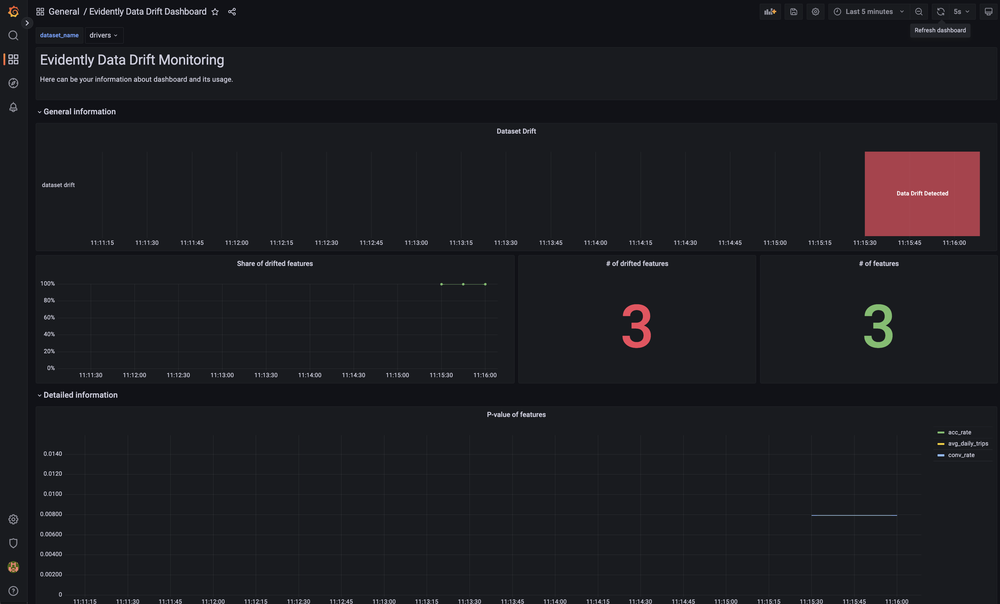
        <figcaption>Evidently Data Drift Dashboard - Dataset drift</figcaption>
    </figure>

    <figure>
        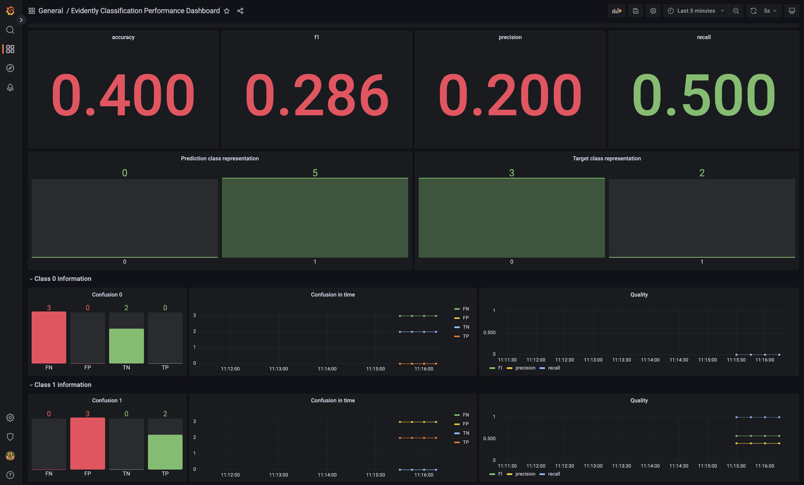
        <figcaption>Evidently Classification Performance Dashboard</figcaption>
    </figure>

1.  Mở trang Grafana Alerting, bạn sẽ thấy cảnh báo `Data drift detection` đang ở trạng thái `Firing`

    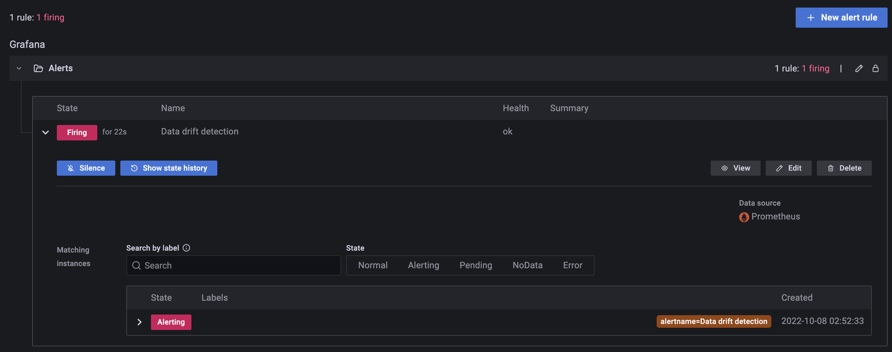

1.  Click nút `Show state history` để xem thời điểm của các trạng thái trong cảnh báo này.

    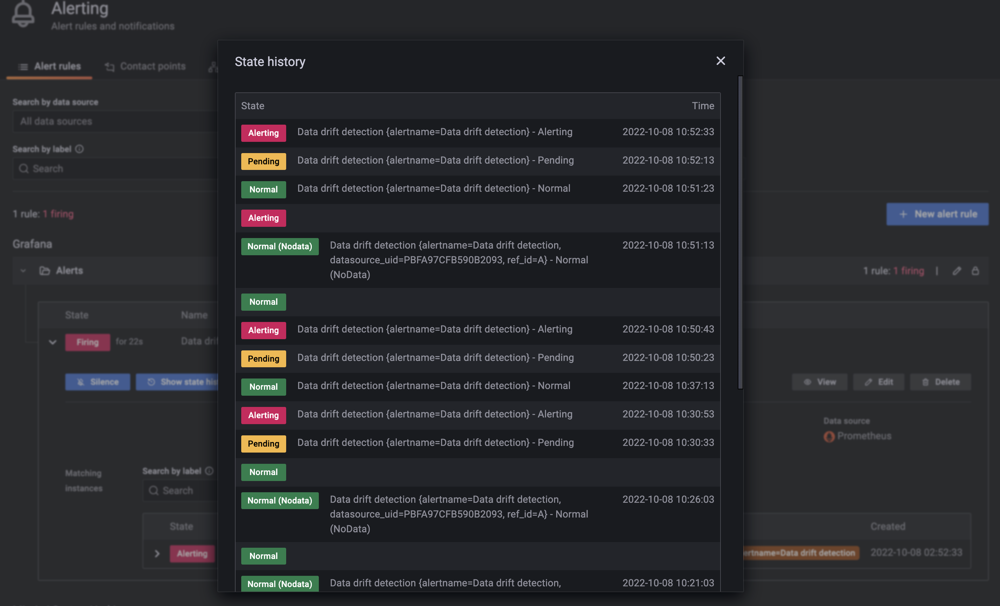

### Data không bị drift

Tiếp theo, chúng ta sẽ test trường hợp data không bị drift. Bạn làm các bước sau.

1.  Gửi 5 requests giả chứa `normal_data` tới Online serving API

    ```bash
    python src/mock_request.py -d normal -n 5
    ```

1.  Kiểm tra **Evidently Data Drift Dashboard**, bạn sẽ thấy thông tin Dataset không bị drift số features bị drift là 0. Ngoài ra, cảnh báo `Data drift detection` cũng đã ở trạng thái `Normal`

    <figure>
        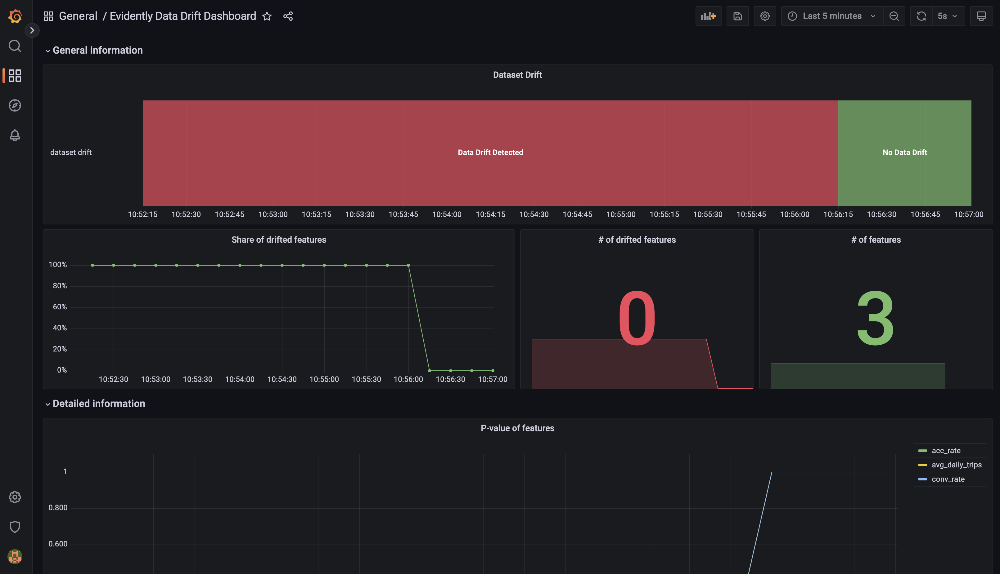
        <figcaption>Evidently Data Drift Dashboard - Dataset không drift</figcaption>
    </figure>

    <figure>
        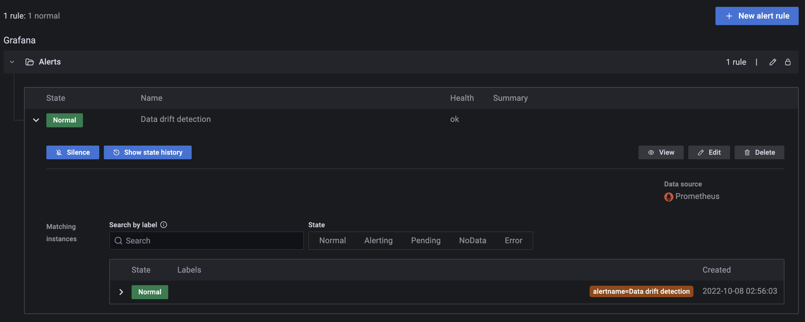
        <figcaption>Alert Data drift detection ở trạng thái Normal</figcaption>
    </figure>

!!! tip

    Nếu mở Kibana ra, bạn cũng sẽ thấy logs của Monitoring service được tự động thu thập nhờ chức năng tự động thu thập logs từ các containers của Filebeat

## Tổng kết

Theo dõi và bảo trì luôn là một phần quan trọng trong quá trình phát triển một hệ thống phần mềm nói chung, đặc biệt là trong một hệ thống ML nói riêng. Trong bài **Monitoring** này, chúng ta đã biết về các metrics điển hình của hệ thống về data và về model mà một hệ thống ML thường theo dõi.

Chúng ta cũng đã phân tích và thiết kế một service khá phức tạp là Monitoring service. Bạn đã biết cách theo dõi các metrics của data, model như **Phát hiện Data drift**, **Theo dõi model performance**, triển khai và thiết lập cảnh báo trên Grafana. Trong thực tế, bạn có thể sẽ cần dùng Grafana alert để kích hoạt một tác vụ nào đó, ví dụ như kích hoạt training pipeline tự động khi phát hiện dataset bị drift hay đơn giản là gửi email thông báo về model performance tới Data Scientist, v.v.

Trong bài tiếp theo, chúng ta sẽ thiết lập và triển khai CI/CD cho các phần trong hệ thống ML. CI/CD giúp chúng ta tự động test và tự động triển khai các Airflow DAGs, cũng như là các services như Online serving service hay Monitoring service, thay vì gõ các lệnh thủ công trong terminal.

## Tài liệu tham khảo

- [Flask](https://flask.palletsprojects.com/en/2.2.x/)
- [Grafana Alerting](https://grafana.com/docs/grafana/latest/alerting/)
