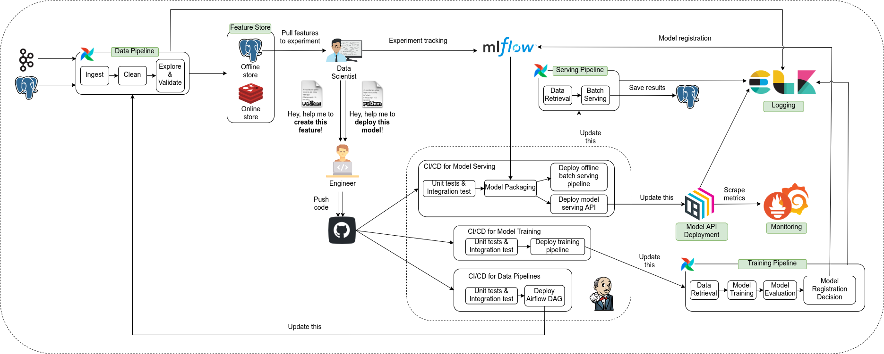

Với sự phát triển mạnh mẽ của các công nghệ điện toán, sự bùng nổ của dữ liệu lớn, và sự nỗ lực không ngừng nghỉ của các nhà nghiên cứu mà ngày nay ML được ứng dụng rộng rãi ở nhiều ngành nghề khác nhau. Điều này làm nảy sinh nhu cầu làm sao để giảm thiểu thời gian go-to-market, tăng hiệu năng và độ tin cậy của các ứng dụng ML. Thế là tập hợp các quy chuẩn về triển khai và duy trì các dự án ML dần dần được hình thành, mở ra một hướng đi hoàn toàn mới cho các anh em MLE/DS, đó là MLOps.

Dự án này được tạo ra với 3 tôn chỉ: ngắn gọn, dễ hiểu và có ý nghĩa thực tiễn. Thông suốt cả khóa học, chúng ta sẽ cùng nhau giải quyết một bài toán kinh doanh cụ thể, từ bước phân tích yêu cầu cho tới thiết kế và triển khai hệ thống. Chúng tôi cũng sẽ cố gắng truyền đạt nhiều best practices nhất có thể dựa trên kinh nghiệm và kiến thức của bản thân, để anh em đỡ phạm sai lầm hơn. Tài liệu tạo ra chắc chắn không tránh khỏi thiếu sót, thế nên team rất mong nhận được đóng góp của mọi người (cách đóng góp xem tại [đây](../../../CONTRIBUTING)).

À suýt quên, mọi người sẽ cùng nhau triển khai hệ thống như này này

