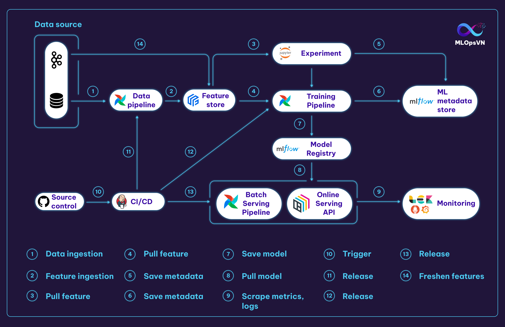

## Giới thiệu
MLOps platform là nền tảng cung cấp các tool cần thiết để quản lý và triển khai các dự án ML. Trong một số tài liệu khác MLOps platform còn có tên là AI platform hoặc ML platform. Ở khóa học này chúng ta sẽ sử dụng một MLOps platform với các thành phần và tool tương ứng như sau:

| Tên thành phần      | Ý nghĩa                                                                               | Tool lựa chọn                      |
| ------------------- | ------------------------------------------------------------------------------------- | ---------------------------------- |
| Source control      | Data và code version control                                                          | Git & Github                       |
| CI/CD               | Tự động hóa quá trình test và deploy                                                  | Jenkins                            |
| Orchestrator        | Xây dựng và quản lý các pipeline                                                      | Airflow                            |
| Model registry      | Lưu trữ và quản lý các model                                                          | MLFlow                             |
| Feature store       | Lưu trữ, quản lý và tương tác với các feature                                         | Feast (PostgreSQL & Redis backend) |
| Experiment tracking | Lưu trữ thông tin và quản lý các experiment                                           | MLFlow                             |
| ML Metadata Store   | Lưu trữ artifact của các pipeline                                                     | MLFlow                             |
| Monitoring          | Theo dõi resource hệ thống, hiệu năng của model và chất lượng dữ liệu trên production | Prometheus & Grafana & ELK         |

???+ tip
    Như mọi người có thể thấy ở trên, chúng ta có thể sử dụng một tool cho nhiều mục đích khác nhau, ví dụ MLFlow, nhằm hướng tới sử dụng ít tool nhất có thể mà vẫn đáp ứng được nhu cầu. Việc sử dụng quá nhiều tool có thể dẫn tới việc vận hành MLOps platform trở nên cực kỳ phức tạp, đồng thời khiến người dùng dễ bị choáng ngợp trong đống tool do không biết sử dụng như thế nào, và sử dụng như nào cho hiệu quả.

Kiến trúc MLOps platform của chúng ta sẽ như sau:

Các tương tác chính trong MLOps platform:

1\. Data Pipeline kéo và xử lý dữ liệu từ file source

2\. Dữ liệu sau khi xử lý bởi Data Pipeline sẽ được đẩy vào Feature Store

3\. Data Scientist (DS) kéo feature từ Feature Store để thực hiện các thí nghiệm trên notebook

4\. Training Pipeline kéo feature về để train model

5\. Metadata của các experiment, ví dụ như hyperparameters và metrics, ... được lưu vào Metadata Store

6\. Metadata của Training Pipeline cũng được lưu vào Metadata Store

7\. Model sau khi train sẽ được lưu trữ ở Model Registry 

8\. Batch Serving Pipeline và Online Serving API kéo model từ Model Registry về để serve

9\. Logs và metrics được scrape từ Online Serving API

10\. DS push code lên Github trigger CI/CD cho các pipelines và Online Serving API

14\. Kafka liên tục ghi dữ liệu mới vào Feature Store giúp feature luôn ở trạng thái _fresh_

## Infra layer

Thông thường, một công ty sẽ có một nhóm các Infra engineer làm nhiệm vụ xây dựng Infra layer. Chức năng chính của Infra layer là quản lý và cung cấp tài nguyên tính toán và lưu trữ cho các ứng dụng ở các layer trên nó. Infra layer có thể được xây dựng đơn giản sử dụng docker-compose, Docker Swarm, hoặc phức tạp hơn như Kubernetes. Trong khoá học này, giả sử rằng chúng ta sử dụng docker-compose ở Infra layer.

Trên Infra layer là Application layer, hay chính là nơi mà các engineer khác xây dựng các ứng dụng cho chính công ty đó. Các ứng dụng này có thể là môi trường Jupyter notebook, Gitlab server, Jenkins server, monitoring platform, hoặc MLOps platform, v.v. Trong khoá học này, chúng ta sẽ học cách triển khai MLOps platform trên localhost.

### Tổng kết

Sau khi đã trả lời một loạt các câu hỏi về hệ thống ML ở bài trước và định nghĩa MLOps platform ở bài này, chúng ta đã có một cái nhìn kĩ lưỡng hơn về problem mà chúng ta đang giải quyết. Dựa vào Timeline đã được định nghĩa, tiếp theo chúng ta sẽ thực hiện POC.
