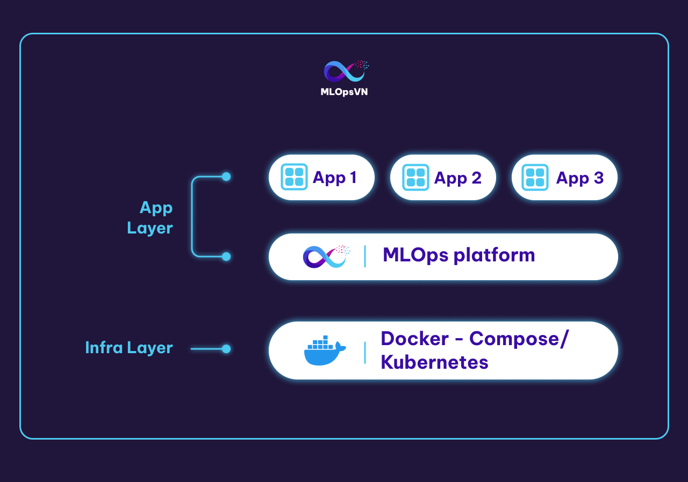

<figure>
    
    <figcaption>Photo by <a href="https://coussement-bruno.medium.com/?source=post_page-----69ff5d96b7db--------------------------------">Coussement Bruno</a> on <a href="https://towardsdatascience.com/which-cloud-servicer-provider-ml-platform-do-you-need-69ff5d96b7db">Towards Data Science</a></figcaption>
</figure>

## Giới thiệu

MLOps platform là nền tảng cung cấp các tool cần thiết để quản lý và triển khai các dự án ML. Trong một số tài liệu khác MLOps platform còn có tên là AI platform hoặc ML platform. Ở khóa học này chúng ta sẽ sử dụng một MLOps platform với các thành phần và tool tương ứng như sau:

| Tên thành phần        | Ý nghĩa                                                                               | Tool sử dụng                       |
| --------------------- | ------------------------------------------------------------------------------------- | ---------------------------------- |
| Source control        | Data và code version control                                                          | Git & Github                       |
| Feature store         | Lưu trữ, quản lý và tương tác với các feature                                         | Feast (PostgreSQL & Redis backend) |
| Experiment tracking   | Lưu trữ thông tin và quản lý các experiment                                           | MLFlow                             |
| Model registry        | Lưu trữ và quản lý các model                                                          | MLFlow                             |
| ML metadata Store     | Lưu trữ artifact của các pipeline                                                     | MLFlow                             |
| Workflow orchestrator | Xây dựng và quản lý các pipeline                                                      | Airflow                            |
| Monitoring            | Theo dõi resource hệ thống, hiệu năng của model và chất lượng dữ liệu trên production | Prometheus & Grafana & ELK         |
| CI/CD                 | Tự động hóa quá trình test và deploy                                                  | Jenkins                            |

???+ info

    Chúng ta sử dụng một tool cho nhiều mục đích khác nhau, ví dụ MLFlow, nhằm mục đích sử dụng ít tool nhất có thể mà vẫn đảm bảo được **9 MLOps Principles**, **9 MLOps Components** và **5 MLOps Workflows** được áp dụng (xem lại bài [Tổng quan MLOps](../tong-quan-mlops)). Việc sử dụng quá nhiều tool có thể dẫn tới việc vận hành MLOps platform trở nên phức tạp, đồng thời khiến người dùng dễ bị choáng ngợp do không biết sử dụng thế nào cho hiệu quả.

## Architecture

Kiến trúc MLOps platform của chúng ta sẽ như sau:


Các tương tác chính trong MLOps platform:

1\. Data Pipeline kéo và xử lý dữ liệu từ file source

2\. Dữ liệu sau khi xử lý bởi Data Pipeline sẽ được đẩy vào Feature Store

3\. Data Scientist (DS) kéo feature từ Feature Store để thực hiện các thí nghiệm trên notebook

4\. Training Pipeline kéo feature về để train model

5\. Metadata của các experiment, ví dụ như hyperparameters và metrics, ... được lưu vào Metadata Store

6\. Metadata của Training Pipeline cũng được lưu vào Metadata Store

7\. Model sau khi train sẽ được lưu trữ ở Model Registry

8\. Batch Serving Pipeline và Online Serving API kéo model từ Model Registry về để serve

9\. Logs và metrics được scrape từ Online Serving API

10\. 11. 12. 13. DS push code lên Github kích hoạt triển khai tự động (CI/CD) cho các pipelines và Online Serving API

14\. Ngoài data source ở dạng tĩnh (static data), streaming data từ _Kafka_ sẽ ghi liên tục vào Feature Store để cập nhật feature

Các tương tác và các tools được nhắc đến ở trên sẽ được hướng dẫn cụ thể xuyên suốt cả khoá học.

## Sử dụng platform

### Start

Để start các services trong MLOps platform, bạn làm theo các bước sau.

1.  Clone code mlops-crash-course-platform tại [đây](https://github.com/MLOpsVN/mlops-crash-course-platform)
1.  Cài Docker theo hướng dẫn tại [đây](https://www.docker.com/)
1.  Cài **Docker Compose version v2.10.2** theo hướng dẫn tại [đây](https://www.digitalocean.com/community/tutorials/how-to-install-docker-compose-on-ubuntu-18-04)

    ???+ warning

        Series bài giảng này sử dụng **docker-compose v2.10.2** với command `docker-compose` (thay vì compose plugin của Docker với command `docker compose`). Sử dụng version khác **v2.10.2** có thể gây ra nhiều lỗi không mong muốn.

1.  Start services

    1.  Cách 1: Start tất cả services một lúc (**nếu máy bạn có cấu hình mạnh**):

        ```bash
        cd mlops-crash-course-platform
        bash run.sh all up
        ```

        ???+ info

            Mỗi bài học tiếp theo sẽ hướng dẫn cách start các service liên quan đến bài học đó. Do vậy, bạn không cần phải start tất cả các services cùng một lúc.

    1.  Cách 2: Start từng nhóm service một:

        ```bash
        cd mlops-crash-course-platform
        bash run.sh feast up # (1)
        ```

        1. Start các service liên quan đến feast

    ??? bug

        Khi start các service, nếu bạn gặp lỗi `port is already allocated` tương tự như sau:

        ```bash
        Error response from daemon: driver failed programming external connectivity on endpoint mlflow-mlflow-1 (2383a7be19ea5d2449033194211cabbd7ad13902d8d4c2dd215a63ab78038283): Bind for 0.0.0.0:5000 failed: port is already allocated
        ```
        có nghĩa là đang có một service khác chạy ở port `5000` và `mlflow` không thể sử dụng port đó nữa, khi đó bạn sẽ thay bằng port khác như bên dưới đây. Bạn sẽ xử lý tương tự với các service khác.

        ```py title="mlops-crash-course-platform/mlflow/mlflow-docker-compose.yml" linenums="1"
        # Source: https://hub.docker.com/r/atcommons/mlflow-server
        version: '3'

        services:
        mlflow:
            ...
            ports:
            - "5000:5000" # (1)
            ...
        ```

        1. Thay bằng `"another_port:5000"`, ví dụ" `"5001:5000"`. Khi đó, sau khi start service `mlflow` bạn sẽ truy cập service này tại `http://localhost:5001`.

### Stop

Để stop các services trong MLOps platform, bạn làm theo các cách sau.

1.  Cách 1: Stop tất cả service mà không làm mất docker volumes liên quan

    ```bash
    cd mlops-crash-course-platform
    bash run.sh all down
    ```

1.  Cách 2: Stop một nhóm service mà không làm mất docker volumes liên quan

    ```bash
    cd mlops-crash-course-platform
    bash run.sh feast down
    ```

1.  Cách 3: Stop service và docker volumes liên quan tới service

    ```bash
    cd mlops-crash-course-platform
    bash run.sh feast down --volumes # (1)
    bash run.sh all down --volumes # (2)
    ```

    1. Stop service `feast` và docker volumes liên quan tới service này
    2. Stop tất cả services và docker volumes liên quan

???+ warning

    Sử dụng cách 3 sẽ không xoá data nằm trong các local folders mà được mount với các docker containers của các services. Để xoá hoàn toàn data liên quan tới services, bạn cần xoá các local folders này thủ công. Các bạn làm các bước sau:

    1. Trong repo `mlops-crash-course-platform`, mở folder tương ứng với service bạn muốn xoá data, ví dụ folder `airflow`
    1. Xoá toàn bộ folders/files trong folder `airflow/run_env`, trừ file `.gitkeep`

### Restart

Để restart các services trong MLOps platform, bạn làm như dưới đây.

```bash
cd mlops-crash-course-platform
bash run.sh feast restart # (1)
bash run.sh all restart # (2)
```

1. Restart service `feast`
2. Restart tất cả services

## Cấu trúc code

Để tiện cho việc code đồng thời quản lý các service trong MLOps platform thì bạn đặt repo `mlops-crash-course-platform` và `mlops-crash-course-code` trong cùng 1 folder như sau:

```python
mlops-crash-course
├── mlops-crash-course-platform/
└── mlops-crash-course-code/
```

Trong đó:

- Repo `mlops-crash-course-platform`: chứa docker-compose files để triển khai MLOps platform
- Repo `mlops-crash-course-code`: chứa code của dự án ML mà chúng ta sẽ phát triển và sử dụng MLOps platform

???+ warning

    Trong mỗi module ở `mlops-crash-course-code/` ví dụ như: `data_pipeline` và `model_serving` sẽ đều có 1 file là `dev_requirements.txt`. Bạn hãy tạo một môi trường mới tương tự như bên dưới trước khi cài đặt các thư viện để tránh xung đột thư viện với các dự án khác:

    ```bash
    conda create -n myenv python=3.9
    conda activate myenv
    cd data_pipeline
    pip install -r dev_requirements.txt
    ```

## Infra layer



Phần này cung cấp cho bạn một cái nhìn tổng quan hơn nữa về MLOps platform khi được đặt trong cơ sở hạ tầng IT của một tổ chức.

Thông thường, một tổ chức sẽ có một nhóm các Infra engineer làm nhiệm vụ xây dựng Infra layer. Chức năng chính của Infra layer là quản lý, cung cấp tài nguyên tính toán, lưu trữ cho các ứng dụng ở các layer trên nó. Infra layer có thể được xây dựng đơn giản sử dụng docker-compose, Docker Swarm hoặc phức tạp hơn như Kubernetes. Trong khoá học này, giả sử rằng chúng ta sử dụng docker-compose ở Infra layer để quản lý các containers và cung cấp tài nguyên tính toán, lưu trữ cho các service.

Trên Infra layer là Application layer hay chính là nơi mà các engineer khác xây dựng các ứng dụng cho chính tổ chức đó. Các ứng dụng này có thể là môi trường Jupyter notebook, Gitlab server, Jenkins server, monitoring platform, v.v. MLOps platform mà chúng ta đang xây dựng cũng nằm trên Application layer này.

## Tổng kết

Sau khi đã trả lời một loạt các câu hỏi về hệ thống ML ở bài trước và định nghĩa MLOps platform ở bài này, chúng ta đã có một cái nhìn kĩ lưỡng hơn về hệ thống cần được phát triển. Trong bài tiếp theo, bạn sẽ được tìm hiểu về các công việc và cách hoạt động cũng như triển khai một dự án POC.

## Tài liệu tham khảo

- <https://ml-ops.org/content/end-to-end-ml-workflow>
- <https://valohai.com/mlops-platforms-compared/>
- <https://cloud.google.com/architecture/mlops-continuous-delivery-and-automation-pipelines-in-machine-learning>
