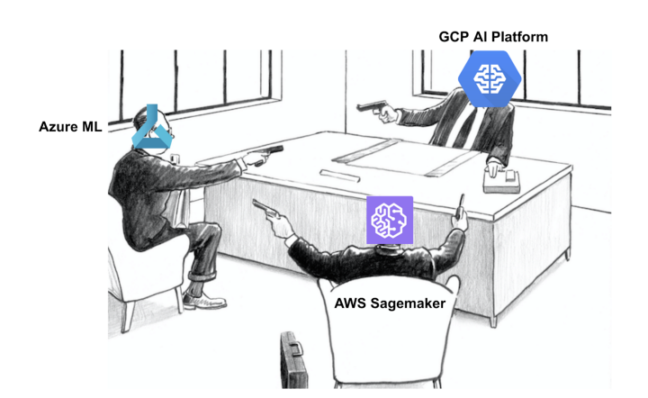

<figure>
    
    <figcaption>Photo by <a href="https://coussement-bruno.medium.com/?source=post_page-----69ff5d96b7db--------------------------------">Coussement Bruno</a> on <a href="https://towardsdatascience.com/which-cloud-servicer-provider-ml-platform-do-you-need-69ff5d96b7db">Towards Data Science</a></figcaption>
</figure>

## Giới thiệu

MLOps platform là nền tảng cung cấp các tool cần thiết để quản lý và triển khai các dự án ML. Trong một số tài liệu khác MLOps platform còn có tên là AI platform hoặc ML platform. Ở khóa học này chúng ta sẽ sử dụng một MLOps platform với các thành phần và tool tương ứng như sau:

| Tên thành phần      | Ý nghĩa                                                                               | Tool lựa chọn                      |
| ------------------- | ------------------------------------------------------------------------------------- | ---------------------------------- |
| Source control      | Data và code version control                                                          | Git & Github                       |
| CI/CD               | Tự động hóa quá trình test và deploy                                                  | Jenkins                            |
| Orchestrator        | Xây dựng và quản lý các pipeline                                                      | Airflow                            |
| Model registry      | Lưu trữ và quản lý các model                                                          | MLFlow                             |
| Feature store       | Lưu trữ, quản lý và tương tác với các feature                                         | Feast (PostgreSQL & Redis backend) |
| Experiment tracking | Lưu trữ thông tin và quản lý các experiment                                           | MLFlow                             |
| ML Metadata Store   | Lưu trữ artifact của các pipeline                                                     | MLFlow                             |
| Monitoring          | Theo dõi resource hệ thống, hiệu năng của model và chất lượng dữ liệu trên production | Prometheus & Grafana & ELK         |

???+ tip

    Như mọi người có thể thấy ở trên, chúng ta có thể sử dụng một tool cho nhiều mục đích khác nhau, ví dụ MLFlow, nhằm hướng tới sử dụng ít tool nhất có thể mà vẫn đáp ứng được nhu cầu. Việc sử dụng quá nhiều tool có thể dẫn tới việc vận hành MLOps platform trở nên cực kỳ phức tạp, đồng thời khiến người dùng dễ bị choáng ngợp trong đống tool do không biết sử dụng như thế nào, và sử dụng như nào cho hiệu quả.

Kiến trúc MLOps platform của chúng ta sẽ như sau:


Các tương tác chính trong MLOps platform:

1\. Data Pipeline kéo và xử lý dữ liệu từ file source

2\. Dữ liệu sau khi xử lý bởi Data Pipeline sẽ được đẩy vào Feature Store

3\. Data Scientist (DS) kéo feature từ Feature Store để thực hiện các thí nghiệm trên notebook

4\. Training Pipeline kéo feature về để train model

5\. Metadata của các experiment, ví dụ như hyperparameters và metrics, ... được lưu vào Metadata Store

6\. Metadata của Training Pipeline cũng được lưu vào Metadata Store

7\. Model sau khi train sẽ được lưu trữ ở Model Registry

8\. Batch Serving Pipeline và Online Serving API kéo model từ Model Registry về để serve

9\. Logs và metrics được scrape từ Online Serving API

10\. 11. 12. 13. DS push code lên Github kích hoạt triển khai tự động (CI/CD) cho các pipelines và Online Serving API

14\. Ngoài data source ở dạng tĩnh (static data), streaming data từ _Kafka_ sẽ ghi liên tục vào Feature Store để cập nhật feature

Các tương tác và các tools được nhắc đến ở trên sẽ được hướng dẫn cụ thể xuyên suốt cả khoá học.

## Sử dụng platform

### Start

Để start platform, đầu tiên mọi người clone code mlops-crash-course-platform tại [đây](https://github.com/MLOpsVN/mlops-crash-course-platform). Tiếp đó mọi người cài Docker theo hướng dẫn tại [đây](https://www.docker.com/) và Docker Compose version v2.10.2 theo hướng dẫn tại [đây](https://www.digitalocean.com/community/tutorials/how-to-install-docker-compose-on-ubuntu-18-04).

Cuối cùng, mọi người start tất cả service một lúc bằng command sau (nếu máy mọi người có cấu hình mạnh):

```bash
cd mlops-crash-course-platform && bash run.sh all up
```

, hoặc start từng nhóm service một như command dưới đây (command này dùng để start các service liên quan đến feast):

```bash
cd mlops-crash-course-platform && bash run.sh feast up
```

???+ info
Ở mỗi bài học sẽ có phần **Môi trường phát triển** để hướng dẫn mọi người start các service liên quan đến bài học, ví dụ command vừa rồi: `cd mlops-crash-course-platform && bash run.sh feast up` mọi người sẽ thấy lại ở bài học về Feature Store.

### Stop

Để stop các service mà không làm mất dữ liệu, mọi người chạy command sau:

- Stop tất cả service:
  ```bash
  cd mlops-crash-course-platform && bash run.sh all down
  ```
- Stop một nhóm service
  ```bash
  cd mlops-crash-course-platform && bash run.sh feast down
  ```

???+ tip

    Nếu muốn stop các service, đồng thời xóa dữ liệu lưu trữ trong các Docker volume, mọi người thêm argument `--volumes`.
    Ví dụ: `bash run.sh all down --volumes`

## Cấu trúc code

Để tiện cho việc code đồng thời quản lý các service trong MLOps platform thì mọi người đặt repo `mlops-crash-course-platform` và `mlops-crash-course-code` trong cùng 1 folder như sau:

```python
mlops-crash-course
├── mlops-crash-course-platform/
└── mlops-crash-course-code/
```

, trong đó:

- Repo: `mlops-crash-course-platform` clone từ [đây](https://github.com/MLOpsVN/mlops-crash-course-platform) chứa các file docker-compose để deploy
- Repo: `mlops-crash-course-code` clone từ [đây](https://github.com/MLOpsVN/mlops-crash-course-code) chứa code của dự án ML sẽ trình bày trong bài học POC

???+ warning
Trong mỗi module ở `mlops-crash-course-code/` ví dụ như: `data_pipeline` và `model_serving` sẽ đều có 1 file là `dev_requirements.txt`. Mọi người hãy tạo một môi trường mới tương tự như bên dưới trước khi cài đặt các thư viện để tránh xung đột thư viện với các dự án khác:

    ```bash
    conda create -n myenv python=3.9
    conda activate myenv
    cd data_pipeline
    pip install -r dev_requirements.txt
    ```

Các bài học tiếp theo giả định rằng chúng ta đang ở trong folder `mlops-crash-course/` (bằng cách sử dụng command `cd mlops-crash-course/` )

## Infra layer


Phần này cung cấp cho bạn một cái nhìn tổng quan hơn nữa về MLOps platform khi được đặt trong cơ sở hạ tầng IT của một tổ chức.

Thông thường, một tổ chức sẽ có một nhóm các Infra engineer làm nhiệm vụ xây dựng Infra layer. Chức năng chính của Infra layer là quản lý và cung cấp tài nguyên tính toán và lưu trữ cho các ứng dụng ở các layer trên nó. Infra layer có thể được xây dựng đơn giản sử dụng docker-compose, Docker Swarm, hoặc phức tạp hơn như Kubernetes. Trong khoá học này, giả sử rằng chúng ta sử dụng docker-compose ở Infra layer để quản lý các containers và cung cấp tài nguyên tính toán, lưu trữ cho các service.

Trên Infra layer là Application layer, hay chính là nơi mà các engineer khác xây dựng các ứng dụng cho chính tổ chức đó. Các ứng dụng này có thể là môi trường Jupyter notebook, Gitlab server, Jenkins server, monitoring platform, v.v. MLOps platform mà chúng ta đang xây dựng cũng nằm trên Application layer này.

## Tổng kết

Sau khi đã trả lời một loạt các câu hỏi về hệ thống ML ở bài trước và định nghĩa MLOps platform ở bài này, chúng ta đã có một cái nhìn kĩ lưỡng hơn về hệ thống mà chúng ta sẽ phát triển. Trong bài tiếp theo, chúng ta sẽ triển khai dự án POC.

## Tài liệu tham khảo

- <https://ml-ops.org/content/end-to-end-ml-workflow>
- <https://valohai.com/mlops-platforms-compared/>
- <https://cloud.google.com/architecture/mlops-continuous-delivery-and-automation-pipelines-in-machine-learning>
