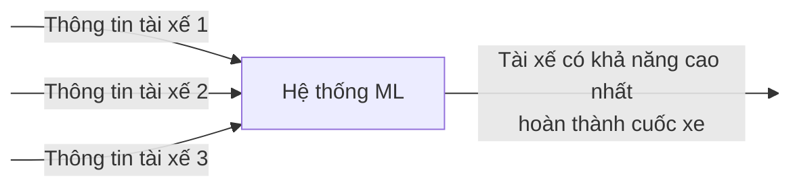

<figure>
    
</figure>

## Giới thiệu

Một hệ thống ML cũng là một hệ thống phần mềm. Khi xây dựng một hệ thống phần mềm, việc đầu tiên cần làm là định nghĩa vấn đề, định lượng hoá định nghĩa đó thành các yêu cầu có thể đánh giá được, và đề xuất các giải pháp khả thi để giải quyết các yêu cầu đó. Vấn đề cốt lõi khi đi xây dựng một hệ thống ML vẫn là vấn đề kinh doanh của một tổ chức.

Giả sử rằng công ty của bạn có mô hình kinh doanh giống _Grab_, và vấn đề kinh doanh của công ty của bạn là:

**_Dự đoán xem tài xế có hoàn thành một cuốc xe hay không để chọn ra tài xế tốt nhất khi có yêu cầu đặt xe từ một khách hàng?_**

Giả sử rằng công ty hiểu về ML và chọn ML làm giải pháp để giải quyết vấn đề kinh doanh này. Hình dưới đây thể hiện yêu cầu về đầu vào và đầu ra của vấn đề.

## Phân tích vấn đề

Quá trình định nghĩa vấn đề kinh doanh là quá trình trả lời nhiều câu hỏi. Bảng dưới đây liệt kê các câu hỏi tiêu biểu và các câu trả lời.

| **Chủ đề**             | **Câu hỏi**                                                                      | **Trả lời**                                                                                                                                                      |
| ---------------------- | -------------------------------------------------------------------------------- | ---------------------------------------------------------------------------------------------------------------------------------------------------------------- |
| **Mục tiêu**           | Mục tiêu kinh doanh?                                                             | Tăng số lượng cuốc xe được hoàn thành trong 1 tháng 10%                                                                                                          |
|                        | Các chức năng chính?                                                             | Chọn tài xế có khả năng cao nhất hoàn thành cuốc xe                                                                                                              |
| **Các bên liên quan**  | Ai là người tham gia? Vai trò và trách nhiệm?                                    | Product owner, Product manager, Solution Architect, Data Scientist, Data engineer, ML engineer                                                                   |
|                        | Ai cần được thông báo về dự án?                                                  | Head of Engineering, CTO, CEO                                                                                                                                    |
|                        | Ai là người dùng cuối?                                                           | Khách hàng                                                                                                                                                       |
| **Data**               | Có thể lấy ở các nguồn nào?                                                      | Static data và streaming data từ ứng dụng đặt xe của công ty                                                                                                     |
|                        | Định nghĩa quy trình để biến đổi data sang format có thể dùng được?              | Giả sử quy trình để biến đổi data, feature engineering đã được định nghĩa                                                                                        |
| **Phát triển model**   | Có giải pháp nào đã được thực hiện để đối chiếu?                                 | Giả sử đã tìm hiểu các giải pháp của đối thủ cạnh tranh                                                                                                          |
|                        | Có những thresholds nào được dùng để khiến giải pháp trở nên hữu ích?            | Model inference không được chạy quá 500ms                                                                                                                        |
|                        | Cân nhắc tradeoffs                                                               | False positives (false alarm) có ảnh hưởng nghiêm trọng hơn                                                                                                      |
|                        | Có cần confidence score không? Dùng threshold nào?                               | Không cần, rank các tài xế theo xác suất mà model dự đoán sau                                                                                                    |
|                        | Làm gì với các dự đoán không được chọn?                                          | Được log lại và gán label                                                                                                                                        |
| **Đánh giá model**     | Dùng metrics nào để đánh giá model lúc phát triển và ở production?               | Dùng metrics RMSE                                                                                                                                                |
|                        | Làm sao để liên kết model performance với mục tiêu kinh doanh?                   | Ở production, ngoài RMSE để đánh giá model performance, cần tính tỉ lệ hoàn thành các cuốc xe trong 1 tháng gần nhất                                             |
| **Triển khai**         | Data của quá trình inference sẽ được lấy từ đâu? Được format và lưu trữ thế nào? | Data đầu vào của quá trình inference được lấy từ _Online Feature Store_ (sẽ được giải thích trong bài **Model serving**)                                         |
|                        | Model được triển khai ở đâu?                                                     | Lên server nội bộ của công ty                                                                                                                                    |
|                        | Khi nào chạy batch prediction? Khi nào chạy online prediction?                   | Chạy batch prediction mỗi giờ cho các tài xế ít hoạt động, data ít thay đổi. Chạy online prediction cho các tài xế hoạt động nhiều                               |
|                        | Tốc độ thay đổi của data thế nào?                                                | Vài features sẽ thay đổi không thường xuyên, đặt lịch để cập nhật hàng ngày. Vài features cần lấy từ streaming data, cần data pipeline riêng để xử lý và lưu trữ |
|                        | Bao lâu thì cần train lại model?                                                 | Dựa vào tốc độ thay đổi của data hoặc chất lượng data ở production                                                                                               |
|                        | Labels ở production được thu thập như thế nào?                                   | Sau khi tài xế được chọn, ứng dụng đặt xe sẽ trả về kết quả xem cuốc xe có hoàn thành không                                                                      |
| **Quyền riêng tư**     | Có yêu cầu nào về quyền riêng tư của data, labels, v.v                           | Data và labels chỉ được dùng trong nội bộ công ty                                                                                                                |
|                        | Hệ thống có thể được kết nối với internet không?                                 | Có                                                                                                                                                               |
|                        | Có thể giữ data của users trong bao lâu?                                         | Không giới hạn                                                                                                                                                   |
| **Chi phí và lợi ích** | Ngân sách ban đầu                                                                | $500,000                                                                                                                                                         |
|                        | So sánh chi phí và lợi ích                                                       | Lợi ích lớn hơn chi phí nhiều, hệ thống có thể tái sử dụng, chi phí để optimize không lớn                                                                        |
|                        | Cần đạt yêu cầu nào để tăng kinh phí?                                            | Hoàn thành các mốc thời gian tiếp theo, triển khai model ra production và tiếp tục chứng minh lợi ích lớn hơn nhiều chi phí                                      |
| **Rủi ro**             | Phân tích rủi ro đi kèm                                                          | Có thể model được đánh giá offline là tốt, nhưng ở production không mang lại hiệu quả cao                                                                        |
|                        | Phân tích rủi ro kinh doanh khác                                                 | Hết tiền trước khi hoàn thiện POC                                                                                                                                |
| **Ràng buộc kĩ thuật** | Có hệ thống cũ nào cần tích hợp với không?                                       | Không                                                                                                                                                            |
|                        | Architecture và tools sẽ dùng?                                                   | Được định nghĩa ở bài tiếp theo                                                                                                                                  |

Ngoài các câu hỏi trên, tuỳ vào vấn đề kinh doanh mà sẽ có các vấn đề và các câu hỏi khác. Trong bảng trên, nhiều câu trả lời liên quan tới mảng kinh doanh của công ty đã được trả lời ngắn gọn. Những câu trả lời này thông thường cần được một nhóm các Data Analyst và Business Strategist thảo luận, phân tích và trả lời. Câu trả lời cho các câu hỏi trên sẽ được cập nhật liên tục trong quá trình thực hiện dự án. Chúng ta không mong đợi câu trả lời sẽ đúng từ khi còn chưa bắt đầu thực hiện dự án. Bạn có thể tham khảo thêm [ở đây](https://ml-ops.org/content/phase-zero) về các câu hỏi khác khi định nghĩa vấn đề kinh doanh.

## Tổng kết

Trong quá trình phát triển hệ thống ML, mọi thành viên đều cần chú ý tới bốn tính chất cơ bản của một hệ thống ML, bao gồm Reliability, Scalability, Maintainability, và Adaptability. Bạn có thể đọc thêm ở khoá học [CS 329S: Machine Learning Systems Design](https://docs.google.com/document/d/1C3dlLmFdYHJmACVkz99lSTUPF4XQbWb_Ah7mPE12Igo/edit#heading=h.f2r0clc6xjgx) để hiểu rõ hơn về bốn tính chất này.

Trong bài tiếp theo, chúng ta sẽ cùng tìm hiểu về các architecture, workflows và MLOps platform được dùng trong khoá học.
