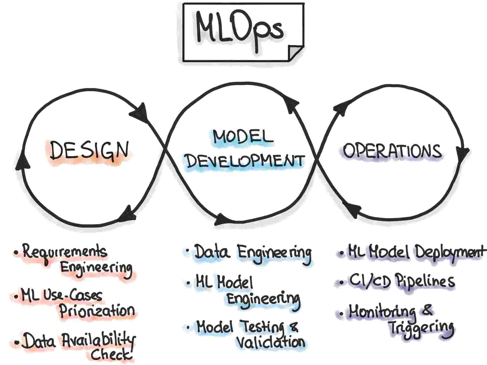
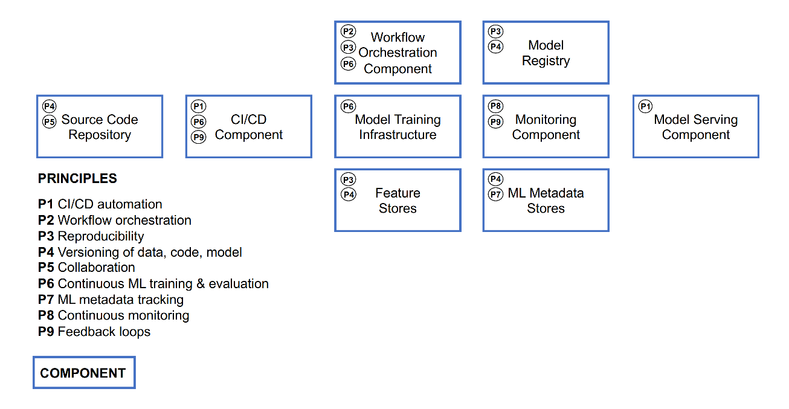
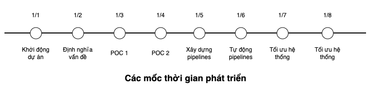

<figure>
    
    <figcaption>Source: ml-ops.org</figcaption>
</figure>

## Giới thiệu

Trong các dự án Machine Learning (ML) thực tế không nhằm mục tiêu nghiên cứu, đích đến cuối cùng là nhanh chóng triển khai hệ thống ML đó ra production. Tuy nhiên, ở thời điểm hiện tại, có rất nhiều thách thức mà các kĩ sư đang gặp phải để có thể tự động hoá các quy trình trong quá trình phát triển và triển khai các hệ thống ML. MLOps ra đời như một thuật ngữ để mô tả các vấn đề và hướng tiếp cận để giải quyết các vấn đề mà các kĩ sư gặp phải trong một dự án ML.

Trong bài này, dựa trên các kiến thức được trình bài trong bài báo [Machine Learning Operations (MLOps): Overview, Definition, and Architecture][mlops-paper], chúng ta sẽ tìm hiểu sơ lược lý thuyết về MLOps, các nguyên tắc trong MLOps, và các workflows điển hình trong MLOps.

!!! note

    Khái niệm về MLOps và các lý thuyết liên quan được nhiều nguồn khác nhau định nghĩa khác nhau. Chúng ta nên giữ một thái độ mở về sự khác nhau giữa các nguồn tài liệu này.

## Định nghĩa

Theo [bài báo trên][mlops-paper], định nghĩa trên về MLOps có thể được hiểu và tóm gọn lại vào các ý sau:

1. MLOps là một mô hình, bao gồm các best practices, các khái niệm, và văn hoá làm việc, trong quá trình phát triển, triển khai, và theo dõi một dự án ML
1. MLOps là các kĩ thuật hội tụ bởi 3 mảng: machine learning, software engineering (đặc biệt là DevOps), và data engineering
1. MLOps tạo điều kiện thuật lợi cho quá trình phát triển và triển khai các hệ thống ML ra production một cách hiệu quả hơn, thông qua một vài nguyên tắc mà chúng ta sẽ xem xét ngay sau đây.

## Các nguyên tắc

<figure>
    
    <figcaption>Photo by <a href="https://unsplash.com/@kellysikkema?utm_source=unsplash&utm_medium=referral&utm_content=creditCopyText">Kelly Sikkema</a> on <a href="https://unsplash.com/s/photos/component?utm_source=unsplash&utm_medium=referral&utm_content=creditCopyText">Unsplash</a></figcaption>
</figure>

Một nguyên tắc được xem như là một best practice, hay một sự hướng dẫn cho các quyết định được đưa ra trong quá trình phát triển hệ thống ML. Các nguyên tắc trong MLOps bao gồm:

**CI/CD automation**

Nguyên tắc này đảm bảo việc tích hợp và triển khai code được diễn ra tự động, với các bước build, test, triển khai.

**Workflow orchestration**

Trong quá trình phát triển một hệ thống ML, sẽ có rất nhiều các pipeline cần được chạy vào những khoảng thời gian nhất định, với các bước trong một pipeline phụ thuộc lẫn nhau, đồng thời có các thư viện và môi trường chạy khác nhau. Nguyên tắc này đảm bảo việc tự động hoá điều phối các pipeline này chạy đúng thứ tự, và đúng thời gian được chỉ định.

**Reproducibility**

Khả năng tái lập lại một kết quả hay một lần thử nghiệm model là một trong những yêu cầu thường thấy khi phát triển một hệ thống ML. Yêu cầu này đảm bảo việc chạy inference được ổn định, và để debug quá trình phát triển model nhanh và hiệu quả.

**Versioning of code, data, model**

Nguyên tắc này đảm bảo cả code, data, và model được version, để có thể tra soát lại xem một phiên bản model được train với data ở phiên bản nào, và sử dụng code ở phiên bản nào để train.

**Collaboration**

Trong quá trình phát triển một hệ thống ML, nhiều kĩ sư với chuyên môn khác nhau sẽ cùng tham gia vào phát triển hệ thống. Nguyên tắc này đảm bảo việc thiết lập một bộ các quy tắc, các công cụ, và cả văn hoá trong quá trình làm việc giữa các cá nhân ở các vai trò khác nhau với các trách nhiệm khác nhau.

**Continuous ML training & evaluation**

Trong nhiều ML problems, ở môi trường production, việc data bị thay đổi liên tục khiến cho hiệu quả hoạt động của model giảm đi nhanh chóng. Nguyên tắc này đảm bảo việc thiết lập một hệ thống train và đánh giá model được chạy tự động ngay khi cần thiết.

**ML metadata tracking**

Mỗi bước ở mỗi pipeline trong quá trình phát triển một hệ thống ML yêu cầu các cấu hình hay data làm đầu vào, và data ở phía đầu ra. Nguyên tắc này được đề ra dựa trên yêu cầu về việc theo dõi và ghi lại các đầu vào và đầu ra này, kèm theo các thông tin về các lần chạy của các pipeline đó, ví dụ như: ngày tháng, thời gian chạy, phiên bản của data đang chạy, hyperparameter được dùng để train model, model train xong được lưu ở đâu, v.v.

**Continuous monitoring**

Nguyên tắc này đảm bảo việc theo dõi hệ thống ML liên tục các thông số liên quan tới code, data, model, infrastructure, để phát hiện và giải quyết các lỗi kịp thời. Một số thông số như: sự thay đổi về phân phối của các features của data ở production, model performance, lượng request được gửi đến server trên một giây, thời gian xử lý một request trung bình, v.v.

**Feedback loops**

Khi phát triển một hệ thống ML, sự phản hồi từ phần đánh giá ngược về phần phát triển thường xuyên xảy ra, ví dụ như: phản hồi từ quá trình thử nghiệm data và model tới quá trình xử lý data từ các nguồn data, hay phản hồi từ quá trình đánh giá model performance ở production tới quá trình thử nghiệm model, v.v.

Xuyên suốt khoá học, các nguyên tắc này sẽ được ngầm hiểu và sử dụng trong quá trình phát triển hệ thống. Để biết thêm chi tiết, các bạn có thể đọc kĩ hơn ở [bài báo trên][mlops-paper].

## Các components

<figure>
    
    <figcaption>Photo by <a href="https://unsplash.com/@jorgedevs?utm_source=unsplash&utm_medium=referral&utm_content=creditCopyText">Jorge Ramirez</a> on <a href="https://unsplash.com/s/photos/component?utm_source=unsplash&utm_medium=referral&utm_content=creditCopyText">Unsplash</a></figcaption>
</figure>

Các components trong MLOps là các thành phần ở mức system design trong một hệ thống ML. Các components được liệt kê như sau.

1. CI/CD component
2. Source code repository
3. Workflow orchestration
4. Feature store
5. Model training infrastructure
6. Model registry
7. ML metadata store
8. Model serving component
9. Monitoring component

Tên của các components trên đã phần lớn giải thích ý nghĩa và công việc của các components đó, và đồng thời chúng cũng thực hiện nhiệm vụ của một hoặc nhiều nguyên tắc ở phần trước, nên chúng ta sẽ không đề cập chi tiết ở đây. Hình dưới đây thể hiện mối quan hệ của các components với các nguyên tắc trong MLOps.

<figure>
    
    <figcaption>Source: <a target="_blank" href="https://arxiv.org/abs/2205.02302">Machine Learning Operations (MLOps): Overview, Definition, and Architecture</a></figcaption>
</figure>

Để hiểu rõ hơn về các components này, các bạn có thể đọc kĩ hơn ở [bài báo trên][mlops-paper].

## Các workflows

Trong phần này, chúng ta sẽ tìm hiểu về các workflows điển hình trong quá trình phát triển một hệ thống ML. Các workflows này được mô tả ở bảng dưới đây.

| #   | Workflow                          | Mô tả                                                                                                                                                                                                  |
| --- | --------------------------------- | ------------------------------------------------------------------------------------------------------------------------------------------------------------------------------------------------------ |
| 1   | Phân tích vấn đề                  | Phân tích vấn đề kinh doanh, thiết kế hệ thống phần mềm, quyết định giải pháp về công nghệ sẽ dùng, định nghĩa vấn đề ML cần giải quyết, tìm kiếm data có thể sử dụng, thu thập data và phân tích data |
| 2   | Định nghĩa quy luật biến đổi data | Sau khi phân tích và hiểu data, định nghĩa các quy luật để biến đổi data thành dạng có thể sử dụng được để thử nghiệm                                                                                  |
| 3   | Xây dựng data pipeline            | Quy luật biến đổi data sẽ được sử dụng để xây dựng data pipeline                                                                                                                                       |
| 4   | Thử nghiệm model                  | Thử nghiệm data và model, train model tốt nhất                                                                                                                                                         |
| 5   | Tự động hoá training pipeline     | Code từ quá trình thử nghiệm data và model sẽ được tự động vào training pipeline. Model sau khi train xong sẽ được triển khai tự động lên Model serving component và tích hợp với Monitoring component |

Lưu ý rằng, các workflows trên không phải là thứ tự chính xác về các công việc mà chúng ta sẽ làm khi xây dựng một hệ thống ML. Hình dưới đây là một ví dụ về các mốc thời gian và các công việc chúng ta cần làm khi trong một dự án ML.

Đầu tiên, chúng ta cần định nghĩa và phân tích vấn đề kinh doanh để hiểu rõ các yêu cầu về các chức năng của hệ thống ML mà chúng ta sẽ xây dựng. Sau đó, chúng ta sẽ thực hiện một dự án POC( Proof Of Concept) để chứng minh rằng giải pháp của chúng ta đề ra là khả thi, trước khi bắt tay vào thực hiện xây dựng chi tiết các chức năng phức tạp của hệ thống.

Có thể có nhiều dự án POC ở các mức độ khác nhau. Trong quá trình thực hiện dự án POC, các data engineer, software engineer, ML engineer, hay MLOps engineer cũng thực hiện song song việc xây dựng data pipeline, training pipeline, model serving component, hay monitoring component, và CI/CD cho tất cả pipeline và components đó.

Trong khoá học này, chúng ta sẽ có các bài học lần lượt thực hiện các bước liên quan tới:

1. Phân tích vấn đề
1. Xây dựng POC
1. Data pipeline
1. Training pipeline
1. Model serving
1. Monitoring
1. CI/CD

Thứ tự các bài học không phản ánh thứ tự các công việc cần làm trong một dự án thực tế, mà nó sẽ như mình vừa miêu tả ở trên. Ngoài ra, các vòng lặp phản hồi sẽ xảy ra ở nhiều bước trong quá trình phát triển hệ thống và cộng tác cùng làm việc giữa các bộ phận và vị trí khác nhau.

## Tổng kết

Trong bài này, chúng ta đã tìm hiểu khá nhiều thử thách về MLOps khi xây dựng một hệ thống ML. Tuy nhiên, MLOps vẫn còn là một mảng mới mẻ trên thế giới, và còn tồn tại khá nhiều thử thách dành cho các kĩ sư. Hy vọng rằng khoá học **MLOps Crash Course** sẽ là một bước đệm giúp cho cộng đồng AI/ML tại Việt Nam phát triển mạnh mẽ, góp phần vào sự phát triển chung của AI/ML trên thế giới.

Trong bài tiếp theo, chúng ta sẽ bắt đầu bước đầu tiên khi xây dựng một dự án ML, đó là bước **Phân tích vấn đề**.

<!-- MARKDOWN LINKS & IMAGES -->

[mlops-paper]: https://arxiv.org/abs/2205.02302
