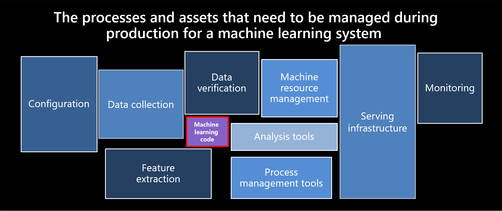

<figure>
    
    <figcaption><i>Sculley, et al. 2015. Hidden technical debt in machine learning systems. Proceedings of the 28th International Conference on Neural Information Processing Systems, Volume 2 (NIPS 2015)</i></figcaption>
</figure>

## Giới thiệu

Trong các dự án Machine Learning (ML) thực tế không nhằm mục tiêu nghiên cứu, đích đến cuối cùng là nhanh chóng triển khai hệ thống ML đó ra production. Ở thời điểm hiện tại, có nhiều thách thức mà các kĩ sư gặp phải để tự động hoá các quy trình trong quá trình phát triển và triển khai hệ thống ML. MLOps ra đời như một thuật ngữ để mô tả các vấn đề và hướng tiếp cận để giải quyết các vấn đề đó trong một dự án ML.

Trong bài này, dựa trên kiến thức từ bài báo [Machine Learning Operations (MLOps): Overview, Definition, and Architecture][mlops-paper], chúng ta sẽ tìm hiểu sơ lược lý thuyết về MLOps, các nguyên tắc trong MLOps, và các workflows điển hình trong MLOps.

!!! warning

    Khái niệm về MLOps và các lý thuyết liên quan được nhiều nguồn khác nhau định nghĩa khác nhau. Chúng ta nên giữ một thái độ mở về sự khác nhau giữa các nguồn tài liệu này.

## Định nghĩa

Theo [bài báo trên][mlops-paper], định nghĩa trên về MLOps có thể được hiểu và tóm gọn lại vào các ý sau:

1. MLOps là một mô hình, bao gồm các best practices, các khái niệm, và văn hoá làm việc, trong quá trình phát triển, triển khai, và theo dõi một dự án ML
1. MLOps là các kĩ thuật hội tụ bởi 3 mảng: machine learning, software engineering (đặc biệt là DevOps), và data engineering
1. MLOps tạo điều kiện thuật lợi cho quá trình phát triển và triển khai các hệ thống ML ra production hiệu quả hơn, thông qua các nguyên tắc mà chúng ta sẽ xem xét ngay sau đây.

## Các nguyên tắc

<figure>
    
    <figcaption>Photo by <a href="https://unsplash.com/@austindistel?utm_source=unsplash&utm_medium=referral&utm_content=creditCopyText">Austin Distel</a> on <a href="https://unsplash.com/s/photos/principle?utm_source=unsplash&utm_medium=referral&utm_content=creditCopyText">Unsplash</a></figcaption>
</figure>

Một nguyên tắc được xem như là một best practice, hay một sự hướng dẫn cho các quyết định được đưa ra trong quá trình phát triển hệ thống ML. Các nguyên tắc trong MLOps bao gồm:

**1. CI/CD automation**

Nguyên tắc này đảm bảo việc tích hợp và triển khai code diễn ra tự động.

**2. Workflow orchestration**

Trong quá trình phát triển hệ thống ML, có nhiều pipeline cần được chạy vào những thời điểm nhất định, với các bước trong pipeline phụ thuộc lẫn nhau. Ngoài ra, các thư viện và môi trường chạy cũng khác nhau. Nguyên tắc này đảm bảo việc tự động hoá điều phối các bước trong một pipeline chạy đúng thứ tự, và đúng thời gian được chỉ định.

**3. Reproducibility**

Khả năng tái lập lại một kết quả hay một lần thử nghiệm là một yêu cầu thường thấy khi phát triển một hệ thống ML. Yêu cầu này đảm bảo việc chạy model inference ở production ổn định, và debug quá trình phát triển model hiệu quả hơn.

**4. Versioning code, data, model**

Nguyên tắc này đảm bảo code, data, và model được version, để tra soát một phiên bản model được train với phiên bản data nào, và sử dụng code ở phiên bản nào để train.

**5. Collaboration**

Trong một dự án ML, nhiều kĩ sư với chuyên môn khác nhau cùng tham gia vào phát triển hệ thống. Nguyên tắc này đảm bảo việc thiết lập một bộ các quy tắc, các công cụ, và cả văn hoá làm việc để quá trình cộng tác giữa các cá nhân ở các vai trò khác nhau với các trách nhiệm khác nhau diễn ra hiệu quả.

**6. Continuous ML training & evaluation**

Ở môi trường production, việc data thay đổi liên tục khiến hiệu quả hoạt động của model giảm nhanh chóng. Nguyên tắc này đảm bảo việc thiết lập một pipeline để train và đánh giá model tự động ngay khi cần thiết.

**7. ML metadata tracking**

Mỗi bước ở mỗi pipeline trong một hệ thống ML yêu cầu các cấu hình hay data đầu vào, đầu ra. Nguyên tắc này được đặt ra dựa trên yêu cầu về việc theo dõi và ghi lại các đầu vào và đầu ra đó, kèm theo thông tin về các lần chạy của các pipeline, ví dụ như:

1. Ngày, tháng, thời gian chạy
1. Phiên bản của data đang chạy
1. Hyperparameter dùng để train model
1. Model train xong lưu ở đâu
1. v.v.

**8. Continuous monitoring**

Nguyên tắc này đảm bảo việc theo dõi liên tục các thông số liên quan tới code, data, model, infrastructure, để phát hiện và giải quyết các lỗi kịp thời. Một số thông số điển hình bao gồm:

1. Các tính chất thống kê của data ở production
1. Model performance
1. Lượng request được gửi đến server
1. Thời gian xử lý một request
1. v.v.

**9. Feedback loops**

Khi phát triển một hệ thống ML, sự phản hồi từ phần đánh giá ngược về phần phát triển thường xuyên xảy ra, ví dụ:

1. Phản hồi từ quá trình thử nghiệm data và model tới quá trình xử lý data thô
1. Phản hồi từ quá trình đánh giá model performance ở production tới quá trình thử nghiệm model
1. v.v.

Xuyên suốt khoá học, các nguyên tắc này sẽ được ngầm hiểu và sử dụng trong quá trình phát triển hệ thống. Để biết thêm chi tiết, bạn có thể đọc kĩ hơn ở [bài báo trên][mlops-paper].

## Các components

<figure>
    
    <figcaption>Photo by <a href="https://unsplash.com/@jorgedevs?utm_source=unsplash&utm_medium=referral&utm_content=creditCopyText">Jorge Ramirez</a> on <a href="https://unsplash.com/s/photos/component?utm_source=unsplash&utm_medium=referral&utm_content=creditCopyText">Unsplash</a></figcaption>
</figure>

Các components trong MLOps là các thành phần trong một hệ thống ML. Các components được liệt kê như sau.

1. CI/CD component
1. Source code repository
1. Workflow orchestration
1. Feature store
1. Model training infrastructure
1. Model registry
1. ML metadata store
1. Model serving component
1. Monitoring component

Tên các components đã giải thích ý nghĩa và công việc của các components đó, đồng thời chúng cũng thực hiện nhiệm vụ của một hoặc nhiều nguyên tắc ở phần trước, nên chúng ta sẽ không đề cập chi tiết ở đây. Hình dưới đây thể hiện mối quan hệ của các components với các nguyên tắc trong MLOps.

<figure>
    
    <figcaption>Source: <a target="_blank" href="https://arxiv.org/abs/2205.02302">Machine Learning Operations (MLOps): Overview, Definition, and Architecture</a></figcaption>
</figure>

Để hiểu rõ hơn về các components này, bạn có thể đọc kĩ hơn ở [bài báo trên][mlops-paper].

## Các workflows

Trong phần này, chúng ta sẽ tìm hiểu về các workflows điển hình trong quá trình phát triển một hệ thống ML. Các workflows được mô tả ở bảng dưới đây.

| #   | Workflow                          | Mô tả                                                                                                                                                                                                  |
| --- | --------------------------------- | ------------------------------------------------------------------------------------------------------------------------------------------------------------------------------------------------------ |
| 1   | Phân tích vấn đề                  | Phân tích vấn đề kinh doanh, thiết kế hệ thống phần mềm, quyết định giải pháp về công nghệ sẽ dùng, định nghĩa vấn đề ML cần giải quyết, tìm kiếm data có thể sử dụng, thu thập data và phân tích data |
| 2   | Định nghĩa quy luật biến đổi data | Định nghĩa các quy luật để biến đổi data thành dạng có thể sử dụng được để thử nghiệm                                                                                                                  |
| 3   | Xây dựng data pipeline            | Quy luật biến đổi data sẽ được sử dụng để xây dựng data pipeline                                                                                                                                       |
| 4   | Thử nghiệm model                  | Thử nghiệm data và model, train model tốt nhất                                                                                                                                                         |
| 5   | Tự động hoá ML pipeline           | Code từ quá trình thử nghiệm data và model sẽ được tự động vào ML pipeline. Model sau khi train xong sẽ được triển khai tự động lên Model serving component và tích hợp với Monitoring component       |

Các workflows trên không phải là thứ tự chính xác về các công việc khi xây dựng một hệ thống ML. Hình dưới đây là một ví dụ về thứ tự trong thực tế.

Đầu tiên, cần định nghĩa và phân tích vấn đề kinh doanh để hiểu rõ yêu cầu về các chức năng của hệ thống ML. Sau đó, chúng ta sẽ thực hiện dự án _Proof Of Concept_ (POC) để chứng minh rằng giải pháp đề ra là khả thi, trước khi bắt tay vào xây dựng chi tiết các chức năng phức tạp.

Có thể có nhiều dự án POC ở các mức độ khác nhau. Trong quá trình thực hiện dự án POC, các data engineer, software engineer, ML engineer, hay MLOps engineer cũng thực hiện song song việc xây dựng data pipeline, training pipeline, model serving component, hay monitoring component, và CI/CD cho tất cả pipeline và components đó. Dựa trên các bước xây dựng một hệ thống ML trong thực tế, khoá học này sẽ bao gồm các bài học lần lượt như sau:

1. Phân tích vấn đề
1. POC
1. Data pipeline
1. Training pipeline
1. Model serving
1. Monitoring
1. CI/CD

## Tổng kết

Trong bài này, chúng ta đã tìm hiểu khá nhiều vấn đề và phương hướng giải quyết dựa trên các quy tắc, components, và workflows được định nghĩa trong MLOps. Tuy nhiên, MLOps vẫn còn là một mảng khá mới, còn tồn tại khá nhiều thử thách dành cho các kĩ sư. Hy vọng rằng khoá học **MLOps Crash Course** sẽ là một bước đệm giúp cho cộng đồng AI/ML tại Việt Nam phát triển mạnh mẽ, góp phần vào sự phát triển chung của AI/ML trên thế giới.

Trong bài tiếp theo, chúng ta sẽ bắt đầu bước đầu tiên khi xây dựng một dự án ML, đó là bước **Phân tích vấn đề**.

<!-- MARKDOWN LINKS & IMAGES -->

[mlops-paper]: https://arxiv.org/abs/2205.02302
