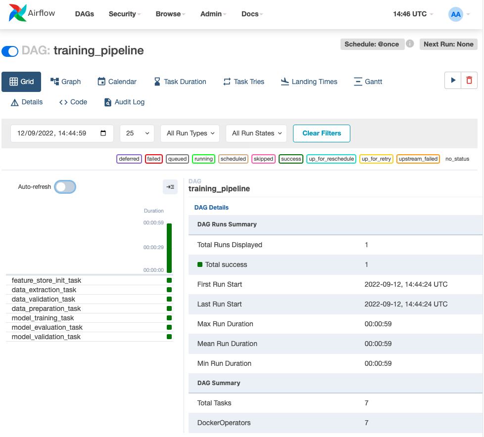

<figure>
    
    <figcaption>Photo by <a href="https://unsplash.com/@selimarda?utm_source=unsplash&utm_medium=referral&utm_content=creditCopyText">SELİM ARDA ERYILMAZ</a> on <a href="https://unsplash.com/s/photos/pipeline?utm_source=unsplash&utm_medium=referral&utm_content=creditCopyText">Unsplash</a></figcaption>
</figure>

## Giới thiệu

Trong bài trước, chúng ta đã phân tích về các task cần thiết khi xây dựng training pipeline. Chi tiết về mục đích của từng bước, mời các bạn xem lại bài trước [Tổng quan training pipeline](../../training-pipeline/tong-quan-training-pipeline). Source code của bài này được đặt tại Github repo [mlops-crash-course-code](https://github.com/MLOpsVN/mlops-crash-course-code).

Trong bài này, chúng ta sẽ cùng nhau viết code để triển khai training pipeline với các task như hình dưới.


## Môi trường phát triển

Để xây dựng pipeline nhanh chóng, chúng ta cần xây dựng môi trường phát triển ở local. Các thư viện các bạn cần cài đặt cho môi trường phát triển được đặt tại `training_pipeline/dev_requirements.txt` (giống môi trường phát triển của bài [POC](../../poc/xay-dung-poc/#moi-truong-phat-trien)).

Sau khi cài đặt môi trường phát triển, chúng ta cần làm các việc sau.

1. Clone Github repo [mlops-crash-course-platform](https://github.com/MLOpsVN/mlops-crash-course-platform). Lưu ý, repo `mlops-crash-course-platform` và repo `mlops-crash-course-code` phải được đặt trong cùng một folder

1. Copy file `training_pipeline/.env-example`, đổi tên thành `training_pipeline/.env`. File này chứa các config cần thiết cho training pipeline.

1. Copy file `training_pipeline/deployment/.env-example`, đổi tên thành `training_pipeline/deployment/.env`. File này chứa các config cần thiết cho việc triển khai training pipeline.

1. Set env var `TRAINING_PIPELINE_DIR` bằng đường dẫn tuyệt đối tới folder `training_pipeline`. Env var này là để hỗ trợ việc chạy python code trong folder `training_pipeline/src` trong quá trình phát triển.

```bash
export TRAINING_PIPELINE_DIR="path/to/mlops-crash-course-code/training_pipeline"
```

Các MLOps tools sẽ được sử dụng trong bài này bao gồm:

1. Feast để truy xuất Feature Store
1. MLflow để làm ML Metadata Store
1. Airflow để quản lý training pipeline

!!! note

    Trong quá trình chạy code cho tất cả các phần dưới đây, chúng ta giả sử rằng folder gốc nơi chúng ta làm việc là folder `training_pipeline`.

## Cập nhật Feature Store

Trước khi cập nhật Feature Store, chúng ta cần đảm bảo rằng code của Feature Store đã được triển khai lên máy của bạn. Trong thực tế, code của Feature Store sẽ được Data Engineer build và release như một library. ML engineer sẽ download về và sử dụng.

Trong khoá học này, chúng ta để code của Feature Store tại `data_pipeline/feature_repo`. Như vậy, để triển khai code này sang training pipeline, chúng ta chỉ cần copy code từ `data_pipeline/feature_repo` sang `training_pipeline/feature_repo`. Để thuận tiện cho khoá học, các bạn chỉ cần chạy các lệnh sau.

```bash
# Làm theo hướng dẫn ở file data_pipeline/README.md trước
# Sau đó chạy
cd ../data_pipeline
make deploy_feature_repo
cd ../training_pipeline
```

Sau khi code của Feature Store đã được triển khai sang folder `training_pipeline`, chúng ta cần cập nhật Feature Registry và Offline Feature Store của Feast bằng cách chạy các lệnh sau.

```bash
cd feature_repo
feast apply
cd ..
```

## Data extraction

Tiếp theo, chúng ta cần viết code để lấy data phục vụ cho quá trình train model từ Feature Store. Code của task này được lưu tại `training_pipeline/src/data_extraction.py` và được giải thích như dưới đây.

```python linenums="1" title="training_pipeline/src/data_extraction.py"
fs = feast.FeatureStore(repo_path=AppPath.FEATURE_REPO) # (1)

orders = pd.read_csv(AppPath.DATA / "driver_orders.csv", sep="\t") # (2)
orders["event_timestamp"] = pd.to_datetime(orders["event_timestamp"]) # (3)

training_df = fs.get_historical_features( # (4)
    entity_df=orders,
    features=[
        "driver_stats:conv_rate", # (5)
        "driver_stats:acc_rate",
        "driver_stats:avg_daily_trips",
    ],
).to_df() # (6)

to_parquet(training_df, AppPath.TRAINING_PQ) # (7)
```

1. Tạo kết nối tới Feature Store
2. Đọc label từ file `driver_orders.csv`
3. Định dạng lại format cho cột `event_timestamp`
4. Download features từ Offline Feature Store.
5. Các feature chúng ta muốn lấy bao gồm `conv_rate`, `acc_rate`, và `avg_daily_trips`. `driver_stats` là tên `FeatureView` mà chúng ta đã định nghĩa tại `data_pipeline/feature_repo/features.py`
6. Cách mà Feast lấy ra features giống như cách chúng ta chuẩn bị data ở dự án POC. Các bạn có thể xem lại [tại đây](../../poc/xay-dung-poc/#chuan-bi-data).
7. Lưu `training_df` vào disk để sử dụng trong các task tiếp theo.

Hãy cùng chạy task này ở môi trường phát triển của bạn bằng cách chạy lệnh sau.

```bash
cd src
python data_extraction.py
cd ..
```

Sau khi chạy xong, hãy kiểm tra folder `training_pipeline/artifacts`, các bạn sẽ nhìn thấy file `training.parquet`.

## Data validation

<figure>
    
    <figcaption>Photo by <a href="https://unsplash.com/@amelune?utm_source=unsplash&utm_medium=referral&utm_content=creditCopyText">Diane Serik</a> on <a href="https://unsplash.com/s/photos/test?utm_source=unsplash&utm_medium=referral&utm_content=creditCopyText">Unsplash</a></figcaption>
</figure>

Ở task Data validation này, dựa trên data đã được lưu vào disk ở task Data extraction, chúng ta sẽ đánh giá xem data chúng ta lấy có thực sự hợp lệ không. Code của task này được lưu tại file `training_pipeline/src/data_validation.py` và được giải thích như dưới đây.

```python linenums="1" title="training_pipeline/src/data_validation.py"
def check_unexpected_features(df: pd.DataFrame): # (1)
    cols = set(df.columns)
    for col in cols:
        if not col in config.feature_dict: # (2)
            # Báo lỗi feature 'col' không mong muốn

def check_expected_features(df: pd.DataFrame): # (3)
    dtypes = dict(df.dtypes)
    for feature in config.feature_dict:
        if not feature in dtypes:
            # Báo lỗi feature 'feature' không tìm thấy
        else:
            expected_type = config.feature_dict[feature]
            real_type = dtypes[feature]
            if expected_type != real_type:
                # Báo lỗi feature 'feature' có định dạng không mong muốn
```

1. Kiểm tra xem data có chứa feature không mong muốn nào không
2. `config.feature_dict` là dictionary với key là tên các feature mong muốn và value là format mong muốn của các feature
3. Kiểm tra xem data có chứa các feature mong muốn và ở định dạng mong muốn không

Để đơn gian hoá code và tập trung vào MLOps, trong khoá học này chúng ta sẽ không kiểm tra các tính chất liên quan tới data distribution. Hãy cùng chạy task này trong môi trường phát triển của bạn bằng cách chạy lệnh sau.

```bash
cd src
python data_validation.py
cd ..
```

## Data preparation

Ở task Data preparation, giả sử rằng chúng ta đã lấy được các feature mong muốn ở định dạng mong muốn, chúng ta không cần phải thực hiện thêm các bước biển đổi data, hoặc sinh ra các feature khác nữa. Code của task này được lưu tại file `training_pipeline/src/data_preparation.py` và được giải thích như dưới đây.

```python linenums="1" title="training_pipeline/src/data_preparation.py"
target_col = 'trip_completed'

train, test = train_test_split( # (1)
    df, test_size=config.test_size, random_state=config.random_seed
)
target_col = config.target_col
train_x = train.drop([target_col], axis=1)
train_y = train[[target_col]]
test_x = test.drop([target_col], axis=1)
test_y = test[[target_col]]

to_parquet(train_x, AppPath.TRAIN_X_PQ) # (2)
to_parquet(train_y, AppPath.TRAIN_Y_PQ)
to_parquet(test_x, AppPath.TEST_X_PQ)
to_parquet(test_y, AppPath.TEST_Y_PQ)
```

1. Chia data ra thành training set và test set
2. Lưu lại để sử dụng cho task Model training và Model evaluation

Hãy cùng chạy task này trong môi trường phát triển của bạn bằng cách chạy lệnh sau.

```bash
cd src
python data_preparation.py
cd ..
```

Sau khi chạy xong, hãy kiểm tra folder `training_pipeline/artifacts`, các bạn sẽ nhìn thấy các files `training.parquet`, `train_x.parquet`, `test_x.parquet`, `train_y.parquet`, và `test_y.parquet`.

## Model training

Đoạn code cho task Model training này đã được chúng ta viết trong khi thực hiện dự án POC. Code của task này được lưu tại file `training_pipeline/src/model_training.py` và được giải thích như dưới đây.

```python linenums="1" title="training_pipeline/src/model_training.py"
mlflow.set_tracking_uri(config.mlflow_tracking_uri) # (1)

train_x = load_df(AppPath.TRAIN_X_PQ) # (2)
train_y = load_df(AppPath.TRAIN_Y_PQ)

model = ElasticNet( # (3)
    alpha=config.alpha,
    l1_ratio=config.l1_ratio,
    random_state=config.random_seed,
)
model.fit(train_x, train_y)

mlflow.log_param("alpha", config.alpha) # (4)
mlflow.log_param("l1_ratio", config.l1_ratio)
mlflow.sklearn.log_model(
    model,
    # nơi lưu model
)

run_id = mlflow.last_active_run().info.run_id # (5)
run_info = RunInfo(run_id)
run_info.save()
```

1. Set URI tới MLflow server
2. Load data
3. Train model
4. Log metadata
5. Lưu lại thông tin về lần chạy hiện tại vào disk, để các task tiếp theo biết được model nào vừa được train để có thể download model từ MLflow server và đánh giá model.

Lưu ý thêm rằng ở bước Log metadata, chúng ta không cần phải log lại danh sách các feature được sử dụng nữa, vì bộ feature chúng ta sử dụng trong training đã được version trong code ở bước Data extraction, đồng thời DAG của chúng ta đã được version bởi `git`. Nếu có thể, chúng ta nên lưu cả đường dẫn tới data source để đảm bảo có thể theo dõi lại được nguồn gốc của data.

Trước khi chạy file code này, chúng ta cần chạy MLflow server. Để chạy Mlflow server, các bạn mở folder chứa code của Github repo [mlops-crash-course-platform](https://github.com/MLOpsVN/mlops-crash-course-platform) và chạy lệnh sau.

```bash
bash run.sh mlflow up
```

Bây giờ, hãy cùng chạy task này bằng cách chạy lệnh sau.

```bash
cd src
python model_training.py
cd ..
```

Sau khi chạy xong, hãy kiểm tra folder `training_pipeline/artifacts`, các bạn sẽ nhìn thấy file `run_info.json`. Nếu mở MLflow server trên browser ra, các bạn cũng sẽ nhìn thấy một experiment đã được tạo ra.


## Model evaluation

Đoạn code cho task Model evaluation này cũng đã được chúng ta viết ở dự án POC. Code của task này được lưu tại file `training_pipeline/src/model_evaluation.py` và được giải thích như dưới đây.

```python linenums="1" title="training_pipeline/src/model_evaluation.py"
model = mlflow.pyfunc.load_model(
    # nơi lưu model
)

test_x = load_df(AppPath.TEST_X_PQ) # (1)
test_y = load_df(AppPath.TEST_Y_PQ)
predicted_qualities = model.predict(test_x)
(rmse, mae) = eval_metrics(test_y, predicted_qualities)

eval_result = EvaluationResult(rmse, mae) # (2)
eval_result.save()
```

1. Chạy inference trên test set
2. Lưu lại kết quả

Kết quả của các offline metrics sẽ được lưu vào disk để phục vụ cho task Model validation. Hãy cùng chạy task này trong môi trường phát triển của bạn bằng cách chạy lệnh sau.

```bash
cd src
python model_evaluation.py
cd ..
```

Sau khi chạy xong, hãy kiểm tra folder `training_pipeline/artifacts`, các bạn sẽ nhìn thấy file `evaluation.json`.

## Model validation

Trong phần này, chúng ta cần đánh giá xem các offline metrics được tính toán ở task Model evaludation có thoả mãn một threshold đã được định nghĩa sẵn không, hay có thoả mãn một baseline đã được định nghĩa ở bước [Phân tích vấn đề](../../tong-quan-he-thong/phan-tich-van-de) không. Chúng ta cũng có thể cần phải kiểm tra xem model mới train được có tương thích với inference service ở production không. Để đơn giản hoá, mình sẽ chỉ viết code để so sánh offline metrics với các thresholds đã được định nghĩa sẵn trong file `training_pipeline/.env`. Code của task này được lưu tại file `training_pipeline/src/model_validation.py` và được giải thích như dưới đây.

```python linenums="1" title="training_pipeline/src/model_validation.py"
eval_result = EvaluationResult.load(AppPath.EVALUATION_RESULT)

if eval_result.rmse > config.rmse_threshold:
    # return vì RMSE không thoả mãn threshold

if eval_result.mae > config.mae_threshold:
    # return vì MAE không thoả mãn threshold

result = mlflow.register_model( # (1)
    # thông tin về model
)

dump_json(result.__dict__, AppPath.REGISTERED_MODEL_VERSION) # (2)
```

1. Register model nếu các offline metrics thoả mãn threshold
2. Lưu lại thông tin về model đã được registered

Nếu như các offline metrics của model thoả mãn các yêu cầu đề ra, chúng ta sẽ tự động register model với Model Registry của MLflow. Thông tin của model được registered và version của nó sẽ được lưu lại vào disk để đối chiếu khi cần.

Hãy cùng chạy task này trong môi trường phát triển của bạn bằng cách chạy lệnh sau.

```bash
cd src
python model_validation.py
cd ..
```

Sau khi chạy xong, nếu như model thoả mãn các yêu cầu đề ra, hãy kiểm tra folder `training_pipeline/artifacts`, các bạn sẽ nhìn thấy file `registered_model_version.json`. MLflow server cũng sẽ hiển thị model mà bạn đã registered.


Các bạn có thể click vào model đã được register để xem thêm thông tin nó. Cụ thể như ở hình dưới, chúng ta có thể thấy MLflow đã ghi lại cả định dạng hợp lệ cho input và output của model.


## Airflow DAG

Như vậy là chúng ta đã phát triển xong các đoạn code cần thiết cho training pipeline. Ở phần này, chúng ta sẽ viết Airflow DAG để kết nối các task trên lại thành một pipeline hoàn chỉnh. Đoạn code để định nghĩa Airflow DAG được lưu tại `training_pipeline/dags/training_dag.py` và được giải thích như dưới đây.

```python linenums="1" title="training_pipeline/dags/training_dag.py"
with DAG(
    dag_id="training_pipeline",
    schedule_interval="@once", # (1)
    # các argument khác
) as dag:
    feature_store_init_task = DockerOperator( # (2)
        task_id="feature_store_init_task",
        command="bash -c 'cd feature_repo && feast apply'", # (3)
        **DefaultConfig.DEFAULT_DOCKER_OPERATOR_ARGS, # (4)
    )

    data_extraction_task = DockerOperator(
        task_id="data_extraction_task",
        command="bash -c 'cd src && python data_extraction.py'",
        **DefaultConfig.DEFAULT_DOCKER_OPERATOR_ARGS,
    )

    # các task khác
```

1. DAG của chúng ta sẽ được trigger một lần khi được kích hoạt, sau đó sẽ cần trigger bằng tay
2. Chúng ta sử dụng `DockerOperator` để cách ly các task, cho chúng chạy độc lập trong các docker container khác nhau, vì các task khác nhau sẽ có môi trường để chạy kèm các dependencies khác nhau. Tuy nhiên, để đơn giản, trong khoá học này chúng ta sẽ chỉ dùng một Docker image duy nhất cho tất cả các task
3. Command mà chúng ta sẽ chạy trong mỗi task. Command giống hệt với các command mà chúng ta đã chạy trong quá trình viết code ở trên
4. Vì chúng ta sử dụng một docker image duy nhất cho tất cả các task, mình sử dụng config chung cho các docker container được tạo ra ở mỗi task. Config chung này được lưu trong biến .

Biến `DefaultConfig.DEFAULT_DOCKER_OPERATOR_ARGS` chứa các config cho `DockerOperator` như sau.

```python linenums="1" title="training_pipeline/dags/utils.py"
DEFAULT_DOCKER_OPERATOR_ARGS = {
    "image": f"{AppConst.DOCKER_USER}/mlops_crash_course/training_pipeline:latest", # (1)
    "network_mode": "host", # (2)
    "mounts": [ # (3)
        # (4)
        Mount(
            source=AppPath.FEATURE_REPO.absolute().as_posix(),
            target="/training_pipeline/feature_repo",
            type="bind",
        ),
        # (5)
        Mount(
            source=AppPath.ARTIFACTS.absolute().as_posix(), # (6)
            target="/training_pipeline/artifacts", # (7)
            type="bind", # (8)
        ),
    ],
    # các config khác
}
```

1. Docker image chúng ta sẽ sử dụng cho task
2. `network_mode` của docker container cần được set thành `host`, để container đó sử dụng cùng một network với máy local. Các bạn có thể đọc thêm ở [đây](https://docs.docker.com/network/host/). Mục đích là để docker container của chúng ta có thể kết nối tới địa chỉ MLflow server đang chạy ở máy local.
3. Có hai folders chúng ta cần mount vào trong docker container của mỗi task. Folder `training_pipeline/feature_repo` và folder `training_pipeline/artifacts`
4. Folder này cần được mount vào để chạy task Cập nhật Feature Store
5. Folder này cần được mount vào để làm nơi lưu trữ các file trong quá trình chạy các task trên. Ví dụ: training data, kết quả đánh giá model, v.v.
6. là folder nằm tại máy local của chúng ta, bắt buộc là đường dẫn tuyệt đối.
7. là folder nằm trong docker container của mỗi task
8. Kiểu bind, đọc thêm [ở đây](https://docs.docker.com/storage/#choose-the-right-type-of-mount)

Tiếp theo, chúng ta cần build docker image `mlopsvn/mlops_crash_course/training_pipeline:latest` và triển khai Airflow DAGs bằng cách chạy các lệnh sau.

```bash
make build_image # (1)
# Đảm bảo Airflow server đã chạy
make deploy_dags # (2)
```

1. Nếu các bạn muốn sử dụng docker image của riêng mình thì hãy sửa `DOCKER_USER` env var tại file `training_pipeline/deployment/.env` thành docker user của các bạn
2. Copy `training_pipeline/dags/*` vào folder `dags` của Airflow

Tiếp theo, đăng nhập vào Airflow UI trên browser với tài khoản và mật khẩu mặc định là `airflow`. Nếu các bạn đã refresh Airflow UI mà vẫn không thấy training pipeline, thì các bạn có thể vào folder `mlops-crash-course-platform` và chạy lệnh sau để restart Airflow server.

```bash
bash run.sh airflow restart
```

Airflow DAG của chúng ta có sử dụng một Airflow Variable tên là `MLOPS_CRASH_COURSE_CODE_DIR`. Variable này sẽ chứa đường dẫn tuyệt đối tới folder `mlops-crash-course-code/`. Chúng ta cần đường dẫn tuyệt đối vì `DockerOperator` yêu cầu `Mount Source` phải là đường dẫn tuyệt đối. Giá trị lấy từ Airflow variable `MLOPS_CRASH_COURSE_CODE_DIR` sẽ được dùng để tạo ra `Mount Source`. Ngoài ra, nếu các bạn dùng docker image của riêng các bạn thì hãy set Airflow variable `DOCKER_USER` thành tên docker user của các bạn. Các bạn có thể tham khảo [hướng dẫn này](https://airflow.apache.org/docs/apache-airflow/stable/howto/variable.html) để set Airflow Variable.

Sau đó, hãy mở Airflow server trên browser của bạn, kích hoạt training pipeline và chờ đợi kết quả. Sau khi Airflow DAG hoàn thành, các bạn cũng có thể kiểm tra MLflow server và sẽ thấy metadata của lần chạy experiment mới và model train xong đã được log lại.



## Tổng kết

Như vậy là chúng ta vừa trải qua quy trình phát triển điển hình cho training pipeline. Lưu ý rằng, vì code của training pipeline sẽ được cập nhật liên tục dựa theo các yêu cầu đến từ Data Scientist, nên chúng ta không hy vọng quá trình phát triển training pipeline sẽ chỉ cần thực hiện một lần rồi xong, mà nó sẽ được thực hiện trong nhiều vòng lặp.

Sau khi tự động hoá được training pipeline, trong bài tiếp theo, chúng ta sẽ cùng nhau xây dựng và tự động hoá model serving pipeline.
