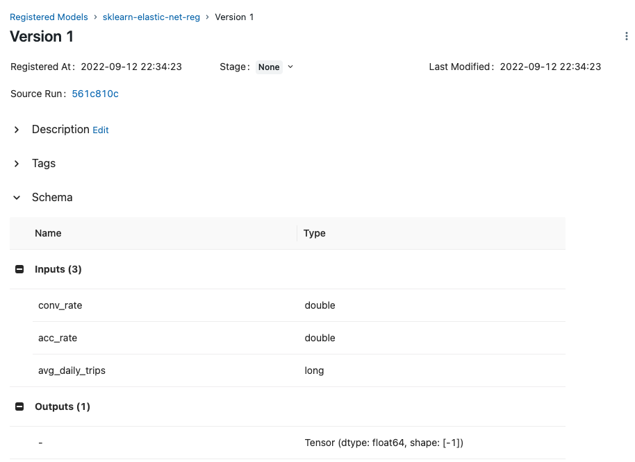

<figure>
    
    <figcaption>Photo by <a href="https://unsplash.com/@selimarda?utm_source=unsplash&utm_medium=referral&utm_content=creditCopyText">SELİM ARDA ERYILMAZ</a> on <a href="https://unsplash.com/s/photos/pipeline?utm_source=unsplash&utm_medium=referral&utm_content=creditCopyText">Unsplash</a></figcaption>
</figure>

## Giới thiệu

Sau khi thực hiện ít nhất một dự án POC thành công, chúng ta đã có được:

1. Cách biến đổi data từ data source
2. Cách biến đổi feature engineering
3. Code chuẩn bị data để train model
4. Code train model
5. Code đánh giá model

Phần 1 và 2 được dùng trong bài [xây dựng data pipeline](../../data-pipeline/tong-quan-data-pipeline). Phần 3, 4, và 5 sẽ được dùng trong bài này để xây dựng training pipeline với các task như hình dưới.


## Môi trường phát triển

Các bạn làm các bước sau để cài đặt môi trường phát triển:

1.  Vào repo `mlops-crash-course-code` sử dụng command `cd mlops-crash-course-code`

1.  Cài đặt các thư viện cần thiết trong file `training_pipeline/dev_requirements.txt`

1.  Đặt environment variable `TRAINING_PIPELINE_DIR` ở terminal bạn dùng bằng đường dẫn tuyệt đối tới folder `training_pipeline`. Env var này hỗ trợ chạy python code ở folder `training_pipeline/src` trong quá trình phát triển.

    ```bash
    export TRAINING_PIPELINE_DIR="path/to/mlops-crash-course-code/training_pipeline"
    ```

Các MLOps tools được dùng trong bài này bao gồm:

1. **Feast:** truy xuất Feature Store
1. **MLflow:** ML Metadata Store, Model Registry
1. **Airflow:** điều phối training pipeline

!!! note

    Trong quá trình chạy code cho tất cả các phần dưới đây, chúng ta giả sử rằng folder gốc nơi chúng ta làm việc là folder `training_pipeline`.

## Cập nhật Feature Store

Trong khoá học này, Feast được dùng làm Feature Store để version các feature và các bộ feature. Feast sử dụng Feature Registry để tập trung lưu trữ định nghĩa về các feature và metadata. Do Feature Registry này được lưu ở dạng file ở máy local, nên mỗi Data Scientist cần tự update Feature Registry trên máy của mình.

Trước khi cập nhật Feature Store, cần đảm bảo code của Feature Store đã được triển khai lên máy của bạn. Trong thực tế, code của Feature Store sẽ được Data Engineer build và release như một library. ML engineer sẽ download về và sử dụng.

Code của Feature Store nằm tại `data_pipeline/feature_repo`. Để triển khai sang training pipeline, chúng ta sẽ copy code từ `data_pipeline/feature_repo` sang `training_pipeline/feature_repo`. Bạn hãy chạy các lệnh sau.

```bash
cd ../data_pipeline
make deploy_feature_repo # (1)
cd ../training_pipeline

cd feature_repo
feast apply # (2)
cd ..
```

1. Triển khai code của Feature Store
2. Cập nhật Feature Registry và Offline Feature Store của Feast

## Data extraction

Trong task này, các features được lấy từ Offline Feature Store để phục vụ cho quá trình train model.

- **Đầu vào:** tên các features chúng ta muốn lấy
- **Đầu ra:** file data chứa features được lưu vào disk

Code của task này được lưu tại `training_pipeline/src/data_extraction.py`.

```python linenums="1" title="training_pipeline/src/data_extraction.py"
fs = feast.FeatureStore(repo_path=AppPath.FEATURE_REPO) # (1)

orders = pd.read_csv(AppPath.DATA / "driver_orders.csv", sep="\t") # (2)
orders["event_timestamp"] = pd.to_datetime(orders["event_timestamp"]) # (3)

training_df = fs.get_historical_features( # (4)
    entity_df=orders,
    features=[
        "driver_stats:conv_rate", # (5)
        "driver_stats:acc_rate",
        "driver_stats:avg_daily_trips",
    ],
).to_df() # (6)

to_parquet(training_df, AppPath.TRAINING_PQ) # (7)
```

1. Tạo kết nối tới Feature Store
2. Đọc label từ file `driver_orders.csv`
3. Định dạng lại format cho cột `event_timestamp`
4. Download features từ Offline Feature Store.
5. Các feature chúng ta muốn lấy bao gồm `conv_rate`, `acc_rate`, và `avg_daily_trips`. `driver_stats` là tên `FeatureView` mà chúng ta đã định nghĩa tại `data_pipeline/feature_repo/features.py`
6. Cách mà Feast lấy ra features giống như cách chúng ta chuẩn bị data ở dự án POC. Bạn có thể xem lại [tại đây](../../poc/xay-dung-poc/#chuan-bi-data).
7. Lưu data vào disk để sử dụng trong các task tiếp theo.

Bạn làm các bước sau để test thử code.

1.  Chạy code

    ```bash
    cd src
    python data_extraction.py
    cd ..
    ```

    Nếu các bạn gặp lỗi sau:

    ```bash
    PermissionError: [Errno 13] Permission denied: '/training_pipeline'
    ```

    Thì các bạn cần đặt environment variable `TRAINING_PIPELINE_DIR` như hướng dẫn ở phần **Môi trường phát triển**.

1.  Kiểm tra folder `training_pipeline/artifacts`, bạn sẽ thấy file `training.parquet`

## Data validation

<figure>
    
    <figcaption>Photo by <a href="https://unsplash.com/@amelune?utm_source=unsplash&utm_medium=referral&utm_content=creditCopyText">Diane Serik</a> on <a href="https://unsplash.com/s/photos/test?utm_source=unsplash&utm_medium=referral&utm_content=creditCopyText">Unsplash</a></figcaption>
</figure>

Sau khi lấy được data từ Offline Feature Store, chúng ta cần đánh giá data có hợp lệ không trước khi train model, bằng cách kiểm tra.

- Cấu trúc data

  - Nhận được feature nào không mong muốn không?
  - Nhận đủ feature mong muốn không?
  - Feature có ở format mong muốn không?

- Giá trị của data

  - Các tính chất thống kê của data có như mong muốn không?
  - Các giả sử về data có như mong muốn không?

Task này không sinh ra các artifact hay file nào, mà nó sẽ quyết định xem task tiếp theo có được thực hiện hay không. Code của task này được lưu tại `training_pipeline/src/data_validation.py`.

```python linenums="1" title="training_pipeline/src/data_validation.py"
def check_unexpected_features(df: pd.DataFrame): # (1)
    cols = set(df.columns)
    for col in cols:
        if not col in config.feature_dict: # (2)
            # Báo lỗi feature 'col' không mong muốn

def check_expected_features(df: pd.DataFrame): # (3)
    dtypes = dict(df.dtypes)
    for feature in config.feature_dict:
        if not feature in dtypes:
            # Báo lỗi feature 'feature' không tìm thấy
        else:
            expected_type = config.feature_dict[feature]
            real_type = dtypes[feature]
            if expected_type != real_type:
                # Báo lỗi feature 'feature' có định dạng không mong muốn
```

1. Kiểm tra xem có feature nào không mong muốn
2. `config.feature_dict` là dictionary với key là tên các feature mong muốn và value là format mong muốn của các feature
3. Kiểm tra xem có feature mong muốn và ở định dạng mong muốn không

Để đơn gian hoá code và tập trung vào MLOps, chúng ta sẽ không kiểm tra các tính chất thống kê của data. Bạn làm các bước sau để test thử code.

```bash
cd src
python data_validation.py
cd ..
```

## Data preparation

Task Data preparation có đầu vào và đầu ra như sau.

- **Đầu vào:** file data chứa features ở bước Data extraction
- **Đầu ra:** training set và test set đã được lưu vào disk

Task này thực hiện các việc sau.

- Biến đổi data nếu cần, có thể xảy ra nếu features lấy từ Offline Feature Store không ở định dạng mong muốn
- Biến đổi feature engineering nếu cần
- Tạo training set, test set để train và đánh giá model

Code của task này được lưu tại `training_pipeline/src/data_preparation.py`.

```python linenums="1" title="training_pipeline/src/data_preparation.py"
target_col = 'trip_completed'

train, test = train_test_split( # (1)
    df, test_size=config.test_size, random_state=config.random_seed
)
target_col = config.target_col
train_x = train.drop([target_col], axis=1)
train_y = train[[target_col]]
test_x = test.drop([target_col], axis=1)
test_y = test[[target_col]]

to_parquet(train_x, AppPath.TRAIN_X_PQ) # (2)
to_parquet(train_y, AppPath.TRAIN_Y_PQ)
to_parquet(test_x, AppPath.TEST_X_PQ)
to_parquet(test_y, AppPath.TEST_Y_PQ)
```

1. Chia data ra thành training set và test set, vì giả sử chúng ta đã lấy được các feature mong muốn ở định dạng mong muốn, cũng không cần thực hiện thêm các bước biển đổi data, hoặc sinh ra các feature khác nữa
2. Lưu data vào disk để sử dụng trong các task tiếp theo.

Bạn làm các bước sau để test thử code.

1.  Chạy code

    ```bash
    cd src
    python data_preparation.py
    cd ..
    ```

1.  Kiểm tra folder `training_pipeline/artifacts`, bạn sẽ thấy các files `training.parquet`, `train_x.parquet`, `test_x.parquet`, `train_y.parquet`, và `test_y.parquet`

## Model training

Task Model training sẽ train model và thực hiện hyperparameter tuning để train model tốt nhất. Tuy nhiên, trong bài này, chúng ta sẽ không thực hiện hyperparameter tuning. Task này có:

- **Đầu vào:** data được chuẩn bị ở task Data preparation
- **Đầu ra:** model đã được train.

Code cho task Model training đã được viết ở dự án POC. Code của task này được lưu tại `training_pipeline/src/model_training.py`.

```python linenums="1" title="training_pipeline/src/model_training.py"
mlflow.set_tracking_uri(config.mlflow_tracking_uri) # (1)

train_x = load_df(AppPath.TRAIN_X_PQ) # (2)
train_y = load_df(AppPath.TRAIN_Y_PQ)

model = ElasticNet( # (3)
    alpha=config.alpha,
    l1_ratio=config.l1_ratio,
    random_state=config.random_seed,
)
model.fit(train_x, train_y)

mlflow.log_param("alpha", config.alpha) # (4)
mlflow.log_param("l1_ratio", config.l1_ratio)
mlflow.sklearn.log_model(
    model,
    # nơi lưu model
)

run_id = mlflow.last_active_run().info.run_id # (5)
run_info = RunInfo(run_id)
run_info.save()
```

1. Set URI tới MLflow server
2. Load data
3. Train model
4. Log metadata
5. Lưu lại thông tin về lần chạy hiện tại để các task tiếp theo biết được model nào vừa được train, để có thể download model và đánh giá model

Ở bước Log metadata, chúng ta không cần log lại danh sách các feature được sử dụng nữa, vì bộ feature được dùng đã được version trong code ở bước Data extraction. Nếu có thể, chúng ta nên lưu cả đường dẫn tới data source để đảm bảo có thể theo dõi lại được nguồn gốc của data.

Bạn làm các bước sau để test thử code.

1.  Mở repo [mlops-crash-course-platform](https://github.com/MLOpsVN/mlops-crash-course-platform) và chạy mlflow server.

    ```bash
    bash run.sh mlflow up
    ```

1.  Chạy code

    ```bash
    cd src
    python model_training.py
    cd ..
    ```

1.  Kiểm tra folder `training_pipeline/artifacts`, bạn sẽ thấy file `run_info.json`

1.  Mở MLflow server, bạn sẽ thấy một experiment được tạo ra

    

## Model evaluation

Task Model evaluation thực hiện chạy prediction cho model trên test set. Task này có:

- **Đầu vào:** model đã được train
- **Đầu ra:** các metrics để đánh giá chất lượng model

Code cho task Model evaluation đã được viết ở dự án POC. Code của task này được lưu tại `training_pipeline/src/model_evaluation.py`.

```python linenums="1" title="training_pipeline/src/model_evaluation.py"
model = mlflow.pyfunc.load_model(
    # nơi lưu model
)

test_x = load_df(AppPath.TEST_X_PQ) # (1)
test_y = load_df(AppPath.TEST_Y_PQ)
predicted_qualities = model.predict(test_x)
(rmse, mae) = eval_metrics(test_y, predicted_qualities)

eval_result = EvaluationResult(rmse, mae) # (2)
eval_result.save()
```

1. Chạy inference trên test set
2. Lưu lại kết quả

Kết quả là offline metrics, sẽ được lưu vào disk, để phục vụ cho task Model validation. Bạn làm các bước sau để test thử code.

1.  Chạy code

    ```bash
    cd src
    python model_evaluation.py
    cd ..
    ```

1.  Kiểm tra folder `training_pipeline/artifacts`, bạn sẽ thấy file `evaluation.json`

## Model validation

Trong task này, chúng ta dùng các metrics từ task Model evaluation để đánh giá model. Các baseline về metrics nên được định nghĩa ở bước **Phân tích vấn đề** rồi. Việc đánh giá model dựa trên các metrics để chứng tỏ model mới có performance tốt hơn model cũ trước khi triển khai ra production.

Model performance cần được đánh giá trên các phần khác nhau của dataset. Ví dụ như model mới có Accuracy cao hơn model cũ khi đánh giá trên tất cả khách hàng, nhưng có Accuracy trên data của khách hàng ở vài khu vực địa lý thấp hơn model cũ.

Ngoài ra, model có thể cần được kiểm tra xem có tương thích với hệ thống ở production không. Ví dụ:

- Kiểm tra model mới có nhận vào định dạng đầu vào và trả về định dạng đầu ra tương thích không
- Thời gian inference có đảm bảo nằm trong một khoảng yêu cầu của vấn đề kinh doanh không

Trong task này, chúng ta chỉ viết code để so sánh offline metrics với các thresholds được định nghĩa trong file `training_pipeline/.env`. Nếu model thoả mãn các thresholds, chúng ta có thể tự động lưu model vào Model Registry. Thông tin của model được lưu và version của nó cũng được lưu vào disk để sử dụng khi cần, ví dụ để triển khai ra production.

Code của task này được lưu tại `training_pipeline/src/model_validation.py`.

```python linenums="1" title="training_pipeline/src/model_validation.py"
eval_result = EvaluationResult.load(AppPath.EVALUATION_RESULT)

if eval_result.rmse > config.rmse_threshold:
    # return vì RMSE không thoả mãn threshold

if eval_result.mae > config.mae_threshold:
    # return vì MAE không thoả mãn threshold

result = mlflow.register_model( # (1)
    # thông tin về model
)

dump_json(result.__dict__, AppPath.REGISTERED_MODEL_VERSION) # (2)
```

1. Lưu model vào Model Registry nếu các offline metrics thoả mãn threshold
2. Lưu lại thông tin về model

Bạn làm các bước sau để test thử code.

1.  Chạy code

    ```bash
    cd src
    python model_validation.py
    cd ..
    ```

1.  Nếu model thoả mãn các thresholds, kiểm tra folder `training_pipeline/artifacts`, bạn sẽ thấy file `registered_model_version.json`

1.  Mở MLflow server, bạn sẽ thấy model đã được lưu vào Model Registry

    

1.  Click vào model để xem thêm thông tin model. Như hình dưới, MLflow đã ghi lại cả định dạng hợp lệ cho input và output của model

    

    !!! tip

        Phần Schema định nghĩa định dạng đầu vào và đầu ra của model. Định dạng này được gọi là **Model Signature**

## Airflow DAG

Ở phần này, Airflow DAG được dùng để kết nối các task trên lại thành một DAG, hay một pipeline hoàn chỉnh. Code định nghĩa Airflow DAG được lưu tại `training_pipeline/dags/training_dag.py`.

```python linenums="1" title="training_pipeline/dags/training_dag.py"
with DAG(
    dag_id="training_pipeline",
    schedule_interval="@once", # (1)
    # các argument khác
) as dag:
    feature_store_init_task = DockerOperator( # (2)
        task_id="feature_store_init_task",
        command="bash -c 'cd feature_repo && feast apply'", # (3)
        **DefaultConfig.DEFAULT_DOCKER_OPERATOR_ARGS, # (4)
    )

    data_extraction_task = DockerOperator(
        task_id="data_extraction_task",
        command="bash -c 'cd src && python data_extraction.py'",
        **DefaultConfig.DEFAULT_DOCKER_OPERATOR_ARGS,
    )

    # các task khác
```

1. DAG sẽ chạy một lần khi được bật, sau đó sẽ cần kích hoạt lại bằng tay
2. Vì các task khác nhau có môi trường chạy và các dependencies khác nhau, nên `DockerOperator` được dùng để cách ly các task trong các docker containers khác nhau. Để đơn giản, chúng ta chỉ dùng một Docker image duy nhất cho tất cả các task
3. Command sẽ được gọi trong mỗi task. Command này giống với command bạn đã chạy trong quá trình viết code ở trên
4. Vì chỉ một docker image duy nhất dùng cho các tasks, nên chỉ cần một config chung cho các docker containers được tạo ra ở mỗi task. Config chung này được lưu trong biến `DefaultConfig.DEFAULT_DOCKER_OPERATOR_ARGS`, được giải thích dưới đây.

Biến `DefaultConfig.DEFAULT_DOCKER_OPERATOR_ARGS` chứa các config cho `DockerOperator` như sau.

```python linenums="1" title="training_pipeline/dags/utils.py"
DEFAULT_DOCKER_OPERATOR_ARGS = {
    "image": f"{AppConst.DOCKER_USER}/mlops_crash_course/training_pipeline:latest", # (1)
    "network_mode": "host", # (2)
    "mounts": [ # (3)
        # (4)
        Mount(
            source=AppPath.FEATURE_REPO.absolute().as_posix(),
            target="/training_pipeline/feature_repo",
            type="bind",
        ),
        # (5)
        Mount(
            source=AppPath.ARTIFACTS.absolute().as_posix(), # (6)
            target="/training_pipeline/artifacts", # (7)
            type="bind", # (8)
        ),
    ],
    # các config khác
}
```

1. Docker image dùng cho task
2. `network_mode` là `host`, để container ở cùng network với máy local, để có thể kết nối tới địa chỉ MLflow server đang chạy ở máy local. Bạn có thể đọc thêm ở [đây](https://docs.docker.com/network/host/) để biết thêm chi tiết
3. Danh sách các folders cần được mount vào container
4. Folder `training_pipeline/feature_repo` chứa định nghĩa Feature Store, để chạy task **Cập nhật Feature Store**
5. Folder `training_pipeline/artifacts` làm nơi lưu các file trong quá trình chạy các task. Ví dụ: training data, kết quả đánh giá model, v.v.
6. Folder ở máy local, bắt buộc là đường dẫn tuyệt đối.
7. Folder nằm trong docker container
8. Kiểu bind, đọc thêm [ở đây](https://docs.docker.com/storage/#choose-the-right-type-of-mount)

Tiếp theo, chúng ta cần build docker image `mlopsvn/mlops_crash_course/training_pipeline:latest` và triển khai Airflow DAG bằng các bước sau.

1.  Đăng nhập vào Airflow UI với tài khoản và mật khẩu là `airflow`.

1.  Đặt Airflow Variable `MLOPS_CRASH_COURSE_CODE_DIR` bằng đường dẫn tuyệt đối tới folder `mlops-crash-course-code/`. Tham khảo [hướng dẫn này](https://airflow.apache.org/docs/apache-airflow/stable/howto/variable.html) để đặt Airflow Variable

    !!! info

        Airflow Variable `MLOPS_CRASH_COURSE_CODE_DIR` được dùng trong file `training_pipeline/dags/utils.py`. Variable này chứa đường dẫn tuyệt đối tới folder `mlops-crash-course-code/`, vì `DockerOperator` yêu cầu `Mount Source` phải là đường dẫn tuyệt đối.

1.  Chạy lệnh

    ```bash
    make build_image
    # Đảm bảo Airflow server đã chạy
    make deploy_dags # (1)
    ```

    1.  Copy `training_pipeline/dags/*` vào folder `dags` của Airflow

    Nếu bạn không thấy training pipeline trên Airflow UI sau khi đã refresh, thì bạn có thể vào folder `mlops-crash-course-platform` và chạy lệnh sau để restart Airflow server

    ```bash
    bash run.sh airflow restart
    ```

1.  Kích hoạt training pipeline và đợi kết quả

    

    Nếu bạn gặp lỗi sau:

    ```bash
        sock.connect(self.unix_socket)
    PermissionError: [Errno 13] Permission denied
    ```

    Lỗi này xảy ra vì Airflow không có quyền truy cập vào /var/run/docker.sock ở máy local. Bạn chạy lệnh sau để fix:

    ```bash
    sudo chmod 666 /var/run/docker.sock
    ```

1.  Sau khi Airflow DAG hoàn thành, kiểm tra MLflow server, bạn sẽ thấy metadata của lần chạy experiment mới và model train xong đã được log lại

## Tổng kết

Chúng ta vừa trải qua quy trình phát triển điển hình cho training pipeline. Tuỳ thuộc vào mức độ phức tạp của dự án và các chức năng của dự án mà có thể bỏ bớt hoặc thêm vào các task khác. Các task cũng có thể được chia nhỏ ra để thực hiện các công việc đòi hỏi tính toán nặng, tránh việc phải chạy lại nhiều lần.

Trong một dự án ML, trong khi Data Scientist vẫn thực hiện các thử nghiệm trên data và model, ML engineer/MLOps engineer sẽ xây dựng training pipeline. Training pipeline sẽ được cập nhật liên tục dựa trên yêu cầu từ Data Scientist.

Sau khi tự động hoá training pipeline, trong bài tiếp theo, chúng ta sẽ xây dựng và tự động hoá quá trình triển khai model.

## Tài liệu tham khảo

- [CS 329S. Lecture 5. Model Development](https://docs.google.com/document/d/1UqrR4QP_RMZErC7uLMoLvPtzLys6ikgeUXiylS1WWPE/edit#heading=h.ozmqmwituoup)
- [MLOps: Continuous delivery and automation pipelines in machine learning](https://cloud.google.com/architecture/mlops-continuous-delivery-and-automation-pipelines-in-machine-learning)
