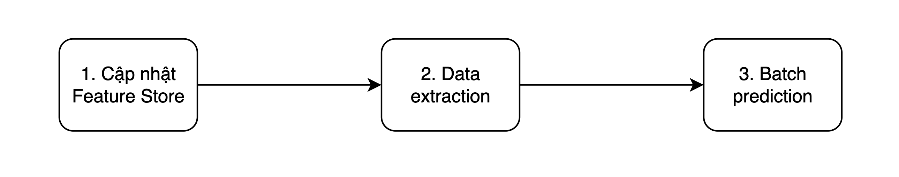

## Giới thiệu

Ở bài trước, [Tổng quan model serving](../tong-quan-model-serving), chúng ta đã phân tích về hai hình thức phổ biến khi triển khai model serving, đó chính là _batch serving_ và _online serving_. Source code của bài này được đặt tại Github repo [mlops-crash-course-code](https://github.com/MLOpsVN/mlops-crash-course-code).

## Môi trường phát triển

Để quá trình phát triển thuận tiện, chúng ta cần xây dựng môi trường phát triển ở máy local. Các library các bạn cần cài đặt cho môi trường phát triển được đặt tại `model_serving/dev_requirements.txt`. Các bạn có thể dùng `virtualenv`, `conda` hoặc bất kì tool nào để cài đặt môi trường phát triển.

Sau khi cài đặt môi trường phát triển, chúng ta cần làm các việc sau.

1. Copy file `model_serving/.env-example`, đổi tên thành `model_serving/.env`. File này chứa các config cần thiết cho việc triển khai model serving.

1. Copy file `model_serving/deployment/.env-example`, đổi tên thành `model_serving/deployment/.env`. File này chứa các config cần thiết cho việc triển khai việc triển khai model serving.

1. Set env var `MODEL_SERVING_DIR` bằng đường dẫn tuyệt đối tới folder `model_serving`. Env var này là để hỗ trợ việc chạy python code trong folder `model_serving/src` trong quá trình phát triển.

```bash
export MODEL_SERVING_DIR="path/to/mlops-crash-course-code/model_serving"
```

Các MLOps tools sẽ được sử dụng trong bài này bao gồm:

1. Feast để truy xuất Feature Store
1. MLflow để làm ML Metadata Store
1. Airflow để quản lý batch serving pipeline
1. Bentoml để triển khai online serving

!!! note

    Trong quá trình chạy code cho tất cả các phần dưới đây, giả sử rằng folder gốc nơi chúng ta làm việc là folder `model_serving`.

## Batch serving

Batch serving sẽ được triển khai dưới dạng một Airflow DAG với các task như hình dưới:



### Cập nhật Feature Store

Task này được thực hiện giống như task **Cập nhật Feature Store** ở bài [Xây dựng training pipeline](../../xay-dung-training-pipeline/xay-dung-pipeline/#cap-nhat-feature-store). Mời các bạn xem lại nếu cần thêm giải thích chi tiết về mục đích của task này.

Đầu tiên, các bạn cần triển khai code của Feature Store từ `data_pipeline/feature_repo` sang `model_serving/feature_repo`, bằng cách chạy các lệnh sau.

```bash
# Làm theo hướng dẫn ở file data_pipeline/README.md trước

# Sau đó chạy
cd ../data_pipeline
make deploy_feature_repo
cd ../model_serving
```

Sau khi code của Feature Store đã được triển khai sang folder `model_serving`, chúng ta cần cập nhật Feature Registry của Feast, bằng cách chạy các lệnh sau.

```bash
# Trong folder mlops-crash-course-platform, chạy:
bash run.sh feast up

# Trong folder mlops-crash-course-code/model_serving, chạy
cd feature_repo
feast apply
cd ..
```

Sau khi chạy xong, các bạn sẽ thấy file `model_serving/feature_repo/registry/local_registry.db` được sinh ra. Như vậy Feature Store đã được cập nhật ở local.

### Data extraction

Tiếp theo, chúng ta sẽ viết code để đọc data mà chúng ta muốn chạy batch prediction. Code của task này được lưu tại `model_serving/src/data_extraction.py`.

Đầu tiên, để có thể lấy được data từ Feature Store, chúng ta cần khởi tạo kết nối tới Feature Store trước.

```python linenums="1" title="model_serving/src/data_extraction.py"
fs = feast.FeatureStore(repo_path=AppPath.FEATURE_REPO)
```

Tiếp theo, chúng ta cần đọc file data mà chúng ta muốn chạy prediction. File này sẽ nằm tại `model_serving/data/batch_request.csv`. File này chứa field `event_timestamp` và `driver_id` mà sẽ được dùng để match với data trong Feature Store.

```python linenums="1" title="model_serving/src/data_extraction.py"
orders = pd.read_csv(batch_input_file, sep="\t")
orders["event_timestamp"] = pd.to_datetime(orders["event_timestamp"])
```

Các feature chúng ta muốn lấy bao gồm `conv_rate`, `acc_rate`, và `avg_daily_trips`. `driver_stats` là tên `FeatureView` mà chúng ta đã định nghĩa tại `data_pipeline/feature_repo/features.py`. Data lấy được sau đó sẽ được xử lý để tương thích với input format mà model yêu cầu.

```python linenums="1" title="model_serving/src/data_extraction.py"
batch_input_df = fs.get_historical_features(
    entity_df=orders,
    features=[
        "driver_stats:conv_rate",
        "driver_stats:acc_rate",
        "driver_stats:avg_daily_trips",
    ],
).to_df()

batch_input_df = batch_input_df.drop(["event_timestamp", "driver_id"], axis=1) # (1)

to_parquet(batch_input_df, AppPath.BATCH_INPUT_PQ) # (2)
```

1. Bỏ các cột không cần thiết
2. Lưu `batch_input_df` vào disk để tiện sử dụng cho task tiếp theo.

Hãy cùng chạy task này ở môi trường phát triển của bạn bằng cách chạy lệnh sau.

```bash
cd src
python data_extraction.py
cd ..
```

Sau khi chạy xong, hãy kiểm tra folder `model_serving/artifacts`, các bạn sẽ nhìn thấy file `batch_input.parquet`.

### Batch prediction

Trước khi chạy batch serving, rõ ràng rằng chúng ta đã quyết định xem sẽ dùng model nào cho batch serving. Thông tin về model mà chúng ta muốn chạy sẽ là một trong những input của batch serving pipeline. Input này có thể là Airflow variable, hoặc đường dẫn tới một file chứa thông tin về model.

Trong phần này, chúng ta sẽ sử dụng model mà chúng ta đã register với MLflow Model Registry ở task **Model validation** trong bài [Xây dựng training pipeline](../../xay-dung-training-pipeline/xay-dung-pipeline/#model-validation). Trong task đó, thông tin về model đã registered được lưu tại `training_pipeline/artifacts/registered_model_version.json`. Chúng ta có thể upload file này vào một Storage nào đó trong tổ chức để các task khác có thể download được model, cụ thể là cho batch serving và online serving ở trong bài này.

Vì chúng ta đang phát triển cả training pipeline và model serving ở local, nên chúng ta chỉ cần copy file `training_pipeline/artifacts/registered_model_version.json` sang `model_serving/artifacts/registered_model_version.json`. Để làm điều này, các bạn hãy chạy lệnh sau.

```bash
cd ../training_pipeline
make deploy_registered_model_file
cd ../model_serving
```

Tiếp theo, chúng ta sẽ viết code cho task batch prediction. Để đơn giản hoá quá trình batch prediction, đoạn code cho task batch prediction này giống như ở task **Model evaluation** mà chúng ta đã viết trong bài [Xây dựng training pipeline](../../xay-dung-training-pipeline/xay-dung-pipeline/#model-evaluation). Code của task này được lưu tại file `model_serving/src/batch_prediction.py`. Mình sẽ tóm tắt lại như sau.

```python linenums="1" title="model_serving/src/batch_prediction.py"
mlflow_model = mlflow.pyfunc.load_model(model_uri=model_uri) # (1)

batch_df = load_df(AppPath.BATCH_INPUT_PQ) # (2)

model_signature = mlflow_model.metadata.signature # (3)
feature_list = []
for name in model_signature.inputs.input_names():
    feature_list.append(name)
batch_df = batch_df[feature_list] # (4)

preds = mlflow_model.predict(batch_df) # (5)
batch_df["pred"] = preds

to_parquet(batch_df, AppPath.BATCH_OUTPUT_PQ) # (6)
```

1. model_uri chứa model path lấy từ file `model_serving/artifacts/registered_model_version.json`
2. Load batch input được lưu ở task trước
3. Load model signature từ MLflow model
4. Vì batch data mà chúng ta đọc từ file vào có thể sẽ chứa các features không theo đúng thứ tự mà model yêu cầu, nên chúng ta cần sắp xếp các features theo đúng thứ tự
5. Chạy prediction
6. Lưu output vào disk

Bây giờ, hãy cùng chạy task này trong môi trường phát triển của bạn bằng cách chạy lệnh sau.

```bash
cd src
python batch_prediction.py
cd ..
```

Sau khi chạy xong, hãy kiểm tra folder `model_serving/artifacts`, các bạn sẽ nhìn thấy file `batch_output.parquet`.

### Airflow DAG

Ở các phần trên, chúng ta đã phát triển xong các đoạn code cần thiết cho batch serving pipeline. Ở phần này, chúng ta sẽ viết Airflow DAG để kết nối các task trên lại thành một pipeline. Đoạn code để định nghĩa Airflow DAG được lưu tại `model_serving/dags/batch_serving_dag.py` và được tóm tắt như dưới đây.

```python linenums="1" title="model_serving/dags/batch_serving_dag.py"
with DAG(
    dag_id="batch_serving_pipeline",
    # các argument khác
) as dag:
    feature_store_init_task = DockerOperator(
        task_id="feature_store_init_task",
        command="bash -c 'cd feature_repo && feast apply'",
        **DefaultConfig.DEFAULT_DOCKER_OPERATOR_ARGS,
    )

    data_extraction_task = DockerOperator(
        task_id="data_extraction_task",
        command="bash -c 'cd src && python data_extraction.py'",
        **DefaultConfig.DEFAULT_DOCKER_OPERATOR_ARGS,
    )

    # các task khác
```

Chi tiết về những điểm quan trọng cần lưu ý, mời các bạn xem lại bài [Xây dựng training pipeline](../../xay-dung-training-pipeline/xay-dung-pipeline/#airflow-dag).

Tiếp theo, chúng ta sẽ build docker image `mlopsvn/mlops_crash_course/model_serving:latest`. Model này đã được build sẵn và push lên Docker Hub rồi, các bạn không cần build nữa. Tuy nhiên, nếu các bạn muốn sử dụng docker image của riêng mình thì hãy sửa `DOCKER_USER` env var tại file `model_serving/deployment/.env` thành docker user của các bạn và chạy lệnh sau.

```bash
make build_push_image
```

Sau khi đã có docker image, để triển khai DAG đã được định nghĩa ở trên, chúng ta sẽ copy `training_pipeline/dags/*` vào folder `dags` của Airflow, bằng cách chạy các lệnh sau.

```bash
# Trong folder mlops-crash-course-platform, chạy:
bash run.sh airflow up

# Trong folder mlops-crash-course-code/model_serving, chạy
make deploy_dags
```

Tiếp theo, đăng nhập vào Airflow UI trên browser với tài khoản và mật khẩu mặc định là `airflow`. Nếu các bạn đã refresh Airflow UI mà vẫn không thấy training pipeline, thì các bạn có thể vào folder `mlops-crash-course-platform` và chạy lệnh sau để restart Airflow server.

```bash
bash run.sh airflow restart
```

Airflow DAG của chúng ta có sử dụng một Airflow Variable tên là `MLOPS_CRASH_COURSE_CODE_DIR`. Variable này sẽ chứa đường dẫn tuyệt đối tới folder `mlops-crash-course-code/`. Nếu như ở bài [Xây dựng training pipeline](../../xay-dung-training-pipeline/xay-dung-pipeline/#airflow-dag), các bạn đã set variable này rồi thì ở bước này các bạn không cần làm gì nữa. Ngoài ra, nếu các bạn dùng docker image của riêng các bạn thì hãy set Airflow variable `DOCKER_USER` thành tên docker user của các bạn.

Sau đó, hãy mở Airflow server trên browser của bạn, kích hoạt batch serving pipeline và chờ đợi kết quả.


## Online serving

Trong phần này, chúng ta sẽ xây dựng một RESTful API (gọi tắt là API) để thực hiện online serving. Để quá trình xây dựng API này thuận tiện, chúng ta sẽ sử dụng Bentoml, một library chuyên được sử dụng cho việc tạo online serving API. Code của online serving được lưu tại `model_serving/src/bentoml_service.py`. Để xây dựng API này, chúng ta cần thực hiện các bước chính sau:

1. Download model mà chúng ta muốn triển khai từ MLflow server
1. Lưu model download được về [dạng mà Bentoml yêu cầu](https://docs.bentoml.org/en/latest/concepts/model.html#save-a-trained-model)
1. Khởi tạo [một _Bentoml Runner_ và một _Bentoml Service_](https://docs.bentoml.org/en/latest/concepts/model.html#using-model-runner)
1. Viết inference code cho API

Đầu tiên, chúng ta sẽ download model từ MLflow server giống như ở task Batch prediction của Batch serving pipeline. Sau đó, chúng ta cần lưu model về dạng mà Bentoml yêu cầu, như đoạn code dưới đây.

```python linenums="1" title="model_serving/src/bentoml_service.py"
mlflow_model = mlflow.pyfunc.load_model(model_uri=model_uri) # (1)
model = mlflow_model._model_impl # (2)

bentoml_model = bentoml.sklearn.save_model( # (3)
    model_name, # (4)
    model,
    signatures={ # (5)
        "predict": { # (6)
            "batchable": False, # (7)
        },
    },
    custom_objects={ # (8)
        "feature_list": feature_list, # (9)
    },
)
```

1. model_uri chứa model path lấy từ file `model_serving/artifacts/registered_model_version.json`
2. Đọc ra sklearn model được wrap trong MLflow model `mlflow_model`
3. Lưu model về dạng Bentoml model
4. `model_name` được lấy từ file `model_serving/artifacts/registered_model_version.json`
5. Signature của model
6. Key `predict` ở đây chính là tên function mà model của bạn sẽ gọi. Trong khoá học này, `sklearn` model mà chúng ta train được sử dụng function `predict` để chạy prediction. Do đó, `signatures` của Bentoml sẽ chứa key `predict`. Chi tiết về `signatures`, các bạn có thể đọc thêm [tại đây](https://docs.bentoml.org/en/latest/concepts/model.html#model-signatures)
7. Thông tin thêm về key `batchable`, các bạn có thể đọc thêm [tại đây](https://docs.bentoml.org/en/latest/concepts/model.html#batching).
8. Lưu bất kì Python object nào đi kèm với model. Đọc thêm [tại đây](https://docs.bentoml.org/en/latest/concepts/model.html#save-a-trained-model)
9. Lưu lại thứ tự các features mà model yêu cầu

Tiếp theo, chúng ta sẽ sử dụng model đã lưu ở trên để tạo Bentoml Runner và Bentoml Service.

```python linenums="1" title="model_serving/src/bentoml_service.py"
bentoml_runner = bentoml.sklearn.get(bentoml_model.tag).to_runner()
svc = bentoml.Service(bentoml_model.tag.name, runners=[bentoml_runner])
```

Trong Bentoml, quá trình chạy model inference sẽ thông qua một Bentoml Runner, hay tức là Bentoml Runner là một wrapper của Bentoml model. Bentoml Service sẽ chứa object Bentoml Runner, và đồng thời giúp chúng ta định nghĩa API một cách thuận tiện, như đoạn code dưới đây.

```python linenums="1" title="model_serving/src/bentoml_service.py"
bentoml_runner = bentoml.sklearn.get(bentoml_model.tag).to_runner()
svc = bentoml.Service(bentoml_model.tag.name, runners=[bentoml_runner])

@svc.api(
    input=NumpyNdarray(), # (1)
    output=NumpyNdarray() # (2)
)
def predict(request: np.ndarray) -> np.ndarray:
    result = bentoml_runner.predict.run(request)
    return result
```

1. Input format: _2D Numpy Array_, với mỗi hàng là một request
2. Output format: _1D Numpy Array_, với mỗi phần tử là prediction của một request

Hãy thử chạy API này bằng cách chạy lệnh sau:

```bash
make build_image && make compose_up
```

Lệnh trên sẽ chạy docker compose được định nghĩa tại `model_serving/deployment/docker-compose.yml`. Trong file docker compose này, chúng ta định nghĩa một service tên là `bentoml_service`, với tên container là `online_serving`, và command sau:

```bash
/bin/bash scripts/bentoml_helper.sh serve
```

Nếu bạn kiểm tra file `scripts/bentoml_helper.sh`, các bạn sẽ thấy command trên thực chất là gọi đến command sau:

```bash
bentoml serve bentoml_service:svc
```

Sau khi docker compose đã chạy, bạn hãy mở browser và truy cập tới `http://localhost:8172/`. Các bạn sẽ nhìn thấy một trang web như sau.


??? info

    Port `8172` được định nghĩa tại `model_serving/deployment/.env`.

Hãy mở API `/predict` ra, và ấn nút `Try it out`. Ở phần `Request body`, các bạn gõ nội dung sau:

```json
[
  [0.5, 0.9, 500],
  [0.1, 0.2, 900]
]
```

Kết quả của response trả về sẽ nhìn giống như sau.


Trong phần này, chúng ta sử dụng docker compose nhằm mục đích tiện cho việc triển khai online serving API trên máy local. Ngoài ra, các bạn có thể triển khai docker image `mlopsvn/mlops_crash_course/model_serving:latest` lên một server nào đó để các services khác có thể gọi tới API đã được expose tại port `8172` trên server này.

Trong thực tế, request của chúng ta sẽ không chứa features được sắp xếp đúng thứ tự như trên, mà nó sẽ chứa data giúp chúng ta lấy ra các features từ Feature Store. Ví dụ, trong khoá học này, request được gửi đến Online serving service sẽ chứa danh sách ID của các tài xế. Dựa vào danh sách ID này, chúng ta sẽ lấy ra các features liên quan từ Online Store của Feast để biến đổi thành request chứa các features được sắp xếp đúng thứ tự.

Đoạn code sau định nghĩa API `inference` sẽ làm các công việc này.

```python linenums="1" title="model_serving/src/bentoml_service.py"
feature_list = bentoml_model.custom_objects["feature_list"] # (1)
fs = feast.FeatureStore(repo_path=AppPath.FEATURE_REPO) # (2)

class InferenceRequest(BaseModel): # (3)
    driver_ids: List[int]

class InferenceResponse(BaseModel): # (4)
    prediction: Optional[float]
    error: Optional[str]

@svc.api(
    input=JSON(pydantic_model=InferenceRequest), # (5)
    output=JSON(pydantic_model=InferenceResponse),
)
def inference(request: InferenceRequest, ctx: bentoml.Context) -> Dict[str, Any]:
    try:
        driver_ids = request.driver_ids
        online_features = fs.get_online_features( # (6)
            entity_rows=[{"driver_id": driver_id} for driver_id in driver_ids],
            features=[f"driver_stats:{name}" for name in feature_list],
        )
        df = pd.DataFrame.from_dict(online_features.to_dict())

        input_features = df.drop(["driver_id"], axis=1) # (7)
        input_features = input_features[feature_list] # (8)

        result = predict(input_features[sorted(input_features)]) # (9)
        df["prediction"] = result
        best_idx = df["prediction"].argmax()
        best_driver_id = df["driver_id"].iloc[best_idx] # (10)
        ...

    except Exception as e: # (11)
        ...
```

1. Lấy ra danh sách chứa thứ tự các features mà model yêu cầu
2. Khởi tạo Feast object
3. Định nghĩa input class cho API
4. Định nghĩa output class cho API
5. Định nghĩa input ở dạng json cho API
6. Định nghĩa output ở dạng json cho API
7. Loại bỏ cột không cần thiết
8. Sắp xếp lại thứ tự features
9. Gọi function `predict` để thực hiện prediction
10. Lấy ra driver id có khả năng cao nhất sẽ hoàn thành cuốc xe. Driver id này sẽ được trả về trong response
11. Xử lý lỗi

Như các bạn thấy, sau khi lấy được các features cần thiết từ Online Feature Store, qua vài bước xử lý features này, chúng ta sẽ gọi tới function `predict` để thực hiện prediction. Trong thực tế, server chứa API `inference` sẽ là một server khác với API `predict`. Server chứa API `inference` sẽ được tối ưu về Network throughput để thực hiện việc nhận request và trả về response cho nhiều client. Server chứa API `predict` sẽ được tối ưu về khả năng tính toán để thực hiện model inference nhanh hơn.

Hãy cùng thử chạy API `inference` bằng cách thực hiện các bước sau.

1. Chạy [Feast materialize pipeline](../../data-pipeline/xay-dung-data-pipeline/#feast-materialize-pipeline) ở bài Data Pipeline để cập nhật Online Feature Store.
2. Chạy lệnh sau

```bash
# Build lại docker image và chạy lại docker compose
make build_image && make compose_up
```

Bạn hãy mở browser, truy cập tới `http://localhost:8172/`, mở API `/inference`, và ấn nút `Try it out`. Ở phần `Request body`, các bạn gõ nội dung sau:

```json
{
  "request_id": "uuid-1",
  "driver_ids": [1001, 1002, 1003, 1004, 1005]
}
```

Kết quả của response trả về sẽ nhìn giống như sau.


## Tổng kết

Như vậy, chúng ta vừa thực hiện quy trình triển khai batch serving và online serving điển hình. Lưu ý rằng, code để chạy cả batch serving và online serving sẽ phụ thuộc vào model mà Data Scientist đã train, và các features được yêu cầu cho model đó.

Sau khi tự động hoá được batch serving pipeline và triển khai được online serving API, trong bài tiếp theo, chúng ta sẽ xây dựng hệ thống giám sát online serving API. Hệ thống này rất quan trọng trong việc theo dõi cả system performance và model performance, giúp chúng ta giải quyết các vấn đề nhanh hơn ở production, và cảnh báo chúng ta khi có các sự cố về hệ thống và model performance.
