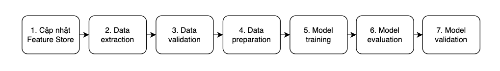

## Giới thiệu

Sau khi thực hiện ít nhất một dự án POC thành công, chúng ta đã có được những thứ sau:

1. Các rules để transform và clean data từ data source
2. Các rules để sinh ra các features cho việc train model
3. Code để chuẩn bị data cho việc train model
4. Code để train model
5. Code để đánh giá model

Phần 1 và 2 là đã được sử dụng trong bài [Tổng quan data pipeline](../../data-pipeline/tong-quan-data-pipeline) để xây dựng data pipeline. Phần 3, 4, và 5 sẽ được dùng trong bài này để xây dựng training pipeline.

Trong bài này, chúng ta sẽ xây dựng training pipeline để tự động hoá quá trình train model, đánh giá model và register model. Lưu ý rằng, ở các dự án thực tế, Data Scientist vẫn tiếp tục thực hiện các thử nghiệm trên data và model, trong khi ML engineer/MLOps engineer sẽ xây dựng training pipeline. Training pipeline sẽ được cập nhật liên tục dựa trên các yêu cầu từ phía các Data Scientist.

Training pipeline của chúng ta bao gồm các tasks như hình dưới:

## Cập nhật Feature Store

Trong khoá học này, chúng ta sử dụng Feast làm Feature Store để version các feature và các bộ feature. Như ở bài trước khi xây dựng data pipline, chúng ta đã biết Feast sử dụng Feature Registry để làm nơi tập trung lưu trữ định nghĩa về các feature và metadata của chúng. Do Feature Registry này sẽ được lưu ở dạng file ở local, nên mỗi Data Scientist cần tự update Feature Registry này trên máy của mình để các feature được update.

## Data extraction

Trong task này, chúng ta sử dụng Feast để lấy data chứa các feature chúng ta muốn về. Đầu vào của task này là định nghĩa về các feature chúng ta muốn lấy. Đầu ra của task này là data đã được lấy về và lưu vào disk.

## Data validation

Sau khi đã lấy được data chứa các feature chúng ta muốn ở task Data extraction, chúng ta cần đánh giá xem data có hợp lệ không trước khi train model, bằng cách kiểm tra những thứ sau.

- Data schema
  - Có nhận được feature không mong muốn nào không?
  - Có nhận được các feature mong muốn không?
  - Có nhận được các feature mong muốn với format và các giá trị mong muốn không?
- Giá trị của data
  - Các tính chất liên quan tới data distribution có hợp lệ không?
  - Các giả sử mà chúng ta đưa ra đối với data có hợp lệ không?

Task này không sinh ra các artifact hay file nào, mà nó sẽ quyết định xem task tiếp theo có được thực hiện hay không.

## Data preparation

Đầu vào của task này là data đã được lấy từ task Data extraction. Task này là nơi chúng ta sẽ thực hiện các bước sau.

- Transform hoặc clean data nếu cần thiết. Điều này xảy ra khi Feature Store chưa cập nhật giá trị của các feature mà chúng ta mong muốn
- Thực hiện feature engineering nếu cần thiết. Điều này xảy ra khi Feature Store chưa cập nhật kịp thời bởi Data Engineer để sinh ra các feature chúng ta mong muốn
- Split data thành các tập training set, validation set, hay test set để phục vụ cho quá trình train model và đánh giá model

Đầu ra của task này là các tập dataset đã được lưu vào disk.

## Model training

Trong task này, chúng ta sẽ train model sử dụng data đã được chuẩn bị ở task Data preparation. Task này cũng là nơi mà chúng ta sẽ thực hiện hyperparameter tuning để train được model tốt nhất. Đầu ra của bước này là model đã được train.

## Model evaluation

Đầu vào của task này là model đã được train ở task Model training. Trong task này, chúng ta thực hiện chạy prediction cho model trên test set lấy từ task Data preparation. Đầu ra của task này là nhóm các metrics dùng để đánh giá chất lượng của model.

## Model validation

Trong task này, chúng ta sẽ sử dụng các metrics được sinh ra từ task Model evaluation để đánh giá model, các baseline và các yêu cầu kinh doanh đã được định nghĩa ở bước [Phân tích vấn đề](../../tong-quan-he-thong/phan-tich-van-de). Việc đánh giá model dựa trên các yếu tố này để chứng tỏ rằng model đã train có performance tốt hơn so với model cũ trước khi triển khai nó ra production.

Thêm nữa, chúng ta cũng cần đánh giá xem model performance của model có tốt trên các phần khác nhau của dataset không. Ví dụ như model mới có Accuracy cao hơn model cũ khi được đánh giá trên tất cả khách hàng, nhưng lại có Accuracy trên data của khách hàng ở vài khu vực địa lý thấp hơn model cũ.

Ngoài ra, chúng ta cũng cần kiểm tra xem model mới train được có tương thích với hệ thống ở production không. Ví dụ như kiểm tra xem model mới có nhận vào định dạng đầu vào và trả về định dạng đầu ra đã được định nghĩa không, hay là thời gian inference có đảm bảo nằm trong một khoảng theo yêu cầu của vấn đề kinh doanh không.

Nếu model thoả mãn các yêu cầu đề ra, chúng ta có thể register model với Model Registry một cách tự động.

## Tổng kết

Các task mà chúng ta vừa phân tích ở trên là các task điển hình trong một training pipeline. Tuy nhiên, tuỳ thuộc vào mức độ phức tạp của dự án và các chức năng của dự án mà chúng ta có thể bỏ bớt hoặc thêm vào các task khác. Chúng ta cũng có thể chia nhỏ các task thực hiện các công việc đòi hỏi tính toán nặng ra, để tránh việc chạy lại nhiều lần.

Trong bài tiếp theo, chúng ta sẽ bắt tay vào viết code cho training pipeline với các task đã được định nghĩa ở trên.
